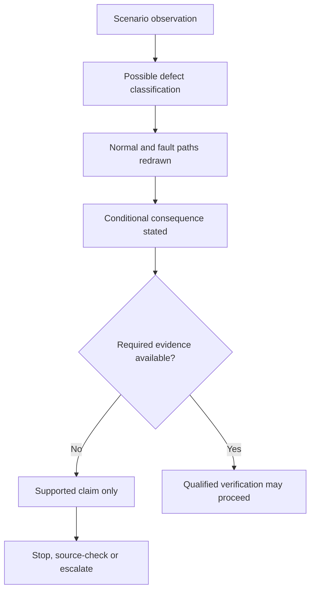

# Day 06C - Earthing and MEN Fault Scenarios

Day 6C applies the component model from Day 6A and the fault-loop model from Day 6B to paper-based diagnosis of missing, open, loose, high-resistance, misplaced and supply-context-dependent defects. Day 7 then retrieves this reasoning alongside the other Week 1 protection and source-navigation models.

## Learning module

- [Day 6C — Earthing and MEN Fault Scenarios](../learning-plans/4-week/modules/day-06c-earthing-and-men-fault-scenarios.md)
- [Continue to Day 7 — Week 1 Consolidation and Competency Check](../learning-plans/4-week/modules/day-07-week-1-consolidation-and-competency-check.md)

## Prerequisites

- [[Day 06A - Earthing Terminology and Component Roles]]
- [[Day 06B - MEN Fault-Current Path]]
- [[Day 03 - Overcurrent Protection]]
- [[Day 04 - RCD Protection and Additional Protection]]
- [[Electrical Fundamentals]]
- [[Safety and Electrical Risk]]

## Related concepts

- [[Earthing Bonding and MEN]]
- [[Fault Finding and Commissioning]]
- [[Inspection Testing and Verification]]
- [[Control Switching and Protection]]
- [[Conductors and Wiring Systems]]
- [[AS-NZS-3000-2018-Index]]

## Diagnostic model

Use **D-I-A-G-N-O-S-E**:

1. **Describe** — record only the stated condition, observation or drawing information.
2. **Identify** — classify the possible defect without converting suspicion into fact.
3. **Arrange** — redraw normal-current and fault-current paths separately.
4. **Grade** — label each claim as described, supported or verified.
5. **Name consequences** — separate circuit, protective and possible contact-risk consequences.
6. **Obtain evidence** — list the inspection, authorised-source or test evidence still required.
7. **Source-check** — locate the governing requirement in current authorised material without inventing a clause.
8. **Escalate** — state the stop condition where evidence, authority or conditions are incomplete.

The workflow prevents a paper scenario from being presented as a confirmed field diagnosis. It also makes the evidence gap visible before any conclusion about safety, compliance or protective-device operation is written.

## Claim grades

- **Described:** directly provided by the scenario, drawing or record.
- **Supported:** consistent with the available facts and reasoning, but not yet confirmed by sufficient evidence.
- **Verified:** established using the required authorised source, approved inspection or test evidence and competent review.

A supported explanation is not automatically a verified installation finding.

## Defect categories

- **Open:** the intended conductive path is interrupted.
- **High resistance:** the path remains partly conductive but has greater opposition than intended.
- **Misplaced connection:** a connection exists at an incorrect or unverified location and may create unintended paths.
- **Supply-context dependent:** the model is incomplete because a generator, inverter, battery, separate supply or transfer arrangement has not been represented.

## Evidence ladder

The ladder shows why a plausible path explanation remains conditional until the required evidence and competent verification are available.

## Practical application

For each paper scenario, record:

- stated observation and defect classification;
- normal current path;
- fault-current path before and after the proposed defect;
- immediate circuit consequence;
- protective consequence;
- possible contact-risk consequence;
- claim grade for each conclusion;
- evidence required before concluding;
- authorised source to check;
- stop or escalation condition.

Use worked-example fading:

1. complete one scenario with the full D-I-A-G-N-O-S-E prompts;
2. complete a second scenario using only the acronym headings;
3. complete a changed-supply scenario from a blank page;
4. compare the evidence grades and correct any unsupported certainty.

The exercise must not be converted into a live testing or repair instruction.

## Assessment relevance

A strong Capstone response explains what changed, how the path changed, why a protective result cannot be assumed, what evidence is required and when work must stop. Claims such as “will trip”, “safe”, “compliant” or “isolated” require an explicit evidence chain.

Use a 0–2 study rubric for each category:

- defect description and classification;
- separation of normal and fault-current paths;
- consequence reasoning;
- evidence and claim grading;
- authorised-source plan;
- safety boundary and escalation.

A score of 2 means defensible and complete, 1 means partial or weakly supported, and 0 means unsafe, unsupported or absent. Any zero in evidence or safety requires remediation before progression.

## Misconceptions to track

- Normal operation proves the protective earthing path is sound.
- A loose connection is harmless if continuity appears intermittent.
- An RCD makes protective-earthing continuity unnecessary.
- Any neutral-earth connection improves safety.
- The original supply sketch remains valid after adding an inverter or generator.
- A paper diagnosis authorises live testing or repair.
- A plausible consequence is the same as a verified installation finding.

## Safety boundary

This note grants no authority to open equipment, isolate, prove de-energised, trace conductors, measure, test, disconnect, reconnect, alter, repair, energise, commission, certify or verify an installation. Practical work must remain within current law, supervision, competence, approved procedures and site controls.

## Navigation

- Previous: [[Day 06B - MEN Fault-Current Path]]
- Next: [[Day 07 - Week 1 Consolidation and Competency Check]]
- Map of content: [[Earthing Bonding and MEN]]

## References

- AS/NZS 3000:2018, current authorised copy and applicable amendments required.
- Current applicable legislation, regulator guidance, network service rules, manufacturer instructions and RTO procedures.
- [Learning Design](../LEARNING_DESIGN.md)
- [Content, Standards and Copyright Policy](../CONTENT_AND_COPYRIGHT.md)

Exact MEN arrangements, connection points, conductor requirements, test methods, readings, protective-device characteristics, operating times, touch-voltage criteria, alternate-supply requirements, exceptions and clause references remain `reference_check_required`. This note is not `technically-reviewed`.

<!-- sequence-navigation:start -->
### Sequence navigation

- [← Previous: Day 06B - MEN Fault-Current Path](./Day%2006B%20-%20MEN%20Fault-Current%20Path.md)
- [Four-week learning plan](./Four-Week%20Capstone%20Learning%20Plan.md)
- [Open the full learning module](../learning-plans/4-week/modules/day-06c-earthing-and-men-fault-scenarios.md)
- [Next: Day 07 - Week 1 Consolidation and Competency Check →](./Day%2007%20-%20Week%201%20Consolidation%20and%20Competency%20Check.md)
<!-- sequence-navigation:end -->
