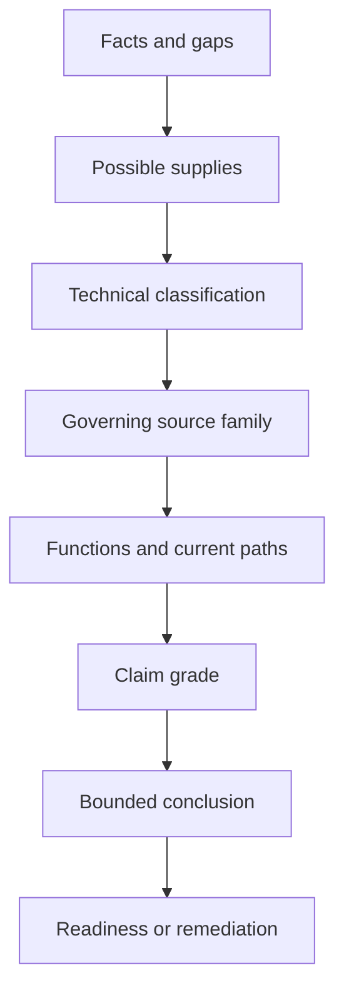

# Day 07 - Week 1 Consolidation and Competency Check

Day 7 integrates the Week 1 models into a scored paper-based readiness check. It tests whether the learner can navigate sources, define a safe decision boundary, distinguish protective functions, trace current paths, grade claims and state a bounded conclusion without relying on familiar wording.

## Learning module

- [Day 7 — Week 1 Consolidation and Competency Check](../learning-plans/4-week/modules/day-07-week-1-consolidation-and-competency-check.md)

## Prerequisites

- [[Day 01 - Exam Orientation and Wiring Rules Navigation]]
- [[Day 02 - Fundamental Safety Principles]]
- [[Day 03 - Overcurrent Protection]]
- [[Day 04 - RCD Protection and Additional Protection]]
- [[Day 05 - Rest Retrieval and Catch-Up]]
- [[Day 06A - Earthing Terminology and Component Roles]]
- [[Day 06B - MEN Fault-Current Path]]
- [[Day 06C - Earthing and MEN Fault Scenarios]]

## Related concepts

- [[Four-Week Capstone Learning Plan]]
- [[Learning and Memory System]]
- [[Safety and Electrical Risk]]
- [[Control Switching and Protection]]
- [[Earthing Bonding and MEN]]
- [[Wiring Rules and Design]]
- [[Inspection Testing and Verification]]
- [[Fault Finding and Commissioning]]
- [[AS-NZS-3000-2018-Index]]

## I-N-T-E-G-R-A-T-E evidence workflow

1. **Identify facts and gaps** — separate facts, assumptions, inferences and missing information.
2. **Name every possible source** — include normal, alternate, stored, induced, control and mechanical energy where relevant.
3. **Tag the technical concepts** — classify protection, earthing, MEN, current-path and source-navigation issues.
4. **Establish the governing source family** — distinguish standards, legislation, regulator or network rules, manufacturer instructions, workplace procedures and RTO directions.
5. **Graph functions and paths** — draw normal and fault current separately and state component roles.
6. **Require evidence for strong claims** — challenge words such as **safe**, **isolated**, **compliant**, **continuous** and **will operate**.
7. **Assign claim grades** — mark each important statement described, supported or verified.
8. **Terminate at the boundary** — state stop and escalation conditions when evidence or authority is incomplete.
9. **Evaluate confidence and remediation** — compare confidence with evidence and select the next learning action.

## Claim grades

- **Described:** stated by the scenario but not independently verified.
- **Supported:** consistent with the available facts and identified source families, while exact requirements remain unchecked.
- **Verified:** supported by current authorised evidence and the required competent process.

The paper exercise generally produces described or supported claims only.

## Practical application

Use the original workshop scenario and the changed battery-supply transfer scenario in the module. Complete closed-note retrieval, source-navigation planning, current-path diagrams, an integrated response, oral defence and the scored readiness rubric.

The readiness outcome is:

- **stop and remediate** for any critical error, omitted possible supply or high-confidence safety misconception;
- **targeted remediation** when no critical error remains but the score is below 14/16 or a category is partial;
- **proceed to Day 8** only at 14/16 or above, with no zero and all safety-critical categories defensible.

This is an educational study decision, not an official RTO criterion.

## Assessment relevance

The checkpoint samples observable capabilities:

- source selection and traceability;
- hazard and energy-source recognition;
- safe stop and escalation decisions;
- distinction between overload, short circuit and residual current;
- distinction between overcurrent and residual-current protection;
- correct conductor and earthing terminology;
- complete normal and fault-current path tracing;
- claim grading, evidence gaps and confidence calibration;
- transfer to a changed supply scenario.

A confident answer is insufficient. The response must show why the conclusion follows, what remains unresolved and why the learner is or is not ready to proceed.

## Misconceptions to track

- A remembered clause number is proof.
- Equipment that is not operating is proven de-energised.
- The visible supply is the only possible source.
- Overload, short circuit and residual current are interchangeable.
- An RCD replaces overcurrent protection or protective earthing.
- Normal operation proves protective-earthing continuity.
- Fault current disappears into soil rather than completing a loop.
- A protective device operates merely because a fault exists.
- A changed supply scenario can be answered by copying the original response.
- Strong conclusion words need no evidence challenge.

## Navigation

- Previous: [[Day 06C - Earthing and MEN Fault Scenarios]]
- Next: [[Day 08 - Maximum Demand]]
- Learning-plan map: [[Four-Week Capstone Learning Plan]]
- Earthing map: [[Earthing Bonding and MEN]]

## References

- AS/NZS 3000:2018, current authorised copy and applicable amendments required.
- Current applicable legislation, regulator guidance, network service rules, manufacturer instructions, workplace procedures and RTO assessment directions.
- [Learning Design](../LEARNING_DESIGN.md)
- [Content, Standards and Copyright Policy](../CONTENT_AND_COPYRIGHT.md)
- Week 1 modules and their listed authorised sources.

Exact clauses, definitions, protective-device conditions, MEN arrangements, test procedures, limits, operating times, acceptance criteria, jurisdiction-specific assessment rules and exceptions remain `reference_check_required`. This note is not `technically-reviewed` and grants no practical authority.

<!-- sequence-navigation:start -->
### Sequence navigation

- [← Previous: Day 06C - Earthing and MEN Fault Scenarios](./Day%2006C%20-%20Earthing%20and%20MEN%20Fault%20Scenarios.md)
- [Four-week learning plan](./Four-Week%20Capstone%20Learning%20Plan.md)
- [Open the full learning module](../learning-plans/4-week/modules/day-07-week-1-consolidation-and-competency-check.md)
- [Next: Day 08 - Maximum Demand →](./Day%2008%20-%20Maximum%20Demand.md)
<!-- sequence-navigation:end -->