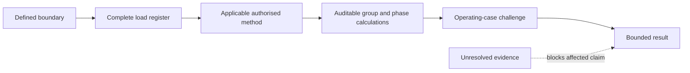

# Day 08 - Maximum Demand

Day 8 begins the Week 2 design sequence by turning a complete load register into a traceable maximum-demand result. The discipline is to separate connected load, assessed demand and spare capacity while keeping every allowance, conversion and exception tied to an authorised source.

## Learning module

- [Day 8 — Maximum Demand](../learning-plans/4-week/modules/day-08-maximum-demand.md)

## Prerequisites

- [[Day 07 - Week 1 Consolidation and Competency Check]]
- [[Exam Orientation and Wiring Rules Navigation]]
- [[Control Switching and Protection]]
- [[Learning and Memory System]]

## Related concepts

- [[Four-Week Capstone Learning Plan]]
- [[Wiring Rules and Design]]
- [[Alternative Supplies and Generation]]
- [[Safety and Electrical Risk]]
- [[AS-NZS-3000-2018-Index]]

## D-E-M-A-N-D workflow

1. **Define the boundary** — identify the installation or section, sources, supply arrangement and present/future scope.
2. **Enumerate every load** — record quantity, rating basis, units, phase, operating mode, source and evidence status.
3. **Match the method** — verify installation and load categories, definitions, notes, exceptions and cross-references.
4. **Apply units and allowances** — use known conversion inputs and keep connected load, assessed contribution and spare capacity separate.
5. **Navigate operating cases** — test phase allocation, credible coincidence, control failure, alternate supplies and unusual loads.
6. **Document the bounded result** — preserve calculations, source references, unresolved evidence, downstream dependencies and stop conditions.

## Evidence and claim model

Classify inputs as:

- **fact** — a scenario or record states it;
- **verified rule** — an authorised source has been checked for applicability;
- **derived value** — calculated from stated inputs;
- **training assumption** — invented and clearly labelled for education;
- **unresolved evidence** — missing information that blocks the affected conclusion.

Use three claim grades:

- **described** — supplied but not independently confirmed;
- **supported** — backed by traceable evidence;
- **verified** — checked by a competent person through the required process.

A correct calculation does not promote an unsupported input to verified status.

## Practical application

Use the mixed-use tenancy scenario in the linked module. Produce:

- a complete load register;
- a source-navigation plan;
- a calculation frame with unresolved allowances marked `reference_check_required`;
- operating cases covering high demand, EV charging, alternate-source operation and control failure;
- a bounded conclusion that states the highest phase, separate future allowance, unresolved evidence and downstream checks.

Then complete the changed-context re-attempt with a heat pump, three-phase machine, battery storage and controlled EV charging.

## Assessment relevance

A defensible response demonstrates:

- complete scope and source identification;
- traceable load capture;
- correct separation of connected load, assessed demand and spare capacity;
- authorised-method applicability rather than remembered percentages;
- consistent units and conversion assumptions;
- phase-by-phase review;
- treatment of controls, alternate supplies and failure cases;
- explicit limits on what the result proves.

The linked module uses a 12-point rubric across scope, register quality, method selection, units/calculations, operating cases and conclusion. Unsupported factors, unsafe conversions, omitted major loads or unbounded compliance claims are critical errors regardless of score.

## Misconceptions to track

- Maximum demand is always the sum of nameplate ratings.
- Diversity permits any convenient percentage.
- One remembered factor applies to the whole installation.
- kW, kVA and A are interchangeable.
- A three-phase total proves every phase is acceptable.
- Solar generation can always be subtracted.
- A demand controller can be assumed effective without specification and failure evidence.
- Spare capacity can be hidden inside an unexplained factor.
- Maximum demand proves cable, switchboard or supply adequacy.

## Safety and review boundary

This note grants no authority for switchboard access, live measurement, isolation, testing, alteration, energisation, commissioning, certification or verification.

Exact maximum-demand methods, load categories, factors, exceptions, conversion requirements, phase rules, alternate-supply treatment and jurisdiction-specific acceptance criteria remain `reference_check_required`. This note is safety-critical, `review-required` and not `technically-reviewed`.

## Navigation

- Previous: [[Day 07 - Week 1 Consolidation and Competency Check]]
- Next: [[Day 09 - Complete Cable-Selection Workflow]]
- Learning-plan map: [[Four-Week Capstone Learning Plan]]
- Design map: [[Wiring Rules and Design]]

## References

- AS/NZS 3000:2018, current authorised copy and applicable amendments required.
- Current legislation, regulator guidance, network service rules, manufacturer instructions, workplace procedures and RTO assessment directions.
- [Learning Design](../LEARNING_DESIGN.md)
- [Content, Standards and Copyright Policy](../CONTENT_AND_COPYRIGHT.md)

The organisation, examples, diagrams and assessment prompts are original educational material. No standards table, figure, systematic clause wording or official dataset is reproduced.

<!-- sequence-navigation:start -->
### Sequence navigation

- [← Previous: Day 07 - Week 1 Consolidation and Competency Check](./Day%2007%20-%20Week%201%20Consolidation%20and%20Competency%20Check.md)
- [Four-week learning plan](./Four-Week%20Capstone%20Learning%20Plan.md)
- [Open the full learning module](../learning-plans/4-week/modules/day-08-maximum-demand.md)
- [Next: Day 09 - Complete Cable-Selection Workflow →](./Day%2009%20-%20Complete%20Cable-Selection%20Workflow.md)
<!-- sequence-navigation:end -->
