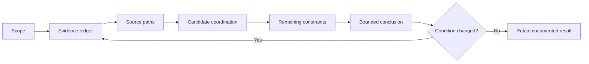

# Day 09 - Complete Cable-Selection Workflow

Day 9 converts the Day 8 demand result into an evidence-led cable-selection decision. It treats cable selection as a dependent chain rather than a size lookup.

## Learning module

- [Day 9 — Complete Cable-Selection Workflow](../learning-plans/4-week/modules/day-09-complete-cable-selection-workflow.md)

## Prerequisites

- [[Day 08 - Maximum Demand]]
- [[Day 03 - Overcurrent Protection]]
- [[Control Switching and Protection]]
- [[Wiring Rules and Design]]

## Core workflow

Use **S-E-L-E-C-T**:

- **Scope** the circuit and operating cases.
- **Establish** the evidence ledger.
- **Locate** authorised source paths.
- **Evaluate** candidate coordination.
- **Check** every remaining constraint.
- **Track** changes and state a bounded conclusion.

The loop is important: a changed load, route, source, device or terminal condition reopens affected checks.

## Terminology

- **Design current:** current derived for the applicable load and operating case.
- **Tabulated capacity:** source value for a defined cable and reference installation condition.
- **Corrected capacity:** capacity after applicable source-defined adjustments.
- **Governing segment:** route section imposing the most restrictive relevant condition.
- **Reopening trigger:** changed evidence requiring earlier checks to be repeated.
- **Bounded conclusion:** conclusion limited to what the current evidence supports.

## Evidence and claim grades

- **Described:** stated by the scenario.
- **Supported:** traceable to supplied evidence or an authorised source path.
- **Verified:** checked by an appropriately qualified person using current authorised material.

This automated note does not establish verified compliance.

## Practical application

Use the mixed-use tenancy submain scenario in the module. Produce:

1. an evidence ledger;
2. an authorised source-navigation plan;
3. a two-candidate comparison;
4. a bounded conclusion identifying unresolved blockers and reopening triggers.

## Assessment relevance

The learner should demonstrate:

- complete circuit scoping before source lookup;
- distinction between design current, device rating, tabulated capacity and corrected capacity;
- accurate source-path identification;
- recognition of the governing route segment;
- correct use of the conceptual coordination screen without overclaiming it;
- separate voltage-drop, fault, environmental, mechanical and terminal checks;
- deliberate reopening of downstream checks after changed evidence;
- explicit limits on what the current evidence proves.

A 12-point rubric scores scope, evidence classification, source path, coordination, constraint coverage and bounded conclusion. Invented source values, omitted material route conditions, treating thermal coordination as compliance, or authorising field action are critical errors.

## Misconceptions to track

- Cable size is selected from load current alone.
- A nominal conductor size has one universal current rating.
- The longest route segment always governs.
- One correction factor is enough whenever several influences coexist.
- A protective-device ampere rating fully describes the device.
- Passing current capacity proves voltage drop and fault protection.
- Neutral loading can always be ignored.
- A larger cable always fits terminals and containment.
- Alternate generation automatically reduces conductor requirements.
- Missing route or fault data may be replaced with favourable assumptions.

## Safety boundary

This is a paper-based educational model. It does not authorise live access, switching, isolation, testing, alteration, installation, energisation, approval, certification or verification. Stop when load, source, route, device, fault or terminal evidence is unresolved and the conclusion depends on it.

## Related concepts

- [[Four-Week Capstone Learning Plan]]
- [[Wiring Rules and Design]]
- [[Control Switching and Protection]]
- [[Safety and Electrical Risk]]
- [[Earthing Bonding and MEN]]
- [[Alternative Supplies and Generation]]
- [[AS-NZS-3000-2018-Index]]

## Navigation

- Previous: [[Day 08 - Maximum Demand]]
- Next: [[Day 10 - Installation Conditions and Derating]]
- Learning-plan map: [[Four-Week Capstone Learning Plan]]
- Design map: [[Wiring Rules and Design]]

## References

- AS/NZS 3000:2018, current authorised copy and applicable amendments required.
- AS/NZS 3008.1.1, current authorised edition and applicable amendments required.
- Current legislation, regulator guidance, network service rules, manufacturer instructions, workplace procedures and RTO assessment directions.
- [Learning Design](../LEARNING_DESIGN.md)
- [Content, Standards and Copyright Policy](../CONTENT_AND_COPYRIGHT.md)

Exact classifications, capacities, correction factors, combination methods, protective-device characteristics, voltage-drop criteria, fault requirements, terminal limits and jurisdiction-specific acceptance criteria remain `reference_check_required`. This note is not `technically-reviewed`.

<!-- sequence-navigation:start -->
### Sequence navigation

- [← Previous: Day 08 - Maximum Demand](./Day%2008%20-%20Maximum%20Demand.md)
- [Four-week learning plan](./Four-Week%20Capstone%20Learning%20Plan.md)
- [Open the full learning module](../learning-plans/4-week/modules/day-09-complete-cable-selection-workflow.md)
- [Next: Day 10 - Installation Conditions and Derating →](./Day%2010%20-%20Installation%20Conditions%20and%20Derating.md)
<!-- sequence-navigation:end -->
