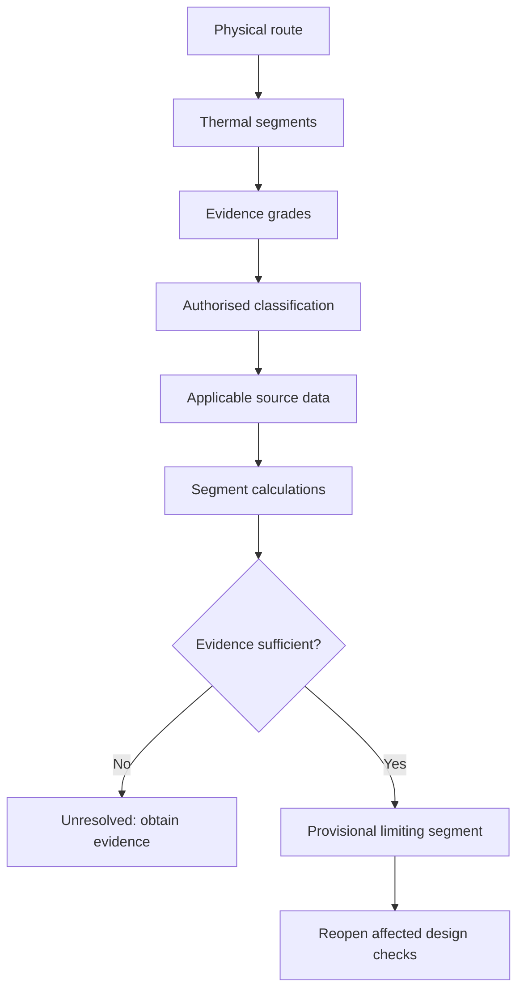

# Day 10 - Installation Conditions and Derating

Day 10 isolates the thermal part of cable selection. It teaches an evidence-led route-segmentation method that separates physical observations, authorised classifications, source values and calculated results before identifying a provisional limiting segment.

## Learning module

- [Day 10 — Installation Conditions and Derating](../learning-plans/4-week/modules/day-10-installation-conditions-and-derating.md)

## Prerequisites

- [[Day 09 - Complete Cable-Selection Workflow]]
- [[Day 08 - Maximum Demand]]
- [[Day 03 - Overcurrent Protection]]

## Related concepts

- [[Four-Week Capstone Learning Plan]]
- [[Wiring Rules and Design]]
- [[Control Switching and Protection]]
- [[Safety and Electrical Risk]]
- [[AS-NZS-3000-2018-Index]]

## C-O-N-D-I-T-I-O-N-S workflow

1. **Capture** the complete route.
2. **Observe** without classifying prematurely.
3. **Name** thermal segments.
4. **Document** evidence status.
5. **Identify** the authorised source family.
6. **Test** each thermal influence separately.
7. **Inspect** factor interactions and exceptions.
8. **Obtain** source values with provenance.
9. **Normalise** units and calculate by segment.
10. **Select** the provisional limiter and reopen affected design checks.

The gate is deliberate: arithmetic does not upgrade weak route evidence.

## Evidence and claim grades

### Evidence

- **Observed:** supported by current site evidence, drawings, schedules or reliable records.
- **Classified:** matched to an authorised source definition with applicability recorded.
- **Calculated:** derived from verified inputs using the applicable method.
- **Unresolved:** evidence is missing, stale, conflicting or inapplicable.

### Claims

- **Described:** states the condition or possible influence.
- **Supported:** links the condition and provisional consequence to traceable evidence.
- **Verified:** requires complete source checking and authorised competent review; this note does not confer that status.

## Thermal evidence model

A defensible result connects:

1. physical route and cable construction;
2. thermally meaningful segments;
3. observed environmental and operating evidence;
4. authorised source classification;
5. applicable factors and interaction rules;
6. unit-controlled calculations by segment;
7. the provisional limiting segment;
8. unresolved dependencies;
9. the design response and reopened checks.

## Practical application

Use the ceiling, shared-riser, plant-room and insulated-penetration scenario in the module. Build a four-segment condition map and classify every input as observed, source-classified, assumed, stale, conflicting or missing.

Then apply the changed condition: the route leaves the shared riser but enters a sealed sun-exposed enclosure. Identify obsolete assumptions, new evidence, repeated calculations and downstream cable-selection checks that must be reopened.

## Assessment relevance

The quality pass makes performance observable through a 12-point rubric covering:

- route segmentation;
- observation versus classification;
- evidence provenance;
- factor applicability and interaction control;
- limiting-segment reasoning;
- bounded conclusions and reopening logic.

Critical errors override the score: inventing source data, combining unrelated segment factors, treating stale evidence as verified, or claiming compliance from training inputs.

## Misconceptions to track

- A conductor size has one universal current rating.
- A mixed route should use one installation label.
- Every adverse condition on a project acts on the same segment.
- The smallest visible factor automatically governs.
- Nearby circuits are necessarily simultaneously loaded.
- Room temperature represents every local cable environment.
- A short adverse section can be ignored.
- A larger conductor resolves every terminal and containment constraint.
- A route change leaves earlier calculations valid.
- A precise calculation proves the evidence was correct.

## Safety and authority boundary

The module authorises no unsafe-access inspection, switching, isolation, opening, testing, alteration, installation, energisation, commissioning or certification. Stop when the route, cable construction, thermal influences, source applicability or safe-access authority cannot be established.

## Navigation

- Previous: [[Day 09 - Complete Cable-Selection Workflow]]
- Next: [[Day 11 - Voltage Drop]]
- Learning-plan map: [[Four-Week Capstone Learning Plan]]

## References

- AS/NZS 3000:2018, current authorised copy and applicable amendments required.
- AS/NZS 3008.1.1, current authorised edition and applicable amendments required.
- Current legislation, regulator guidance, network service rules, manufacturer instructions, workplace procedures and RTO directions.
- [Learning Design](../LEARNING_DESIGN.md)
- [Content, Standards and Copyright Policy](../CONTENT_AND_COPYRIGHT.md)

Exact classifications, reference conditions, capacity values, ambient-temperature treatment, grouping rules, thermal-insulation treatment, enclosure and underground factors, factor-combination methods, exceptions and acceptance criteria remain `reference_check_required`. This note is not `technically-reviewed`.

<!-- sequence-navigation:start -->
### Sequence navigation

- [← Previous: Day 09 - Complete Cable-Selection Workflow](./Day%2009%20-%20Complete%20Cable-Selection%20Workflow.md)
- [Four-week learning plan](./Four-Week%20Capstone%20Learning%20Plan.md)
- [Open the full learning module](../learning-plans/4-week/modules/day-10-installation-conditions-and-derating.md)
- [Next: Day 11 - Voltage Drop →](./Day%2011%20-%20Voltage%20Drop.md)
<!-- sequence-navigation:end -->