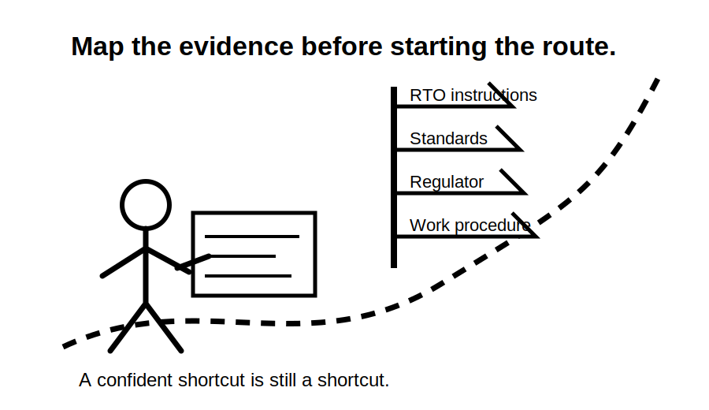
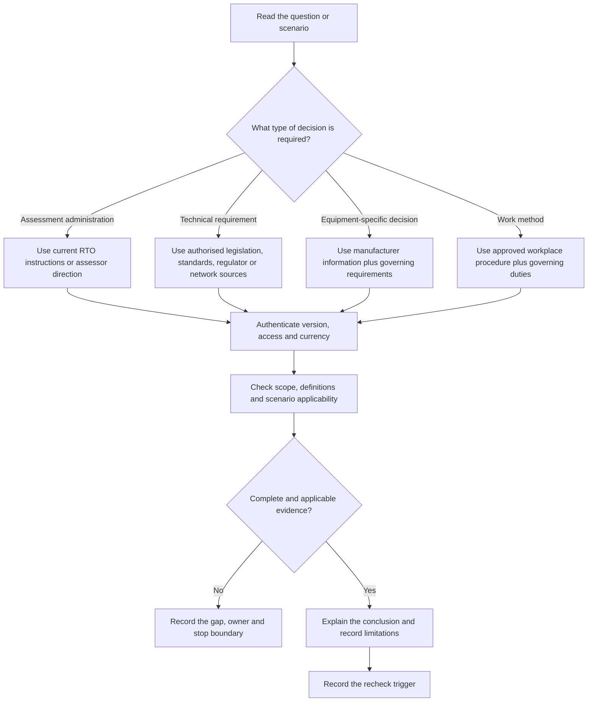
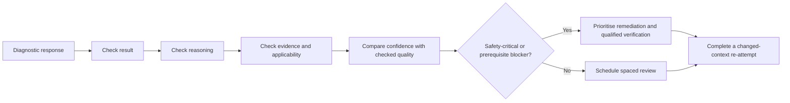
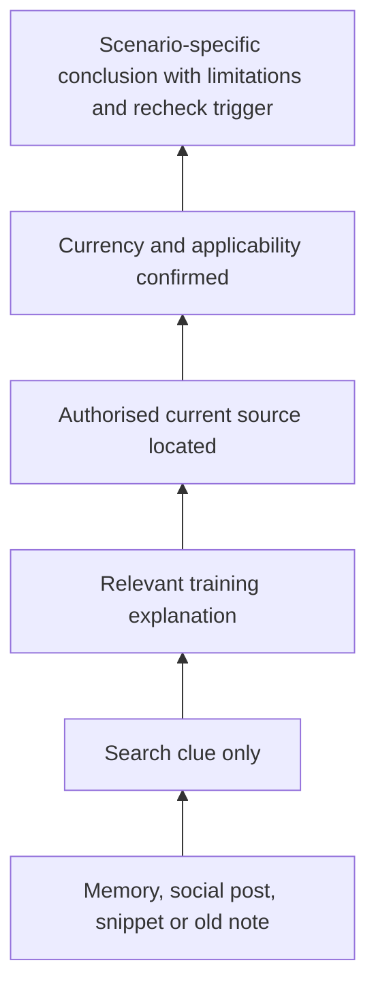
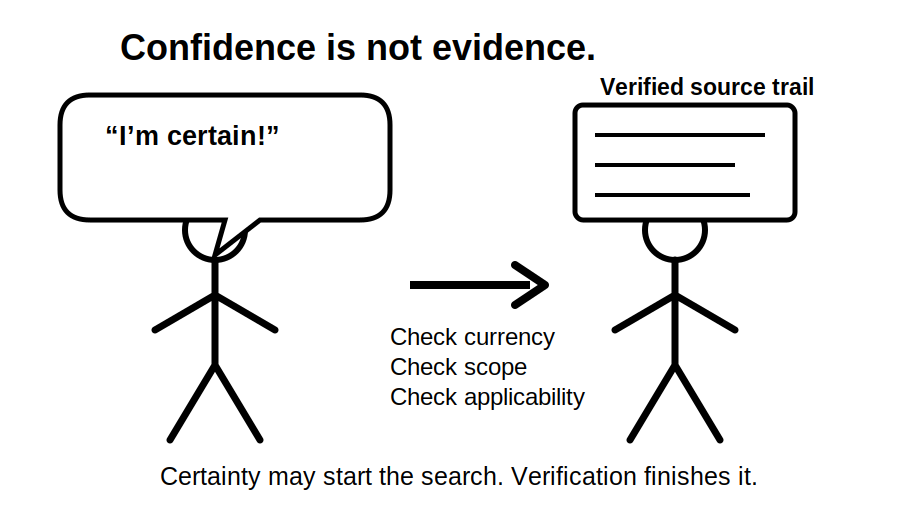

# Day 1 — Program Orientation, Baseline Diagnostic and Authorised-Source Map

> **Currency and scope notice:** This module establishes a study baseline and a method for identifying controlling sources. It does not state a universal Capstone exam format, permitted-resource rule, pass mark, technical requirement or safe-work procedure. Confirm current assessment arrangements with the learner's RTO. Verify technical conclusions using authorised current legislation, standards, regulator guidance, network requirements, manufacturer information and approved workplace procedures as applicable.

## 1. Outcome and entry check

### Learning objectives

By the end of this block, the learner should be able to:

1. explain the purpose, weekly rhythm and evidence expectations of the twelve-week program;
2. complete an eight-domain baseline diagnostic without notes and record confidence before checking;
3. classify each incomplete response as a knowledge, navigation, process, applicability or unsafe-assumption error;
4. identify the likely controlling source family for an assessment, design, installation, equipment or workplace question;
5. create an authorised-source map that records access, edition, jurisdiction, currency, applicability and unresolved ownership;
6. distinguish source availability, source authority and permission to use a source in an assessment;
7. select one remediation priority using safety significance, prerequisite value, recurrence and confidence error; and
8. state the boundary between learning activity, supervised practice and authorised electrical work.

### Entry check

Without opening references, answer each prompt and mark confidence as **guessing**, **unsure**, **reasonably confident** or **certain**.

1. Which source controls what resources are permitted in a particular assessment?
2. Name two reasons a technically relevant source may not apply to a scenario.
3. What is the difference between remembering a rule and holding defensible evidence for a conclusion?
4. When should a learner stop and seek qualified direction rather than continue a practical task?
5. Which weakness is more urgent: a low-confidence terminology error or a high-confidence safety error? Explain why.
6. What information should be recorded when a source is unavailable or its currency cannot be confirmed?

Do not calculate a pass mark. The diagnostic locates starting points; it does not certify competence.



## 2. Why it matters

A long program can create false reassurance if progress is measured only by completed pages. Capstone readiness depends on whether the learner can retrieve, navigate, apply and explain knowledge safely under assessment conditions.

Day 1 creates a baseline so later improvement can be measured against evidence rather than memory. It prevents four common planning failures:

- studying familiar topics while avoiding weak prerequisites;
- treating confidence as proof of competence;
- relying on old notes, screenshots or remembered clause locations as if they were current authorised sources; and
- treating a correct final answer as sufficient when the reasoning or evidence trail is defective.

The twelve-week pathway deliberately revisits concepts in varied contexts. A baseline record allows later retrieval results, worked-example fading and mock assessments to show whether capability has actually changed.

## 3. Core concepts and terminology

### Baseline diagnostic

A **baseline diagnostic** is an initial, low-stakes sample of current capability. It is not an official competency assessment. It reveals what the learner can do without prompts, where reasoning breaks down and how confidence compares with checked evidence.

### Capability domain

A **capability domain** is a broad area of performance assessed separately. This program uses:

- terminology and foundational concepts;
- authorised-source navigation;
- protection and earthing reasoning;
- design and calculation process;
- installation and inspection reasoning;
- verification and fault-finding concepts;
- evidence recording and explanation; and
- safety, authority and stop conditions.

### Error type

Classify each diagnostic error before choosing remediation:

- **Knowledge gap:** the concept or term is not understood.
- **Navigation gap:** the learner cannot locate or verify the controlling information.
- **Process gap:** individual facts are known but are not organised into a reliable workflow.
- **Applicability gap:** a requirement is found but matched to the wrong equipment, location, supply or work context.
- **Unsafe assumption:** the learner proceeds despite missing authority, uncertain equipment state, incomplete source evidence or an unverified control.

### Confidence calibration

**Confidence calibration** compares stated certainty with checked answer quality. A high-confidence error receives priority because it is more likely to be repeated without verification.

### Evidence dimensions

A response is reviewed through four separate dimensions:

1. **Result:** whether the final response is supportable.
2. **Reasoning:** whether the steps logically connect the facts to the conclusion.
3. **Evidence:** whether current, applicable and authorised sources support the conclusion.
4. **Boundary:** whether limitations, uncertainty and stop conditions are stated.

A correct result with defective reasoning is not treated as secure learning evidence.

### Source family

A **source family** is a category of information likely to control a decision:

- RTO assessment instructions and assessor direction;
- legislation and regulation;
- adopted or required standards;
- regulator and network-service-provider requirements;
- manufacturer instructions and equipment data;
- approved workplace procedures and systems of work; and
- training explanations and original learning materials.

Training material may explain and organise learning, but it does not replace the source that legally, technically or administratively controls the decision.

### Authorised-source map

An **authorised-source map** records what sources the learner can legitimately access and whether they are usable for the current jurisdiction, task and assessment context.

```text
Source family:
Title or issuing body:
Purpose:
Jurisdiction or workplace:
Edition/version/date:
Amendments or currency checked:
Access confirmed:
Assessment use permitted:
Applicability limits:
Last verification date:
Recheck trigger:
Unresolved check and owner:
```

### Recheck trigger

A **recheck trigger** is a change that makes earlier source verification unreliable. Examples include a revised assessment brief, amendment, changed jurisdiction, different equipment model, altered supply arrangement or updated workplace procedure.

### Remediation priority

A **remediation priority** is the next weakness selected for correction. Prioritise:

1. unsafe high-confidence assumptions;
2. weak prerequisites that block several later topics;
3. missing access to controlling sources;
4. recurring process or applicability errors; and
5. isolated low-risk recall gaps.

## 4. Rule-finding workflow

Use **M-A-P-S** before relying on any source.

1. **M — Match the question to a source family.** Decide whether the question concerns assessment administration, technical requirements, equipment data or workplace method.
2. **A — Authenticate access and currency.** Confirm legitimate access, edition, amendments, jurisdiction and any RTO restrictions.
3. **P — Prove applicability.** Check scope, definitions, installation type, equipment, supply arrangement, work type and date.
4. **S — State the evidence boundary.** Record what the source establishes, what remains unresolved, who owns the check and what change would trigger re-verification.



The workflow is deliberately conservative. Familiarity, searchability or common use does not prove that a source controls the current question.

## 5. Visual model or worked example

### Worked baseline classification

**Fictional diagnostic response:**

> “An RCD protects the cable from every overcurrent condition, so separate overcurrent protection is unnecessary.”

This module does not provide device-selection instructions. It demonstrates how to classify and remediate the response.

| Diagnostic lens | Observation | Record |
|---|---|---|
| Result | The statement combines distinct protective functions. | Mark unsupported pending authorised technical verification. |
| Reasoning | No separate function or protection boundary is identified. | Record a process gap. |
| Evidence | No current, applicable source is cited. | Record a navigation and evidence gap. |
| Confidence | Learner marked “certain.” | Treat as a high-priority confidence error. |
| Safety significance | The misconception could affect later design reasoning. | Escalate in the remediation order. |
| Next task | Explain the distinct purposes in original words, then classify a changed scenario. | Re-attempt without copying the first answer. |



### Evidence-strength ladder



Confidence cannot move evidence up this ladder. Verification can.



## 6. Practical application

### Part A — build the baseline record

Use eight original prompts supplied by the trainer, RTO or approved practice bank: one for each capability domain.

For each prompt, record:

1. the answer without notes;
2. confidence before checking;
3. the reasoning steps used;
4. the result, reasoning, evidence and boundary review;
5. the error type if incorrect or incomplete;
6. the likely controlling source family;
7. whether authorised access and assessment-use permission are available;
8. the smallest useful remediation task; and
9. confidence after verification.

Use these educational anchors rather than a pass mark:

- **Secure:** supportable result, coherent reasoning, applicable evidence and stated limits.
- **Developing:** partly supportable but contains one material gap that can be named.
- **Unsupported:** conclusion lacks applicable evidence or contains broken reasoning.
- **Stop-required:** the response crosses an authority or safety boundary, or relies on an unsafe assumption.

Any **stop-required** response is prioritised regardless of the other categories.

### Part B — create the authorised-source map

Create one row for each source family. Do not copy technical provisions into the map. Record metadata, purpose, access, applicability, recheck triggers and unresolved ownership.

| Source family | Access and currency evidence | Intended use | Gap, owner or recheck trigger |
|---|---|---|---|
| RTO instructions | Current task sheet or assessor confirmation | Assessment conditions | Record unclear resource restrictions and who will resolve them. |
| Legislation/regulation | Current official publication | Legal duties and jurisdiction | Recheck if jurisdiction or work context changes. |
| Standards | Authorised current edition and amendments | Technical requirements | Record licensed access, edition and amendment status. |
| Regulator/network | Current official guidance or requirements | Jurisdiction or supply conditions | Recheck if the supply authority or scenario changes. |
| Manufacturer | Current model-specific documentation | Equipment data and instructions | Recheck if product identity or revision changes. |
| Workplace procedures | Approved controlled document | Authorised work method | Recheck if owner, revision, task or supervision changes. |

### Part C — choose the first remediation target

Score each weakness from 0–2 on:

- safety significance;
- prerequisite value;
- confidence error;
- recurrence; and
- missing-source impact.

The score is a study-triage aid, not an official competency result. Choose one priority and define a changed-context re-attempt to complete later in Week 1.

### Part D — quality check the baseline

Before closing Day 1, confirm that:

- all eight domains were sampled;
- confidence was recorded before checking;
- correct guesses were not treated as secure knowledge;
- every source entry has a currency check or explicit gap;
- unresolved checks have an owner;
- at least one recheck trigger is recorded; and
- exactly one first remediation target is selected.

## 7. Common errors and safety checkpoint

### Common errors

- **Using completed reading as evidence of mastery:** require closed-note retrieval and application.
- **Turning the diagnostic into a pass/fail exam:** use it to classify starting capability.
- **Scoring only the final answer:** review result, reasoning, evidence and boundary separately.
- **Recording only topics:** record the error type and failed reasoning step.
- **Prioritising comfortable topics:** prioritise safety significance and prerequisite value.
- **Treating confidence as accuracy:** compare confidence with checked evidence.
- **Listing a source without checking version:** record edition, date, amendments and jurisdiction.
- **Assuming access means permission:** confirm RTO assessment-use rules separately.
- **Leaving gaps ownerless:** record who will resolve each missing-source or applicability question.
- **Copying standards content into notes:** record a reference trail and original explanation instead.
- **Trying to correct every weakness on Day 1:** choose one priority and preserve the rest in the error log.

### Safety checkpoint

This module does not authorise opening equipment, approaching exposed parts, switching, isolation, testing, energisation, resetting, alteration, repair or certification.

Stop and seek direction from the supervising licensed person, assessor or authorised competent person when:

- the practical authority or supervision boundary is unclear;
- equipment state or all energy sources cannot be established;
- an authorised procedure or controlling source is unavailable;
- the learner is asked to perform beyond licence, training or workplace authority; or
- fatigue, time pressure or uncertainty makes safe reasoning unreliable.

A baseline answer is educational evidence only. It is not permission to act on an installation.

## 8. Retrieval and next links

### Closed-note recall

1. What are the five error types used in this module?
2. Why are high-confidence errors prioritised?
3. What does each letter in **M-A-P-S** represent?
4. What are the four evidence dimensions used to review a response?
5. What is the difference between source access, source authority and assessment-use permission?
6. What metadata belongs in an authorised-source map?
7. What is a recheck trigger?
8. Why is the baseline not an official competency result?
9. Name three practical stop conditions.

### Varied retrieval

A learner finds an undated screenshot of a technical table in a group chat and is certain it answers a cable-design question.

Write:

- the evidence level of the screenshot;
- the likely error types;
- the controlling source family;
- the M-A-P-S steps required before a conclusion;
- the exact unresolved checks and their owner;
- one recheck trigger; and
- the next safe study action.

### Evidence to retain

Keep:

- the eight-domain baseline record;
- the authorised-source map;
- the result/reasoning/evidence/boundary review;
- the prioritised error log;
- the selected remediation target; and
- confidence before and after checking.

These records will be revisited during weekly consolidation and mock review.

### Navigation

- **Plan:** [Twelve-Week Capstone Learning Plan](../MASTER_PLAN.md)
- **Knowledge note:** [[12-Week Day 01 - Program Orientation Baseline Diagnostic and Authorised-Source Map]]
- **Previous:** None — this is the first block.
- **Next:** [Day 2 — Electrical Hazards, Exposure Pathways and Consequence Reasoning](day-02-electrical-hazards-exposure-pathways-and-consequence-reasoning.md)

### Reference and currency notice

Verify current assessment conditions with the learner's RTO. Verify all technical, legal, jurisdiction-specific and safety-critical conclusions against authorised current sources. This quality-improved original learning module remains `review-required`, `reference_check_required` and not `technically-reviewed`.