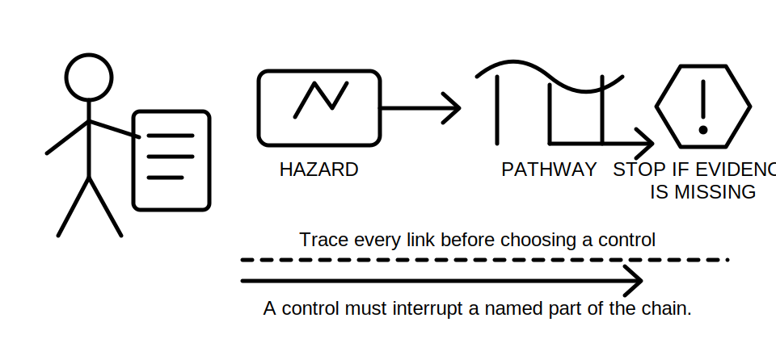
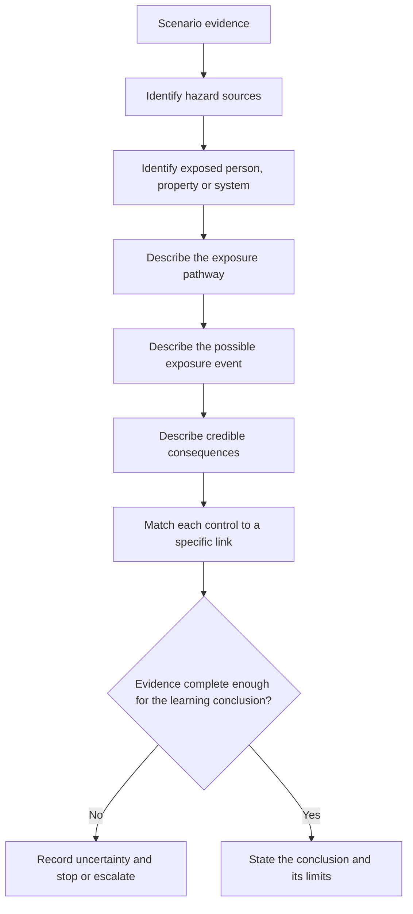
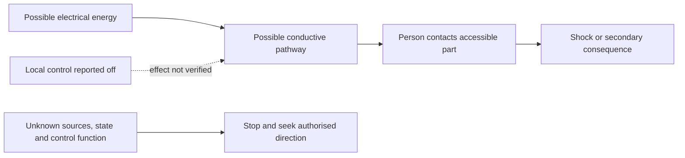

# Day 2 — Electrical Hazards, Exposure Pathways and Consequence Reasoning

> **Currency and scope notice:** This module teaches a conservative reasoning model for recognising electrical hazards and explaining how exposure may lead to harm. It does not prescribe a safe-work method, isolation procedure, test sequence, approach distance, rescue method or emergency response. Current legislation, regulator guidance, authorised workplace procedures, equipment instructions, supervision arrangements and task-specific controls remain controlling. All safety-critical detail requires qualified review.

## 1. Outcome and entry check

### Learning objectives

By the end of this block, the learner should be able to:

1. distinguish a **hazard**, an **exposure pathway**, an **exposure event**, a **consequence** and a **control**;
2. construct a complete hazard-to-consequence chain from a written scenario without inventing missing facts;
3. identify at least three factors that can increase or reduce the likelihood or severity of harm;
4. distinguish a control that removes or interrupts a pathway from a control that only reduces consequence;
5. identify missing evidence that prevents a safe conclusion;
6. explain why de-energised appearance, an open switch or absence of visible damage is not proof of safety;
7. state when the correct learner action is to stop, preserve the scene and seek authorised direction.

### Entry check

Answer without notes and record confidence before checking:

1. Is “electric shock” a hazard, an exposure event or a consequence? Explain your classification.
2. Give one example of an electrical hazard that can cause harm without direct body contact.
3. What must be known before claiming that an exposure pathway has been interrupted?
4. Why can one scenario produce several different consequences?
5. What is the difference between a control being present and a control being verified effective?
6. When should uncertainty itself trigger a stop decision?

Do not turn this entry check into a practical inspection. Use only written, trainer-provided or otherwise authorised learning scenarios.



## 2. Why it matters

Weak safety reasoning often jumps directly from “electricity is dangerous” to a generic control such as wearing personal protective equipment or switching something off. That shortcut hides the mechanism of harm and makes it difficult to judge whether the chosen control actually interrupts the relevant pathway.

Capstone-style questions may present incomplete information, multiple energy sources, misleading labels, damaged equipment or competing hazards. A defensible response must separate:

- what can cause harm;
- how a person, animal, property or system could be exposed;
- what event would transfer energy;
- what harm could follow;
- what evidence is needed before relying on a control.

This module builds the reasoning foundation for later work on authority, isolation, protection, earthing, verification and fault finding. It deliberately avoids procedural detail until the learner can first describe the hazard chain accurately.

## 3. Core concepts and terminology

### Hazard

A **hazard** is a source or situation with the potential to cause harm. In electrical work, hazards can include electrical energy, stored energy, induced or back-fed energy, heat, arcing, fire, movement, pressure, hazardous substances, height and the consequences of unexpected equipment operation.

### Exposure pathway

An **exposure pathway** is the route or set of conditions that could allow the hazard to reach a person, property or system. Examples include contact with an accessible conductive part, approach to an arc source, damaged insulation permitting contact, a conductive tool bridging points, or equipment starting unexpectedly.

### Exposure event

An **exposure event** is the actual transfer or interaction that occurs when the pathway is completed. Examples include current passing through a body, thermal energy reaching skin, an arc releasing heat and pressure, or machinery moving while a person is in the danger zone.

### Consequence

A **consequence** is the resulting harm or loss. Consequences may include injury, fatality, burns, fire, equipment damage, secondary falls, loss of supply, process interruption or harm to another person.

### Likelihood and severity

**Likelihood** is how plausible the exposure event is under the stated conditions. **Severity** is how serious the resulting consequence could be. Neither should be guessed from a single visible feature. Both depend on scenario-specific evidence.

### Control

A **control** is a measure intended to eliminate the hazard, interrupt the pathway, reduce likelihood, reduce severity or improve detection and response. A control is not reliable merely because it is named, fitted or expected to exist. Its applicability, condition, configuration and effectiveness must be established by authorised evidence.

### Critical control

A **critical control** is a control whose failure could permit a serious or fatal event. Because the consequence of failure is high, the evidence needed before relying on it must also be strong.

### Residual uncertainty

**Residual uncertainty** is what remains unknown after the available evidence has been reviewed. If the uncertainty affects energy state, source identification, authority, control effectiveness or exposure, the correct outcome may be to stop rather than infer.

## 4. Rule-finding workflow

Use **H-A-Z-A-R-D** to analyse a written scenario.

1. **H — Highlight the energy and other harm sources.** List only hazards supported by the scenario.
2. **A — Analyse who or what could be exposed.** Identify people, equipment, property and secondary effects.
3. **Z — Zoom in on the pathway.** State the physical or operational route by which harm could occur.
4. **A — Ask what evidence is missing.** Record unknown energy sources, equipment state, authority, condition, environment and control status.
5. **R — Relate controls to the pathway.** Explain exactly which part of the chain each control is intended to remove or reduce.
6. **D — Decide whether reasoning may continue.** Continue only within the learning task; stop and escalate if a real-world safety conclusion depends on missing authorised evidence.



The sequence prevents a learner from naming controls before understanding the mechanism. A generic control that does not interrupt the stated pathway is not a complete answer.

## 5. Visual model or worked example

### Fictional scenario

A maintenance worker reports that a metal-framed appliance “gave a tingle.” The appliance is now switched off at its local control. No authorised isolation, test result, supply diagram or equipment inspection record is available.

This is a reasoning exercise only. It is not an instruction to approach, test, touch, reset or operate the appliance.

| Reasoning stage | Defensible statement | Unsupported shortcut to avoid |
|---|---|---|
| Hazard | Electrical energy may be present, and the reported symptom suggests a potentially unsafe condition. | “The appliance is definitely live.” |
| Exposed target | A person touching accessible conductive parts may be exposed. | “Only the reporter is at risk.” |
| Pathway | A conductive contact path may exist between an energised fault condition, the frame, the person and the surrounding environment. | “The frame must be the cause.” |
| Event | Current may pass through a person if the pathway is completed. | “A tingle proves the current level was harmless.” |
| Consequence | Shock, secondary movement or fall, burn, fire or equipment damage may be credible depending on facts not yet known. | “No injury occurred, so there is no serious risk.” |
| Existing control | The local control is reported off, but its function, pole arrangement, condition and effect on all energy sources are unverified. | “Off means isolated.” |
| Decision | Preserve the warning, prevent unauthorised use and refer to the authorised person and procedure. | “Try it again to confirm.” |



The dotted relationship shows that a reported control position is evidence to investigate, not proof that the pathway is interrupted.

### Control-to-pathway test

For every proposed control, complete this sentence:

> “This control is intended to change ______ in the hazard chain, and its effectiveness would need to be established by ______.”

A learner who cannot fill both blanks has not yet produced a defensible control argument.

## 6. Practical application

### Written scenario analysis

Use a trainer-provided fictional scenario containing:

- one primary electrical hazard;
- one secondary hazard;
- at least two possible exposure pathways;
- one stated control;
- one hidden or missing source of energy;
- incomplete evidence about authority or equipment state.

Create a one-page hazard-chain record:

```text
Observed facts:
Primary hazard:
Secondary hazard:
Exposed person/property/system:
Pathway 1:
Pathway 2:
Possible exposure event:
Credible consequences:
Existing controls:
What each control changes:
Control evidence available:
Missing evidence:
Stop/escalation point:
Authorised source or person required:
```

Then complete three tasks:

1. **Classification:** correctly label each item as hazard, pathway, event, consequence, control or evidence gap.
2. **Control matching:** connect every control to the exact link it is intended to affect.
3. **Varied re-attempt:** analyse a second scenario in which the same hazard has a different pathway or consequence.

### Performance rubric

Score each category 0, 1 or 2:

- terminology accuracy;
- completeness of the hazard chain;
- separation of fact from assumption;
- control-to-pathway reasoning;
- recognition of missing evidence;
- safe stop and escalation decision.

A high total does not authorise practical work. Any unsafe assumption or failure to stop where required must be remediated before later practical-preparation content.

## 7. Common errors and safety checkpoint

### Common errors

- **Calling the consequence the hazard:** for example, naming “shock” without identifying the energy source and pathway.
- **Naming only one pathway:** consider direct, indirect, secondary and unexpected-operation pathways where supported.
- **Assuming visible condition proves energy state:** labels, indicator lights, switch positions and appearance are incomplete evidence.
- **Treating PPE as the first or only control:** first understand whether the hazard can be removed or the pathway interrupted under authorised procedures.
- **Listing controls without checking effectiveness:** record what evidence would establish that the control applies and works.
- **Confusing low likelihood with low consequence:** an uncommon event may still require strict control because the credible consequence is severe.
- **Using absence of prior harm as proof of safety:** previous survival is not verification.
- **Inventing technical values or procedures:** mark them `reference_check_required` and use authorised current sources.

### Safety checkpoint

This module authorises no approach to exposed parts, opening of equipment, switching, resetting, isolation, testing, energisation, alteration, repair, rescue or emergency intervention.

Stop and seek authorised direction when:

- any energy source or equipment state is uncertain;
- a control is assumed rather than verified;
- the scenario involves damaged equipment, exposed conductive parts, burning, arcing, smoke, heat or unexpected operation;
- the learner lacks task authority, supervision or an approved procedure;
- the environment introduces water, conductive structures, height, confined space, machinery or other interacting hazards;
- fatigue, urgency or pressure is narrowing attention;
- the next step would require real-world contact, operation or testing.

In an actual emergency, follow current emergency procedures and directions from emergency services and authorised workplace personnel. This module does not replace emergency training.

## 8. Retrieval and next links

### Closed-note recall

1. Define hazard, exposure pathway, exposure event, consequence and control.
2. What does each letter in **H-A-Z-A-R-D** represent?
3. Why is a switch position not proof of isolation?
4. What is the control-to-pathway test?
5. Name three forms of missing evidence that should prevent a confident conclusion.
6. Why can one hazard create multiple consequences?
7. What makes a control “critical”?
8. State four stop conditions from this module.

### Varied retrieval

A damaged extension lead is found near a damp work area. It is unplugged, but the origin of the lead, the condition of the outlet, the presence of other supplies and the authority to inspect are unknown.

Without proposing a practical procedure, write:

- the observed facts;
- two hazards;
- two possible pathways;
- two credible consequences;
- the evidence gaps;
- how a stated control would need to be verified;
- the safe stop and escalation point.

### Evidence to retain

Keep:

- the completed hazard-chain record;
- the first and varied scenarios;
- confidence before and after checking;
- any unsafe assumptions added to the error log;
- the exact authorised-source or supervision questions that remain open.

### Navigation

- **Plan:** [Twelve-Week Capstone Learning Plan](../MASTER_PLAN.md)
- **Knowledge note:** [[12-Week Day 02 - Electrical Hazards Exposure Pathways and Consequence Reasoning]]
- **Previous:** [Day 1 — Program Orientation, Baseline Diagnostic and Authorised-Source Map](day-01-program-orientation-baseline-diagnostic-and-authorised-source-map.md)
- **Next:** Day 3 — Roles, Authority, Supervision and Practical Stop Conditions

### Reference and currency notice

Verify all safety-critical claims, legal duties, source applicability, work methods and emergency arrangements against authorised current sources for the relevant jurisdiction, workplace and task. This original educational module is `review-required`, `reference_check_required` and not `technically-reviewed`.