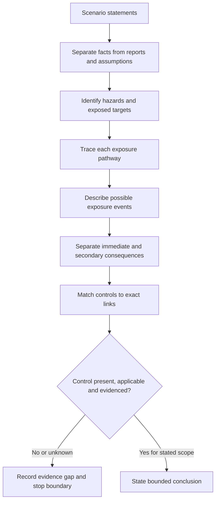
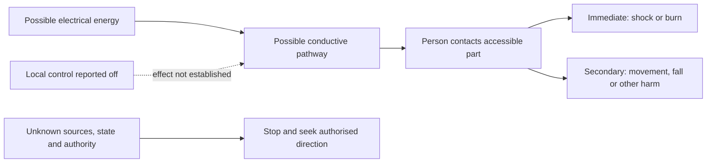

# Day 2 — Electrical Hazards, Exposure Pathways and Consequence Reasoning

> **Currency and scope notice:** This module teaches a conservative reasoning model for recognising electrical hazards and explaining how exposure may lead to harm. It does not prescribe a safe-work method, isolation procedure, test sequence, approach distance, rescue method or emergency response. Current legislation, regulator guidance, authorised workplace procedures, equipment instructions, supervision arrangements and task-specific controls remain controlling. All safety-critical detail requires qualified review.

## 1. Outcome and entry check

### Learning objectives

By the end of this block, the learner should be able to:

1. classify scenario statements as **hazard**, **exposed target**, **exposure pathway**, **exposure event**, **consequence**, **control** or **evidence gap** with no category substitutions;
2. construct a complete hazard-to-consequence chain from a written scenario while marking every inference that is not directly supported;
3. explain at least two distinct pathways or consequences where the scenario evidence permits them;
4. match each proposed control to the exact link it is intended to eliminate, interrupt, reduce or detect;
5. distinguish a control being named, present, applicable and verified effective;
6. identify uncertainty about energy state, source, authority or control effectiveness that requires a stop decision; and
7. transfer the model to a changed scenario without copying the first answer structure mechanically.

### Entry check

Answer without notes and record confidence as **guessing**, **unsure**, **reasonably confident** or **certain**:

1. Is “electric shock” a hazard, an exposure event or a consequence? State what additional wording would remove ambiguity.
2. Give one example of harm that can occur without direct body contact with a conductor.
3. What evidence is required before claiming that a pathway has been interrupted?
4. Why can one hazard produce several consequences?
5. What is the difference between a control being present and being verified effective for the stated scenario?
6. When should uncertainty itself trigger a stop decision?

Record any high-confidence error separately. A correct answer supported only by guessing is not yet secure evidence of understanding.

Do not turn this entry check into a practical inspection. Use only written, trainer-provided or otherwise authorised learning scenarios.


## 2. Why it matters

Weak safety reasoning often jumps directly from “electricity is dangerous” to a generic control such as personal protective equipment or switching something off. That shortcut hides the mechanism of harm and prevents the learner from showing whether the control addresses the actual pathway.

Capstone-style scenarios may contain incomplete information, several energy sources, misleading labels, damaged equipment or interacting hazards. A defensible response must separate:

- the source or situation capable of causing harm;
- the person, property or system exposed;
- the route that permits exposure;
- the event that transfers energy or initiates movement;
- the credible immediate and secondary consequences;
- the control-to-pathway relationship; and
- the evidence boundary beyond which the learner must not infer.

This reasoning foundation is reused in authority, isolation, protection, earthing, verification and fault-finding modules. The aim is not to predict every outcome. It is to produce a bounded explanation that another person can inspect, challenge and verify.

## 3. Core concepts and terminology

### Hazard

A **hazard** is a source or situation with the potential to cause harm. Electrical energy is one hazard source, but a scenario may also involve stored energy, induced or back-fed energy, heat, arcing, fire, movement, pressure, hazardous substances, height or unexpected equipment operation.

### Exposed target

An **exposed target** is the person, animal, property, equipment or system that could be harmed. Naming the target prevents vague statements such as “it is dangerous” and reveals secondary exposure, such as a nearby person affected by a fall or unexpected movement.

### Exposure pathway

An **exposure pathway** is the route or set of conditions that could allow the hazard to reach the target. Examples include contact with an accessible conductive part, approach to an arc source, damaged insulation permitting contact, a conductive object bridging points or equipment starting while a person is within a danger zone.

### Exposure event

An **exposure event** is the transfer or interaction that occurs when the pathway is completed. Examples include current passing through a body, thermal energy reaching skin, an arc releasing heat and pressure, or machinery moving unexpectedly.

### Consequence

A **consequence** is the resulting harm or loss. Separate **immediate consequences**, such as shock or burn, from **secondary consequences**, such as a fall, fire, equipment damage, process interruption or harm to another person.

### Likelihood and severity

**Likelihood** describes how plausible the exposure event is under the stated conditions. **Severity** describes how serious a credible consequence could be. A lack of evidence may prevent either from being estimated. Low apparent likelihood does not make a severe credible consequence irrelevant.

### Control

A **control** is a measure intended to eliminate the hazard, interrupt the pathway, reduce likelihood, reduce severity or improve detection and response. Four separate questions must be answered:

1. **Named:** has the control merely been mentioned?
2. **Present:** is there evidence that it exists in this scenario?
3. **Applicable:** does it address the stated hazard and pathway?
4. **Verified effective:** is there authorised evidence that its required function is achieved under the stated conditions?

### Critical control

A **critical control** is a control whose failure could permit a serious or fatal event. The more serious the credible consequence, the less acceptable it is to rely on assumption, appearance or undocumented status.

### Evidence gap and residual uncertainty

An **evidence gap** is a specific missing fact, record, source or authorised confirmation. **Residual uncertainty** is what remains unknown after available evidence is reviewed. Uncertainty about energy state, source identification, task authority, control effectiveness or exposure requires an explicit boundary and may require stopping.

## 4. Rule-finding workflow

Use **H-A-Z-A-R-D** to analyse a written scenario.

1. **H — Highlight harm sources.** List only hazards supported by the scenario and separate primary from interacting hazards.
2. **A — Analyse exposed targets.** Identify who or what could be harmed, including secondary targets.
3. **Z — Zoom in on each pathway.** Describe the physical or operational route without skipping directly to the consequence.
4. **A — Ask what evidence is missing.** Record unknown sources, states, authority, condition, environment and control status.
5. **R — Relate controls to links.** State exactly which link each control changes and what evidence would show that it applies.
6. **D — Decide the boundary.** State the supported learning conclusion, its limits and the point at which authorised direction is required.



The diagram includes an evidence test after control matching. A named control is not automatically a valid conclusion because existence, applicability and effectiveness are separate claims.

### Evidence-strength check

Use these educational anchors; they are not an official risk-rating system:

- **Supported:** the scenario directly supplies the fact or an authorised record.
- **Reasonable but unverified:** the inference is plausible, labelled as an inference and not used to justify practical action.
- **Unsupported:** the claim has no stated evidence or depends on an invented value, procedure or equipment state.
- **Stop-required:** the missing evidence affects energy state, exposure, authority or a critical control.

## 5. Visual model or worked example

### Fictional scenario

A maintenance worker reports that a metal-framed appliance “gave a tingle.” The appliance is now switched off at its local control. No authorised isolation record, test result, supply diagram or equipment inspection record is available.

This is a reasoning exercise only. It is not an instruction to approach, test, touch, reset or operate the appliance.

| Reasoning stage | Defensible statement | Evidence status | Unsupported shortcut to avoid |
|---|---|---|---|
| Hazard | Electrical energy may be present; the report indicates a potentially unsafe condition. | Reported and incomplete | “The appliance is definitely live.” |
| Exposed target | A person contacting an accessible conductive part may be exposed. | Reasonable pathway target | “Only the reporter is at risk.” |
| Pathway | A conductive route may exist between a fault condition, the frame, a person and the surrounding environment. | Unverified inference | “The frame must be the fault source.” |
| Event | Current may pass through a person if that pathway is completed. | Consequence mechanism | “A tingle proves the current was harmless.” |
| Consequence | Shock, involuntary movement, fall, burn, fire or equipment damage may be credible. | Depends on missing facts | “No injury means no serious risk.” |
| Stated control | The local control is reported off, but its function and effect on all sources are unknown. | Present only as a report | “Off means isolated.” |
| Boundary | Prevent unauthorised use and refer the matter to the authorised person and procedure. | Stop-required | “Operate it again to confirm.” |



The dotted relationship shows that a reported control position is evidence to investigate, not proof that the pathway is interrupted. The split consequence branches force the learner to consider both direct and secondary harm.

### Control-to-pathway test

For every proposed control, complete both statements:

> “This control is intended to change ______ in the hazard chain.”

> “Before relying on it, the evidence required is ______, provided or confirmed by ______.”

A response is incomplete when either the affected link or evidence owner is missing.

## 6. Practical application

### Independent written scenario analysis

Use a trainer-provided fictional scenario containing one primary electrical hazard, one interacting hazard, at least two possible pathways, one stated control, one hidden or missing energy source and incomplete evidence about authority or equipment state.

Create a one-page hazard-chain record:

```text
Observed facts and reports:
Assumptions or inferences:
Primary hazard:
Interacting hazard:
Exposed target(s):
Pathway 1:
Pathway 2:
Possible exposure event(s):
Immediate consequence(s):
Secondary consequence(s):
Existing control(s):
Link changed by each control:
Evidence that each control is present:
Evidence that each control is applicable/effective:
Evidence gaps:
Stop/escalation point:
Authorised source or person required:
Bounded conclusion:
```

Complete four tasks:

1. **Classification:** label every item correctly and correct any category substitution.
2. **Control matching:** connect every control to one or more exact links and state the evidence owner.
3. **Consequence discrimination:** explain why at least one immediate and one secondary consequence are credible or not supported.
4. **Changed-context transfer:** reanalyse a second scenario where the hazard is similar but the target, environment or pathway differs.

### Performance rubric

Rate each category using the following anchors:

| Category | Secure | Developing | Unsupported or stop-required |
|---|---|---|---|
| Terminology | Categories are distinct and consistently used. | One correctable category substitution. | Hazard, pathway, event and consequence are merged or confused. |
| Evidence discipline | Facts, reports and inferences are visibly separated. | Some inference labels or evidence owners are missing. | Invented facts or values support the conclusion. |
| Pathway completeness | Hazard, target, pathway, event and consequences form a traceable chain. | One link is vague but recoverable. | The response jumps from hazard to control or consequence. |
| Control reasoning | Each control is linked to a mechanism and evidence requirement. | Mechanism is stated but evidence is incomplete. | Presence is treated as effectiveness. |
| Consequence reasoning | Immediate and secondary consequences are distinguished and bounded. | Consequences are plausible but weakly explained. | Severity or likelihood is asserted without evidence. |
| Safety boundary | Stop conditions, authority and residual uncertainty are explicit. | Boundary exists but is incomplete. | The response proposes unauthorised contact, operation or testing. |
| Transfer | The changed scenario is reasoned from its facts. | Some wording is copied but the altered pathway is recognised. | The first answer is reused despite changed facts. |

A module pass is not an official assessment outcome. Any unsafe assumption, unsupported practical direction or failure to stop is a blocking remediation item regardless of otherwise strong work.

## 7. Common errors and safety checkpoint

### Common errors

- **Calling the consequence the hazard:** naming “shock” without identifying the energy source, target and pathway.
- **Treating a report as a verified fact:** preserve wording such as “reported off” until authorised evidence changes its status.
- **Naming only one pathway:** consider direct, indirect, secondary and unexpected-operation pathways where supported.
- **Assuming visible condition proves energy state:** labels, indicator lights, switch positions and appearance are incomplete evidence.
- **Treating PPE as the first or only control:** first explain the hazard and pathway; do not invent a safe-work hierarchy or procedure.
- **Listing controls without checking applicability:** identify the link affected and the evidence needed before reliance.
- **Confusing low likelihood with low consequence:** an apparently uncommon event may still have a severe credible consequence.
- **Using absence of prior harm as proof of safety:** previous survival is not verification.
- **Overstating precision:** do not invent technical values, legal duties, distances, procedures or acceptance criteria.

### Safety checkpoint

This module authorises no approach to exposed parts, opening of equipment, switching, resetting, isolation, testing, energisation, alteration, repair, rescue or emergency intervention.

Stop and seek authorised direction when:

- any energy source or equipment state is uncertain;
- a critical control is assumed rather than evidenced;
- damaged equipment, exposed conductive parts, burning, arcing, smoke, heat or unexpected operation are involved;
- the learner lacks task authority, supervision or an approved procedure;
- water, conductive structures, height, confined space, machinery or other hazards interact with the electrical hazard;
- fatigue, urgency or pressure is narrowing attention; or
- the next step would require real-world contact, operation, testing or emergency action.

In an actual emergency, follow current emergency procedures and directions from emergency services and authorised workplace personnel. This module does not replace emergency training.

## 8. Retrieval and next links

### Closed-note recall

1. Define hazard, exposed target, exposure pathway, exposure event, consequence and control.
2. What does each letter in **H-A-Z-A-R-D** represent?
3. What are the four separate control-status questions?
4. Why is a switch position not proof of isolation?
5. What is the difference between immediate and secondary consequences?
6. What makes an evidence gap stop-required?
7. State the two parts of the control-to-pathway test.
8. Name four stop conditions from this module.

### Changed-context retrieval

A damaged extension lead is found near a damp work area. It is reported unplugged, but its origin, the condition of the outlet, other possible supplies and authority to inspect are unknown.

Without proposing a practical procedure, write:

- facts, reports and inferences in separate groups;
- two hazards or interacting hazards;
- the exposed targets;
- two possible pathways;
- immediate and secondary consequences;
- the status of the “unplugged” control claim;
- evidence gaps and their owners;
- the safe stop boundary; and
- one sentence explaining how this scenario differs from the appliance example.

### Evidence to retain

Keep:

- the first and changed-context hazard-chain records;
- confidence before and after checking;
- high-confidence errors and category substitutions;
- any unsupported control claims added to the error log;
- the exact authorised-source or supervision questions that remain open; and
- one transfer statement showing what changed between scenarios.

### Navigation

- **Plan:** [Twelve-Week Capstone Learning Plan](../MASTER_PLAN.md)
- **Knowledge note:** [[12-Week Day 02 - Electrical Hazards Exposure Pathways and Consequence Reasoning]]
- **Previous:** [Day 1 — Program Orientation, Baseline Diagnostic and Authorised-Source Map](day-01-program-orientation-baseline-diagnostic-and-authorised-source-map.md)
- **Next:** [Day 3 — Roles, Authority, Supervision and Practical Stop Conditions](day-03-roles-authority-supervision-and-practical-stop-conditions.md)

### Reference and currency notice

Verify all safety-critical claims, legal duties, source applicability, work methods and emergency arrangements against authorised current sources for the relevant jurisdiction, workplace and task. This original educational module is `review-required`, `reference_check_required` and not `technically-reviewed`.