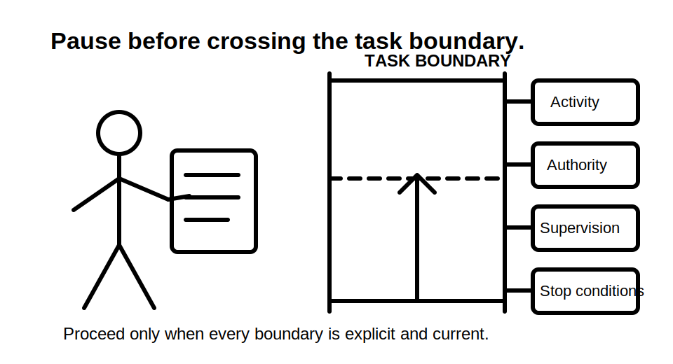
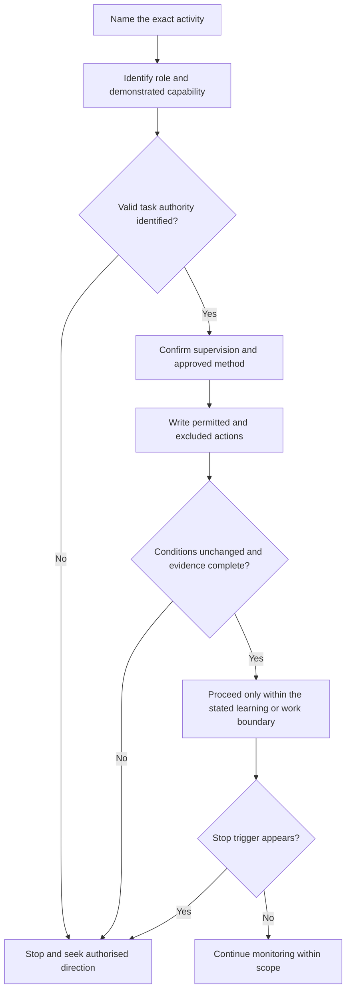
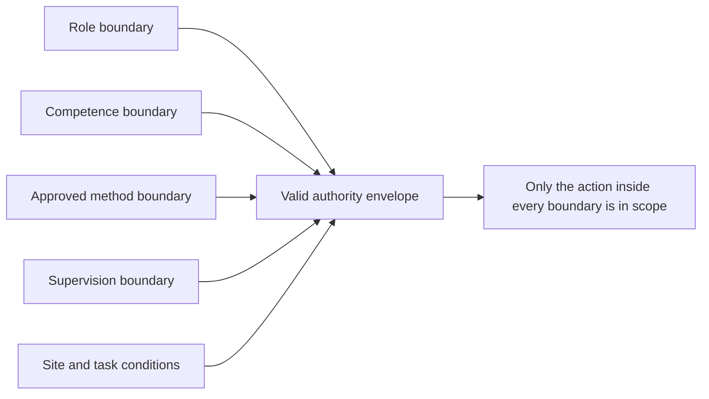

# Day 3 — Roles, Authority, Supervision and Practical Stop Conditions

> **Currency and scope notice:** This module teaches how to reason about role, task authority, supervision and stop conditions before practical activity. It does not define a universal licensing boundary, supervision ratio, safe-work method, isolation procedure, test sequence or emergency response. Current legislation, regulator requirements, licence conditions, RTO instructions, workplace procedures and task-specific directions remain controlling and require authorised verification.

## 1. Outcome and entry check

### Learning objectives

By the end of this block, the learner should be able to:

1. distinguish **role**, **competence**, **task authority**, **supervision**, **scope** and **stop condition**;
2. identify which person or source can authorise a stated learning or workplace task;
3. separate permission to observe, discuss, prepare, assist, operate, test, alter and verify;
4. construct an authority statement that names the task, limits, supervisor, approved method and escalation route;
5. recognise at least six conditions that invalidate or suspend an earlier permission;
6. explain why experience, confidence, urgency or another person's informal request does not independently establish authority;
7. stop a scenario at the first unsupported transition from learning activity to practical action.

### Entry check

Answer without notes and record confidence:

1. Does knowing how to perform a task prove that you are authorised to perform it?
2. Can a person be competent in one part of a task but outside scope for another part?
3. What information must be explicit before “work under supervision” is a usable instruction?
4. Name three changes that should trigger a fresh authority check.
5. Who owns the decision to stop when a learner reaches an unclear boundary?
6. Why is “my supervisor usually lets me” weak evidence?

Use written or trainer-approved scenarios only. Do not convert this entry check into a workplace experiment.



## 2. Why it matters

Many unsafe decisions occur before a tool is touched. The person may misunderstand what they were asked to do, rely on an assumed supervision arrangement, continue after conditions change, or confuse technical familiarity with legal and organisational authority.

Capstone preparation must therefore assess more than whether a learner can describe a correct technical method. A defensible response also shows:

- who is responsible for the task;
- what the learner is permitted to do;
- what remains outside scope;
- what supervision and approved procedure apply;
- which changes require work to stop;
- how uncertainty is escalated without improvisation.

This is a prerequisite for later modules on isolation, inspection, testing, fault finding and verification. Those modules cannot safely rely on the vague instruction “under supervision.”

## 3. Core concepts and terminology

### Role

A **role** is the recognised function a person holds in a learning or work system, such as learner, apprentice, supervisor, assessor, licence holder, site manager or equipment operator. A role suggests responsibilities but does not by itself authorise every task.

### Competence

**Competence** is demonstrated capability to perform a defined activity to the required standard. It is task-specific and evidence-based. Training exposure, confidence or previous success may contribute evidence but does not automatically prove current competence.

### Task authority

**Task authority** is explicit permission from the correct person or system to perform a defined activity under stated conditions. It should identify the task, location or equipment, limits, supervision, approved method and time or condition boundary.

### Scope

**Scope** is the outer boundary of what the person may do. It can be limited by law, licence, training stage, workplace policy, task allocation, equipment type, environment, supervision or the approved procedure.

### Supervision

**Supervision** is an arranged control in which a suitably authorised person directs, monitors and intervenes according to the task risk, learner capability and governing requirements. The word alone is incomplete unless availability, communication, proximity, intervention and stop arrangements are understood.

### Delegation

**Delegation** is the assignment of a task or responsibility by a person who has authority to assign it. Delegation cannot create powers the delegating person does not hold, and it does not remove the recipient's duty to stay within scope.

### Stop condition

A **stop condition** is a predefined or emerging circumstance that requires the task to pause and be referred for authorised direction. It is a control, not a failure of confidence.

### Re-authorisation trigger

A **re-authorisation trigger** is a change that makes the original task permission incomplete or unreliable, such as changed equipment, supply arrangement, environment, personnel, procedure, fault evidence or supervision availability.

## 4. Rule-finding workflow

Use **A-U-T-H-O-R-I-T-Y** before any practical transition:

1. **A — Activity:** state the exact action being considered using a clear verb.
2. **U — User role:** identify the learner's role, demonstrated competence and known limits.
3. **T — Task authority:** identify who or what validly authorises this particular activity.
4. **H — Hazards and controls:** connect the authority check to the Day 2 hazard pathways and critical controls.
5. **O — Oversight:** define the supervision, communication and intervention arrangement.
6. **R — Rules and method:** locate current legislation, RTO instructions, workplace procedures and manufacturer information that apply.
7. **I — In-scope boundary:** write what is permitted and what is expressly excluded.
8. **T — Triggers to stop:** name conditions that suspend the permission.
9. **Y — Yield and escalate:** stop at the first missing element and refer to the authorised person.



The workflow makes authority a maintained condition rather than a one-time verbal permission.

## 5. Visual model or worked example

### The authority envelope

Think of permission as an envelope around a specific activity. Five boundaries must overlap:



If one boundary changes or is unknown, the action moves outside the envelope until checked again.

### Fictional worked example

A learner is asked to “help check a faulty circuit.” The supervisor is elsewhere on site. The fault description is incomplete and an alternate supply may be present.

| Reasoning element | Defensible statement | Unsafe shortcut |
|---|---|---|
| Activity | “Help check” must be converted into exact permitted verbs: observe, retrieve documents, record information or another defined action. | Treat the phrase as permission to open, operate or test equipment. |
| Role | The learner's training stage and demonstrated capability must be known for the exact activity. | Assume time served equals authority. |
| Authority | The authorised person must define the task and limits. | Rely on a message relayed by a co-worker. |
| Oversight | Supervisor availability, communication and intervention arrangements must match the task. | Assume being on the same site is sufficient supervision. |
| Conditions | Possible alternate supply and incomplete fault evidence are re-authorisation triggers. | Continue because the circuit was previously discussed. |
| Decision | Stop before any practical interaction; clarify the activity, sources, method and supervision. | “Just have a quick look” inside equipment. |

The worked example deliberately ends before a technical procedure. The learning objective is to detect the unsupported transition.

## 6. Practical application

### Authority-boundary worksheet

For a trainer-provided fictional scenario, complete:

```text
Exact activity verb:
Person requesting the activity:
Learner role:
Evidence of capability relevant to this activity:
Source of task authority:
Approved method or instruction:
Required supervision arrangement:
Permitted actions:
Explicitly excluded actions:
Known hazards and critical controls:
Missing evidence:
Re-authorisation triggers:
Immediate stop conditions:
Escalation person or channel:
Boundary statement:
```

Complete three passes:

1. **Observation-only pass:** identify what can be learned without practical interaction.
2. **Boundary pass:** mark the first point where explicit authority, supervision or procedure becomes necessary.
3. **Changed-condition pass:** re-evaluate after one detail changes, such as supervisor availability, equipment identity, supply arrangement, environment or fault evidence.

### Observable performance rubric

Score each category 0, 1 or 2:

- exact activity definition;
- correct separation of role, competence and authority;
- supervision specificity;
- permitted-versus-excluded action boundary;
- identification of re-authorisation triggers;
- timely stop and escalation decision.

Any response that performs or proposes an unauthorised practical action is not satisfactory regardless of the total score.

## 7. Common errors and safety checkpoint

### Common errors

- **Competence equals permission:** capability and authority are separate questions.
- **Role title equals unlimited scope:** titles do not replace task-specific limits.
- **Vague action verbs:** “check,” “look at,” “help with” and “make safe” must be clarified.
- **Supervision by proximity:** being nearby is not a complete supervision arrangement.
- **Borrowed authority:** a co-worker's request may not come from the authorised decision-maker.
- **Permission survives every change:** altered conditions require the envelope to be checked again.
- **Silence means consent:** lack of objection is not authorisation.
- **Urgency expands scope:** time pressure does not create authority.
- **Stopping is insubordination:** a justified stop protects the learner, supervisor and task.
- **Inventing legal or RTO rules:** uncertain requirements remain `reference_check_required`.

### Safety checkpoint

This module authorises no switching, isolation, testing, opening of equipment, resetting, disconnection, alteration, repair, rescue, energisation or verification.

Stop and seek authorised direction when:

- the action cannot be stated precisely;
- the person granting permission or their authority is unclear;
- the learner's competence or scope for the exact activity is unverified;
- supervision is unavailable, interrupted or materially different from the arrangement;
- the approved method, equipment identity, energy sources or site conditions are uncertain;
- a fault, damage, unexpected reading, alternate supply or environmental change appears;
- the activity moves from observation or documentation into practical interaction;
- pressure, fatigue or fear of embarrassment discourages escalation.

In an actual emergency, follow current emergency arrangements and directions from emergency services and authorised workplace personnel. This module is not emergency-response training.

## 8. Retrieval and next links

### Closed-note recall

1. Define role, competence, task authority, scope, supervision and stop condition.
2. Recite the nine steps of **A-U-T-H-O-R-I-T-Y**.
3. Why must an instruction such as “help check it” be rewritten with exact verbs?
4. Name five boundaries in the authority envelope.
5. Give six re-authorisation triggers.
6. Explain why supervision is more than physical proximity.
7. What is the first action when valid authority cannot be established?
8. Why does urgency not expand scope?

### Varied retrieval

A learner was authorised to observe a planned inspection with a named supervisor. On arrival, the equipment is different, the supervisor has left temporarily, and a worker asks the learner to remove a cover so the job can start sooner.

Without proposing a technical procedure, write:

- the original authority envelope;
- each condition that has changed;
- the exact unsupported transition;
- the stop statement;
- the information and person needed before any new activity could be considered.

### Evidence to retain

Keep:

- the completed authority-boundary worksheet;
- the changed-condition re-attempt;
- confidence ratings before and after checking;
- any high-confidence scope errors added to the error log;
- unresolved legal, RTO or workplace questions for authorised review.

### Navigation

- **Plan:** [Twelve-Week Capstone Learning Plan](../MASTER_PLAN.md)
- **Knowledge note:** [[12-Week Day 03 - Roles Authority Supervision and Practical Stop Conditions]]
- **Previous:** [Day 2 — Electrical Hazards, Exposure Pathways and Consequence Reasoning](day-02-electrical-hazards-exposure-pathways-and-consequence-reasoning.md)
- **Next:** Day 4 — Wiring Rules Structure and Efficient Topic Navigation

### Reference and currency notice

Verify licensing, legal duties, supervision requirements, RTO conditions, workplace responsibilities, approved methods and task authority against authorised current sources for the relevant jurisdiction and context. This original educational module is `review-required`, `reference_check_required` and not `technically-reviewed`.