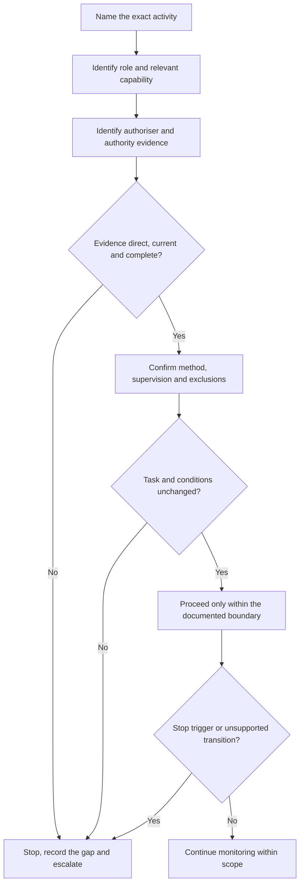
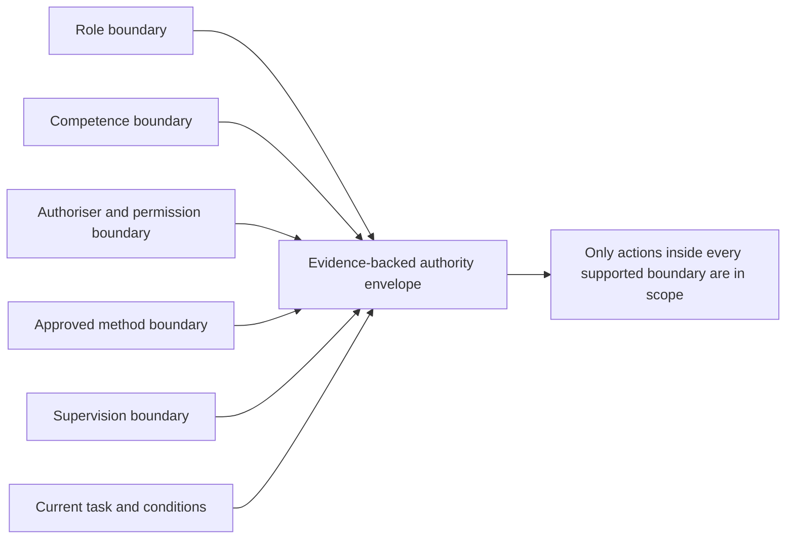

# Day 3 — Roles, Authority, Supervision and Practical Stop Conditions

> **Currency and scope notice:** This module teaches how to reason about role, task authority, supervision and stop conditions before practical activity. It does not define a universal licensing boundary, supervision ratio, safe-work method, isolation procedure, test sequence or emergency response. Current legislation, regulator requirements, licence conditions, RTO instructions, workplace procedures and task-specific directions remain controlling and require authorised verification.

## 1. Outcome and entry check

### Learning objectives

By the end of this block, the learner should be able to:

1. classify a scenario statement as evidence of **role**, **competence**, **task authority**, **scope**, **supervision** or a **stop condition**;
2. rank authority evidence as direct and current, indirect, incomplete or unsupported;
3. rewrite vague instructions into observable activity verbs and explicit exclusions;
4. test whether a supervision arrangement remains adequate when task, equipment, personnel, energy source, environment or learner capability changes;
5. produce an authority statement naming the task, authoriser, evidence, limits, approved method, supervision, expiry conditions and escalation route;
6. identify the first unsupported transition and stop before practical interaction;
7. defend the stop decision using scenario evidence rather than confidence, custom, urgency or hierarchy alone;
8. transfer the reasoning to a changed scenario without importing permission from the original scenario.

### Entry check

Answer without notes and record confidence from 0–100%:

1. Does knowing how to perform a task prove authority to perform it?
2. What evidence would distinguish a direct instruction from hearsay?
3. Can supervision remain adequate when the activity changes from observation to operation?
4. Name three facts that can expire an earlier permission.
5. What is the first unsupported transition in: “Watch the inspection, then remove the cover while I take a call”?
6. Who owns the decision to stop when the learner cannot establish a safe and authorised boundary?

For each answer, mark the evidence used as **stated fact**, **reasonable inference**, **missing evidence** or **assumption**. Use written or trainer-approved scenarios only.


## 2. Why it matters

Many unsafe decisions occur before a tool is touched. A person may understand a method but misunderstand the assignment, rely on an assumed supervision arrangement, continue after conditions change, or treat familiarity and urgency as permission.

Capstone performance therefore requires two separate judgements:

- **technical judgement:** what method or principle may be relevant;
- **authority judgement:** whether this person may perform this exact action, under these conditions, with this evidence and oversight.

A technically plausible action is still unacceptable when the authority chain is unsupported. Conversely, stopping without identifying the missing authority evidence is safer than proceeding, but it is incomplete assessment evidence because the learner may not understand the boundary.

## 3. Core concepts and terminology

### Role
A **role** is a recognised function in a learning or work system. It suggests responsibilities but does not independently authorise every task.

### Competence
**Competence** is demonstrated capability for a defined activity to the required standard. It is task-specific, current and evidence-based. It does not create legal or organisational permission.

### Task authority
**Task authority** is explicit permission from the correct person or system for a defined activity under stated conditions. Usable authority identifies the activity, subject equipment or location, limits, approved method, supervision and expiry or recheck conditions.

### Authority evidence
**Authority evidence** is information supporting the claim that permission is valid. Use four educational categories:

- **direct and current:** issued by the authorised person or controlling system, for this task and current conditions;
- **indirect:** relayed by another person or inferred from a roster, custom or previous task;
- **incomplete:** the authoriser may be valid, but task, limits, method, supervision or conditions are missing;
- **unsupported:** based only on confidence, urgency, silence, habit or assumed seniority.

These categories are learning aids, not legal classifications.

### Scope
**Scope** is the outer boundary of permitted action. It may be limited by law, licence, training stage, workplace policy, task allocation, equipment, environment, supervision or the approved method.

### Supervision
**Supervision** is an arranged control in which a suitably authorised person directs, monitors and can intervene. Its adequacy depends on the exact task, learner capability, hazards, communication, proximity, visibility, response time and governing requirements.

### Delegation
**Delegation** is assignment by a person who has authority to assign the task. It cannot create powers the delegator does not hold or remove the recipient's obligation to stay within scope.

### Stop condition
A **stop condition** is a predefined or emerging circumstance requiring the activity to pause and be referred for authorised direction. A justified stop is a control, not a failure of confidence.

### Re-authorisation trigger
A **re-authorisation trigger** is a material change that makes earlier permission incomplete or unreliable. Examples include changed task verbs, equipment identity, energy sources, environment, personnel, method, fault evidence, learner capability or supervision availability.

### First unsupported transition
The **first unsupported transition** is the earliest point where the proposed action moves beyond the evidence-backed authority envelope. Detecting this point prevents later reasoning from normalising an unsafe step.

## 4. Rule-finding workflow

Use **A-U-T-H-O-R-I-T-Y** before any practical transition:

1. **A — Activity:** state the exact action using an observable verb.
2. **U — User role:** identify role, relevant demonstrated capability and known limits.
3. **T — Task authority:** identify the authoriser and rank the evidence supporting permission.
4. **H — Hazards and controls:** connect the task to Day 2 exposure pathways and critical controls.
5. **O — Oversight:** define direction, monitoring, communication, intervention and availability.
6. **R — Rules and method:** identify current controlling instructions and the approved method.
7. **I — In-scope boundary:** state permitted actions, exclusions and unresolved evidence.
8. **T — Triggers to stop:** name changes that suspend permission.
9. **Y — Yield and escalate:** stop at the first missing or changed element and refer to the authorised person.



The workflow treats authority as a maintained condition. A previous valid instruction does not survive every change.

## 5. Visual model or worked example

### The authority envelope



The overlap is only as strong as its weakest unsupported boundary. Missing evidence is not automatically proof that permission is absent, but it is sufficient reason for the learner to stop and seek clarification.

### Fictional worked example

A learner is told by a co-worker: “The supervisor said you can help check the faulty circuit. Start by taking the cover off; she is somewhere on site.” The equipment identifier differs from the job sheet and an alternate supply label is visible.

| Element | Evidence classification | Defensible response |
|---|---|---|
| Request | Indirect | The co-worker's statement does not establish the supervisor's exact instruction. |
| Activity | Incomplete | “Help check” must be replaced with defined verbs and exclusions. |
| Equipment | Contradictory | The identifier differs from the job sheet. |
| Supervision | Incomplete | “Somewhere on site” does not define monitoring or intervention. |
| Conditions | Changed | Alternate-supply information requires a fresh authority and method check. |
| First unsupported transition | Clear | Removing the cover is the earliest proposed practical interaction without supported authority. |
| Decision | Stop-required | Do not interact with the equipment; record the mismatches and contact the authorised supervisor through the approved channel. |

A weaker answer merely says “stop because it looks dangerous.” A stronger answer identifies the exact transition, the missing and contradictory evidence, and the person or source required to resolve it.

## 6. Practical application

### Authority evidence ledger

For each trainer-provided fictional scenario, complete:

```text
Exact activity verb:
Equipment, location or document identifier:
Person requesting the activity:
Claimed authoriser:
Evidence the authoriser controls this task:
Authority evidence: direct-current / indirect / incomplete / unsupported
Learner role and relevant capability evidence:
Approved method or controlling instruction:
Supervision arrangement:
Permitted actions:
Explicit exclusions:
Known hazards and critical controls:
Missing or contradictory evidence:
Re-authorisation triggers:
First unsupported transition:
Stop statement:
Escalation owner and channel:
Expiry or recheck condition:
```

Complete three rounds:

1. **Classification round:** label each scenario statement as fact, inference, gap or assumption and rank authority evidence.
2. **Boundary round:** identify the first unsupported transition and write a specific stop statement.
3. **Transfer round:** change one material condition and rebuild the authority envelope from the start rather than carrying permission forward.

### Observable performance anchors

Assess each criterion separately:

- **secure:** evidence is classified correctly; the boundary and first unsupported transition are explicit; stop and escalation are justified;
- **developing:** the safe decision is reached but one authority, supervision, exclusion or evidence link is incomplete;
- **unsupported:** the answer relies on custom, confidence, hierarchy, proximity or an assumed instruction;
- **stop-required:** the response proposes or normalises practical action beyond supported authority.

A correct stop reached for the wrong reason is not yet secure. Any proposal for unauthorised practical action is unsatisfactory regardless of other strengths.

## 7. Common errors and safety checkpoint

### Common errors

- **Competence equals permission:** capability and authority answer different questions.
- **Role title equals unlimited scope:** titles do not replace task-specific evidence.
- **Vague verbs:** “check,” “help,” “look at” and “make safe” conceal different authority boundaries.
- **Supervision by proximity:** being on site does not prove adequate direction, monitoring or intervention.
- **Borrowed authority:** a relayed instruction is not automatically direct or complete.
- **Permission survives change:** task, equipment, environment, method or personnel changes trigger reassessment.
- **Stop without diagnosis:** stopping is safer than guessing, but assessment evidence must name the unsupported transition and missing evidence.
- **Silence means consent:** absence of objection is not authorisation.
- **Urgency expands scope:** time pressure does not create authority.
- **Inventing legal or RTO rules:** uncertain requirements remain `reference_check_required`.

### Safety checkpoint

This module authorises no switching, isolation, testing, opening equipment, resetting, disconnection, alteration, repair, rescue, energisation or verification.

Stop and seek authorised direction when:

- the action, equipment or location cannot be stated precisely;
- the authoriser, their authority or the evidence trail is unclear;
- competence or scope for the exact activity is unverified;
- supervision is unavailable, interrupted or mismatched to the task;
- the approved method, energy sources or site conditions are uncertain;
- information is missing, contradictory, stale or relayed indirectly;
- the activity crosses from discussion, observation or documentation into practical interaction;
- pressure, fatigue or fear of embarrassment encourages assumption.

In an actual emergency, follow current emergency arrangements and directions from emergency services and authorised workplace personnel. This module is not emergency-response training.

## 8. Retrieval and next links

### Closed-note recall

1. Define role, competence, task authority, scope, supervision and stop condition.
2. Recite **A-U-T-H-O-R-I-T-Y**.
3. Name the four educational authority-evidence categories.
4. Explain the first unsupported transition.
5. Why can a correct stop still be incomplete assessment evidence?
6. Name six re-authorisation triggers.
7. What evidence makes a supervision arrangement usable rather than vague?

### Changed-context retrieval

A learner has direct permission to observe a planned inspection with a named supervisor. On arrival, the equipment differs, the supervisor leaves, and another worker asks the learner to operate a device so the inspection can start.

Without proposing a technical procedure, produce:

- a fact/inference/gap/assumption table;
- the original and changed authority envelopes;
- the first unsupported transition;
- the evidence classification for the worker's request;
- a specific stop statement and escalation owner;
- a confidence rating before and after checking the module.

### Evidence to retain

Keep the authority evidence ledger, changed-context re-attempt, confidence ratings, any high-confidence scope errors, and unresolved legal, RTO or workplace questions for authorised review.

### Navigation

- **Plan:** [Twelve-Week Capstone Learning Plan](../MASTER_PLAN.md)
- **Knowledge note:** [[12-Week Day 03 - Roles Authority Supervision and Practical Stop Conditions]]
- **Previous:** [Day 2 — Electrical Hazards, Exposure Pathways and Consequence Reasoning](day-02-electrical-hazards-exposure-pathways-and-consequence-reasoning.md)
- **Next:** [Day 4 — Wiring Rules Structure and Efficient Topic Navigation](day-04-wiring-rules-structure-and-efficient-topic-navigation.md)

### Reference and currency notice

Verify licensing, legal duties, supervision requirements, RTO conditions, workplace responsibilities, approved methods and task authority against authorised current sources for the relevant jurisdiction and context. This original educational module is `review-required`, `reference_check_required` and not `technically-reviewed`.