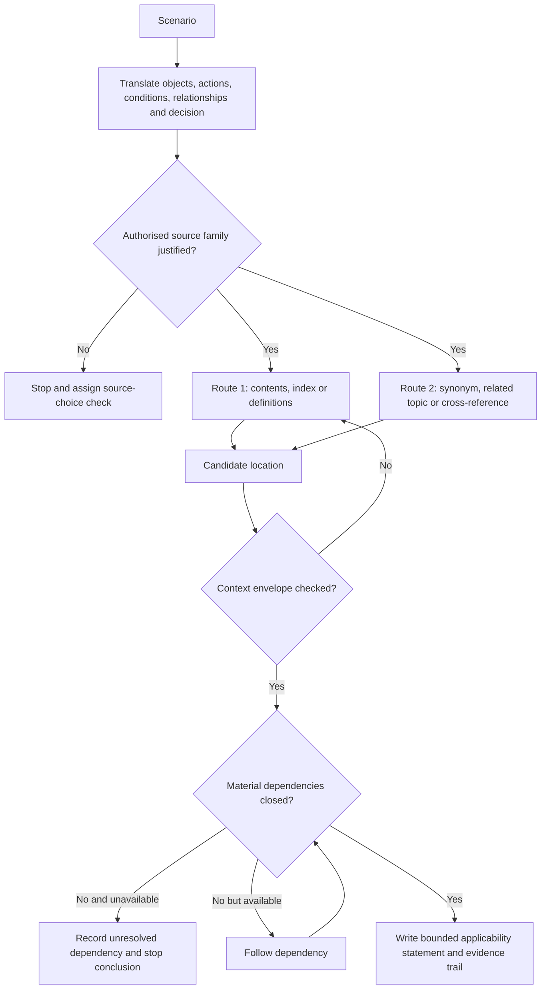
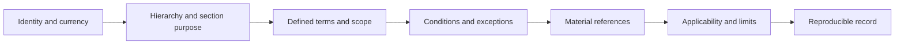

# Day 4 — Wiring Rules Structure and Efficient Topic Navigation

> **Currency and scope notice:** This module teaches an original method for locating, checking and recording relevant material in an authorised copy of the Wiring Rules. It does not reproduce the standard, prescribe universal clause numbers, confirm a source edition, or decide technical compliance. The learner must use the current authorised edition, amendments, jurisdictional requirements, RTO instructions and workplace procedures applicable to the task.

## 1. Outcome and entry check

### Learning objectives

By the end of this block, the learner should be able to:

1. classify a located item as a definition, requirement, condition, exception, note, table, figure, appendix or external reference;
2. convert a scenario into searchable objects, actions, conditions, relationships and decision questions;
3. justify the chosen source family before searching and identify when another controlling source may be required;
4. demonstrate two independent navigation routes to a candidate location rather than relying on clause-number memory;
5. test a candidate against document currency, hierarchy, scope, defined terms, conditions, exceptions and material dependencies;
6. record a reproducible search trail that separates source evidence, learner interpretation, unresolved checks and confidence;
7. reject a plausible-looking result when its authority, applicability or dependency closure is unsupported;
8. transfer the method to a changed scenario without carrying the earlier search conclusion forward.

### Entry check

Without opening a source, answer and record confidence as **guessing**, **unsure**, **reasonably confident** or **certain**:

1. Why is a remembered clause number a navigation hint rather than evidence?
2. What is the difference between a keyword match and an applicable requirement?
3. What source details must be known before a result can be relied upon?
4. Why can a note, appendix or table require different treatment from surrounding text?
5. What makes a cross-reference material to the conclusion?
6. When must the learner stop rather than continue searching from an unofficial summary or screenshot?

Use only an authorised source supplied or approved for the learning context. Do not search unauthorised copies or reproduce source text into these notes.


## 2. Why it matters

Capstone tasks commonly combine several source domains. A search can return genuine text that is nevertheless incomplete, outside scope, conditioned by another provision, altered by an exception, dependent on another document or no longer current.

Efficient navigation is therefore not speed-reading and is not clause-number recall. It is the ability to:

- choose the correct authorised source family;
- translate the scenario into precise search concepts;
- locate and independently confirm a candidate passage;
- test its context, status and dependencies;
- preserve enough evidence for another person to reproduce the route;
- state exactly what remains unresolved;
- stop when source identity, applicability or authority cannot be established.

A fast unsupported answer is weaker than a slower traceable answer. This block prepares the learner for later design, inspection, verification and fault-reasoning tasks, where a technically plausible conclusion can still be unsafe or invalid if the source trail is wrong.

## 3. Core concepts and terminology

### Source family

A **source family** is the category of authorised material likely to control or qualify a decision, such as legislation, regulation, a standard, regulator guidance, network requirements, manufacturer instructions, workplace procedures or RTO assessment instructions. Selecting the wrong family can make an otherwise careful search irrelevant.

### Source hierarchy

A **source hierarchy** is the task-specific relationship between controlling and supporting documents. It is not a universal ranking copied from one context. The learner must identify which sources govern, qualify, explain or merely support the decision.

### Topic map

A **topic map** is a learner-created outline of broad subject families, headings and relationships in a source. It records navigation structure, not copied technical content.

### Search concept and synonym set

A **search concept** is an object, action, condition, relationship or decision extracted from the scenario. A **synonym set** is a small list of alternative technical and everyday terms used to avoid missing relevant material because the scenario and source use different language.

### Candidate location

A **candidate location** is material that may be relevant but has not yet passed context and applicability checks. A search hit, remembered clause or trainer hint remains a candidate until verified.

### Context envelope

The **context envelope** is the information surrounding a candidate that controls its meaning: document identity and currency, section purpose, heading hierarchy, definitions, scope, conditions, exceptions, notes and cross-references.

### Normative and informative material

**Normative material** forms part of a document's requirements. **Informative material** assists understanding but does not have the same status. The authorised source must be checked because labels and effects vary by document.

### Dependency closure

**Dependency closure** is reached when every cross-reference, exception, referenced document or instruction that could materially change the conclusion has either been checked or explicitly recorded as unresolved. It does not mean every link in a document must be followed.

### Applicability statement

An **applicability statement** is the learner's reasoning that connects verified source material to the stated scenario. It must identify the relevant scenario facts, the condition being tested and the boundary of the conclusion.

### Reproducible evidence trail

A **reproducible evidence trail** records enough information for another authorised reader to repeat the search: source identity, edition or version, amendment evidence, search concepts, routes tried, heading path, candidate location, context checks, dependencies, applicability reasoning, confidence and unresolved items.

## 4. Rule-finding workflow

Use **T-R-A-C-E** with two explicit gates:

1. **T — Translate the scenario:** extract objects, actions, conditions, relationships, hazards and the exact decision requested. Create a small synonym set.
2. **R — Route to the source:** justify the authorised source family, then use contents, index, definitions and known cross-references. Record at least two plausible navigation routes.
3. **A — Analyse the candidate:** check source identity, currency, section purpose, heading hierarchy, defined terms, scope, conditions, exceptions and normative or informative status.
4. **C — Close material dependencies:** follow only references capable of changing the answer. Record unavailable or unresolved dependencies instead of silently ignoring them.
5. **E — Evidence the bounded conclusion:** separate the located material from the learner's applicability statement, limits, confidence and `reference_check_required` items.



The two routes do not need to land on identical words. Their purpose is to reduce search-path dependence and expose false positives. If the routes produce conflicting candidate areas, the conflict becomes evidence that the topic map or scenario translation needs revision.

## 5. Visual model or worked example

### The candidate test



A conclusion is only as strong as the weakest unverified stage in this chain. Recording a clause location without the surrounding checks demonstrates location, not applicability.

### Fictional worked example

A written scenario asks whether a control may be required for equipment used in a particular environment. The learner has an authorised source but remembers only a broad topic.

| Stage | Strong evidence | Weak shortcut | Why the shortcut fails |
|---|---|---|---|
| Translate | Equipment, function, environment, supply condition and requested decision are listed; technical synonyms are added. | Search the everyday equipment name only. | The source may organise the topic by function, hazard or installation condition. |
| Route | Contents and index routes are tried independently and the selected source family is justified. | Guess a clause number. | Memory may point to an obsolete, adjacent or incomplete provision. |
| Analyse | Document identity, hierarchy, defined terms, scope and status are recorded. | Copy the first matching sentence. | A genuine sentence may not govern this scenario. |
| Close | Exceptions and references capable of changing the answer are followed. | Stop after the first apparent answer. | The controlling qualification may sit elsewhere. |
| Evidence | Source evidence and learner reasoning are separated; uncertainty and limits are explicit. | Write only “required” or “not required.” | Another reader cannot reproduce or audit the conclusion. |

No technical answer is supplied. The assessment target is the search process, evidence quality and stopping judgment.

### False-positive challenge

The trainer supplies two fictional search results:

- one contains the learner's exact keyword but sits under an unrelated heading;
- one uses different terminology but matches the scenario function and conditions.

The learner must reject the first and explain why the second deserves further analysis. This checks whether matching words are being mistaken for applicability.

## 6. Practical application

### Three-round source-navigation drill

Use trainer-provided fictional prompts and an authorised source.

**Round 1 — Guided decomposition**

- classify each scenario statement as object, action, condition, relationship, hazard or requested decision;
- create two search concepts and one synonym for each;
- identify the likely source family and one possible competing source family;
- predict what evidence would disprove the initial route.

**Round 2 — Independent-route confirmation**

Reach a candidate through two different routes. Record:

```text
Scenario identifier:
Authorised source title:
Edition/version and amendment evidence:
Source family and why selected:
Competing source family considered:
Search concepts and synonyms:
Route 1:
Route 2:
Heading path:
Candidate location:
Material type and status:
Definitions and scope checked:
Conditions and exceptions:
Material dependencies followed:
Unavailable dependencies:
Source evidence summary in original wording:
Learner applicability statement:
Conclusion boundary:
Confidence before and after checking:
Reference-check owner and trigger:
```

**Round 3 — Changed-context transfer**

The trainer changes one material scenario fact, such as equipment function, environment, supply arrangement, jurisdiction, document edition or requested decision. The learner must:

1. identify which earlier search assumptions are invalidated;
2. rebuild the search concepts and source-family choice;
3. decide which prior evidence can remain and which must be reopened;
4. complete a fresh bounded trail without copying the earlier conclusion.

Use a trainer-agreed time limit only after accuracy is stable. Stop the timer whenever source identity, authority or applicability becomes uncertain.

### Criterion-level performance anchors

Assess each criterion separately; do not average away a blocking error.

| Criterion | Secure evidence | Developing evidence | Unsupported evidence | Stop-required evidence |
|---|---|---|---|---|
| Scenario translation | Distinguishes objects, actions, conditions, relationships and decision; useful synonyms included. | Most concepts identified but one material condition or relationship is missed. | Searches from a single vague keyword. | Omits a safety-critical condition and proceeds as though it were known. |
| Source-family choice | Justifies the controlling source family and checks plausible alternatives. | Selects a plausible source but gives limited justification. | Uses the most convenient source or an unofficial summary. | Relies on an unauthorised, unidentified or clearly out-of-scope source. |
| Navigation route | Two routes are recorded and conflicts are investigated. | One reproducible route plus a weak second check. | Clause memory or one search hit is treated as sufficient. | A failed or conflicting route is concealed. |
| Context analysis | Currency, hierarchy, definitions, scope, conditions, exceptions and status are checked. | Checks are mostly complete but one non-blocking element is unclear. | Candidate text is detached from its context envelope. | Source identity, currency or scope is unknown and a conclusion is still asserted. |
| Dependency closure | Material dependencies are followed or assigned as unresolved with an owner. | Dependencies are named but one follow-up lacks ownership. | Cross-references are skipped without explanation. | An unavailable dependency capable of changing the answer is treated as satisfied. |
| Applicability reasoning | Separates source evidence from scenario reasoning and states limits. | Reasoning is plausible but the conclusion boundary is imprecise. | Citation is supplied without explaining application. | Technical compliance or practical authority is claimed beyond the evidence. |
| Transfer and calibration | Rebuilds the route after changed facts and calibrates confidence to evidence. | Detects the change but carries some earlier assumptions forward. | Repeats the prior answer with minor wording changes. | High confidence is maintained despite invalidated source or scope evidence. |

A technically plausible answer cannot be classified as secure when source choice, currency, scope or a material dependency remains unsupported.

## 7. Common errors and safety checkpoint

### Common errors

- **Clause-memory dependence:** memory is used as proof rather than a search hint.
- **Keyword capture:** a matching word is mistaken for an applicable rule.
- **Source-family error:** the learner searches the Wiring Rules when another authorised source controls or qualifies the decision.
- **Single-route lock-in:** the first route shapes the conclusion and no independent route is attempted.
- **Heading blindness:** surrounding hierarchy and section purpose are ignored.
- **Definition drift:** everyday language replaces a defined technical term.
- **Exception omission:** general material is applied without checking qualifications.
- **Dependency abandonment:** a cross-reference is skipped because it takes longer to follow.
- **Edition ambiguity:** currency is assumed from a file name, appearance or remembered date.
- **Search-engine authority:** an internet result, screenshot or summary is treated as controlling material.
- **Citation without reasoning:** a location is recorded but applicability and limits are not explained.
- **Copyright over-copying:** passages, tables or figures are reproduced instead of transformed into original notes.
- **False precision:** a clause location is provided even though the source identity or amendment status is uncertain.

### Safety checkpoint

This module authorises no access, switching, isolation, testing, opening equipment, resetting, disconnection, alteration, repair, energisation, commissioning, certification or verification. Source navigation does not establish practical authority or technical approval.

Stop and seek authorised guidance when:

- the authorised source, edition, amendment status or jurisdiction is unclear;
- the wrong source family may have been selected;
- the scenario falls outside the identified scope;
- definitions conflict with the learner's assumed meaning;
- a material referenced document is unavailable;
- an exception, condition or source conflict cannot be resolved;
- legal, network, manufacturer, workplace or RTO requirements may alter the result;
- the task asks for a safety-critical conclusion beyond the available evidence or learner authority;
- the learner is tempted to use an unofficial copy because the authorised source is inconvenient or unavailable.

## 8. Retrieval and next links

### Closed-note recall

1. Define source family, context envelope, candidate location, dependency closure, applicability statement and reproducible evidence trail.
2. Recite the five stages of **T-R-A-C-E**.
3. Why are two navigation routes useful?
4. Name seven checks around a candidate location.
5. What makes a cross-reference material?
6. When must a candidate be rejected even when its wording appears technically plausible?
7. Why must source evidence and learner reasoning be recorded separately?
8. What must be reopened when a material scenario fact changes?

### Varied retrieval

A classmate provides a screenshot of a paragraph and says it proves an answer. Produce a short response that identifies:

- missing source identity, currency and hierarchy evidence;
- the source-family decision still required;
- two independent routes that could verify the candidate;
- dependencies and applicability checks that remain open;
- the stop condition if the complete authorised source is unavailable.

### Evidence to retain

Keep:

- the guided decomposition sheet;
- the two-route navigation record;
- the false-positive challenge response;
- the changed-context transfer attempt;
- confidence ratings before and after checking;
- source-choice and navigation errors added to the error log;
- unresolved source, currency, dependency and applicability questions with owners.

### Navigation

- **Plan:** [Twelve-Week Capstone Learning Plan](../MASTER_PLAN.md)
- **Knowledge note:** [[12-Week Day 04 - Wiring Rules Structure and Efficient Topic Navigation]]
- **Previous:** [Day 3 — Roles, Authority, Supervision and Practical Stop Conditions](day-03-roles-authority-supervision-and-practical-stop-conditions.md)
- **Next:** [Day 5 — Rest, Retrieval and Source-Navigation Correction](day-05-rest-retrieval-and-source-navigation-correction.md)

### Reference and currency notice

Confirm the authorised source, edition, amendments, normative status, applicability and all material dependencies for the relevant jurisdiction and assessment context. This original educational module is `review-required`, `reference_check_required` and not `technically-reviewed`.