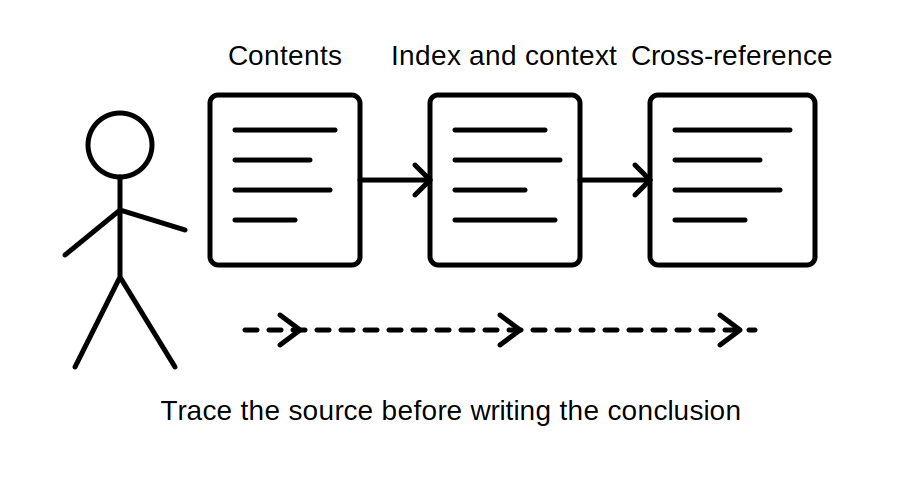
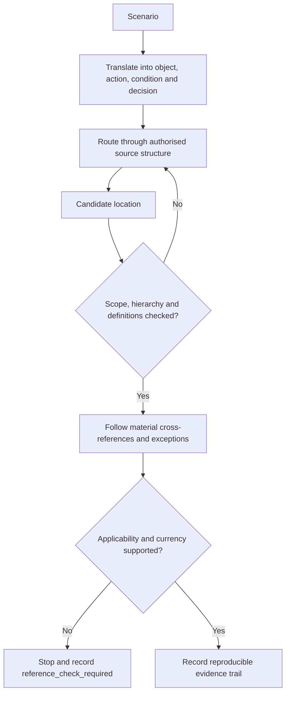
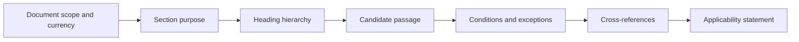

# Day 4 — Wiring Rules Structure and Efficient Topic Navigation

> **Currency and scope notice:** This module teaches an original method for locating, checking and recording relevant material in an authorised copy of the Wiring Rules. It does not reproduce the standard, prescribe universal clause numbers, confirm a source edition, or decide technical compliance. The learner must use the current authorised edition, amendments, jurisdictional requirements, RTO instructions and workplace procedures applicable to the task.

## 1. Outcome and entry check

### Learning objectives

By the end of this block, the learner should be able to:

1. distinguish a topic, requirement, definition, exception, note, table, figure, appendix and referenced document;
2. convert a scenario into searchable nouns, actions, conditions and evidence questions;
3. navigate from broad subject location to a candidate requirement without relying on remembered clause numbers;
4. read the surrounding hierarchy and cross-references before recording a conclusion;
5. document source identity, location, applicability, exceptions and unresolved questions in a reproducible evidence trail;
6. reject a technically plausible extract when edition, scope, context or completeness cannot be established;
7. complete a timed navigation exercise while preserving accuracy and stop conditions.

### Entry check

Without opening a source, answer and record confidence:

1. Why is a remembered clause number weaker than a repeatable search method?
2. What is the difference between finding a keyword and finding an applicable requirement?
3. Why should the heading above and text below a search result be read?
4. What details identify the source being used?
5. When should an appendix or note be treated differently from a mandatory requirement?
6. What must be recorded when a cross-reference cannot be followed?

Use only an authorised source supplied or approved for the learning context. Do not search unauthorised copies or reproduce source text into these notes.



## 2. Why it matters

Capstone tasks often combine several topics. A learner who searches for the first familiar word may locate text that is real but incomplete, outside scope, qualified by an exception, dependent on another section, or superseded by a current amendment.

Efficient navigation is therefore not speed-reading. It is the ability to:

- translate the scenario into precise search concepts;
- choose the correct source family;
- locate a candidate passage;
- test its hierarchy, scope and dependencies;
- preserve enough evidence for another person to reproduce the result;
- stop when the source or applicability cannot be verified.

This block prepares the learner for every later design, inspection, verification and fault-reasoning module. It also reduces false confidence created by isolated search results.

## 3. Core concepts and terminology

### Source hierarchy

A **source hierarchy** is the organised relationship between controlling documents and supporting material. The applicable hierarchy depends on jurisdiction and task. A standard may interact with legislation, regulator directions, other referenced standards, manufacturer instructions, network requirements, workplace procedures and assessment conditions.

### Topic map

A **topic map** is a learner-created outline of where broad subject families are organised in a source. It records headings and relationships, not copied technical content.

### Search term

A **search term** is a word or phrase used to locate candidate material. Strong search terms usually name the object, action, condition or relationship in the scenario. A search hit is not evidence of applicability.

### Normative and informative material

**Normative material** forms part of the requirements of a document. **Informative material** assists understanding but does not have the same status. The authorised source must be checked because labels and effects vary by document.

### Scope

**Scope** identifies what a document, section or requirement covers and excludes. Scope must be checked before a passage is applied.

### Exception and condition

An **exception** removes or modifies a general requirement in stated circumstances. A **condition** is a fact that must be true before a requirement, permission or exception applies.

### Cross-reference

A **cross-reference** directs the reader to related material elsewhere. It may contain a dependency essential to interpretation.

### Applicability statement

An **applicability statement** explains why the located material does or does not govern the stated scenario. It separates source text from the learner's reasoning.

### Evidence trail

An **evidence trail** records enough information to reproduce the search: source identity, edition or version, amendment status, location, search path, surrounding context, dependencies, applicability and unresolved checks.

## 4. Rule-finding workflow

Use **T-R-A-C-E**:

1. **T — Translate the scenario:** extract the installation or equipment, action, condition, risk and required decision.
2. **R — Route to the source:** identify the authorised document and likely subject family using the contents, index, definitions and known cross-references.
3. **A — Analyse the candidate:** read the heading hierarchy, scope, definitions, conditions, exceptions, notes and adjacent provisions.
4. **C — Connect dependencies:** follow referenced clauses, tables, appendices, other standards and controlling instructions that materially affect the answer.
5. **E — Evidence the conclusion:** record the source identity, location, applicability reasoning, limitations and any `reference_check_required` item.



The loop is deliberate. Returning to the source map is better than forcing an early search result to fit the scenario.

## 5. Visual model or worked example

### The context window

A candidate sentence sits inside several layers:



A defensible conclusion requires the learner to move through the full chain rather than quote the candidate passage alone.

### Fictional worked example

A written scenario asks whether a control is required for equipment in a particular environment. The learner remembers a likely topic but not its location.

| Stage | Defensible navigation action | Weak shortcut |
|---|---|---|
| Translate | List the equipment, function, environment, supply condition and decision requested. | Search only the everyday name of the equipment. |
| Route | Use contents, index and definitions to identify possible subject families. | Guess a clause number from memory. |
| Analyse | Read the section scope, heading hierarchy and defined terms. | Copy the first sentence containing the keyword. |
| Connect | Follow any exception, referenced section or manufacturer dependency. | Ignore links because the first result appears clear. |
| Evidence | Record source identity, location, applicability and unresolved checks. | Write only “complies” or “does not comply.” |

No technical conclusion is supplied here. The assessment target is the navigation process and evidence quality.

## 6. Practical application

### Three-round source-navigation drill

Use trainer-provided fictional prompts and an authorised source.

**Round 1 — Guided map**

- underline the object, action, condition and decision;
- nominate two likely search terms and one synonym;
- identify the source family and likely navigation entry point;
- record the route taken.

**Round 2 — Context check**

For the candidate location, record:

```text
Authorised source and edition/version:
Amendment or currency evidence:
Heading path:
Candidate location:
Defined terms checked:
Scope checked:
Conditions or exceptions:
Cross-references followed:
Normative/informative status:
Applicability statement:
Unresolved reference checks:
```

**Round 3 — Faded support**

Complete a fresh prompt with no supplied keywords. Set a time limit agreed with the trainer, but stop the timer when source identity, context or applicability becomes uncertain. Accuracy and escalation take priority over speed.

### Observable performance rubric

Score each category 0, 1 or 2:

- scenario translated into precise search concepts;
- appropriate source and navigation route selected;
- hierarchy, scope and terminology checked;
- material dependencies followed;
- applicability explained separately from source material;
- evidence trail complete and reproducible;
- uncertainty stopped and flagged rather than guessed.

A fast answer based on an isolated search hit is not satisfactory.

## 7. Common errors and safety checkpoint

### Common errors

- **Clause-memory dependence:** memory is used as a hint, not proof.
- **Keyword capture:** a matching word is mistaken for an applicable rule.
- **Heading blindness:** surrounding hierarchy is ignored.
- **Definition drift:** ordinary language is substituted for a defined technical term.
- **Exception omission:** general text is applied without checking qualifications.
- **Cross-reference abandonment:** a dependency is skipped because it takes longer to follow.
- **Edition ambiguity:** source currency is assumed from file name or appearance.
- **Search-engine authority:** an internet result or summary is treated as the controlling source.
- **Citation without reasoning:** a location is recorded but applicability is not explained.
- **Copyright over-copying:** source passages, tables or figures are reproduced instead of transformed into original learning notes.

### Safety checkpoint

This module authorises no switching, isolation, testing, opening equipment, resetting, disconnection, alteration, repair, energisation or verification. Source navigation does not establish practical authority.

Stop and seek authorised guidance when:

- the authorised source, edition or amendment status is unclear;
- the scenario falls outside the identified scope;
- definitions conflict with the learner's assumed meaning;
- a referenced document is unavailable;
- an exception or condition cannot be resolved;
- legal, network, manufacturer, workplace or RTO requirements may alter the result;
- the task asks for a safety-critical conclusion beyond the available evidence or learner authority.

## 8. Retrieval and next links

### Closed-note recall

1. Define source hierarchy, scope, cross-reference, applicability statement and evidence trail.
2. Recite the five stages of **T-R-A-C-E**.
3. Why is a search hit only a candidate?
4. Name six context checks around a candidate passage.
5. What information makes a navigation trail reproducible?
6. When must the learner record `reference_check_required`?
7. Why must speed never override applicability or currency checks?

### Varied retrieval

A classmate gives you a screenshot of a paragraph and says it proves the answer. Write a response that identifies:

- evidence missing from the screenshot;
- the navigation steps required to verify it;
- the difference between locating text and proving applicability;
- the stop condition if the full authorised source is unavailable.

### Evidence to retain

Keep:

- the three completed navigation records;
- the timed faded-support attempt;
- confidence ratings before and after source checking;
- source-navigation errors added to the error log;
- unresolved source, currency and applicability questions.

### Navigation

- **Plan:** [Twelve-Week Capstone Learning Plan](../MASTER_PLAN.md)
- **Knowledge note:** [[12-Week Day 04 - Wiring Rules Structure and Efficient Topic Navigation]]
- **Previous:** [Day 3 — Roles, Authority, Supervision and Practical Stop Conditions](day-03-roles-authority-supervision-and-practical-stop-conditions.md)
- **Next:** Day 5 — Rest, Retrieval and Source-Navigation Correction

### Reference and currency notice

Confirm the authorised source, edition, amendments, normative status, applicability and all material dependencies for the relevant jurisdiction and assessment context. This original educational module is `review-required`, `reference_check_required` and not `technically-reviewed`.