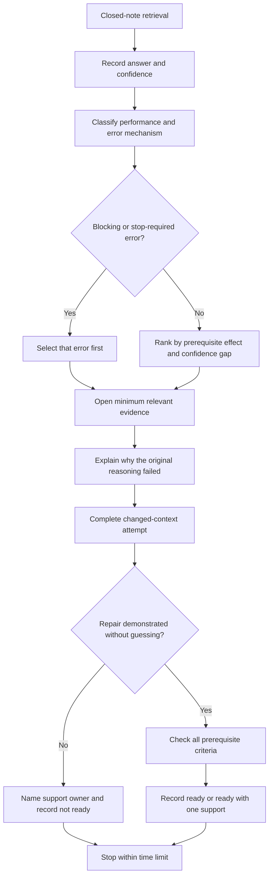
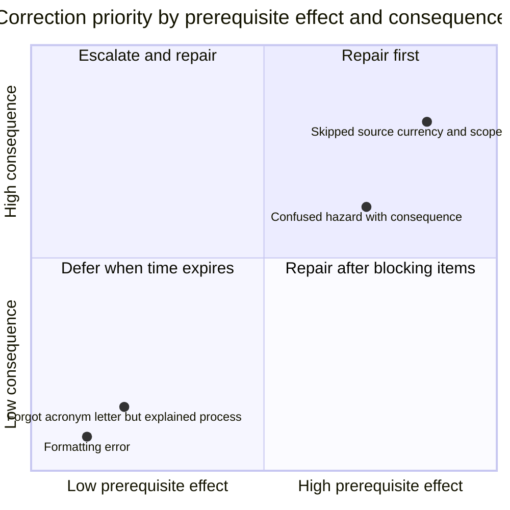

# Day 5 — Rest, Retrieval and Source-Navigation Correction

> **Currency and scope notice:** This recovery block introduces no new electrical rule or technical procedure. It consolidates Days 1–4 through closed-note retrieval, confidence calibration, error-mechanism correction and a bounded readiness decision. Any technical claim recalled by the learner remains subject to current authorised sources, jurisdictional requirements, RTO instructions and qualified review.

## 1. Outcome and entry check

### Learning objectives

By the end of this block, the learner should be able to:

1. reconstruct the M-A-P-S, H-A-Z-A-R-D, A-U-T-H-O-R-I-T-Y and T-R-A-C-E workflows without notes;
2. distinguish recall strength from confidence and identify a high-confidence error;
3. classify an error by mechanism, safety consequence and prerequisite effect;
4. select the smallest correction that protects Day 6 readiness;
5. demonstrate repair through a changed scenario rather than repeating the original answer;
6. identify unresolved evidence that requires a trainer, authorised source or qualified reviewer;
7. make a criterion-level readiness decision and stop within the recovery limit.

### Entry check

Before opening an earlier module, spend no more than eight minutes answering:

1. What evidence supports a claim that a source is authorised and current?
2. What is the difference between a hazard, an exposure pathway and a consequence?
3. What changes can invalidate a task-authority decision?
4. Why is a search result only a candidate location?
5. What is the first unsupported transition in an authority scenario?
6. Name one stop condition from each of Days 1–4.

For each response, record both **performance** and **confidence before checking**.

Performance anchors:

- **secure:** the answer is accurate for the learning scenario, explains the boundary and identifies missing evidence;
- **developing:** the central idea is present, but an important distinction, dependency or stop condition is missing;
- **unsupported:** the answer relies on memory fragments, unexplained certainty or an unverified source;
- **stop-required:** the answer would encourage practical action beyond authority, conceal uncertainty or treat missing evidence as approval.

Confidence uses a percentage from 0–100. Confidence is not a performance score. A confident unsupported answer is a higher-priority correction than a low-confidence memory lapse.


*Caption: Retrieve first, repair the most consequential error and end before fatigue turns correction into further rehearsal of mistakes.*

## 2. Why it matters

Learning can feel fluent immediately after reading because the page supplies the cues. Capstone performance requires retrieval when the cue is absent, wording changes and time pressure is present.

A planned recovery block protects learning in four ways:

- it reveals what can be recalled before rereading creates false confidence;
- it exposes confidence-calibration errors, especially confidently wrong safety reasoning;
- it limits correction so tired practice does not rehearse weak source-navigation habits;
- it creates a clear support decision before the learner enters the evidence-quality work in Day 6.

The purpose is not to finish every missed task. The purpose is to protect the prerequisite chain. A learner who can recite an acronym but cannot explain its decision points is not ready merely because every letter was remembered.

## 3. Core concepts and terminology

### Retrieval practice

**Retrieval practice** is the deliberate attempt to recall knowledge or reconstruct a process before looking at the answer. The effort and the resulting evidence are part of the learning task.

### Recognition

**Recognition** is identifying familiar material when it is shown. Recognition is easier than recall and can overstate readiness.

### Confidence calibration

**Confidence calibration** compares how certain the learner felt before checking with the quality of the answer. Useful categories are:

- **well calibrated:** confidence broadly matches performance;
- **underconfident:** a secure answer receives low confidence;
- **overconfident:** a developing or unsupported answer receives high confidence;
- **dangerously overconfident:** a stop-required answer receives high confidence.

These are educational labels, not clinical or official assessment categories.

### Error log

An **error log** records the prompt, original answer, confidence, error mechanism, consequence, correction evidence, changed-context attempt and remaining support need. It is a decision record, not a list of personal failures.

### Error mechanism

An **error mechanism** explains how the reasoning failed. Use six categories:

- **memory lapse:** a term or step cannot be recalled;
- **terminology confusion:** two concepts or ordinary and technical meanings are mixed;
- **process omission:** a required reasoning or source-checking step is skipped;
- **applicability error:** valid material is applied to the wrong scope, condition or scenario;
- **evidence-quality error:** a claim relies on an incomplete, stale, indirect or untraceable source;
- **unsafe-confidence error:** a definite conclusion or proposed action exceeds the available evidence or authority.

One response may contain more than one mechanism.

### Blocking error

A **blocking error** prevents safe or meaningful progression because it affects a prerequisite, conceals an authority boundary, or supports action without adequate evidence. A blocking error is not averaged away by stronger responses elsewhere.

### Correction

A **correction** identifies the failure mechanism, uses the minimum relevant learning evidence, reconstructs the reasoning in the learner's own words and demonstrates it in a changed context.

### Transfer

**Transfer** is successful use of repaired reasoning when material facts, wording or evidence quality change. Repeating the original question is evidence of recall, not necessarily transfer.

### Readiness decision

A **readiness decision** is criterion-based:

- **ready:** all four prerequisite domains are at least developing, no blocking or stop-required error remains, and uncertainty is handled explicitly;
- **ready with one named support:** the learner can proceed only with one specific aid, prompt or trainer check that does not replace a missing safety boundary;
- **not ready:** a blocking prerequisite, unresolved unsafe-confidence error or unsupported technical claim requires remediation before Day 6.

## 4. Rule-finding workflow

Use **R-E-S-T-O-R-E**:

1. **R — Retrieve first:** close notes and answer the prompts before seeking cues.
2. **E — Estimate confidence:** record confidence before checking each answer.
3. **S — Separate result from mechanism:** classify performance, error mechanism and consequence independently.
4. **T — Triage the blocking priority:** choose the smallest error whose repair most protects safety or Day 6 prerequisites.
5. **O — Open minimum evidence:** consult only the relevant module section and authorised source needed to diagnose the error.
6. **R — Rebuild in a changed context:** explain the repaired reasoning and apply it to a materially varied prompt.
7. **E — End with evidence:** record readiness, remaining support, evidence owner and stop time.



The flow prevents a strong average score from hiding one unsafe misconception. It also prevents recovery from expanding into an attempt to redo the whole week.

## 5. Visual model or worked example

### Priority model



The positions are illustrative, not fixed risk scores. Confidence modifies priority: a high-confidence applicability or authority error should be treated before an equally consequential low-confidence error because it is less likely to trigger self-correction.

### Worked correction example

A learner writes, “I found the keyword in the standard, so the answer is confirmed,” with 90% confidence.

- **Performance:** unsupported.
- **Mechanisms:** process omission, evidence-quality error and unsafe-confidence error.
- **Why it failed:** location was treated as applicability; hierarchy, definitions, scope, conditions, exceptions, dependencies and currency were not checked.
- **Minimum evidence:** revisit Day 4's T-R-A-C-E workflow and the explanation of a candidate location. Do not copy standards wording.
- **Changed scenario:** a classmate supplies a cropped screenshot from an unidentified edition and claims it settles a different installation question.
- **Successful repair:** the learner identifies the screenshot as unverified candidate material, lists the missing source and context evidence, describes two navigation routes and states that no technical conclusion can be made yet.
- **Remaining boundary:** the learner records who must provide the authorised source or confirm the source set.

### Faded transfer prompt

A supervisor mentions a remembered clause number but cannot identify the edition, amendment or applicable installation condition. Without using the worked-example wording, produce:

1. a one-sentence evidence-status statement;
2. the first two checks you would perform in the learning scenario;
3. the conclusion that must remain withheld;
4. the named support or source owner.

## 6. Practical application

### Thirty-minute recovery block

Set a maximum of 30 minutes. Shorten it after demanding work, when concentration is reduced or when the learner is already showing fatigue signals.

**Part A — Eight-minute retrieval**

Reconstruct from memory:

- M-A-P-S and one source recheck trigger;
- H-A-Z-A-R-D with hazard, pathway and consequence separated;
- A-U-T-H-O-R-I-T-Y and the first unsupported transition;
- T-R-A-C-E with two plausible navigation routes;
- one stop condition for missing source evidence.

**Part B — Six-minute diagnostic sort**

For each weak response, record:

```text
Prompt:
My original answer:
Confidence before checking (0–100%):
Performance: secure / developing / unsupported / stop-required
Error mechanism(s):
Possible consequence:
Prerequisite affected:
Blocking error: yes / no
Priority: repair now / named support / defer
```

**Part C — Eleven-minute correction**

Correct exactly one blocking or highest-value item:

1. explain the failure mechanism in one or two sentences;
2. identify the exact learning section used for correction;
3. separate source evidence from personal memory;
4. rewrite the reasoning in your own words;
5. complete a materially changed scenario;
6. record confidence after the re-attempt and explain any confidence change.

**Part D — Five-minute readiness decision**

Record each criterion rather than a single total:

```text
Authorised-source map and currency reasoning: secure / developing / unsupported / stop-required
Hazard-pathway-consequence reasoning: secure / developing / unsupported / stop-required
Authority, supervision and stop-boundary reasoning: secure / developing / unsupported / stop-required
Source navigation, applicability and dependency reasoning: secure / developing / unsupported / stop-required
Blocking error remaining: yes / no
Day 6 readiness: ready / ready with one named support / not ready
Evidence for decision:
Named support or evidence owner:
Unresolved reference_check_required item:
Stop time:
```

### Observable completion criteria

The block is complete when the learner has:

- attempted retrieval before rereading;
- recorded confidence before checking;
- classified errors by mechanism and consequence;
- selected a blocking or highest-value priority rather than the easiest item;
- explained why the original reasoning failed;
- demonstrated repair in a changed scenario;
- recorded criterion-level readiness and a named evidence owner where required;
- stopped within the time or fatigue boundary.

## 7. Common errors and safety checkpoint

### Common errors

- **Rereading first:** familiarity hides retrieval weakness.
- **Averaging away a blocking error:** stronger answers conceal one unsafe misconception.
- **Treating acronym recall as process mastery:** letters are remembered but decision points are not explained.
- **Correcting everything:** catch-up expands until concentration falls.
- **Choosing the easiest error:** formatting displaces a prerequisite or authority gap.
- **Copying the model answer:** wording changes while the reasoning mechanism remains weak.
- **Recording confidence only after checking:** calibration evidence is lost.
- **Using the same scenario for repair:** the original response is memorised without transfer.
- **Marking an unresolved claim correct:** authorised-source and applicability checks remain incomplete.
- **Using “ready with support” to conceal a blocking gap:** a prompt cannot substitute for a missing safety boundary.

### Safety checkpoint

This block authorises no switching, isolation, testing, opening equipment, resetting, disconnection, alteration, repair, energisation, verification or practical demonstration. Recovery work is written and source-based only.

Stop the study block when:

- the 30-minute maximum is reached;
- the same line is reread repeatedly without comprehension;
- error frequency rises while concentration falls;
- frustration encourages guessing, answer copying or skipped evidence checks;
- a blocking or safety-critical misconception cannot be resolved from approved learning material;
- source ownership, jurisdiction, edition, scope or applicability remains unresolved;
- the learner feels pressure to perform practical work to prove an answer;
- qualified or trainer guidance is required.

When a correction depends on an exact clause, limit, value, procedure, legal interpretation or assessment rule, record `reference_check_required`, identify the evidence owner and withhold the conclusion rather than inventing or approximating it.

## 8. Retrieval and next links

### Exit retrieval

Without notes, answer:

1. Why must retrieval happen before rereading?
2. What makes a high-confidence error different from a memory lapse?
3. Name the six error mechanisms used in this module.
4. Why can one blocking error override otherwise strong performance?
5. What makes a changed scenario materially different?
6. What are the three readiness decisions, and when is “ready with one support” inappropriate?
7. Recite **R-E-S-T-O-R-E** and explain each decision point.

### Evidence to retain

Keep:

- entry-check responses, performance anchors and confidence ratings;
- the diagnostic error record;
- one completed correction and changed-context attempt;
- criterion-level Day 6 readiness evidence;
- the named support or evidence owner;
- unresolved `reference_check_required` items.

### Navigation

- **Plan:** [Twelve-Week Capstone Learning Plan](../MASTER_PLAN.md)
- **Knowledge note:** [[12-Week Day 05 - Rest Retrieval and Source-Navigation Correction]]
- **Previous:** [Day 4 — Wiring Rules Structure and Efficient Topic Navigation](day-04-wiring-rules-structure-and-efficient-topic-navigation.md)
- **Next:** [Day 6 — Evidence Quality, Applicability and Completeness Workshop](day-06-evidence-quality-applicability-and-completeness-workshop.md)

### Reference and currency notice

This original recovery module adds no new electrical requirements. The performance, confidence and readiness labels are educational categories, not official assessment or legal classifications. Any recalled technical claim retains the review status of its source module. The content is `review-required`, `reference_check_required` and not `technically-reviewed`.