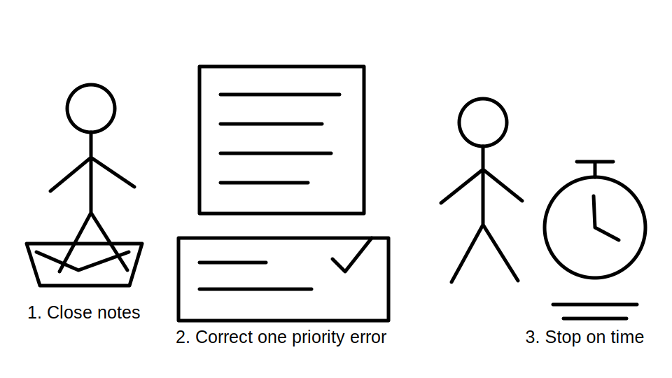
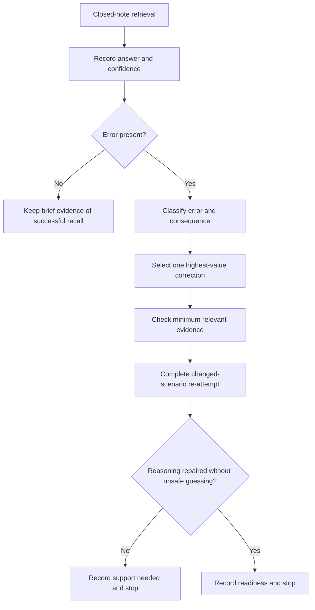
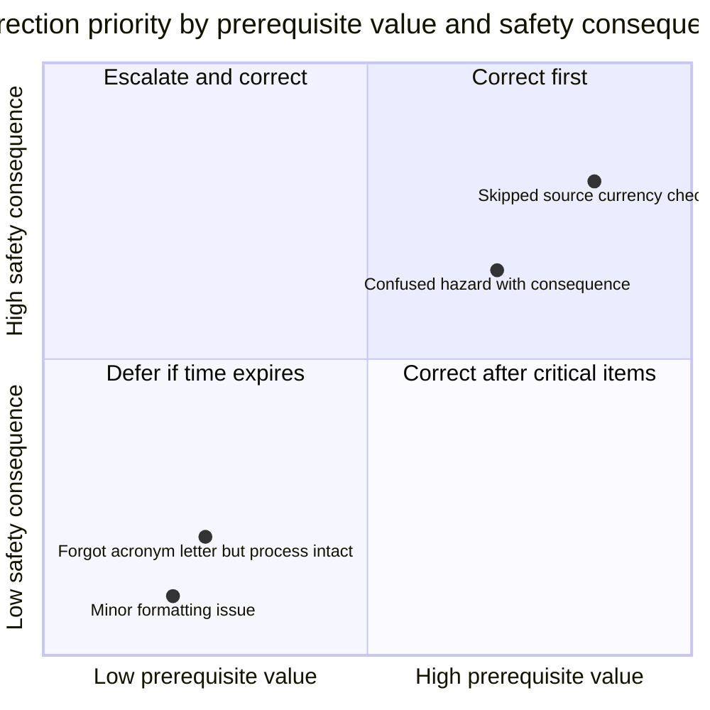

# Day 5 — Rest, Retrieval and Source-Navigation Correction

> **Currency and scope notice:** This recovery block introduces no new electrical rule or technical procedure. It consolidates Days 1–4 through closed-note retrieval, error-log correction and a readiness decision. Any technical claim recalled by the learner remains subject to current authorised sources, jurisdictional requirements, RTO instructions and qualified review.

## 1. Outcome and entry check

### Learning objectives

By the end of this block, the learner should be able to:

1. reconstruct the M-A-P-S, H-A-Z-A-R-D, A-U-T-H-O-R-I-T-Y and T-R-A-C-E workflows without notes;
2. distinguish a memory lapse, terminology error, process omission, applicability error and unsafe-confidence error;
3. select one high-value correction using safety significance and prerequisite importance;
4. repair that error through a changed scenario rather than copying the original answer;
5. identify when fatigue, frustration or reduced concentration makes further study unreliable;
6. make and record a clear readiness decision for Day 6.

### Entry check

Before opening any earlier module, spend no more than eight minutes answering:

1. What evidence proves that a source is authorised and current?
2. What is the difference between a hazard and an exposure pathway?
3. What changes can invalidate task authority?
4. Why is a search result only a candidate requirement?
5. Name one stop condition from each of Days 1–4.

Rate each response from 0 to 2:

- **0 — absent or unsafe:** no usable answer, or the answer encourages guessing or action beyond authority;
- **1 — partial:** the main idea is present but an important boundary or step is missing;
- **2 — usable:** accurate enough to apply in a written learning scenario, with uncertainty stated.



## 2. Why it matters

Learning can feel fluent immediately after reading because the page supplies the cues. Capstone performance requires the learner to retrieve and apply ideas when the cue is absent, the wording changes and time pressure is present.

A planned recovery block protects learning in two ways:

- it reveals what can actually be recalled before rereading creates false confidence;
- it limits catch-up so tired practice does not rehearse weak reasoning, unsafe shortcuts or inaccurate source-navigation habits.

The purpose is not to finish every missed task. The purpose is to protect the foundations needed for Day 6.

## 3. Core concepts and terminology

### Retrieval practice

**Retrieval practice** is the deliberate attempt to recall knowledge or a process without looking at the answer first. The effort of recall is part of the learning task.

### Recognition

**Recognition** is identifying familiar material when it is shown. Recognition is easier than recall and can overstate readiness.

### Error log

An **error log** records the task, the learner's answer, confidence, error type, correction evidence and a varied re-attempt. It is a decision tool, not a list of personal failures.

### Error type

Use five categories:

- **memory lapse:** a term or step cannot be recalled;
- **terminology error:** a technical term is confused with another term or ordinary-language meaning;
- **process omission:** a required reasoning or source-checking step is skipped;
- **applicability error:** valid material is applied to the wrong scope, condition or scenario;
- **unsafe-confidence error:** the learner gives a definite answer or proposes action despite missing evidence or authority.

### Correction

A **correction** explains why the original reasoning failed, identifies the governing learning source and demonstrates the repaired process in a different scenario.

### Transfer

**Transfer** is successful use of a concept or workflow when surface details change. Repeating the same question from memory is not sufficient evidence of transfer.

### Readiness decision

A **readiness decision** is one of:

- **ready:** prerequisites are usable and no safety-critical misconception remains;
- **ready with one support:** Day 6 may proceed with one named prompt, reference aid or trainer check;
- **not ready:** a prerequisite or safety boundary needs supervised remediation before continuing.

## 4. Rule-finding workflow

Use **R-E-S-T-O-R-E**:

1. **R — Retrieve first:** close notes and attempt the selected prompts from memory.
2. **E — Estimate confidence:** record confidence before checking the answer.
3. **S — Sort the errors:** classify each error by type, safety significance and prerequisite value.
4. **T — Triage one priority:** choose one correction that most affects safe reasoning or Day 6 readiness.
5. **O — Open the minimum evidence:** consult only the relevant module and authorised source needed to diagnose the error.
6. **R — Re-attempt in a changed context:** apply the corrected reasoning to a new prompt.
7. **E — End deliberately:** record readiness and stop when the time or fatigue limit is reached.



The workflow deliberately limits correction to one priority. A recovery day fails when it becomes an unbounded attempt to redo the entire week.

## 5. Visual model or worked example

### Correction priority matrix



The labels are examples, not fixed scores. The learner should prioritise an error that could produce unsafe confidence or block later learning, even when a low-value task is easier to finish.

### Worked correction example

A learner writes, “I found the keyword in the standard, so the answer is confirmed,” with confidence 90%.

- **Error type:** process omission and unsafe-confidence error.
- **Mechanism:** the learner treated location as proof and skipped scope, hierarchy, definitions, conditions, exceptions, dependencies and currency.
- **Minimum evidence:** revisit the T-R-A-C-E workflow in Day 4; do not copy any standards wording.
- **Changed scenario:** a classmate supplies a screenshot from an unknown edition. The learner must list the missing evidence and state the stop condition.
- **Successful repair:** the learner explains that the screenshot is only a candidate, identifies the missing context and refuses to make a technical conclusion until the full authorised source is available.

## 6. Practical application

### Thirty-minute recovery block

Set a maximum of 30 minutes. Shorten it when tired or after demanding work.

**Part A — Eight-minute retrieval**

Reconstruct, from memory:

- M-A-P-S;
- H-A-Z-A-R-D;
- the practical meaning of an authority boundary;
- T-R-A-C-E;
- one stop condition for missing source evidence.

**Part B — Five-minute error triage**

For each weak response, record:

```text
Prompt:
My answer:
Confidence before checking (0–100%):
Error type:
Possible safety consequence:
Prerequisite impact on Day 6:
Priority: correct now / support required / defer
```

**Part C — Twelve-minute correction**

Correct exactly one priority item:

1. explain the error mechanism in one or two sentences;
2. identify the specific module section used for correction;
3. write the repaired reasoning in your own words;
4. complete a changed-scenario re-attempt;
5. record confidence after the re-attempt.

**Part D — Five-minute readiness decision**

Record:

```text
Day 6 readiness: ready / ready with one support / not ready
Evidence for decision:
One support or remediation action, if needed:
Unresolved reference_check_required item:
Stop time:
```

### Observable completion criteria

The block is complete when the learner has:

- attempted retrieval before rereading;
- classified errors by mechanism rather than merely marking answers wrong;
- selected one priority using safety and prerequisite value;
- demonstrated correction in a changed scenario;
- recorded a readiness decision and stopped within the limit.

## 7. Common errors and safety checkpoint

### Common errors

- **Rereading first:** familiarity hides retrieval weakness.
- **Correcting everything:** catch-up expands until concentration falls.
- **Choosing the easiest error:** a low-value formatting issue displaces a safety-critical misconception.
- **Copying the model answer:** wording changes but reasoning does not.
- **Confidence after checking only:** the learner loses evidence of calibration error.
- **Punitive catch-up:** rest is treated as failure rather than part of deliberate practice.
- **No transfer check:** the original answer is memorised without repairing the process.
- **Ignoring unresolved evidence:** a technical claim is marked correct without an authorised source check.

### Safety checkpoint

This block authorises no switching, isolation, testing, opening equipment, resetting, disconnection, alteration, repair, energisation, verification or practical demonstration. Recovery work is written and source-based only.

Stop the study block when:

- the 30-minute maximum is reached;
- the same line is reread repeatedly without comprehension;
- confidence falls while errors increase;
- frustration encourages guessing or skipping evidence checks;
- a safety-critical misconception cannot be resolved from the approved learning material;
- the learner feels pressure to perform practical work to “prove” an answer;
- qualified or trainer guidance is required.

When a technical correction depends on an exact clause, limit, value, procedure or assessment rule, record `reference_check_required` rather than inventing or approximating it.

## 8. Retrieval and next links

### Exit retrieval

Without notes, answer:

1. Why must retrieval happen before rereading?
2. Name the five error types used in this module.
3. What two factors determine correction priority?
4. Why must a correction use a changed scenario?
5. What are the three readiness decisions?
6. Name four stop conditions for a recovery block.
7. Recite **R-E-S-T-O-R-E**.

### Evidence to retain

Keep:

- the entry-check responses and confidence ratings;
- the error-triage record;
- one completed correction and changed-scenario attempt;
- the Day 6 readiness decision;
- any unresolved `reference_check_required` items.

### Navigation

- **Plan:** [Twelve-Week Capstone Learning Plan](../MASTER_PLAN.md)
- **Knowledge note:** [[12-Week Day 05 - Rest Retrieval and Source-Navigation Correction]]
- **Previous:** [Day 4 — Wiring Rules Structure and Efficient Topic Navigation](day-04-wiring-rules-structure-and-efficient-topic-navigation.md)
- **Next:** Day 6 — Evidence Quality, Applicability and Completeness Workshop

### Reference and currency notice

This original recovery module adds no new electrical requirements. Any recalled technical claim retains the review status of its source module. The content is `review-required`, `reference_check_required` and not `technically-reviewed`.