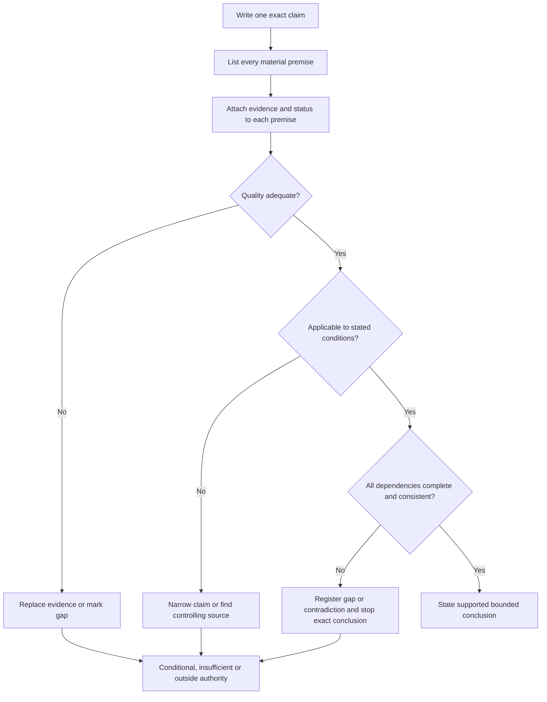
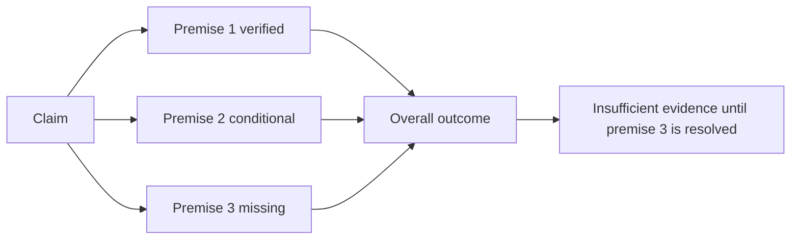

# Day 6 — Evidence Quality, Applicability and Completeness Workshop

> **Currency and scope notice:** This module teaches an original method for evaluating evidence in written Capstone scenarios. It does not supply exact electrical requirements or authorise field work. Current authorised standards, legislation, regulator guidance, network rules, manufacturer instructions, workplace procedures and RTO requirements remain controlling. Exact clauses, values, exceptions, procedures and assessment rules remain `reference_check_required`. This module is not `technically-reviewed`.

## 1. Outcome and entry check

### Learning objectives

By the end of this block, the learner should be able to:

1. separate evidence quality, applicability and completeness without treating them as one general credibility judgement;
2. classify each evidence item by authority, currency, traceability, integrity and independence;
3. distinguish a stated fact, a verified source statement, an inference, an assumption, a contradiction and an unresolved evidence gap;
4. map the material conditions that decide whether evidence applies to a specific claim;
5. build a claim-to-premise evidence chain that identifies the source and status of every material premise;
6. resolve an apparent source conflict or state why it requires escalation;
7. produce a bounded conclusion whose certainty is no stronger than its weakest material premise;
8. transfer the method to a changed scenario without carrying forward invalid evidence.

### Entry check

Without notes, answer the following and record confidence as **guessing**, **unsure**, **reasonably confident** or **certain**:

1. Why is a keyword result only a candidate source?
2. What is the difference between source authority and applicability?
3. What makes a premise material to a conclusion?
4. How does a contradiction differ from missing evidence?
5. When must an exact conclusion be withheld?
6. What support or stop condition did you retain from Day 5?

Classify each response:

- **secure:** accurate distinction, correct evidence boundary and proportionate confidence;
- **developing:** broadly safe but one material distinction or justification is missing;
- **unsupported:** conclusion relies on memory, appearance or an unstated assumption;
- **stop-required:** the response invents an exact requirement, conceals uncertainty or authorises action beyond the scenario.

Any `stop-required` response is a blocking issue. It cannot be offset by stronger answers elsewhere and must be repaired before the workshop conclusion is treated as usable.

## 2. Why it matters

Many incorrect Capstone responses begin with a source that looks relevant. The failure occurs when the learner stops before asking whether the source is controlling, whether it governs the actual conditions and whether it supports every premise in the claim.

A source can be authoritative but superseded, current but outside the jurisdiction, relevant to a related device but not the stated model, applicable to one arrangement but not another, or valid yet incomplete for the conclusion being claimed.

Evidence discipline therefore requires two controls:

- **claim control:** break broad statements into testable claims and material premises;
- **certainty control:** limit the conclusion to the weakest unresolved material premise.


*Caption: A defensible conclusion must pass all three evidence tests; strength in one test cannot compensate for failure in another.*

## 3. Core concepts and terminology

### Evidence item

An **evidence item** is information used to support reasoning. It can be a scenario fact, current authorised source, manufacturer instruction, calculation input, inspection record or verified observation.

### Evidence status

Every material item should be labelled as one of the following:

- **stated fact:** explicitly supplied by the scenario;
- **verified source statement:** located in a current authorised source with context recorded;
- **inference:** a reasoned interpretation that follows from identified evidence;
- **assumption:** an unverified premise used to continue reasoning;
- **contradiction:** applicable evidence that points to incompatible conclusions;
- **evidence gap:** information required for the claim but not yet available;
- **outside authority:** information or judgement that requires qualified review, supervision or an approved process.

An inference is not automatically wrong, but it must be traceable to evidence. An assumption cannot silently become a fact.

### Evidence quality

**Evidence quality** asks whether an item deserves reliance for the claim. Check:

- **authority:** who issued, approved or controls it;
- **currency:** edition, amendment, date and supersession status;
- **traceability:** whether the full source and surrounding context can be found;
- **integrity:** whether the item is complete and unaltered;
- **independence:** whether corroboration is genuinely separate rather than copied from the same origin.

### Applicability

**Applicability** asks whether valid evidence governs the actual scenario. Material conditions may include jurisdiction, installation type, intended use, supply arrangement, circuit function, equipment identity, environmental influence, new or existing work, definitions, exceptions, manufacturer limits, worker authority and approved procedure.

### Completeness

**Completeness** asks whether every material premise required by the exact claim is supported. It does not mean collecting every available document. It means that no necessary link in the reasoning chain is missing, contradictory or outside authority.

### Material premise

A **material premise** is a fact, rule, definition, condition, calculation input or authority boundary that could change the conclusion if it changed or remained unknown.

### Evidence dependency

An **evidence dependency** exists when one conclusion depends on another item being valid first. For example, a performance conclusion may depend on verified equipment identity, applicable conditions and authorised criteria. If an upstream dependency fails, downstream conclusions must be reopened.

### Bounded conclusion

Use one of four outcomes:

- **supported:** every material premise is verified within the stated scope;
- **conditionally supported:** the conclusion follows only if named conditions are confirmed;
- **insufficient evidence:** at least one material premise is missing or unresolved;
- **outside authority:** reaching or acting on the conclusion requires qualified review or an approved process.

## 4. Rule-finding workflow

Use **C-L-E-A-R**:

1. **C — Claim:** separate the proposed answer into exact testable claims.
2. **L — Locate:** identify scenario facts, candidate controlling sources and plausible competing sources.
3. **E — Evaluate:** classify evidence status and check authority, currency, traceability, integrity and independence.
4. **A — Apply:** map definitions, conditions, exceptions, dependencies and authority limits to each claim.
5. **R — Review:** test completeness, resolve or register contradictions, then state a bounded outcome.



The workflow is claim-centred. A source is not accepted merely because it is credible; it must support a named premise within the actual context.

### Claim-to-premise ledger

```text
Exact claim:
Material premise:
Evidence item:
Evidence status:
Authority and currency evidence:
Applicability conditions:
Definitions, exceptions and dependencies checked:
Contradictory or competing evidence:
Evidence owner for unresolved check:
Recheck trigger:
Premise outcome: verified / conditional / missing / contradictory / outside authority
Overall bounded conclusion:
```

An **evidence owner** is the person or role responsible for obtaining or confirming an unresolved item. A **recheck trigger** is a change—such as edition, jurisdiction, equipment identity, supply arrangement or assessment instruction—that requires the conclusion to be reopened.

## 5. Visual model or worked example

### Weakest-material-premise model



The overall claim cannot be stronger than its weakest material premise. A strong source for Premise 1 does not repair a missing Premise 3.

### Worked example: relevant excerpt, unsupported combined claim

A fictional scenario supplies a board diagram, a device label and an undated excerpt from a classmate. The proposed answer is: “The arrangement is compliant and the protective device will operate correctly.”

Apply C-L-E-A-R:

1. **Claim:** separate arrangement compliance from protective-device performance.
2. **Locate:** treat the diagram and label as scenario items; treat the excerpt only as a candidate source.
3. **Evaluate:** the excerpt lacks edition, amendment and surrounding context, so its quality is inadequate.
4. **Apply:** supply arrangement, circuit conditions, equipment identity, definitions and exceptions remain unresolved.
5. **Review:** performance also depends on verified inputs and applicable criteria not supplied.

A defensible conclusion is:

> The supplied evidence is insufficient to confirm either claim. The excerpt is untraceable and material conditions and dependencies remain unresolved. Current authorised sources and verified scenario inputs are required before a more definite conclusion is justified.

### Contradiction register

When two apparently applicable sources disagree, record:

```text
Claim affected:
Source A and scope:
Source B and scope:
Same term and condition confirmed? yes / no / unclear
Hierarchy and currency checked:
Narrower controlling condition:
Resolution:
Escalation owner if unresolved:
Conclusions withdrawn or reopened:
```

Do not average conflicting statements. A contradiction remains blocking until scope, hierarchy, currency or a narrower controlling condition resolves it.

## 6. Practical application

### Round 1 — evidence-status sorting

Sort twelve fictional evidence cards into the defined status categories. For each card, state:

- the claim it may support;
- the claim it cannot support;
- the quality check still required;
- whether it creates a gap, contradiction or authority boundary.

Include a current complete authorised source, an unattributed screenshot, instructions for the wrong model, a verified scenario fact, a memory-based clause number, an older workbook, copied secondary web pages, a controlling definition, a silent assumption, an unapproved workplace procedure and a task-specific supervisor instruction.

### Round 2 — condition and dependency map

For one fictional scenario, map:

```text
Jurisdiction:
Installation and equipment identity:
Supply arrangement:
Circuit or function:
Location and environment:
New or existing work:
Definitions and exceptions:
Manufacturer limitations:
Authority and supervision:
Upstream evidence dependencies:
```

Circle every condition whose change would require the conclusion to be reopened.

### Round 3 — premise audit

Audit this proposed conclusion:

> The selected protective arrangement is suitable, correctly applied and expected to operate as required.

Separate it into claims and material premises. Label every premise **verified**, **conditional**, **missing**, **contradictory**, **not relevant to the narrowed claim** or **outside authority**. Do not invent values or procedures.

### Round 4 — changed-context transfer

Change two material conditions, not one. For example, change the equipment model and make the source edition uncertain. Produce a before-and-after ledger showing:

- evidence that remains valid;
- evidence that becomes inapplicable;
- dependencies that must be reopened;
- conclusions that must be narrowed or withdrawn;
- the evidence owner and recheck trigger for each unresolved item.

### Assessment record

Assess each criterion independently:

| Criterion | Secure | Developing | Unsupported | Stop-required |
|---|---|---|---|---|
| Claim definition | exact claims and material premises separated | one claim remains broad | vague compliance statement | broad claim used to justify practical action |
| Evidence status | facts, sources, inferences, assumptions and gaps labelled | one status unclear | memory or appearance treated as evidence | invented source or concealed gap |
| Quality | authority, currency, traceability, integrity and independence checked | one non-critical check omitted | weak or copied evidence relied upon | safety-critical claim rests on unverified evidence |
| Applicability | material conditions, definitions and exceptions mapped | one condition unresolved and declared | typical conditions assumed | known mismatch ignored |
| Completeness and dependencies | every material premise and upstream dependency audited | non-blocking dependency incomplete | conclusion exceeds evidence chain | missing blocking premise hidden or averaged away |
| Conflict handling | contradiction registered, investigated and resolved or escalated | conflict recognised but record incomplete | conflict averaged or ignored | conflicting safety evidence used to justify action |
| Bounded conclusion | certainty matches weakest material premise | wording needs narrowing | unsupported definite answer | action beyond authority or exactness invented |
| Transfer | changed conditions correctly reopen evidence and conclusions | one recheck trigger omitted | original answer carried forward without review | invalid evidence knowingly retained |

A module outcome is usable only when there are no `stop-required` criteria, no unsupported safety-critical criterion and every unresolved material premise has an evidence owner and recheck trigger. This is an educational readiness rule, not an official RTO pass standard.

## 7. Common errors and safety checkpoint

### Common errors

- treating formal appearance as proof of authority;
- assuming the newest document controls without checking scope and jurisdiction;
- treating a search hit as an applicable requirement;
- confusing a reasonable inference with a verified fact;
- counting copied secondary sources as independent corroboration;
- carrying evidence forward after a material scenario change;
- averaging contradictions;
- hiding a missing premise inside conditional language;
- collecting documents without defining the claim;
- using a correct overall answer to conceal unsafe reasoning.

### Safety checkpoint

This module authorises no access, switching, isolation, testing, measurement, opening, resetting, disconnection, alteration, repair, energisation, commissioning, certification, verification or practical demonstration. Activities are written evidence exercises only.

Stop and seek trainer or qualified guidance when:

- the controlling source, edition, amendment or jurisdiction cannot be confirmed;
- material facts, definitions, dependencies or verified inputs are missing;
- a contradiction remains after hierarchy, scope and currency checks;
- the claim depends on an exact clause, limit, value, device characteristic or procedure not verified from an authorised source;
- resolving the evidence requires access, measurement or judgement outside stated authority;
- an earlier conclusion has not been reopened after a material change;
- time pressure encourages assumption, invented precision or concealment of uncertainty.

Record `reference_check_required` rather than approximating an exact technical requirement.

## 8. Retrieval and next links

### Closed-note retrieval

1. Define evidence quality, applicability and completeness.
2. Distinguish a stated fact, verified source statement, inference, assumption, contradiction and evidence gap.
3. Explain why an overall claim cannot be stronger than its weakest material premise.
4. Name five evidence-quality checks.
5. Give six conditions that can change applicability.
6. Explain evidence dependency and recheck trigger.
7. State the four bounded outcomes.
8. Recite C-L-E-A-R.
9. Explain why copied secondary sources are not independent corroboration.
10. State four blocking stop conditions.

### Exit task

Complete a claim-to-premise ledger for a fresh fictional scenario. Then change two material conditions. The second response must identify invalidated evidence, reopened dependencies, revised confidence, evidence owners and narrower or withdrawn conclusions.

### Evidence to retain

Keep the entry-check confidence record, evidence-status sort, condition and dependency map, premise audit, contradiction register, changed-context ledger, criterion-level assessment and unresolved `reference_check_required` items.

### Navigation

- **Plan:** [Twelve-Week Capstone Learning Plan](../MASTER_PLAN.md)
- **Knowledge note:** [[12-Week Day 06 - Evidence Quality Applicability and Completeness Workshop]]
- **Previous:** [Day 5 — Rest, Retrieval and Source-Navigation Correction](day-05-rest-retrieval-and-source-navigation-correction.md)
- **Next:** [Day 7 — Week 1 Consolidation and Individual Remediation Plan](day-07-week-1-consolidation-and-individual-remediation-plan.md)

### Reference and currency notice

This module uses original terminology, workflows, examples, diagrams and exercises organised around learner decisions rather than a standards clause sequence. It does not reproduce standards tables, figures, systematic wording, exact technical values or official assessment material. Current authorised sources and qualified technical review are required before any safety-critical conclusion is used beyond the written learning scenario.
