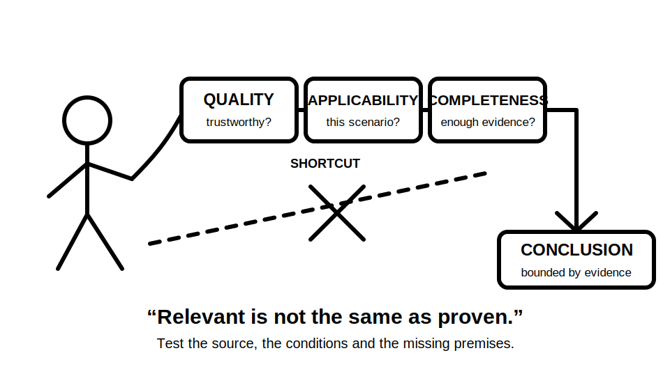
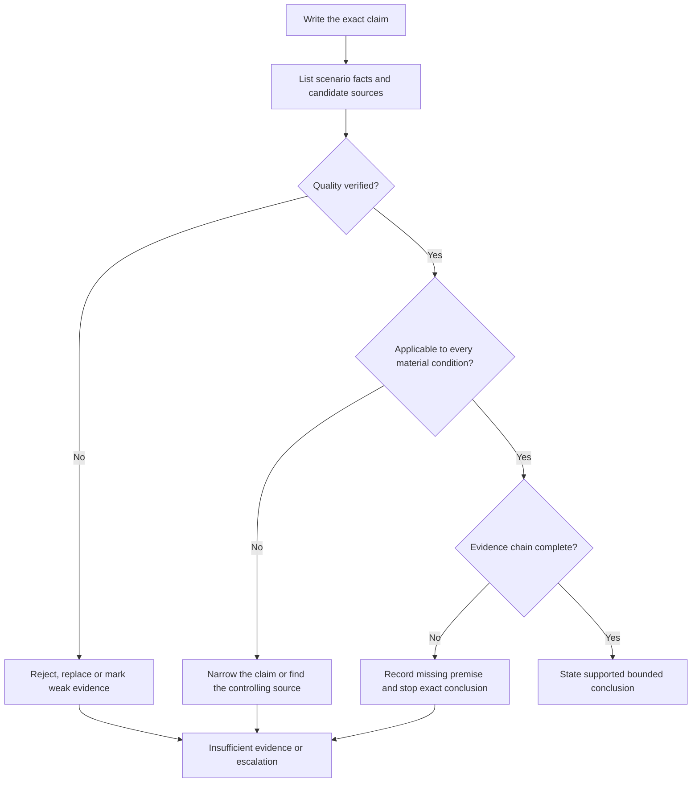
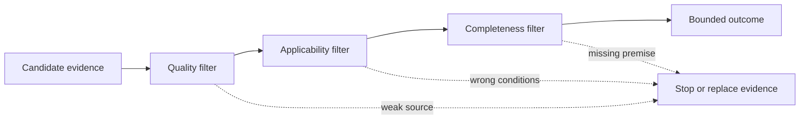

# Day 6 — Evidence Quality, Applicability and Completeness Workshop

> **Currency and scope notice:** This module teaches an original method for evaluating evidence in written Capstone scenarios. It does not supply exact electrical requirements or authorise field work. Current authorised standards, legislation, regulator guidance, network rules, manufacturer instructions, workplace procedures and RTO requirements remain controlling. Exact clauses, values, exceptions, procedures and assessment rules remain `reference_check_required`. This module is not `technically-reviewed`.

## 1. Outcome and entry check

### Learning objectives

By the end of this block, the learner should be able to:

1. distinguish evidence quality, applicability and completeness as three separate tests;
2. classify a source by authority, currency, traceability and independence;
3. identify at least five scenario conditions that can change whether a requirement applies;
4. build an evidence chain from scenario fact to source, condition, exception and bounded conclusion;
5. identify missing evidence without filling the gap from memory or assumption;
6. compare two conflicting sources and explain which should control or why escalation is required;
7. state one of four defensible outcomes: supported, conditionally supported, insufficient evidence or outside authority;
8. complete an evidence review with at least 10 out of 12 rubric points and no critical unsupported safety claim.

### Entry check

Without notes, answer:

1. Why is a keyword search result only a candidate source?
2. What makes a source authorised and current?
3. Give one example of a condition that can change applicability.
4. What is the difference between missing evidence and evidence that contradicts a proposed answer?
5. When should a learner stop rather than infer the missing rule?
6. What support did you record at the end of Day 5, if any?

Rate each answer:

- **0 — absent or unsafe:** no usable distinction, or a definite conclusion despite missing evidence;
- **1 — partial:** the idea is present but one material check is omitted;
- **2 — usable:** the answer identifies the evidence boundary and states uncertainty where required.

A score below 8 out of 12 means the learner should use the Day 4 T-R-A-C-E prompts during this workshop.

## 2. Why it matters

Many wrong Capstone answers are not caused by complete ignorance. They arise because a learner finds a relevant-looking statement and stops too early.

A source can be:

- credible but out of date;
- current but outside the scenario's jurisdiction;
- technically relevant but dependent on a definition or exception not yet checked;
- accurate for one supply arrangement but inapplicable to another;
- applicable in principle but insufficient to support the exact conclusion being claimed.

The practical risk is overconfidence. A learner may state an exact requirement, propose a device response or describe a practical action when the source chain does not support it. Evidence discipline reduces that risk by requiring the conclusion to be no stronger than the evidence.



## 3. Core concepts and terminology

### Evidence item

An **evidence item** is a piece of information used to support reasoning. It may be a scenario fact, an authorised technical source, a manufacturer instruction, an inspection record, a calculation input or a verified observation.

### Evidence quality

**Evidence quality** asks whether an item is trustworthy enough for the claim. Check:

- **authority:** who issued or approved it;
- **currency:** edition, amendment, date and supersession status;
- **traceability:** whether the full source and context can be located;
- **integrity:** whether the item is complete and unaltered;
- **independence:** whether it confirms the claim rather than merely repeating the same unsupported source.

A screenshot without title, edition or surrounding context is weak even when the words look familiar.

### Applicability

**Applicability** asks whether valid evidence governs the actual scenario. It depends on conditions such as:

- jurisdiction and applicable legislation;
- installation type and intended use;
- supply arrangement and source conditions;
- equipment class, function and manufacturer limitations;
- circuit role, location and environmental influence;
- existing versus new work;
- stated exceptions, definitions and dependencies;
- worker authority, supervision and approved procedure.

A correct rule applied to the wrong condition is still a wrong answer.

### Completeness

**Completeness** asks whether every material premise needed for the conclusion is supported. A complete evidence chain may require:

1. the relevant scenario facts;
2. the controlling source;
3. defined terms;
4. applicability conditions;
5. exceptions or exclusions;
6. dependent requirements;
7. required calculation or verified input;
8. authority and procedure boundaries.

Completeness does not mean collecting every available document. It means obtaining all material evidence required for the claim being made.

### Corroboration

**Corroboration** is support from an independent source or evidence type. It strengthens a conclusion when the sources are genuinely independent and applicable. Two web pages copying the same unverified statement are not meaningful corroboration.

### Contradiction

A **contradiction** occurs when applicable evidence supports incompatible conclusions. Do not average the sources. Check hierarchy, scope, currency, definitions and whether one source controls a narrower condition. Escalate when the conflict cannot be resolved within authority.

### Assumption

An **assumption** is an unstated premise used to continue reasoning. Assumptions must be made visible. A safety-critical conclusion must not depend on an unverified assumption presented as fact.

### Bounded conclusion

A **bounded conclusion** states only what the evidence supports and records what remains unresolved. Use one of four outcomes:

- **supported:** the material evidence chain is verified within scope;
- **conditionally supported:** the conclusion follows only if named conditions are confirmed;
- **insufficient evidence:** one or more material premises are missing;
- **outside authority:** reaching or acting on the conclusion requires qualified review, supervision or an approved procedure.

## 4. Rule-finding workflow

Use **C-L-E-A-R**:

1. **C — Claim:** write the exact conclusion being tested. Avoid vague questions such as “is this compliant?”
2. **L — Locate evidence:** identify scenario facts and candidate authorised sources using the source hierarchy and T-R-A-C-E workflow.
3. **E — Evaluate quality:** check authority, currency, traceability, integrity and independence.
4. **A — Apply conditions:** map jurisdiction, definitions, installation conditions, exceptions, dependencies and authority boundaries.
5. **R — Review completeness:** list every premise required, mark gaps or contradictions, and state a bounded outcome.



The three decision points are independent. Passing the quality test does not automatically pass applicability or completeness.

### Evidence-chain record

Use this template:

```text
Exact claim:
Scenario facts supplied:
Candidate controlling source:
Authority and currency evidence:
Defined terms checked:
Applicability conditions:
Exceptions or exclusions checked:
Dependencies or calculations required:
Independent corroboration, if needed:
Missing or contradictory evidence:
Authority boundary:
Outcome: supported / conditionally supported / insufficient evidence / outside authority
Bounded conclusion:
```

## 5. Visual model or worked example

### The three-filter model



Think of the filters as sequential but not interchangeable:

- quality asks whether the evidence deserves reliance;
- applicability asks whether it governs this case;
- completeness asks whether enough evidence exists for this particular claim.

### Worked example: relevant excerpt, unsupported conclusion

Scenario: a learner is given a fictional board diagram, a device label and an undated excerpt supplied by a classmate. The learner concludes, “The arrangement is compliant and the protective device will operate correctly.”

Apply C-L-E-A-R:

1. **Claim:** two claims are hidden in the sentence: arrangement compliance and protective-device performance.
2. **Locate:** the diagram and label are scenario evidence; the excerpt is only a candidate technical source.
3. **Evaluate:** the excerpt has no identifiable edition, amendment status or complete context. Its quality is insufficient.
4. **Apply:** the supply arrangement, circuit conditions, device characteristics and relevant exceptions are not established.
5. **Review:** device operation also requires verified inputs and applicable performance criteria not supplied by the scenario.

A defensible answer is:

> The supplied material is insufficient to confirm either compliance or protective-device performance. The excerpt is not traceable or current, and material installation and device conditions are missing. The claims require current authorised sources and verified scenario inputs.

The learner has not failed by refusing the conclusion. The learner has correctly identified the evidence boundary.

### Conflicting-source example

Suppose an older training handout and a current authorised source appear to disagree.

- confirm that both address the same term and scenario;
- check whether the handout predates an amendment or summarises only a typical case;
- prefer the current controlling source within its jurisdiction and scope;
- record the handout as superseded or limited rather than blending the statements;
- seek trainer or qualified guidance if the conflict remains unresolved.

## 6. Practical application

### Workshop round 1 — evidence sorting

Sort twelve fictional evidence cards into:

- usable scenario fact;
- candidate authorised evidence requiring context;
- weak or untraceable evidence;
- assumption;
- evidence outside the learner's authority to verify.

Cards should include:

1. a complete current authorised source with edition and context;
2. a cropped screenshot with no title;
3. a manufacturer instruction for a different model;
4. a scenario statement that explicitly fixes the supply type;
5. a memory-based clause number;
6. an inspection result supplied as verified scenario data;
7. an older workbook that may be superseded;
8. two websites repeating identical unattributed wording;
9. a definition from the controlling source;
10. an assumption that all conductors are correctly terminated;
11. a workplace procedure whose approval status is unknown;
12. an instruction from a suitably authorised supervisor within the stated task.

For each card, state what claim it may support and what it cannot support.

### Workshop round 2 — applicability map

Use one fictional installation scenario. Create a condition map under these headings:

```text
Jurisdiction:
Installation or equipment type:
Supply arrangement:
Circuit or function:
Location and environment:
New or existing work:
Definitions that control meaning:
Exceptions or special conditions:
Manufacturer limitations:
Authority and supervision:
```

Then identify three ways the answer could change if one condition changes.

### Workshop round 3 — completeness audit

Review this proposed conclusion:

> The selected protective arrangement is suitable, correctly applied and expected to operate as required.

Break it into its required premises. At minimum, consider:

- identified hazard and protective purpose;
- applicable installation and circuit conditions;
- device type and role;
- relevant ratings or characteristics;
- conductor and fault-path relationships;
- installation instructions and dependencies;
- required verification evidence;
- source currency and exceptions.

Do not calculate or invent missing values. Mark each premise as:

- **verified in scenario**;
- **authorised source required**;
- **qualified verification required**;
- **not relevant to the narrowed claim**.

### Workshop round 4 — changed scenario

Change one major condition, such as:

- normal supply becomes an alternate source;
- the equipment model changes;
- the installation moves to a special location;
- the source edition becomes uncertain;
- the task moves beyond the learner's stated authority.

Explain which earlier evidence remains valid, which becomes inapplicable and which conclusion must be withdrawn.

### Performance rubric

Score each category from **0 to 2**:

| Category | 0 | 1 | 2 |
|---|---|---|---|
| Claim definition | vague compliance statement | claim partly separated | exact testable claim or claims stated |
| Evidence quality | relies on memory or untraceable source | some quality checks | authority, currency, traceability and integrity checked |
| Applicability | assumes typical conditions | one condition checked | material conditions, definitions and exceptions mapped |
| Completeness | jumps from excerpt to outcome | one missing premise identified | full material evidence chain audited |
| Conflict and uncertainty | hides or averages conflict | uncertainty noted | hierarchy checked and escalation boundary stated |
| Bounded conclusion | exact unsupported answer | conditional wording incomplete | correct one of four outcomes with explicit gaps |

Pass standard: at least **10 out of 12**, with no unsupported safety-critical claim, invented requirement or action beyond authority.

## 7. Common errors and safety checkpoint

### Common errors

- **Authority by appearance:** treating formal formatting or a logo as proof that a source controls.
- **Newest equals controlling:** assuming the most recent document applies without checking jurisdiction and scope.
- **Keyword confirmation:** finding familiar words and ignoring definitions, exceptions or dependencies.
- **Typical-case substitution:** applying a familiar household or workshop example to a different supply, location or equipment arrangement.
- **Screenshot certainty:** treating a cropped excerpt as complete evidence.
- **Duplicate-source inflation:** counting copied secondary statements as independent corroboration.
- **Silent assumptions:** filling missing scenario facts from personal experience.
- **Binary compliance claim:** forcing yes or no when the defensible outcome is conditional or insufficient evidence.
- **Conflict averaging:** combining incompatible sources rather than resolving hierarchy and scope.
- **Evidence hoarding:** collecting large amounts of material without identifying the exact claim or required premise.

### Safety checkpoint

This module authorises no switching, isolation, testing, opening equipment, resetting, disconnection, alteration, repair, energisation, commissioning, verification or practical demonstration. Activities are written evidence exercises only.

Stop and seek trainer or qualified guidance when:

- the controlling source cannot be identified;
- the source appears incomplete, superseded or outside jurisdiction;
- a conflict remains after hierarchy, currency and scope checks;
- material scenario facts or verified inputs are missing;
- the claim depends on an exact clause, limit, value, device characteristic or test method not confirmed from an authorised source;
- the task requires access, measurements or actions outside stated authority;
- uncertainty could affect electrical safety or the validity of practical work;
- pressure to finish encourages assumption or invented precision.

Record `reference_check_required` rather than approximating an exact technical requirement.

## 8. Retrieval and next links

### Closed-note retrieval

1. Define evidence quality, applicability and completeness.
2. Name five evidence-quality checks.
3. List six conditions that can affect applicability.
4. Explain why two copied secondary sources are not independent corroboration.
5. What should happen when applicable sources contradict each other?
6. Name the four bounded outcomes.
7. Recite C-L-E-A-R.
8. Explain why a high-quality source may still be insufficient for a conclusion.
9. Give one example of a silent assumption.
10. State four stop or escalation conditions.

### Exit task

Complete one evidence-chain record for a fresh fictional scenario. Then remove one material fact and revise the outcome. The revised conclusion must become narrower, conditional or unsupported; it must not remain unchanged without explanation.

### Evidence to retain

Keep:

- the entry-check score;
- the twelve-card evidence sort;
- the applicability condition map;
- one completeness audit;
- the changed-scenario revision;
- the performance-rubric score;
- unresolved `reference_check_required` items.

### Navigation

- **Plan:** [Twelve-Week Capstone Learning Plan](../MASTER_PLAN.md)
- **Knowledge note:** [[12-Week Day 06 - Evidence Quality Applicability and Completeness Workshop]]
- **Previous:** [Day 5 — Rest, Retrieval and Source-Navigation Correction](day-05-rest-retrieval-and-source-navigation-correction.md)
- **Next:** Day 7 — Week 1 Consolidation and Individual Remediation Plan

### Reference and currency notice

This module uses original terminology, workflows, examples, diagrams and exercises arranged around learner decisions rather than a standards clause sequence. It does not reproduce standards tables, figures, systematic wording, exact technical values or official assessment material. Current authorised sources and qualified technical review are required before any safety-critical conclusion is used beyond the written learning scenario.
