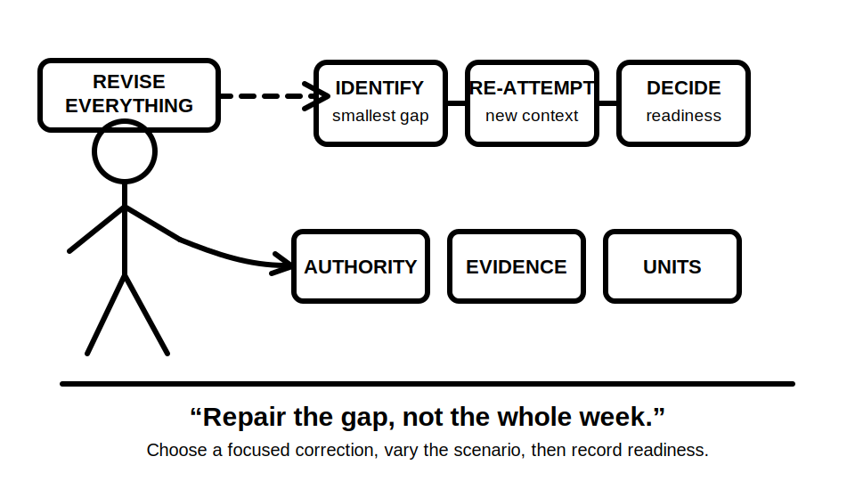
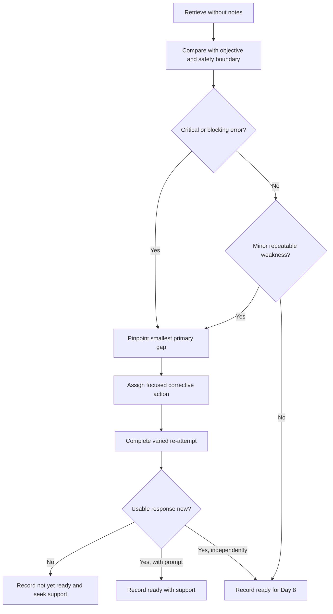
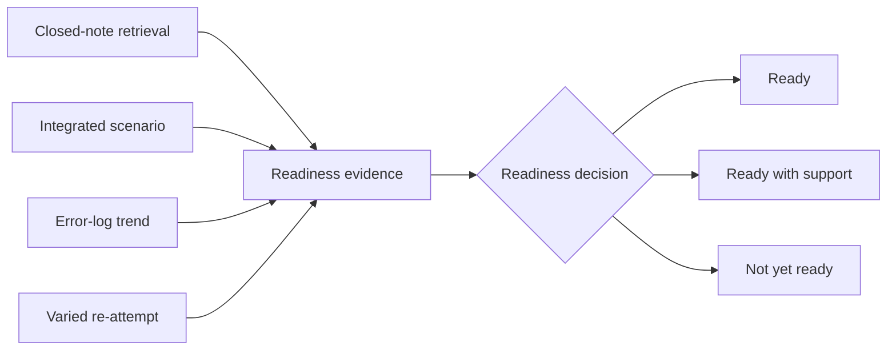

# Day 7 — Week 1 Consolidation and Individual Remediation Plan

> **Currency and scope notice:** This module consolidates Week 1 learning through written retrieval, scenario reasoning and an individual remediation plan. It introduces no field procedure and does not authorise electrical work. Exact clauses, technical requirements, official assessment rules and safety-critical procedures remain `reference_check_required`. Current authorised standards, legislation, regulator guidance, workplace procedures, manufacturer instructions and RTO requirements remain controlling. This module is not `technically-reviewed`.

## 1. Outcome and entry check

### Learning objectives

By the end of this block, the learner should be able to:

1. retrieve the six Week 1 workflows without notes and explain the purpose of each;
2. distinguish a knowledge gap, process gap, confidence-calibration error and authority-boundary error;
3. analyse one integrated written scenario using hazard, authority, source-navigation and evidence-quality reasoning;
4. identify the smallest prerequisite gap that would block safe progress into Week 2;
5. convert error-log evidence into a prioritised remediation plan containing no more than three active targets;
6. design a varied re-attempt for each target rather than repeating the original question unchanged;
7. state a readiness decision of **ready**, **ready with support** or **not yet ready** using recorded evidence;
8. achieve at least 10 out of 12 rubric points with no unsafe action, invented technical requirement or hidden assumption.

### Entry check

Without notes, write the six Week 1 workflows and one sentence describing the decision each supports:

- M-A-P-S;
- H-A-Z-A-R-D;
- A-U-T-H-O-R-I-T-Y;
- T-R-A-C-E;
- R-E-S-T-O-R-E;
- C-L-E-A-R.

Then answer:

1. What is the difference between a hazard and an exposure pathway?
2. Why does competence not automatically create authority?
3. Why is a keyword search result only a candidate source?
4. Why can a current authoritative source still be inapplicable?
5. What makes a conclusion bounded?
6. What should happen after a high-confidence error?

Rate each response as **0 — absent or unsafe**, **1 — partial**, or **2 — usable**. Do not average away a safety-critical zero. Any zero involving authority, stop conditions, source control or unsupported practical action becomes an immediate remediation target.

## 2. Why it matters

Week 1 establishes the reasoning controls that later technical modules depend on. A learner who can recall electrical terminology but cannot recognise an authority boundary, locate the controlling source or expose a missing premise is not ready to make reliable protection, design, inspection or verification decisions.

Consolidation is not a memory contest. Its purpose is to determine whether the learner can coordinate several controls in a fresh scenario:

- identify the hazard and possible exposure pathway;
- stay within role, supervision and task authority;
- locate candidate controlling material efficiently;
- test evidence quality, applicability and completeness;
- stop when the evidence or authority boundary is reached;
- record the exact gap that needs remediation.

A broad plan such as “revise Week 1” is too vague to guide improvement. A useful plan identifies one observable failure, the smallest corrective activity, the evidence of improvement and the date or block for rechecking it.



## 3. Core concepts and terminology

### Consolidation

**Consolidation** is the process of connecting and stabilising previously learned knowledge so it can be retrieved and applied in a new context. It requires recall and transfer, not passive rereading.

### Retrieval strength

**Retrieval strength** is the learner's present ability to recall and use an item without prompts. A correct answer produced only after rereading has not demonstrated strong retrieval.

### Transfer

**Transfer** is successful use of learning in a changed scenario. A varied context is required because repeating the same wording may measure recognition rather than understanding.

### Remediation target

A **remediation target** is a narrowly stated capability that needs correction. It should name observable behaviour, for example:

- “separates task competence from legal or workplace authority”;
- “checks source edition and scope before using an excerpt”;
- “states missing evidence instead of supplying it from memory.”

“Improve safety” and “study standards” are not sufficiently specific.

### Error categories

Classify each important error into one primary category:

1. **Knowledge gap:** a definition, relationship or prerequisite is not understood.
2. **Process gap:** the learner knows individual ideas but omits or misorders a reasoning step.
3. **Applicability gap:** a valid idea is used under the wrong conditions.
4. **Evidence gap:** the learner cannot distinguish fact, candidate evidence, assumption or missing premise.
5. **Authority-boundary error:** the learner proposes or implies action beyond stated authority, supervision or procedure.
6. **Confidence-calibration error:** confidence is substantially higher or lower than demonstrated performance.

A single answer may reveal several problems, but select the smallest primary cause that should be corrected first.

### Blocking prerequisite

A **blocking prerequisite** is a gap that makes the next learning block unreliable or unsafe. In this transition, examples include inability to:

- distinguish a quantity from its unit;
- perform basic arithmetic with consistent units;
- identify supplied versus assumed information;
- show calculation steps clearly;
- stop before using an unverified value or procedure.

Exact electrical calculation requirements belong to later modules and authorised sources. Day 7 only checks readiness for prerequisite calculation reasoning.

### Readiness outcomes

- **Ready:** required Week 1 controls are retrieved and applied independently, and no blocking prerequisite is evident.
- **Ready with support:** progress may continue with a named prompt, refresher or supervised learning support.
- **Not yet ready:** a safety-critical reasoning error or blocking prerequisite requires remediation before independent progression.

A readiness decision is about the next learning block, not a claim of trade competence or formal assessment approval.

## 4. Rule-finding workflow

Use **R-E-P-A-I-R** to turn performance evidence into a bounded plan:

1. **R — Retrieve:** attempt the selected knowledge or workflow without notes.
2. **E — Examine evidence:** compare the response with the module objective, source boundary and safety expectations.
3. **P — Pinpoint the gap:** classify the smallest primary error and identify whether it blocks progression.
4. **A — Assign a corrective action:** choose one focused explanation, diagram reconstruction, source-navigation task or fresh scenario.
5. **I — Implement a varied re-attempt:** change the wording, context, evidence order or decision condition.
6. **R — Record readiness:** state ready, ready with support or not yet ready, with evidence and a review point.



The decision tree prevents two common errors: treating every mistake as equally important and allowing an unsafe error to disappear inside an average score.

### Remediation record

Use this template for no more than three active targets:

```text
Observed response or behaviour:
Confidence before feedback:
Primary error category:
Why it matters:
Blocking prerequisite? yes / no
Smallest corrective action:
Varied re-attempt:
Evidence of improvement:
Support required:
Review point:
Readiness effect:
```

## 5. Visual model or worked example

### From broad revision to a precise repair

A learner writes this answer to a fictional scenario:

> I would open the equipment to check the wiring, then search online for the relevant rule. The diagram looks normal, so the arrangement is probably acceptable.

The answer contains several issues:

- opening equipment is proposed without authority, isolation or approved procedure;
- the search method does not identify an authorised source;
- “looks normal” substitutes familiarity for applicability and completeness;
- “probably acceptable” hides missing evidence rather than bounding the conclusion.

Apply R-E-P-A-I-R:

1. **Retrieve:** ask the learner to state the authority and evidence checks from memory.
2. **Examine:** compare the response with A-U-T-H-O-R-I-T-Y, T-R-A-C-E and C-L-E-A-R.
3. **Pinpoint:** the first blocking error is the authority-boundary error. Source and evidence gaps are also recorded, but practical action must be corrected first.
4. **Assign:** revisit the authority-envelope model and write one stop statement.
5. **Implement:** present a changed written scenario in which the equipment is already documented as isolated but the learner still lacks authority to open it.
6. **Record:** if the learner now stops, identifies the authorised person or procedure and continues only with written evidence analysis, mark that target improved.

A suitable bounded response is:

> The scenario does not establish my authority or an approved procedure for opening the equipment, so I would not perform that action. I can analyse the supplied written evidence, identify the controlling source required and record the missing facts. Practical inspection or verification requires authorised supervision and procedure.

The corrective task is not “redo all of Week 1.” It is a targeted authority-boundary repair followed by a changed-context re-attempt.

### Readiness evidence stack



No single quiz score decides readiness. The decision uses several evidence types and gives extra weight to safety-critical errors, repeated process failures and high-confidence misconceptions.

## 6. Practical application

### Round 1 — closed-note Week 1 map

On one page, reconstruct:

- the purpose of each Week 1 block;
- all six workflows;
- the relationship between hazard, exposure pathway and control;
- the difference between competence, authority and supervision;
- the source-navigation path from question to bounded answer;
- the three evidence tests and four bounded outcomes.

Use notes only after the first attempt. Add corrections in a different annotation style and record confidence before checking.

### Round 2 — integrated scenario

Use this fictional written scenario:

> A learner receives a photograph of a small switchboard, an equipment label, a copied excerpt with no edition shown and a message saying the installation was “checked last year.” The learner is asked whether the arrangement is safe and compliant and what should be done next. No supply arrangement, inspection record, test result, worker role or task authority is supplied.

Produce a response containing:

1. the hazards or consequences that make unsupported action inappropriate;
2. the difference between visible information and inferred information;
3. the authority and supervision boundary;
4. the candidate sources that must be located;
5. quality, applicability and completeness checks;
6. assumptions and missing premises;
7. a bounded written conclusion;
8. one safe escalation or evidence-gathering next step within the scenario.

Do not diagnose the installation from the photograph and do not invent test results, supply conditions or clause requirements.

### Round 3 — error-log conference

Review all Week 1 evidence and select no more than three targets. Prioritise in this order:

1. unsafe action or authority-boundary error;
2. high-confidence safety misconception;
3. repeated source or applicability failure;
4. blocking prerequisite for Day 8;
5. minor terminology or presentation issue.

For each target, complete the remediation record. Defer lower-value items rather than creating an unmanageable plan.

### Round 4 — prerequisite calculation check

Complete these non-technical readiness tasks:

1. rewrite three quantities using consistent units supplied by the trainer;
2. identify the known, unknown and assumed items in a simple arithmetic word problem;
3. show substitution, operation and result on separate lines;
4. explain why a result without units is incomplete;
5. estimate whether the result is plausible before accepting it;
6. identify when a calculator entry or supplied value must be checked.

This is not an electrical design calculation and supplies no standards value. A basic arithmetic or unit-handling gap becomes a Day 8 support item.

### Performance rubric

Score each category from **0 to 2**:

| Category | 0 | 1 | 2 |
|---|---|---|---|
| Retrieval | workflows absent or confused | several prompts required | six workflows retrieved with purposes |
| Integrated reasoning | one isolated idea only | several controls identified | hazard, authority, source and evidence controls coordinated |
| Safety and authority | unsafe action or hidden authority assumption | stop stated but incomplete | clear stop, escalation and authority boundary |
| Evidence discipline | photograph or excerpt treated as proof | some gaps noted | quality, applicability and completeness separated |
| Remediation quality | broad rereading plan | target identified but re-attempt weak | smallest gap, focused action and varied re-attempt |
| Readiness judgement | unsupported pass/fail claim | outcome stated with limited evidence | bounded outcome supported by multiple evidence types |

Pass standard for progression without additional support: at least **10 out of 12**, with no zero in safety and authority or evidence discipline. A lower result does not imply failure of the program; it determines the support and remediation required before or during Day 8.

## 7. Common errors and safety checkpoint

### Common errors

- **Average-score masking:** allowing a strong total score to hide one safety-critical zero.
- **Rereading as remediation:** reviewing pages without a retrieval attempt or changed scenario.
- **Too many targets:** creating a long list that prevents focused correction.
- **Topic-label diagnosis:** recording “standards problem” instead of the exact failed behaviour.
- **Unchanged re-attempt:** repeating the same prompt and mistaking familiarity for transfer.
- **Confidence neglect:** ignoring a high-confidence error because the corrected answer is now visible.
- **Premature progression:** moving on because the schedule says Day 8 rather than because blocking gaps are controlled.
- **Perfection delay:** refusing progression for a minor non-blocking wording issue.
- **Practical-action drift:** turning a written consolidation scenario into unauthorised inspection or testing.
- **Technical overreach:** inventing clauses, values or procedures to make the scenario feel complete.

### Safety checkpoint

All activities are written, diagrammatic or arithmetic prerequisite exercises. This module authorises no switching, isolation, opening equipment, testing, resetting, disconnection, alteration, repair, energisation, commissioning, verification or practical demonstration.

Stop and seek trainer or qualified guidance when:

- the learner proposes practical action outside stated authority or procedure;
- a high-confidence misconception could affect electrical safety;
- the controlling source or scenario conditions cannot be established;
- an exact clause, limit, value, test method or official assessment rule is required;
- repeated re-attempts still depend on prompts for a blocking prerequisite;
- fatigue or frustration makes the evidence unreliable;
- the proposed support exceeds the learner's, trainer's or workplace authority.

Record `reference_check_required` rather than supplying an approximate technical requirement.

## 8. Retrieval and next links

### Closed-note retrieval

1. Recite R-E-P-A-I-R and explain each step.
2. Name the six primary error categories.
3. What makes a prerequisite blocking?
4. Why should a remediation plan contain only a few active targets?
5. Why must a re-attempt vary the context?
6. What evidence supports a readiness decision?
7. Distinguish ready, ready with support and not yet ready.
8. Why must a safety-critical zero not be averaged away?
9. Give one example of a confidence-calibration error.
10. State five stop or escalation conditions.

### Exit task

Write a one-page Week 1 remediation and readiness record containing:

- one demonstrated strength;
- up to three active remediation targets;
- one varied re-attempt per target;
- required support;
- one review point;
- the readiness decision and evidence;
- unresolved `reference_check_required` items.

### Evidence to retain

Keep:

- the closed-note Week 1 map;
- integrated-scenario response;
- rubric score;
- confidence record;
- selected remediation records;
- prerequisite calculation check;
- readiness decision;
- unresolved review flags.

### Navigation

- **Plan:** [Twelve-Week Capstone Learning Plan](../MASTER_PLAN.md)
- **Knowledge note:** [[12-Week Day 07 - Week 1 Consolidation and Individual Remediation Plan]]
- **Previous:** [Day 6 — Evidence Quality, Applicability and Completeness Workshop](day-06-evidence-quality-applicability-and-completeness-workshop.md)
- **Next:** Day 8 — Circuit Quantities, Load Reasoning and Prerequisite Calculation Check

### Reference and currency notice

This module uses original workflows, scenarios, diagrams, rubric and remediation tools organised around learner performance rather than a standards clause sequence. It does not reproduce standards tables, figures, systematic wording, exact technical values or official assessment material. Current authorised sources and qualified review remain required before any safety-critical conclusion or practical procedure is used beyond the written learning context.
