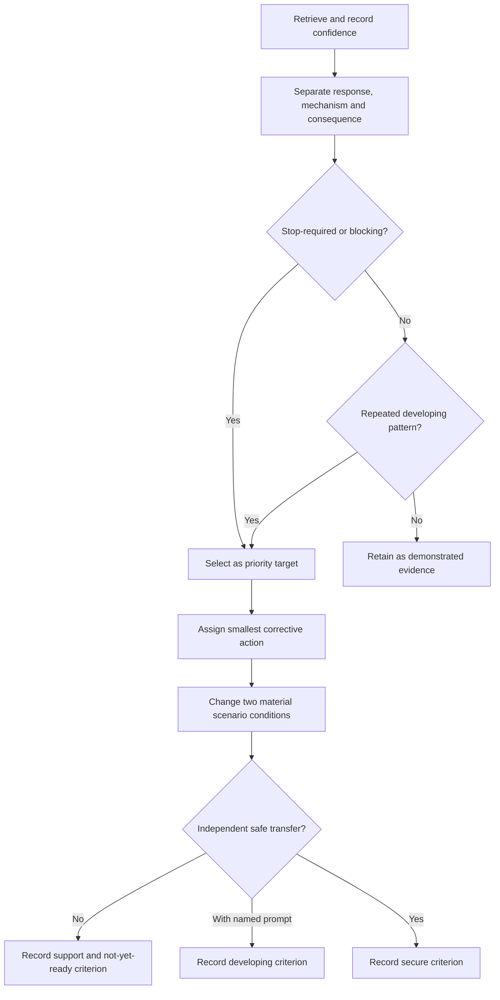
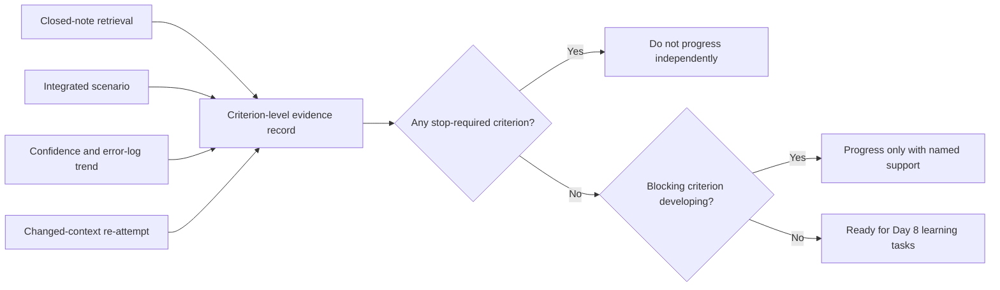

# Day 7 — Week 1 Consolidation and Individual Remediation Plan

> **Currency and scope notice:** This module consolidates Week 1 through written retrieval, scenario reasoning and an individual remediation plan. It introduces no field procedure and does not authorise electrical work. Exact clauses, technical requirements, official assessment rules and safety-critical procedures remain `reference_check_required`. Current authorised standards, legislation, regulator guidance, workplace procedures, manufacturer instructions and RTO requirements remain controlling. This module is not `technically-reviewed`.

## 1. Outcome and entry check

### Learning objectives

By the end of this block, the learner should be able to:

1. retrieve the six Week 1 workflows without notes and state the decision each supports;
2. coordinate hazard, authority, source-navigation and evidence reasoning in one unfamiliar written scenario;
3. separate an observed performance error from its likely mechanism and safety or learning consequence;
4. identify the first blocking prerequisite rather than treating every weakness as equally urgent;
5. select no more than three active remediation targets using recorded evidence;
6. define a corrective action, a materially changed re-attempt and observable evidence of improvement for each target;
7. calibrate confidence against performance, giving priority to high-confidence unsafe or unsupported responses;
8. record a criterion-level readiness decision for Day 8 without using an invented pass mark or claiming formal competency.

### Entry check

Without notes, write the six Week 1 workflows and one sentence describing the decision each supports:

- M-A-P-S;
- H-A-Z-A-R-D;
- A-U-T-H-O-R-I-T-Y;
- T-R-A-C-E;
- R-E-S-T-O-R-E;
- C-L-E-A-R.

Then answer:

1. What is the difference between a hazard and an exposure pathway?
2. Why does competence not automatically create authority?
3. Why is a keyword result only a candidate source?
4. Why can a current authoritative source still be inapplicable?
5. What makes a conclusion bounded?
6. What should happen after a high-confidence error?

For each response, record:

- the response itself;
- confidence before checking: guessing, unsure, reasonably confident or certain;
- evidence status: secure, developing, unsupported or `stop-required`;
- the smallest observable gap, if any.

A `stop-required` response involving authority, practical action, source control or hidden assumptions cannot be offset by stronger performance elsewhere.

## 2. Why it matters

Week 1 establishes the reasoning controls used throughout later protection, design, inspection, verification and fault-diagnosis modules. Recall alone is insufficient. The learner must coordinate several controls in a changed context:

- identify a hazard, target and possible exposure pathway;
- stay inside role, task and supervision authority;
- locate candidate controlling sources without relying on remembered clause numbers;
- test evidence quality, applicability and completeness;
- distinguish facts, inferences, assumptions, contradictions and missing premises;
- stop when authority or evidence is insufficient;
- record the exact capability requiring repair.

A broad instruction such as “revise Week 1” conceals the cause of failure. A useful remediation plan identifies one observable behaviour, the likely mechanism behind it, the consequence if it persists, the smallest corrective activity and the evidence required before the target is considered improved.


*Caption: Repair the smallest demonstrated gap instead of assigning an unbounded review of the entire week.*

## 3. Core concepts and terminology

### Consolidation

**Consolidation** connects and stabilises previous learning so it can be retrieved and applied in a new context. Passive rereading may improve familiarity without demonstrating retrieval or transfer.

### Retrieval strength

**Retrieval strength** is the learner's present ability to recall and use an item without prompts. It is temporary and task-specific; one correct response does not establish durable mastery.

### Transfer distance

**Transfer distance** describes how much a re-attempt differs from the original task. A useful transfer task changes at least two material features, such as the evidence type, authority condition, source-currency problem, operating state or required decision.

### Error mechanism

An **error mechanism** is the process that produced the incorrect or unsafe response. Examples include:

1. **Knowledge gap:** a definition or relationship is not understood.
2. **Retrieval gap:** the learner understood the idea previously but cannot retrieve it without prompting.
3. **Process gap:** relevant ideas are known but omitted, misordered or not connected.
4. **Applicability gap:** valid information is used under the wrong conditions.
5. **Evidence-control gap:** fact, inference, assumption, contradiction or missing premise is misclassified.
6. **Authority-boundary error:** action is proposed beyond stated authority, supervision or procedure.
7. **Confidence-calibration error:** confidence is materially stronger or weaker than the evidence supports.

A response may reveal several mechanisms. Select the earliest mechanism that would prevent the later errors if corrected.

### Blocking prerequisite

A **blocking prerequisite** is a gap that makes the next learning block unreliable or unsafe. For the transition to Day 8, blocking gaps include inability to:

- distinguish a quantity from its unit;
- keep units consistent;
- identify supplied, derived and assumed information;
- show substitution, operation and result separately;
- test plausibility;
- stop before using an unverified technical value or procedure.

### Readiness evidence

**Readiness evidence** is the retained work used to justify progression support. It must show performance across more than one evidence type and must preserve unresolved safety or source limitations.

### Criterion-level readiness states

- **Secure:** the learner performs the criterion independently in a changed context and states the relevant boundary.
- **Developing:** the learner performs part of the criterion but requires a named prompt or support.
- **Unsupported:** the conclusion or action is not justified by the supplied evidence.
- **Stop-required:** the response proposes unsafe, unauthorised or materially unverified action or hides a safety-critical premise.

These are educational planning labels, not official RTO grades or competency outcomes.

## 4. Rule-finding workflow

Use **R-E-P-A-I-R** to convert performance evidence into a bounded plan:

1. **R — Retrieve:** attempt the selected workflow or concept without notes and record confidence first.
2. **E — Examine:** compare the response with the objective, scenario evidence, source boundary and safety expectations.
3. **P — Pinpoint:** identify the observable error, its likely mechanism and whether it blocks progression.
4. **A — Assign:** choose the smallest corrective explanation, diagram reconstruction, source-navigation task or scenario.
5. **I — Implement transfer:** change at least two material conditions and complete the re-attempt without copying the correction.
6. **R — Record readiness:** classify each criterion, name support or evidence owners and set one review point.



The workflow prevents three distortions: averaging away a blocking error, treating a corrected copy as transfer, and converting an educational readiness decision into an unsupported formal pass claim.

### Remediation record

Use this template for no more than three active targets:

```text
Observed response or behaviour:
Confidence before feedback:
Evidence status:
Primary error mechanism:
Consequence if uncorrected:
Blocking prerequisite? yes / no
Smallest corrective action:
Two material changes in the transfer task:
Independent evidence of improvement:
Support or evidence owner:
Review point:
Criterion-level readiness effect:
Unresolved reference check:
```

## 5. Visual model or worked example

### From broad revision to a precise repair

A learner writes in response to a fictional scenario:

> I would open the equipment to check the wiring, then search online for the relevant rule. The diagram looks normal, so the arrangement is probably acceptable.

The response contains multiple errors, but they should not be treated as one vague “safety problem”:

- **Observed behaviour:** proposes opening equipment and gives an acceptance conclusion.
- **First error mechanism:** authority-boundary error; neither authority nor an approved procedure is supplied.
- **Secondary mechanisms:** weak source control and unsupported applicability reasoning.
- **Consequence:** practical-action drift and an unjustified compliance conclusion.
- **Confidence risk:** if stated with high confidence, the target receives greater priority.

Apply R-E-P-A-I-R:

1. Retrieve the authority and evidence checks without notes.
2. Examine the answer against A-U-T-H-O-R-I-T-Y, T-R-A-C-E and C-L-E-A-R.
3. Pinpoint the first blocking transition: moving from supplied documents to opening equipment.
4. Assign one corrective task: reconstruct the authority envelope and write a stop statement.
5. Implement transfer using a scenario where isolation is documented but authority to open the equipment is still absent, and the copied excerpt is replaced by a current but out-of-scope source.
6. Record separate results for authority control, source applicability and bounded conclusion.

A suitable bounded response is:

> The scenario does not establish authority or an approved procedure for opening the equipment, so that action must stop. I can analyse the supplied written evidence, identify the authorised source and responsible evidence owner, and record what remains unknown. The photograph and source excerpt do not establish compliance, and practical inspection or verification requires authorised supervision and procedure.

### Readiness evidence model



No aggregate score decides readiness. The decision uses multiple evidence types and preserves blocking conditions, support requirements and unresolved source checks.

## 6. Practical application

### Round 1 — closed-note Week 1 map

Reconstruct on one page:

- the purpose of each Week 1 block;
- all six workflows;
- the relationship between hazard, target, pathway, exposure and consequence;
- the difference between competence, authority, supervision and evidence of authority;
- the source-navigation path from question to bounded answer;
- evidence quality, applicability and completeness;
- the available bounded outcomes and stop conditions.

Record confidence before checking. Add corrections only after the closed-note attempt and label each correction by error mechanism.

### Round 2 — integrated scenario

Use this fictional written scenario:

> A learner receives a photograph of a small switchboard, an equipment label, a copied excerpt with no edition shown and a message saying the installation was “checked last year.” The learner is asked whether the arrangement is safe and compliant and what should be done next. No supply arrangement, inspection record, test result, worker role or task authority is supplied.

Produce a response containing:

1. stated facts, reports, inferences, assumptions, contradictions and evidence gaps;
2. hazards and possible consequences that make unsupported action inappropriate;
3. the exact authority boundary and first unsupported transition;
4. candidate source families and source-currency checks;
5. quality, applicability and completeness checks;
6. a claim-to-premise map for any proposed conclusion;
7. a bounded written outcome;
8. one evidence owner or safe escalation step within the written scenario.

Do not diagnose the installation from the photograph and do not invent test results, supply conditions, clause requirements or practical authority.

### Round 3 — changed-context transfer

Change at least two material conditions, for example:

- replace the undated excerpt with a current source that applies to a different installation class;
- provide a role statement but leave supervision and task authority unclear;
- replace the photograph with an inspection record that lacks operating-state information;
- add contradictory equipment-identification details.

Rebuild the answer. Do not merely edit the first response. Record which conclusions, source choices and stop conditions changed and why.

### Round 4 — remediation conference

Review all Week 1 evidence and select no more than three targets. Prioritise:

1. `stop-required` action or hidden authority assumption;
2. high-confidence safety misconception;
3. repeated source, applicability or evidence-control failure;
4. blocking prerequisite for Day 8;
5. repeated process failure;
6. minor terminology or presentation issue.

Each target must include one mechanism, one consequence, one corrective action, one changed-context task, one evidence owner or support requirement and one review point.

### Round 5 — prerequisite calculation check

Complete these non-technical readiness tasks:

1. rewrite three supplied quantities using consistent units;
2. identify known, unknown, derived and assumed items in a simple arithmetic problem;
3. show substitution, operation and result on separate lines;
4. explain why a result without units is incomplete;
5. estimate whether the result is plausible;
6. identify when a calculator entry or supplied value must be checked;
7. stop and label the task incomplete when a required value is missing.

This is not an electrical design calculation and supplies no standards value.

### Criterion-level evidence record

Classify each criterion as **secure**, **developing**, **unsupported** or **stop-required** and cite the retained evidence:

| Criterion | Evidence required | Blocking condition |
|---|---|---|
| Workflow retrieval | six workflows and their decisions reconstructed without notes | authority or source-control workflow absent |
| Integrated reasoning | hazard, authority, source and evidence controls coordinated | unsafe action or hidden material premise |
| Source and evidence discipline | source currency, scope, applicability and missing evidence recorded | photograph, memory or excerpt treated as proof |
| Transfer | answer rebuilt after two material changes | correction copied with no changed-context reasoning |
| Remediation quality | smallest mechanism, focused action and observable recheck | broad rereading plan or no evidence of improvement |
| Calculation readiness | units, knowns, assumptions, steps and plausibility visible | invented value or inability to stop when information is missing |

Readiness rules:

- Any `stop-required` criterion means **not ready for independent progression**.
- A blocking criterion marked `developing` permits progression only with named support and a scheduled recheck.
- `Unsupported` non-blocking work becomes a remediation target or deferred item with an owner.
- “Ready” means ready for Day 8 learning activity, not formally competent or technically approved.

## 7. Common errors and safety checkpoint

### Common errors

- **Aggregate-score masking:** allowing strong recall to hide one unsafe or unsupported criterion.
- **Correct-answer bias:** treating a guessed correct response as secure evidence.
- **Rereading as remediation:** reviewing pages without retrieval or transfer.
- **Too many targets:** creating a plan too broad to execute.
- **Topic-label diagnosis:** writing “standards problem” instead of the failed behaviour and mechanism.
- **Single-change transfer:** changing only names or numbers while preserving the same reasoning cues.
- **Confidence neglect:** ignoring a high-confidence misconception after showing the correction.
- **Support ambiguity:** recording “ask for help” without naming the prompt, person, source or review point.
- **Premature progression:** advancing because of the timetable rather than evidence.
- **Perfection delay:** blocking progression for a minor non-safety wording issue.
- **Practical-action drift:** turning a written scenario into unauthorised inspection or testing.
- **Technical overreach:** inventing clauses, values or procedures.

### Safety checkpoint

All activities are written, diagrammatic or arithmetic prerequisite exercises. This module authorises no access, switching, isolation, opening equipment, testing, measurement, resetting, disconnection, alteration, repair, energisation, commissioning, certification, verification or practical demonstration.

Stop and seek trainer or qualified guidance when:

- practical action is proposed outside stated authority or approved procedure;
- a high-confidence misconception could affect electrical safety;
- source currency, jurisdiction, scope or scenario conditions cannot be established;
- an exact clause, limit, value, test method or official assessment rule is required;
- a blocking criterion still depends on prompts after the transfer attempt;
- fatigue or frustration makes the evidence unreliable;
- the proposed support exceeds the learner's, trainer's or workplace authority.

Record `reference_check_required` rather than supplying an approximate technical requirement.

## 8. Retrieval and next links

### Closed-note retrieval

1. Recite R-E-P-A-I-R and explain each step.
2. Distinguish an observed error from its mechanism and consequence.
3. Name the seven error mechanisms.
4. What makes a prerequisite blocking?
5. Why must a transfer task change at least two material conditions?
6. Why can a correct guess remain developing or unsupported evidence?
7. What evidence supports a readiness decision?
8. Distinguish secure, developing, unsupported and `stop-required`.
9. Why must support have an owner and review point?
10. State five stop or escalation conditions.

### Exit task

Write a one-page Week 1 remediation and readiness record containing:

- one demonstrated strength with evidence;
- up to three active remediation targets;
- the error mechanism and consequence for each;
- two material changes in each transfer task;
- required support or evidence owner;
- one review point per target;
- criterion-level readiness decisions;
- unresolved `reference_check_required` items.

### Evidence to retain

Keep the closed-note map, integrated response, confidence record, changed-context response, criterion-level evidence record, remediation records, calculation-readiness check and unresolved review flags.

### Navigation

- **Plan:** [Twelve-Week Capstone Learning Plan](../MASTER_PLAN.md)
- **Knowledge note:** [[12-Week Day 07 - Week 1 Consolidation and Individual Remediation Plan]]
- **Previous:** [Day 6 — Evidence Quality, Applicability and Completeness Workshop](day-06-evidence-quality-applicability-and-completeness-workshop.md)
- **Next:** [Day 8 — Circuit Quantities, Load Reasoning and Prerequisite Calculation Check](day-08-circuit-quantities-load-reasoning-and-prerequisite-calculation-check.md)

### Reference and currency notice

This module uses original workflows, scenarios, diagrams and remediation tools organised around learner performance rather than a standards clause sequence. It does not reproduce standards tables, figures, systematic wording, exact technical values or official assessment material. Current authorised sources and qualified review remain required before any safety-critical conclusion or practical procedure is used beyond the written learning context.
