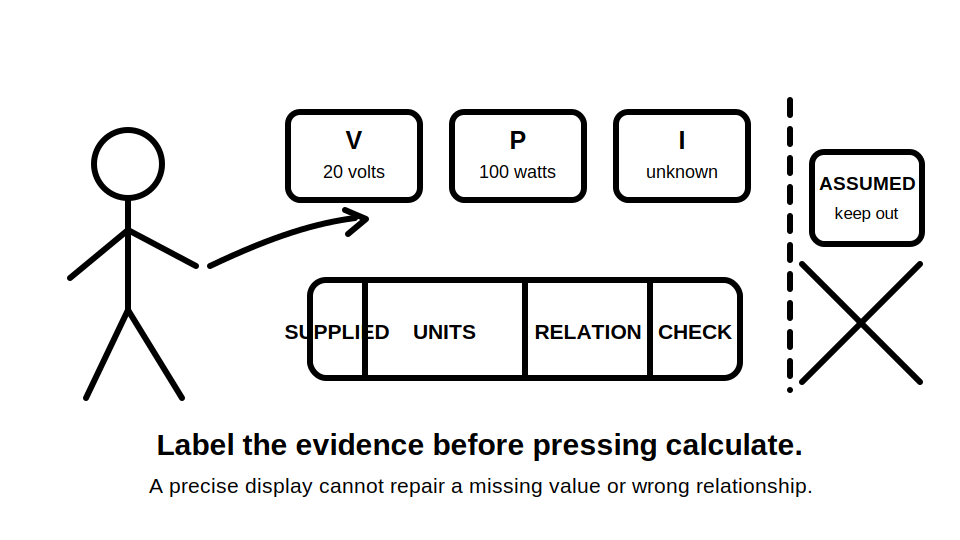
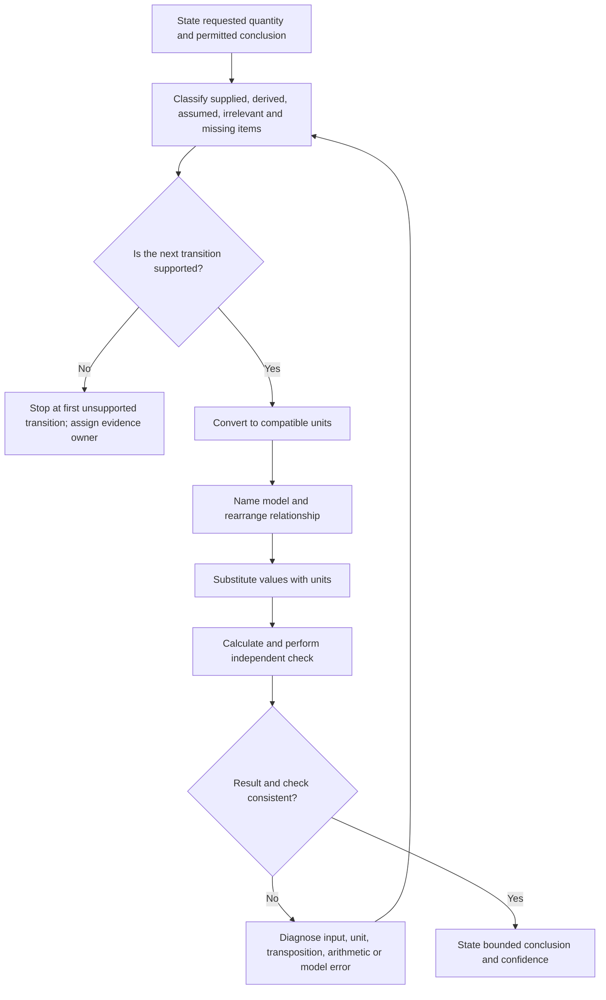
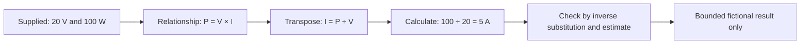

# Day 8 — Circuit Quantities, Load Reasoning and Prerequisite Calculation Check

> **Currency and scope notice:** This module develops calculation literacy using original, fictional examples. It does not provide installation-design values, cable-selection rules, protective-device settings or a field procedure. Exact clauses, limits, nominal supply conditions, diversity methods, assessment rules and safety-critical requirements remain `reference_check_required`. Current authorised standards, legislation, regulator guidance, workplace procedures, manufacturer instructions and RTO requirements remain controlling. This module is not `technically-reviewed`.

## 1. Outcome and entry check

### Learning objectives

By the end of this block, the learner should be able to:

1. distinguish voltage, current, resistance, power and energy by meaning, symbol and unit;
2. classify every value in a written problem as supplied, derived, assumed, irrelevant or missing;
3. identify the requested quantity and the strongest conclusion the available evidence can support;
4. convert prefixes and units before substitution and preserve units through each calculation line;
5. select and rearrange a relationship from the stated quantities rather than from keyword recognition;
6. calculate one unknown from complete fictional inputs and expose every material step;
7. test a result through unit analysis, estimation, inverse calculation or an independent relationship;
8. distinguish connected load, operating load and design demand without inventing diversity;
9. identify the first unsupported calculation transition and stop rather than repair the scenario with an assumed value;
10. produce a bounded conclusion separating arithmetic correctness from design or compliance judgement.

### Entry check

Complete without notes:

1. Write the usual unit for voltage, current, resistance, power and energy.
2. Explain the difference between a quantity, symbol and unit.
3. Convert `2.5 kW` to watts and `750 mA` to amperes, showing the scale factor.
4. In “a fictional load is supplied at 20 V and consumes 100 W,” identify the known and unknown quantities when current is requested.
5. Explain why a calculator display without a unit and source trail is incomplete evidence.
6. Name two genuinely different ways to check a numerical result.
7. State what must happen when a required value is missing and cannot be verified.

For each answer, record confidence as **guessing**, **unsure**, **reasonably confident** or **certain**. Correct guesses and high-confidence errors require different remediation.

## 2. Why it matters

Later Capstone tasks depend on calculation discipline, but arithmetic alone is not sufficient. A numerically correct display can still be unusable because the learner selected the wrong relationship, mixed incompatible units, concealed an assumption or claimed that a fictional result proved design compliance.

Reliable calculation reasoning has four linked layers:

- **meaning:** what each quantity represents;
- **provenance:** where each value came from;
- **process:** how the relationship, units and arithmetic were handled;
- **boundary:** what the result can and cannot establish.

This block deliberately slows the process so errors remain visible and correctable before later modules introduce protection and design dependencies.



*Caption: Label quantities, units and evidence status before entering values into a calculator.*

## 3. Core concepts and terminology

### Quantity, symbol and unit

A **quantity** is a measurable property. A **symbol** is a compact label used to represent it. A **unit** is the agreed scale used to express its magnitude.

| Quantity | Common symbol | Unit | Meaning in this module |
|---|---:|---|---|
| Voltage | V | volt (V) | electrical potential difference between two stated points |
| Current | I | ampere (A) | rate of electric charge flow through a stated path |
| Resistance | R | ohm (Ω) | opposition represented in a stated circuit model |
| Power | P | watt (W) | rate of electrical energy transfer or conversion |
| Energy | E | watt-hour (Wh) or joule (J) | quantity of energy transferred over time |

The same letter can be used differently in other contexts. Define the quantity beside each value rather than relying on the symbol alone.

### Prefix and compatible units

A **prefix** changes unit scale. Here, kilo means one thousand times the base unit and milli means one thousandth. **Compatible units** are expressed on scales that can be used together without an unrecorded conversion.

Write the conversion factor. Do not treat decimal movement as a self-explanatory step.

### Evidence status of values

- **Supplied value:** explicitly provided by the scenario or a named authorised source.
- **Derived value:** calculated from supported inputs through a visible relationship.
- **Assumed value:** introduced without direct evidence.
- **Irrelevant value:** present but not required for the requested relationship or conclusion.
- **Missing value:** required for the next reasoning step but not available or verified.

An assumption may be used in a clearly labelled teaching sensitivity check, but it cannot silently become an installation fact.

### Relationship and model boundary

For a simple stated model, the trainer may supply:

- `V = I × R`
- `P = V × I`
- `E = P × t`

A **model boundary** states the conditions under which a relationship is being used. Rearranging a formula does not improve the evidence quality of its inputs and does not prove cable suitability, maximum demand, protective-device performance or compliance.

### Load terms

- **Connected load:** total stated rating of connected equipment in the fictional scenario before considering operating pattern or an authorised demand method.
- **Operating load:** load described as operating under a stated condition.
- **Design demand:** value used for design only after applying an applicable authorised method to verified conditions.
- **Diversity:** recognition that connected loads may not all operate at full rating simultaneously; its method and allowances must be sourced, not guessed.

### Independent check and circular check

An **independent check** uses a meaningfully different route, such as inverse substitution, dimensional reasoning or an estimate. A **circular check** repeats the same setup or calculator entry and therefore may reproduce the original error.

### First unsupported transition

The **first unsupported transition** is the earliest point where the next calculation step depends on an unverified value, relationship, unit conversion or applicability assumption. This is the required stop point.

## 4. Rule-finding workflow

Use **Q-U-A-N-T-I-T-Y** before accepting a calculation:

1. **Q — Question:** name the requested quantity and permitted conclusion.
2. **U — Unpack:** classify supplied, derived, assumed, irrelevant and missing information.
3. **A — Align units:** show each prefix conversion and use compatible units.
4. **N — Name the relationship:** state the model and why it matches the supplied quantities.
5. **T — Transpose:** isolate the unknown symbol before substitution.
6. **I — Insert:** substitute values with units on a separate line.
7. **T — Test:** check unit sense, scale, arithmetic and an independent route.
8. **Y — Yield a bounded conclusion:** report the result, confidence, evidence limits and unresolved checks.



The stop branch is a valid outcome. Assign the missing evidence to a named trainer, source or qualified reviewer rather than inventing it.

### Calculation record

```text
Requested quantity:
Permitted conclusion:
Supplied values and source:
Derived values:
Assumptions:
Irrelevant values:
Missing values:
First unsupported transition, if any:
Evidence owner or source needed:
Unit conversions:
Relationship and model boundary:
Rearranged form:
Substitution with units:
Result with unit:
Independent check:
Confidence:
Bounded conclusion:
Reference checks still required:
```

## 5. Visual model or worked example

### Worked example — fictional low-voltage model

A fictional learning load is stated to operate at `20 V` and transfer power at `100 W`. Determine current for this model. These values are selected only for arithmetic practice.

1. **Question:** determine current, `I`; no installation conclusion is permitted.
2. **Unpack:** supplied `V = 20 V`, `P = 100 W`; current is missing but derivable.
3. **Align:** volts and watts are already on compatible base-unit scales.
4. **Name:** use `P = V × I` because power and voltage are supplied.
5. **Transpose:** `I = P ÷ V`.
6. **Insert:** `I = 100 W ÷ 20 V`.
7. **Calculate:** `I = 5 A`.
8. **Test:** inverse substitution gives `20 V × 5 A = 100 W`; an estimate also places current in single-digit amperes.
9. **Yield:** current in the stated fictional model is `5 A`. This does not establish supply, conductor, protection or installation suitability.



The diagram keeps input evidence, model selection, arithmetic, checking and conclusion separate.

### Contrast case — unsupported transition

A worksheet asks for current but supplies power only. Voltage is neither stated nor authorised. The learner must stop before substitution, record voltage as missing and identify the evidence owner. Selecting a familiar nominal value from memory would create a hidden assumption, not a solution.

### Load-reasoning contrast

If three items are connected but only two are stated to operate, summing all three gives a connected-load subtotal and summing the two operating items gives an operating-load subtotal. Neither automatically becomes design demand. An authorised demand method and verified applicability remain required.

## 6. Practical application

### Round 1 — quantity and evidence sort

For voltage, current, resistance, power and energy, record symbol, unit, meaning, one common confusion and a diagnostic question. Then classify trainer-supplied values as supplied, derived, assumed, irrelevant or missing and justify each classification.

### Round 2 — complete calculation records

Complete fictional examples for:

1. current from supplied power and voltage;
2. resistance from supplied voltage and current;
3. energy from supplied power and time.

Show every conversion, relationship, transposition, substitution, result, independent check and bounded conclusion.

### Round 3 — worked-example fading

Repeat with support removed progressively:

1. relationship and transposition supplied;
2. relationship supplied but transposition omitted;
3. only quantities and requested outcome supplied;
4. changed prefixes requiring visible conversion;
5. one irrelevant value included;
6. one required value omitted, requiring a stop.

Progress only when the learner can explain why each retained value and relationship is relevant.

### Round 4 — load reasoning

Use a fictional schedule containing four connected items, two operating conditions, one missing rating, mixed watt and kilowatt units, and no authorised diversity method. Produce verified connected and operating subtotals, a missing-information register and a statement explaining why design demand cannot yet be claimed.

### Round 5 — changed-context transfer

Change at least two material conditions, such as the requested quantity and unit prefix, or operating condition and missing input. Rebuild the calculation record rather than copying the previous setup. Explain which prior steps remain valid and which must be reopened.

### Criterion-level evidence states

Assess each criterion independently:

| Criterion | Secure | Developing | Unsupported | `stop-required` |
|---|---|---|---|---|
| Quantity meaning | meanings, symbols and units consistently distinguished | minor confusion corrected with prompting | labels used without usable meaning | confusion would support an unsafe or false conclusion |
| Evidence setup | all values classified with provenance | one non-material classification gap | assumptions or missing values not exposed | a material value is invented or falsely attributed |
| Unit control | conversions and units visible throughout | isolated notation error with sound scale reasoning | conversion route cannot be explained | incompatible units are used without recognition |
| Relationship selection | model and applicability justified | correct with targeted prompt | formula selected by keyword or memory only | relationship is used outside the stated model boundary |
| Process visibility | transposition, substitution and arithmetic traceable | one recoverable omitted step | calculator output cannot be reconstructed | hidden process masks a material error |
| Verification | independent check and discrepancy response recorded | check is weak but distinct | same entry repeated as a check | contradictory evidence is ignored |
| Conclusion boundary | result and unresolved design requirements separated | limitation incomplete but directionally correct | arithmetic presented as design evidence | compliance or practical authority is claimed without support |
| Confidence calibration | confidence matches demonstrated reasoning | confidence adjusted after feedback | correct guess treated as mastery | high-confidence unsafe reasoning persists |

A `stop-required` state blocks progression regardless of stronger evidence elsewhere. **Unsupported** evidence requires targeted repair and changed-context transfer. **Developing** evidence may proceed only with an explicit support plan. These are educational planning states, not official assessment grades or competency decisions.

## 7. Common errors and safety checkpoint

### Common errors

- unitless answer;
- prefix drift;
- formula matching by familiar words;
- premature substitution;
- hidden assumption;
- treating an irrelevant value as required;
- treating connected load as design demand;
- accepting calculator precision as authority;
- using a circular rather than independent check;
- ignoring contradictory checks;
- claiming arithmetic proves compliance;
- attempting practical measurement to fill a written evidence gap.

### Safety checkpoint

All activities are written, diagrammatic or trainer-supplied arithmetic exercises. This module authorises no switching, isolation, opening equipment, testing, measurement, resetting, disconnection, alteration, repair, energisation, commissioning, verification or practical demonstration.

Stop and seek trainer or qualified guidance when:

- a material input or relationship is missing, assumed or unverified;
- an exact clause, limit, demand method, device characteristic or assessment rule is required;
- units or model applicability cannot be reconciled confidently;
- an independent check contradicts the result;
- a result would be used to select equipment or justify practical work;
- measurement or access is proposed outside stated authority and procedure;
- repeated errors reveal a blocking numeracy or unit-handling prerequisite;
- fatigue or frustration makes the record unreliable.

Record `reference_check_required` and an evidence owner instead of inserting an approximate technical value.

## 8. Retrieval and next links

### Closed-note retrieval

1. Define quantity, symbol and unit.
2. Define voltage, current, resistance, power and energy.
3. Recite Q-U-A-N-T-I-T-Y and explain each step.
4. Distinguish supplied, derived, assumed, irrelevant and missing values.
5. Explain the first unsupported transition.
6. Why are units aligned before substitution?
7. Distinguish an independent check from a circular check.
8. Distinguish connected load, operating load and design demand.
9. Why must diversity not be invented?
10. State five stop or escalation conditions.

### Exit task

Complete one independent fictional quantity problem and one incomplete load scenario. Retain the calculation record, confidence rating, criterion-level evidence states, error diagnosis, evidence owners, changed-context transfer and unresolved `reference_check_required` items.

### Navigation

- **Plan:** [Twelve-Week Capstone Learning Plan](../MASTER_PLAN.md)
- **Knowledge note:** [[12-Week Day 08 - Circuit Quantities Load Reasoning and Prerequisite Calculation Check]]
- **Previous:** [Day 7 — Week 1 Consolidation and Individual Remediation Plan](day-07-week-1-consolidation-and-individual-remediation-plan.md)
- **Next:** [Day 9 — Overload, Short-Circuit and Fault-Current Distinctions](day-09-overload-short-circuit-and-fault-current-distinctions.md)

### Reference and currency notice

This module uses original explanations, fictional values, workflows, diagrams, scenarios and assessment tools organised around learner reasoning rather than a standards clause sequence. It does not reproduce standards tables, figures, systematic wording, official design data or assessment material. Current authorised sources and qualified review remain required before any safety-critical calculation, design conclusion or practical procedure is used beyond this written learning context.
