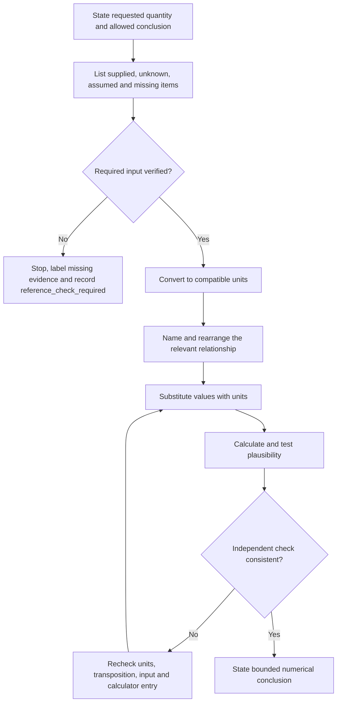
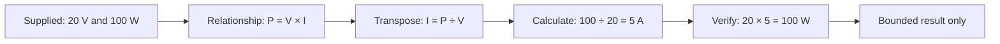

# Day 8 — Circuit Quantities, Load Reasoning and Prerequisite Calculation Check

> **Currency and scope notice:** This module develops calculation literacy using original, fictional learning examples. It does not provide installation-design values, cable-selection rules, protective-device settings or a field procedure. Exact clauses, limits, nominal supply conditions, diversity methods, assessment rules and safety-critical requirements remain `reference_check_required`. Current authorised standards, legislation, regulator guidance, workplace procedures, manufacturer instructions and RTO requirements remain controlling. This module is not `technically-reviewed`.

## 1. Outcome and entry check

### Learning objectives

By the end of this block, the learner should be able to:

1. distinguish voltage, current, resistance, power and energy by meaning, symbol and unit;
2. identify the known, unknown and assumed quantities in a written circuit problem;
3. select a relevant relationship from the supplied information rather than from keyword recognition;
4. convert prefixes and units before substitution and retain units through each calculation line;
5. calculate one unknown quantity from a complete set of fictional supplied values;
6. explain the difference between connected load, operating load and an authorised design-demand method without inventing a diversity allowance;
7. check a result using estimation, unit sense, inverse calculation or an independent relationship;
8. state a bounded conclusion that separates arithmetic correctness from design compliance;
9. achieve at least 10 out of 12 rubric points with no invented requirement, hidden unit conversion or unsafe practical action.

### Entry check

Complete without notes:

1. Write the unit normally used for voltage, current, resistance, power and energy.
2. Explain the difference between a quantity and a unit.
3. Convert 2.5 kW to watts and 750 mA to amperes.
4. In the statement “a fictional load is supplied at 20 V and consumes 100 W,” identify the known and unknown quantities if current is requested.
5. Explain why a calculator display without a unit is incomplete.
6. Name two ways to check whether a numerical result is plausible.
7. State what must happen when a required technical value is not supplied and cannot be verified.

Record confidence as **guessing**, **unsure**, **reasonably confident** or **certain**. A high-confidence unit, relationship or assumption error becomes a priority remediation item.

## 2. Why it matters

Many later Capstone tasks depend on calculation discipline, but arithmetic alone is not enough. A learner can enter numbers correctly and still produce an unsafe or meaningless answer by using inconsistent units, choosing the wrong relationship, treating an assumption as a fact or claiming that a calculated result proves compliance.

Reliable calculation reasoning therefore has two linked parts:

- **quantity reasoning:** what each value represents and how the quantities relate;
- **evidence reasoning:** where each value came from, whether it applies and what conclusion it can support.

This module deliberately slows the process down. It uses small fictional examples so the learner can practise problem setup, units, substitution, checking and bounded conclusions before later modules introduce design and protection decisions.


## 3. Core concepts and terminology

### Quantity, symbol and unit

A **quantity** is a measurable property. A **symbol** is the letter used to represent that quantity in a relationship. A **unit** is the agreed scale used to express its magnitude.

| Quantity | Common symbol | Unit | Meaning in this module |
|---|---:|---|---|
| Voltage | V | volt (V) | electrical potential difference between two stated points |
| Current | I | ampere (A) | rate of electric charge flow through a stated path |
| Resistance | R | ohm (Ω) | opposition represented in a stated circuit model |
| Power | P | watt (W) | rate at which electrical energy is transferred or converted |
| Energy | E | watt-hour (Wh) or joule (J) | quantity of energy transferred over time |

The same letter may appear in different contexts, so always define the quantity and unit beside the value rather than relying on memory alone.

### Prefixes and scale

A **prefix** changes the scale of a unit. In this module:

- kilo means one thousand times the base unit;
- milli means one thousandth of the base unit.

Convert quantities to compatible units before substitution. Do not move a decimal point without writing the conversion factor or explaining the scale change.

### Supplied, derived and assumed values

- A **supplied value** is explicitly given by the scenario or an authorised source.
- A **derived value** is calculated from supplied values using a stated relationship.
- An **assumed value** is introduced without direct evidence.

An assumption may be useful in a labelled teaching example, but it must never be hidden or presented as an installation fact.

### Electrical relationships

For a simple stated model, the following relationships may be supplied:

- `V = I × R`
- `P = V × I`
- `E = P × t`

Rearrangement changes which quantity is isolated; it does not change the evidence quality of the inputs. These relationships alone do not establish cable suitability, maximum demand, protective-device performance or compliance.

### Load terms

- **Connected load:** the total rating or stated demand of equipment connected in the fictional scenario before considering operating pattern or an authorised demand method.
- **Operating load:** the load actually described as operating under the stated scenario conditions.
- **Design demand:** the value used for design after applying the applicable authorised method and verified conditions.
- **Diversity:** recognition that not every connected load necessarily operates at full rating at the same time. The applicable method and allowances must come from current authorised sources; they must not be guessed.

### Plausibility check

A **plausibility check** asks whether the result fits the scale, units, direction and scenario. It does not replace an independent verification or an authorised design method.

## 4. Rule-finding workflow

Use **Q-U-A-N-T-I-T-Y** before accepting a calculation:

1. **Q — Question:** state exactly what quantity is requested and what conclusion is permitted.
2. **U — Unpack:** list supplied facts, unknowns, assumptions and missing technical requirements.
3. **A — Align units:** convert prefixes and place all values in compatible units.
4. **N — Name the relationship:** write the relationship and explain why it matches the stated quantities.
5. **T — Transpose:** isolate the unknown symbol before inserting numbers.
6. **I — Insert:** substitute values with units on a separate line.
7. **T — Test:** check arithmetic, unit sense, scale and an inverse or alternative calculation where possible.
8. **Y — Yield a bounded conclusion:** state the numerical result, source status and what the result does not prove.



The stop branch is a valid result. It prevents an incomplete scenario from being repaired with an invented technical value.

### Calculation record

Use this template:

```text
Question:
Permitted conclusion:
Supplied quantities and source:
Unknown quantity:
Assumptions:
Missing requirements:
Unit conversions:
Relationship:
Rearranged form:
Substitution with units:
Result with unit:
Plausibility or inverse check:
Bounded conclusion:
Reference checks still required:
```

## 5. Visual model or worked example

### Worked example — fictional low-voltage learning model

Scenario: a fictional learning load is stated to operate at `20 V` and transfer power at `100 W`. Determine the current for this stated model. These values are selected only for arithmetic practice and are not installation-design data.

Apply Q-U-A-N-T-I-T-Y:

1. **Question:** determine current, `I`.
2. **Unpack:** supplied `V = 20 V`, `P = 100 W`; no installation conclusion is requested.
3. **Align units:** volts and watts are already in compatible base units.
4. **Name:** use `P = V × I` because power and voltage are supplied and current is unknown.
5. **Transpose:** `I = P ÷ V`.
6. **Insert:** `I = 100 W ÷ 20 V`.
7. **Calculate:** `I = 5 A`.
8. **Test:** inverse check: `20 V × 5 A = 100 W`.
9. **Yield:** the current in the stated fictional model is `5 A`; this does not establish conductor selection, protection, supply suitability or compliance.



The visual sequence keeps evidence, relationship selection, arithmetic and conclusion separate. Skipping directly from the scenario to a calculator entry hides the reasoning that must be assessed.

### Load-reasoning example

A fictional worksheet lists three equipment ratings but states that only two items operate in the described condition. The sum of all three ratings is the **connected load** for the worksheet. The sum of the two stated operating items is the **operating load** for that condition. Neither value automatically becomes the **design demand**. An authorised demand method, verified conditions and the controlling source are still required.

## 6. Practical application

### Round 1 — quantity and unit sort

Create cards for voltage, current, resistance, power and energy. For each card, add:

- symbol;
- unit;
- plain-language meaning;
- one commonly confused quantity;
- one question that would reveal the confusion.

Then sort ten trainer-supplied values into supplied, derived, assumed or missing. Explain every classification.

### Round 2 — completed worked examples

Complete three fictional calculations using values provided by the trainer:

1. current from supplied power and voltage;
2. resistance from supplied voltage and current;
3. energy from supplied power and time.

For each, show the full calculation record and one independent check. Values must be chosen for learning clarity and must not be represented as installation requirements.

### Round 3 — worked-example fading

Repeat with supports removed in stages:

1. relationship and transposition supplied;
2. relationship supplied but transposition omitted;
3. only quantities and requested outcome supplied;
4. changed units requiring a prefix conversion;
5. one unnecessary value included to test selection discipline.

Do not proceed to the next stage until the learner can explain why each retained value is relevant.

### Round 4 — load reasoning

Use a fictional equipment schedule containing:

- four connected items;
- two stated operating conditions;
- one missing rating;
- one value shown in kilowatts while the others are in watts;
- no authorised diversity or maximum-demand method.

Produce:

1. connected-load subtotal using only verified ratings;
2. operating-load subtotal for each stated condition;
3. a list of missing or assumed information;
4. a statement explaining why design demand cannot yet be claimed;
5. the authorised source or trainer evidence needed next.

### Performance rubric

Score each category from **0 to 2**:

| Category | 0 | 1 | 2 |
|---|---|---|---|
| Quantity meaning | quantities confused | definitions partly usable | meanings, symbols and units distinguished |
| Evidence setup | assumptions hidden | most inputs classified | supplied, derived, assumed and missing items explicit |
| Units | conversion absent or unsafe | minor notation error | compatible units shown before substitution |
| Relationship and process | guessed or unexplained | correct with prompts | selected, rearranged and substituted independently |
| Verification | calculator result accepted | one weak sense check | arithmetic and independent check recorded |
| Conclusion boundary | compliance or design overclaimed | limitation partly stated | numerical result and unresolved requirements separated |

Progression target: at least **10 out of 12**, with no zero for evidence setup, units or conclusion boundary. A lower result creates a focused support item; it is not a claim of formal assessment failure.

## 7. Common errors and safety checkpoint

### Common errors

- **Unitless answer:** recording a number without the quantity or unit.
- **Prefix drift:** treating kilo or milli as decoration rather than a scale change.
- **Formula matching:** selecting a relationship because familiar words appear, without checking supplied quantities.
- **Premature substitution:** inserting numbers before isolating the unknown.
- **Hidden assumption:** supplying a missing value from memory or habit.
- **Connected-load substitution:** treating the sum of ratings as design demand without an authorised method.
- **Calculator authority:** assuming a precise display proves correct setup.
- **Single-path checking:** repeating the same calculator entry instead of using an inverse or independent check.
- **False compliance claim:** treating an arithmetic result as proof of conductor, device or installation suitability.
- **Practical drift:** attempting measurements or equipment access to fill gaps in a written exercise.

### Safety checkpoint

All activities are written, diagrammatic or trainer-supplied arithmetic exercises. This module authorises no switching, isolation, opening equipment, testing, measurement, resetting, disconnection, alteration, repair, energisation, commissioning, verification or practical demonstration.

Stop and seek trainer or qualified guidance when:

- a technical input is missing, assumed or from an unverified source;
- the task requires an exact clause, limit, design method, device characteristic or official assessment rule;
- units cannot be reconciled confidently;
- a result would be used to select equipment or justify practical work;
- the learner proposes measurement or access outside stated authority and procedure;
- repeated errors suggest a blocking numeracy or unit-handling prerequisite;
- fatigue or frustration makes the calculation record unreliable.

Record `reference_check_required` rather than inserting an approximate value.

## 8. Retrieval and next links

### Closed-note retrieval

1. Define voltage, current, resistance, power and energy.
2. State the symbol and unit for each.
3. Recite Q-U-A-N-T-I-T-Y and explain each step.
4. Distinguish supplied, derived, assumed and missing values.
5. Why should units be aligned before substitution?
6. Why should the unknown be isolated before numbers are inserted?
7. Name four plausibility or verification checks.
8. Distinguish connected load, operating load and design demand.
9. Why must diversity not be invented?
10. State five stop or escalation conditions.

### Exit task

Complete one independent fictional quantity problem and one incomplete load scenario. Retain:

- the calculation record;
- unit conversions;
- relationship-selection explanation;
- inverse or independent check;
- confidence rating;
- bounded conclusion;
- missing evidence list;
- unresolved `reference_check_required` items.

### Navigation

- **Plan:** [Twelve-Week Capstone Learning Plan](../MASTER_PLAN.md)
- **Knowledge note:** [[12-Week Day 08 - Circuit Quantities Load Reasoning and Prerequisite Calculation Check]]
- **Previous:** [Day 7 — Week 1 Consolidation and Individual Remediation Plan](day-07-week-1-consolidation-and-individual-remediation-plan.md)
- **Next:** Day 9 — Overload, Short-Circuit and Fault-Current Distinctions

### Reference and currency notice

This module uses original explanations, fictional values, workflows, diagrams, scenarios and assessment tools organised around learner reasoning rather than a standards clause sequence. It does not reproduce standards tables, figures, systematic wording, official design data or assessment material. Current authorised sources and qualified review remain required before any safety-critical calculation, design conclusion or practical procedure is used beyond this written learning context.
