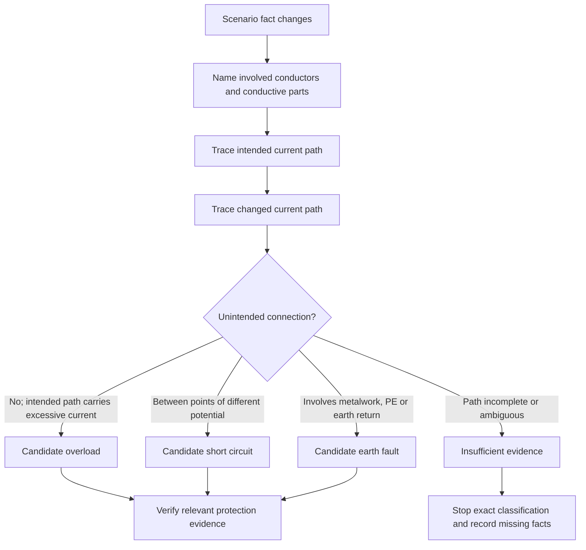
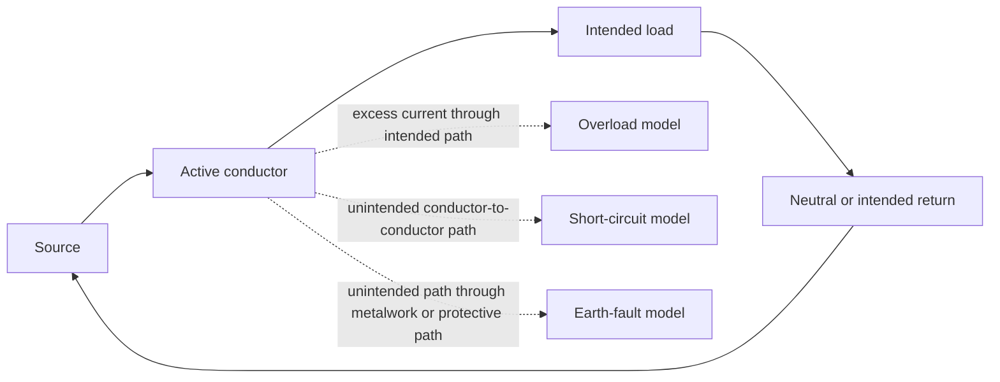

# Day 9 — Overload, Short-Circuit and Fault-Current Distinctions

> **Currency and scope notice:** This module teaches original conceptual classification and evidence discipline. It does not provide device ratings, prospective fault-current values, disconnection times, conductor withstand calculations, test methods or a field procedure. Exact definitions, clauses, limits, device characteristics and jurisdiction-specific requirements remain `reference_check_required`. Current authorised standards, legislation, regulator guidance, network rules, manufacturer instructions, workplace procedures and RTO requirements remain controlling. This module is not `technically-reviewed`.

## 1. Outcome and entry check

### Learning objectives

By the end of this block, the learner should be able to:

1. define normal load current, overload current, short-circuit current, earth-fault current and the broader term fault current;
2. classify an original written scenario by current path and initiating condition rather than by current magnitude alone;
3. distinguish an overcurrent condition from a residual-current condition and explain why the categories may overlap;
4. identify the evidence needed before claiming a protective-device response;
5. trace a conceptual current path without treating protective earth as a normal load conductor;
6. separate a described event, an inferred event and a verified event;
7. revise a classification when one scenario fact changes;
8. state a bounded conclusion without inventing a value, trip time or device performance claim;
9. achieve at least 10 out of 12 rubric points with no unsafe practical action or unsupported protective outcome.

### Entry check

Complete without notes:

1. Define current and name its unit.
2. Explain the difference between connected load and operating load.
3. What makes a supplied value different from an assumed value?
4. Draw a simple normal active–load–neutral path.
5. State why a large current does not by itself identify the fault type.
6. Name two items of evidence required before claiming a protective device operates.
7. State what to do when a scenario omits the return path or device data.

Record confidence as **guessing**, **unsure**, **reasonably confident** or **certain**. A high-confidence category error becomes a priority remediation item.

## 2. Why it matters

Protection questions are often answered badly because the learner jumps from one clue—such as “high current,” “metal case” or “breaker”—to a device conclusion. The safe reasoning order is different: identify what changed, trace the current path, classify the event, establish the relevant protection purpose, then verify operating conditions.

Confusing overload, short circuit and earth fault can lead to the wrong source lookup, the wrong calculation and an unsupported claim about disconnection. This module deliberately slows classification before Day 10 examines protective-device roles.


## 3. Core concepts and terminology

### Normal load current

**Normal load current** is current flowing through the intended active–load–return path under the stated operating condition. “Normal” describes the intended path and condition; it does not prove that the installation is compliant or that the current is within every applicable limit.

### Overcurrent

**Overcurrent** is current exceeding the relevant intended or rated current for the stated part of the installation. It is an umbrella concept that can include overload current and short-circuit current. The controlling definition and application must be checked in authorised sources.

### Overload current

**Overload current** is overcurrent in an electrically sound intended path, commonly associated with excessive connected or operating load, abnormal operating duration, stalled equipment or another condition that causes current above the relevant design basis without an unintended low-impedance connection between conductors.

The phrase “electrically sound path” does not mean the operating condition is acceptable. It distinguishes the path from a conductor-to-conductor fault path.

### Short-circuit current

**Short-circuit current** is current flowing through an unintended conductive connection between points that should be at different potentials. The path may bypass all or part of the intended load and may have comparatively low impedance. Exact classification depends on the conductors and arrangement described.

### Earth fault and earth-fault current

An **earth fault** is an unintended conductive connection involving an active part and exposed conductive metalwork, protective earthing, earth or another relevant conductive path, as applicable to the scenario. **Earth-fault current** is current flowing because of that fault path.

Do not describe current as “disappearing into the ground.” A current loop must be completed back to its source. The actual return route depends on the supply and earthing arrangement and remains an evidence question.

### Fault current

**Fault current** is a broader term for current resulting from an electrical fault. Depending on context, short-circuit current and earth-fault current may both be fault currents. The term should not be used as though it identifies one unique path.

### Residual current

**Residual current** is the imbalance represented by the vector or algebraic relationship of currents in the conductors monitored by a residual-current device. It is not simply another name for earth-fault current, although an earth-leakage or earth-fault path may create residual current in a stated arrangement.

### Magnitude, path and duration

- **Magnitude** is how much current flows.
- **Path** is the route through which it flows.
- **Duration** is how long the condition persists.

These are separate questions. Classification begins with initiating condition and path; protection consequences also depend on magnitude, duration, conductor capability and device characteristics.

### Described, inferred and verified events

- A **described event** is explicitly stated in the scenario.
- An **inferred event** is a reasoned interpretation that depends on one or more assumptions.
- A **verified event** is supported by adequate inspection, test or authorised evidence within the applicable procedure and authority.

A written learning scenario normally supports described or inferred classification only. It does not authorise practical verification.

## 4. Rule-finding workflow

Use **P-A-T-H-S** before naming a protection outcome:

1. **P — Pin down the change:** identify the load change, unintended connection or insulation/path failure explicitly described.
2. **A — Account for conductors:** name every conductor or conductive part stated in the current path.
3. **T — Trace the loop:** draw the intended path and the changed path back to the source without skipping the return route.
4. **H — Hold competing classifications:** compare overload, conductor-to-conductor short circuit, earth fault, residual-current condition and insufficient evidence.
5. **S — State evidence and limits:** classify only to the level supported, list missing evidence and avoid claiming device operation until authorised operating conditions are verified.



The branches are candidates, not automatic final conclusions. A scenario may support more than one technically relevant description, and exact terminology must be checked against current authorised sources.

### Classification record

```text
Scenario change:
Intended path:
Changed path:
Conductors or conductive parts involved:
Described facts:
Inferences:
Missing evidence:
Candidate classification:
Competing classification considered:
Relevant protection question:
Protective-device evidence still required:
Bounded conclusion:
Stop or escalation condition:
```

## 5. Visual model or worked example

### Conceptual comparison



The model compares path descriptions only. It does not show physical layout, impedance, current magnitude, supply arrangement or device performance.

### Worked reasoning example

Scenario: a fictional appliance operates normally, then its rotating part becomes mechanically jammed. The scenario states that the intended active–load–neutral path remains intact and that current rises above the fictional operating value. It provides no device curve, conductor data or test result.

Apply P-A-T-H-S:

1. **Pin down:** the stated change is mechanical jamming and increased current.
2. **Account:** the stated path remains active through the load and neutral return.
3. **Trace:** no unintended conductor-to-conductor or metalwork path is described.
4. **Hold alternatives:** overload is the supported candidate; short circuit and earth fault are not supported by the given facts.
5. **State limits:** the scenario supports a conceptual overload classification only. It does not prove device operation, acceptable duration or conductor protection.

Bounded conclusion:

> The described condition is consistent with overload current in the intended load path. Protective-device response, operating time and conductor suitability remain unverified and `reference_check_required`.

### Changed-condition transfer

Change one fact: the scenario now states that damaged insulation creates direct contact between active and neutral conductors ahead of the load. The candidate classification changes to a conductor-to-conductor short circuit because the current path is now unintended and bypasses the load. No magnitude or trip claim may be added without evidence.

## 6. Practical application

### Round 1 — path-card sort

Sort trainer-written cards into:

- normal intended path;
- excessive current in intended path;
- unintended conductor-to-conductor path;
- unintended path involving exposed metalwork or protective return;
- residual-current clue;
- insufficient evidence.

For every card, underline the fact that drives the classification and circle any assumption.

### Round 2 — complete scenario comparison

Analyse four original fictional scenarios:

1. increasing connected load with the intended path intact;
2. active-to-neutral insulation failure;
3. active-to-metal-enclosure contact with a described protective conductor;
4. an imbalance indication with no fault path supplied.

Complete one classification record for each. At least one scenario must end as **insufficient evidence**.

### Round 3 — worked-example fading

Repeat with supports removed:

1. candidate categories supplied;
2. only the conductor/path facts supplied;
3. one irrelevant current value added;
4. one essential return-path fact removed;
5. one fact changed after the first conclusion.

The learner must revise the conclusion when the evidence changes rather than defend the first answer.

### Round 4 — protection-question handoff

For each classified scenario, write the next question Day 10 must answer, such as:

- what protection purpose is relevant;
- which conductor or risk is being protected;
- what device evidence is required;
- whether another protective measure has a separate role;
- what exact authorised source must be checked.

Do not select a device rating or predict operation.

### Performance rubric

Score each category from **0 to 2**:

| Category | 0 | 1 | 2 |
|---|---|---|---|
| Terminology | categories treated as synonyms | most terms usable | all key terms distinguished precisely |
| Path tracing | return path omitted | path partly complete | intended and changed loops explicit |
| Evidence discipline | assumptions hidden | most facts separated | described, inferred and missing evidence clear |
| Classification | magnitude-only guess | plausible with prompts | initiating condition and path justify outcome |
| Revision | changed fact ignored | conclusion revised with help | classification independently updated |
| Boundary | device operation overclaimed | limitation partly stated | bounded conclusion and next evidence explicit |

Progression target: at least **10 out of 12**, with no zero for path tracing, evidence discipline or boundary. This is an educational readiness threshold, not an official assessment rule.

## 7. Common errors and safety checkpoint

### Common errors

- **Magnitude-only classification:** assuming every high current is a short circuit.
- **Device-first reasoning:** naming a breaker or RCD before classifying the path and protection purpose.
- **Earth-as-sink model:** describing fault current as vanishing into soil rather than completing a loop.
- **Protective-earth normalisation:** drawing protective earth as part of the normal load-current path.
- **Residual-current synonym:** treating residual current and earth-fault current as identical in every arrangement.
- **Single-label certainty:** forcing an exact category when the scenario lacks conductor or return-path facts.
- **Trip assumption:** claiming operation merely because a fault category is named.
- **Hidden values:** inventing fault current, impedance, rating or operating time.
- **Practical drift:** proposing live access or testing to complete a written exercise.

### Safety checkpoint

All activities are written, diagrammatic or trainer-provided classification exercises. This module authorises no switching, isolation, opening equipment, testing, measurement, fault creation, resetting, disconnection, alteration, repair, energisation, commissioning or verification.

Stop and seek trainer or qualified guidance when:

- the current path or source return is incomplete;
- an exact definition, clause, value, test method or device characteristic is required;
- the scenario would be used to justify practical work;
- the learner proposes creating or reproducing a fault;
- a protection outcome depends on unverified device or conductor data;
- authority, supervision or procedure is unclear;
- fatigue or repeated category errors make the record unreliable.

Use `reference_check_required` rather than guessing.

## 8. Retrieval and next links

### Closed-note retrieval

1. Define normal load current, overcurrent, overload current, short-circuit current, earth-fault current, fault current and residual current.
2. Recite P-A-T-H-S and explain each step.
3. Why is magnitude alone insufficient for classification?
4. Draw a normal intended current loop.
5. Explain why protective earth is not a normal load conductor.
6. Distinguish described, inferred and verified events.
7. Give one scenario that supports overload and one that supports short circuit.
8. What evidence is missing before claiming protective-device operation?
9. State five common classification errors.
10. State five stop or escalation conditions.

### Exit task

Complete one unseen fictional scenario containing:

- an intended path;
- one changed condition;
- one irrelevant numerical value;
- one missing device fact;
- one later fact change.

Retain the original classification, revised classification, evidence list, confidence ratings and bounded conclusions.

### Navigation

- **Plan:** [Twelve-Week Capstone Learning Plan](../MASTER_PLAN.md)
- **Knowledge note:** [[12-Week Day 09 - Overload Short-Circuit and Fault-Current Distinctions]]
- **Previous:** [Day 8 — Circuit Quantities, Load Reasoning and Prerequisite Calculation Check](day-08-circuit-quantities-load-reasoning-and-prerequisite-calculation-check.md)
- **Next:** Day 10 — Protective-Device Roles and Protection Boundaries

### Reference and currency notice

This module uses original explanations, workflows, diagrams, scenarios and assessment tools organised around learner classification rather than a standards clause sequence. It does not reproduce standards tables, figures, device curves, systematic wording, official values or assessment material. Current authorised sources and qualified review remain required before any safety-critical protection conclusion or practical procedure is used beyond this written learning context.
