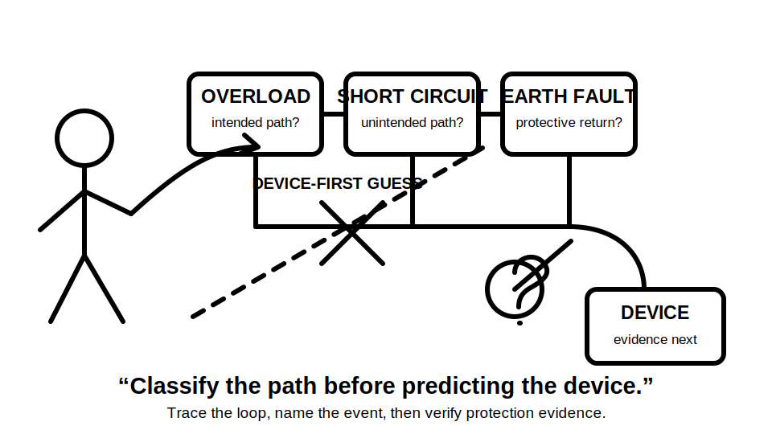
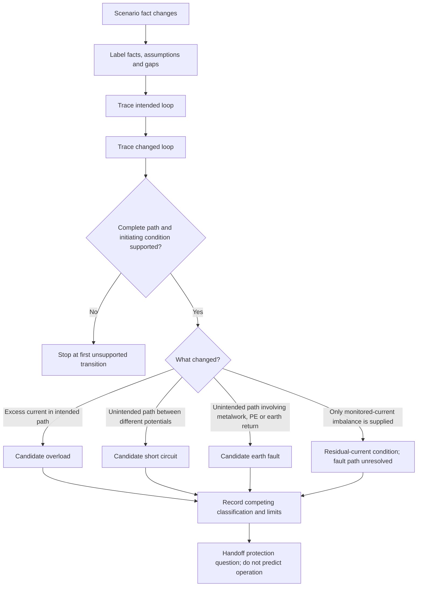
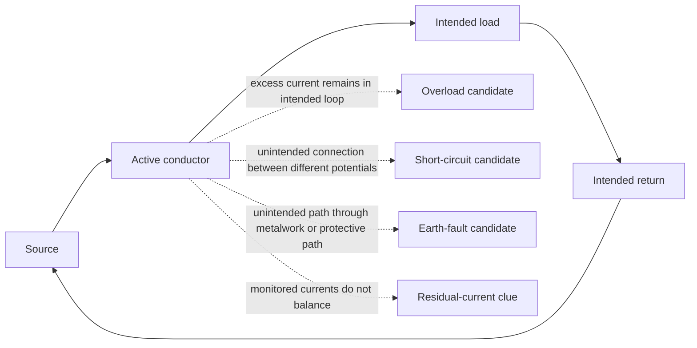

# Day 9 — Overload, Short-Circuit and Fault-Current Distinctions

> **Currency and scope notice:** This module teaches original conceptual classification and evidence discipline. It does not provide device ratings, prospective fault-current values, disconnection times, conductor withstand calculations, test methods or a field procedure. Exact definitions, clauses, limits, device characteristics and jurisdiction-specific requirements remain `reference_check_required`. Current authorised standards, legislation, regulator guidance, network rules, manufacturer instructions, workplace procedures and RTO requirements remain controlling. This module is not `technically-reviewed`.

## 1. Outcome and entry check

### Learning objectives

By the end of this block, the learner should be able to:

1. define normal load current, overcurrent, overload current, short-circuit current, earth-fault current, fault current and residual current in bounded conceptual terms;
2. classify an original written scenario from its initiating condition and current path rather than from magnitude or device labels alone;
3. distinguish a stated fact, inference, assumption, contradiction and evidence gap;
4. trace intended and changed current loops without treating protective earth as a normal load conductor or earth as a current sink;
5. maintain competing classifications until the supplied evidence distinguishes them;
6. identify the first unsupported transition in a classification chain and stop there;
7. explain why event classification does not itself prove protective-device operation;
8. revise a classification when at least two material scenario conditions change; and
9. produce a bounded handoff to Day 10 that names the protection question, unresolved evidence and responsible evidence owner.

### Entry check

Complete without notes:

1. Define current and name its unit.
2. Distinguish connected load, operating load and design demand.
3. Explain the difference between a supplied value, derived value, assumption and missing input.
4. Draw a simple intended active–load–return loop.
5. Explain why a large current does not identify the event type by itself.
6. Name two items of evidence needed before predicting protective-device operation.
7. State the correct response when the return path, source arrangement or device data is absent.

For each answer, record confidence as **guessing**, **unsure**, **reasonably confident** or **certain**. A correct guess is not secure evidence. A high-confidence unsupported or unsafe answer is a priority remediation item.

## 2. Why it matters

Protection reasoning fails when a learner jumps from one cue—such as “high current,” “metal case,” “breaker” or “RCD”—to a device conclusion. A defensible sequence is:

1. identify what changed;
2. separate facts from assumptions;
3. trace the intended and changed current loops;
4. compare plausible event classifications;
5. locate the first unsupported transition; and
6. hand the bounded event classification to the protection-selection process.

Confusing overload, short circuit, earth fault and residual-current conditions can lead to the wrong source lookup, wrong calculation model and unsupported disconnection claim. Day 9 therefore slows classification before Day 10 examines protective-device roles.



*Caption: classify the initiating condition and complete current path before considering a device response.*

## 3. Core concepts and terminology

### Normal load current

**Normal load current** is current flowing through the intended source–load–return path under the stated operating condition. “Normal” describes the intended path and condition; it does not prove compliance, acceptable magnitude or correct protection.

### Overcurrent

**Overcurrent** is current exceeding the relevant intended or rated current for the part being considered. It is an umbrella concept that may include overload current and short-circuit current. The controlling definition and application require an authorised source.

### Overload current

**Overload current** is overcurrent in an intended, electrically sound path. It may arise from excessive load, abnormal duration, stalled equipment or another stated operating condition without an unintended conductor-to-conductor path.

“Electrically sound path” distinguishes the path from a fault connection; it does not mean the operating condition is acceptable.

### Short-circuit current

**Short-circuit current** is current through an unintended conductive connection between points that should be at different potentials. The path may bypass all or part of the intended load. Exact terminology depends on the conductors and arrangement described.

### Earth fault and earth-fault current

An **earth fault** is an unintended conductive connection involving an active part and exposed conductive metalwork, protective earthing, earth or another relevant conductive path, as applicable to the scenario. **Earth-fault current** is current caused by that fault path.

Current does not “disappear into the ground.” A loop must return to the source. The actual return route depends on the stated supply and earthing arrangement and remains an evidence question.

### Fault current

**Fault current** is a broader term for current resulting from an electrical fault. Short-circuit current and earth-fault current may both be fault currents. The term does not identify one unique path.

### Residual current

**Residual current** is the imbalance represented by the vector or algebraic relationship of currents in conductors monitored by a residual-current device. It is not automatically synonymous with earth-fault current, although a stated earth-leakage or earth-fault path may create residual current in a particular arrangement.

### Classification dimensions

- **Initiating condition:** the stated change that begins the event.
- **Path:** the complete route through which current flows back to the source.
- **Magnitude:** how much current flows.
- **Duration:** how long the condition persists.
- **Location:** where the changed path occurs relative to loads, conductors and protective devices.
- **Evidence state:** whether a proposition is supplied, inferred, assumed, contradicted or missing.

Magnitude and duration may affect consequences, but they do not replace path and initiating-condition classification.

### Evidence labels

- **Stated fact:** explicitly supplied by the scenario.
- **Inference:** a conclusion supported by stated facts but still dependent on reasoning.
- **Assumption:** an unstated proposition temporarily introduced to continue reasoning.
- **Contradiction:** evidence that cannot be reconciled with another material proposition without further investigation.
- **Evidence gap:** information required before the next reasoning step can be supported.
- **First unsupported transition:** the earliest step where the conclusion depends on an unresolved assumption, contradiction, missing path or unverified relationship.

A written scenario usually supports stated or inferred classification only. It does not authorise practical verification.

## 4. Rule-finding workflow

Use **P-A-T-H-S** before naming a protection outcome:

1. **P — Pin down the change:** identify the load change, unintended connection, insulation failure or other initiating condition explicitly described.
2. **A — Account for conductors:** name every conductor and conductive part stated in the intended and changed paths.
3. **T — Trace both loops:** draw the intended loop and the changed loop back to the source; mark any missing segment.
4. **H — Hold alternatives:** compare overload, conductor-to-conductor short circuit, earth fault, residual-current condition, overlapping description and insufficient evidence.
5. **S — State support and stop point:** label facts, inferences, assumptions and gaps; stop at the first unsupported transition; state only the bounded classification supported.



The branches produce candidate classifications, not automatic final conclusions. More than one descriptor may be relevant, while exact terminology and protective consequences require current authorised sources.

### Classification record

```text
Scenario change:
Stated facts:
Contradictions:
Intended loop:
Changed loop:
Missing loop segments:
Conductors or conductive parts involved:
Candidate classification:
Competing classification retained:
Inference or assumption used:
First unsupported transition:
Relevant protection question:
Evidence still required:
Evidence owner or authorised source:
Bounded conclusion:
Stop or escalation condition:
Confidence before review:
Confidence after review:
```

## 5. Visual model or worked example

### Conceptual comparison



This model compares conceptual path evidence only. It does not depict physical layout, impedance, magnitude, duration, supply arrangement or device performance.

### Worked reasoning example

A fictional appliance operates normally, then its rotating part becomes mechanically jammed. The scenario states that the intended active–load–return path remains intact and current rises above the fictional operating value. It supplies no device curve, conductor data, source arrangement or test result.

Apply P-A-T-H-S:

1. **Pin down:** mechanical jamming and increased current are stated.
2. **Account:** active, load and intended return are supplied; no unintended conductive part is described.
3. **Trace:** the complete stated loop remains through the load.
4. **Hold alternatives:** overload is supported; short circuit and earth fault are not supported by the supplied facts.
5. **State support and stop point:** the classification can reach “conceptual overload candidate.” It must stop before predicting device response, acceptable duration or conductor protection.

> The described condition is consistent with overload current in the intended load path. Protective-device response, operating time and conductor suitability remain unverified and `reference_check_required`.

### Changed-context transfer

Change two material facts:

- damaged insulation creates a direct active-to-neutral connection ahead of the load; and
- the previously quoted high current value is removed.

The candidate classification changes to conductor-to-conductor short circuit because the initiating condition and changed path support it. Removing the magnitude does not prevent conceptual classification. A trip claim remains unsupported because device, source and conductor evidence is still absent.

Then replace the second fact: instead of active-to-neutral contact, the scenario states only that a monitored-current imbalance exists. The learner must not invent an earth-fault path. The supported conclusion is a residual-current condition with the physical path unresolved.

## 6. Practical application

### Round 1 — path-card sort

Sort trainer-written cards into:

- normal intended path;
- excessive current in intended path;
- unintended conductor-to-conductor path;
- unintended path involving exposed metalwork or protective return;
- residual-current clue with unresolved physical path;
- contradictory evidence; or
- insufficient evidence.

For every card, underline the classification-driving fact, circle each assumption and mark the first unsupported transition.

### Round 2 — scenario comparison

Analyse four original fictional scenarios:

1. increasing load with the intended loop intact;
2. active-to-neutral insulation failure;
3. active-to-metal-enclosure contact with a described protective conductor;
4. an imbalance indication with no physical fault path supplied.

Complete one classification record for each. At least one must finish as **insufficient evidence**, and the imbalance-only scenario must not be relabelled automatically as an earth fault.

### Round 3 — worked-example fading

Repeat with supports progressively removed:

1. candidate categories supplied;
2. only conductor and path facts supplied;
3. one irrelevant numerical value added;
4. one essential return-path fact removed;
5. one contradiction introduced; and
6. two material facts changed after the first conclusion.

The learner must revise the conclusion when evidence changes rather than defend the first answer.

### Round 4 — protection-question handoff

For each classified scenario, write:

- the protection purpose that may be relevant;
- the conductor, equipment or risk under consideration;
- the device and source evidence required;
- any separate protective measure that may need analysis;
- the current authorised source or evidence owner; and
- the exact point where the Day 9 conclusion stops.

Do not select a device rating or predict operation.

### Criterion-level performance evidence

Record each criterion as **secure**, **developing**, **unsupported** or **`stop-required`**.

| Criterion | Secure evidence | Developing evidence | Unsupported evidence | `stop-required` evidence |
|---|---|---|---|---|
| Terminology | key categories are distinguished and bounded | distinctions are mostly correct but need prompts | terms are treated as interchangeable | invented official definition or unsafe practical claim |
| Loop tracing | intended and changed loops return to the source | one loop is incomplete but gap is identified | return path is omitted or earth is treated as a sink | proposes practical fault creation or unauthorised testing |
| Evidence control | facts, inferences, assumptions, contradictions and gaps are labelled | most evidence states are separated | assumptions are hidden | contradiction or missing path is ignored to justify action |
| Classification | initiating condition and path support the candidate | plausible classification needs prompts | magnitude or device label drives the answer | protective outcome is asserted without required evidence |
| Revision | conclusion changes when two material facts change | revision occurs with prompting | first answer is defended despite changed evidence | unsafe conclusion remains after contradictory evidence |
| Boundary and handoff | first unsupported transition, evidence owner and Day 10 question are explicit | limitation is present but incomplete | exact device response is guessed | practical action is proposed outside authority or procedure |

There is no aggregate pass score. Any `stop-required` result blocks progression until corrected and demonstrated in a changed context. An **unsupported** result in loop tracing, evidence control, classification or boundary also requires targeted remediation before Day 10. These are educational planning states, not official competency grades.

## 7. Common errors and safety checkpoint

### Common errors

- **Magnitude-only classification:** assuming every high current is a short circuit.
- **Device-first reasoning:** naming a breaker or RCD before classifying the event and protection purpose.
- **Earth-as-sink model:** describing current as vanishing into soil rather than completing a source loop.
- **Protective-earth normalisation:** drawing protective earth as part of the normal load-current path.
- **Residual-current synonym:** treating residual current and earth-fault current as identical in every arrangement.
- **Single-label certainty:** forcing an exact category when conductors, return path or initiating condition are missing.
- **Trip assumption:** claiming operation merely because a fault category is named.
- **Hidden values:** inventing fault current, impedance, rating or operating time.
- **Contradiction suppression:** ignoring evidence that conflicts with the preferred classification.
- **Practical drift:** proposing access, fault creation or testing to complete a written exercise.

### Safety checkpoint

All activities are written, diagrammatic or trainer-provided classification exercises. This module authorises no access, switching, isolation, opening equipment, testing, measurement, fault creation, resetting, disconnection, alteration, repair, energisation, commissioning, certification or verification.

Stop and seek trainer or qualified guidance when:

- the intended or changed loop is incomplete;
- the initiating condition is ambiguous;
- material evidence contradicts the proposed classification;
- an exact definition, clause, value, method or device characteristic is required;
- the scenario would be used to justify practical work;
- a protection outcome depends on unverified device, source or conductor data;
- authority, supervision or procedure is unclear; or
- fatigue or repeated category errors make the record unreliable.

Use `reference_check_required` rather than guessing.

## 8. Retrieval and next links

### Closed-note retrieval

1. Define normal load current, overcurrent, overload current, short-circuit current, earth-fault current, fault current and residual current.
2. Recite P-A-T-H-S and explain each step.
3. Explain why magnitude alone is insufficient for classification.
4. Draw an intended current loop and identify its return to the source.
5. Explain why protective earth is not a normal load conductor.
6. Distinguish a fact, inference, assumption, contradiction and evidence gap.
7. Define the first unsupported transition.
8. Give one scenario supporting overload and one supporting short circuit without using magnitude as the deciding fact.
9. Explain why a residual-current clue does not automatically prove an earth-fault path.
10. State the evidence needed before claiming protective-device operation.

### Exit task

Complete one unseen fictional scenario containing:

- an intended loop;
- one initiating change;
- one irrelevant numerical value;
- one missing source or device fact;
- one contradiction; and
- two later material fact changes.

Retain the original classification, competing classification, first unsupported transition, revised classifications, evidence owners, confidence ratings and bounded conclusions.

### Navigation

- **Plan:** [Twelve-Week Capstone Learning Plan](../MASTER_PLAN.md)
- **Knowledge note:** [[12-Week Day 09 - Overload Short-Circuit and Fault-Current Distinctions]]
- **Previous:** [Day 8 — Circuit Quantities, Load Reasoning and Prerequisite Calculation Check](day-08-circuit-quantities-load-reasoning-and-prerequisite-calculation-check.md)
- **Next:** [Day 10 — Protective-Device Roles and Protection Boundaries](day-10-protective-device-roles-and-protection-boundaries.md)

### Reference and currency notice

This module uses original explanations, workflows, diagrams, scenarios and assessment tools organised around learner classification rather than a standards clause sequence. It does not reproduce standards tables, figures, device curves, systematic wording, official values or assessment material. Current authorised sources and qualified review remain required before any safety-critical protection conclusion or practical procedure is used beyond this written learning context.