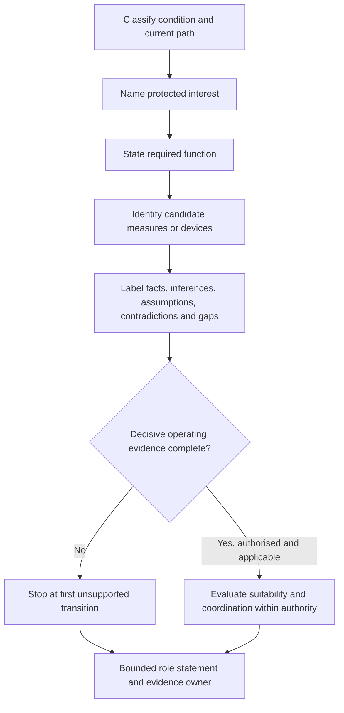
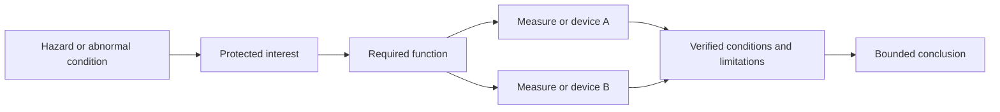

# Day 10 — Protective-Device Roles and Protection Boundaries

> **Currency and scope notice:** This module teaches original conceptual reasoning about protection purposes and evidence boundaries. It does not provide device ratings, current-time curves, breaking-capacity values, disconnection times, selectivity settings, installation instructions, test methods or a device-selection procedure. Exact definitions, clauses, coverage requirements, characteristics, coordination rules and jurisdiction-specific duties remain `reference_check_required`. Current authorised standards, legislation, regulator guidance, network rules, manufacturer instructions, workplace procedures and RTO requirements remain controlling. This module is not `technically-reviewed`.

## 1. Outcome and entry check

### Learning objectives

By the end of this block, the learner should be able to:

1. distinguish a **hazard**, **protected interest**, **protection function**, **protective measure**, **protective device** and **protection boundary**;
2. classify overload, short-circuit, fault and additional-protection roles without treating them as interchangeable;
3. state a required protection function before naming a candidate device;
4. separate a device’s detection input, intended contribution, protected interest and limitations;
5. label scenario information as **stated fact**, **inference**, **assumption**, **contradiction** or **evidence gap**;
6. identify the first unsupported transition between a role statement and a suitability, coordination or operating claim;
7. preserve competing protection interpretations until decisive evidence is available;
8. revise a protection-role record when at least two material scenario conditions change; and
9. produce a bounded record with no `stop-required` criterion, unsupported operating claim or unsafe practical action.

### Entry check

Complete without notes:

1. Define overload current, short-circuit current, earth-fault current and residual current.
2. Why must the current path be classified before predicting device operation?
3. Name two different protected interests in one circuit scenario.
4. What evidence is needed before claiming operation within a required time?
5. Why is “the breaker protects the circuit” too vague?
6. What is the difference between a role statement and an operating claim?
7. What should be recorded when the protection purpose is clear but device suitability is not verified?

Record confidence as **guessing**, **unsure**, **reasonably confident** or **certain**. A confident universal-device claim is a priority misconception even when the final device name happens to be plausible.

## 2. Why it matters

Protection reasoning fails when a learner starts with a familiar device and works backwards to invent a purpose. The same device family may contribute to different objectives under different conditions, and one safety objective may depend on several coordinated measures. Device recognition is therefore not evidence of correct selection or operation.

Use this reasoning order:

1. classify the abnormal condition and current path;
2. identify the protected interest;
3. state the required function independently of a device;
4. identify candidate measures and their limits;
5. verify applicability, characteristics, installation context and coordination;
6. stop at the first unsupported transition; and
7. state only the bounded conclusion supported by the evidence.

This prepares the learner for Day 11, where residual-current protection is examined as one part of a protection system rather than a universal substitute.


*Caption: Name the condition, protected interest and function before trusting a device label.*

## 3. Core concepts and terminology

### Hazard and protected interest

A **hazard** is a source or situation with potential to cause harm. A **protected interest** is the person, conductor, equipment, property, supply function or other outcome intended to be safeguarded. “Protect the circuit” is incomplete because it does not identify what is being protected or from which consequence.

### Protection function, measure and device

A **protection function** is the job that must be achieved. A **protective measure** is the wider arrangement used to reduce risk. A **protective device** is one component intended to perform one or more functions under defined conditions. A device name does not prove that the required function is achieved.

### Detection input and protected outcome

A **detection input** is the condition a device responds to, such as a current magnitude or imbalance within its verified design. A **protected outcome** is the harm-reduction objective. These are not identical: detecting a condition does not by itself prove that every relevant person, conductor, item of equipment or property outcome is adequately protected.

### Overload, short-circuit, fault and additional protection

- **Overload protection** concerns excessive current in an intended path over time and the resulting thermal effects.
- **Short-circuit protection** concerns an unintended conductive connection and resulting thermal, mechanical or other effects.
- **Fault protection** concerns protection under a stated fault condition, commonly including shock-risk reduction when accessible conductive parts may become energised.
- **Additional protection** supplements other measures and does not replace basic protection, fault protection, overcurrent protection or safe-work controls.

Exact terminology and required performance remain subject to authorised-source verification.

### Role statement, operating claim and coordination claim

A **role statement** describes what a device or measure may contribute. An **operating claim** states that it will act under a particular condition or within a particular time. A **coordination claim** states how two or more protection elements interact. Operating and coordination claims require more evidence than a conceptual role statement.

### Protection boundary

A **protection boundary** is the limit of what the available function, device and evidence set can support. Boundaries may arise from fault types detected, monitored conductors, device characteristics, installation conditions, upstream/downstream interactions, missing values, authority limits or hazards requiring another measure.

### Evidence labels

- **Stated fact:** explicitly supplied information.
- **Inference:** a conclusion drawn from stated facts.
- **Assumption:** an unverified condition temporarily introduced for reasoning.
- **Contradiction:** evidence that cannot all be true within the current interpretation.
- **Evidence gap:** information required before a stronger conclusion can be supported.
- **First unsupported transition:** the earliest step where the conclusion requires missing, contradictory or unauthorised evidence.

### Criterion states

- **Secure:** independently demonstrated with a complete evidence trail.
- **Developing:** broadly correct but needs a prompt or contains a non-blocking omission.
- **Unsupported:** asserted without sufficient evidence.
- **`stop-required`:** unsafe, contradictory or materially incomplete reasoning that blocks progression regardless of strengths elsewhere.

These are educational planning states, not official grades or competency decisions.

## 4. Rule-finding workflow

Use **G-U-A-R-D-S** before making a device claim:

1. **G — Ground the scenario:** classify the condition, path, supply context and evidence labels.
2. **U — Unpack the protected interest:** name each person, conductor, equipment, property or continuity objective.
3. **A — Assign the function:** state the required function without naming a device prematurely.
4. **R — Relate measures and devices:** identify candidate contributions, detection inputs and explicit limitations.
5. **D — Demand decisive evidence:** verify device, conductor, fault, installation, source and coordination evidence from authorised sources.
6. **S — State the boundary:** stop at the first unsupported transition and give the strongest bounded conclusion available.



The diagram prevents a conceptual role from being mistaken for verified operation. Most foundation scenarios end at a bounded role statement because they omit at least one material device, conductor, path or coordination fact.

### Protection-role record

```text
Scenario and abnormal condition:
Current-path classification:
Protected interest(s):
Required protection function(s):
Candidate measure or device:
Detection input claimed:
Contribution supported:
Limitation or exclusion:
Stated facts:
Inferences:
Assumptions:
Contradictions:
Evidence gaps:
Competing interpretation retained:
First unsupported transition:
Authorised-source check and evidence owner:
Supported role statement:
Unsupported operating or coordination claims avoided:
Stop, escalation or recheck trigger:
```

## 5. Visual model or worked example

### Layered protection model



Several measures may contribute to one objective, but none bypasses verification. This is a reasoning model, not a physical wiring diagram or a list of mandatory measures.

### Worked reasoning example

A fictional final subcircuit supplies a fixed load. The scenario states that current in the intended path rises above a fictional design current because of an abnormal load condition. A protective device is named, but its characteristic, conductor installation data, duration, coordination information and authorised-source result are absent.

Apply G-U-A-R-D-S:

1. **Ground:** stated facts support a candidate overload condition; exact duration and thermal consequence remain gaps.
2. **Unpack:** the immediate protected interest is the conductor; equipment and property may be secondary interests.
3. **Assign:** the required conceptual function is overload protection.
4. **Relate:** the named device may contribute, but its name alone does not establish suitability.
5. **Demand:** device characteristic, conductor capacity under installation conditions, duration, applicable rules and coordination are missing.
6. **State:** the first unsupported transition occurs when “may contribute” is changed to “is correctly selected and will operate in time.”

Bounded conclusion:

> The named device may have an overload-protection role for the stated conductor. Correct selection, coordination and operating performance are not established and remain `reference_check_required`.

### Competing interpretation and changed-context transfer

Change two material conditions: the abnormal condition becomes an active-to-enclosure fault, and a residual-current device is added. The learner must rebuild the record rather than edit only the device line. Shock-risk fault protection and possible additional protection become relevant, while overcurrent protection, the fault path, earthing arrangement, monitored-conductor arrangement and timely operation remain separate evidence questions.

Retain a competing interpretation when the supplied evidence could also indicate a different path or detection condition. State what evidence would distinguish the interpretations and who must provide it.

## 6. Practical application

### Round 1 — separate the layers

For six original trainer-written scenarios, identify the condition, protected interest, required function, candidate measure, detection input, limitations and evidence needed for a stronger claim. At least two scenarios must name the same device but require different role statements.

### Round 2 — evidence and boundary sort

Sort statements into:

- stated fact;
- inference;
- assumption;
- contradiction;
- evidence gap;
- supported role statement;
- unsupported suitability claim;
- unsupported operating or coordination claim; and
- `stop-required` practical drift.

Rewrite each unsupported claim as a bounded statement.

### Round 3 — worked-example fading

Complete four variations with progressively removed support. In the final variation, change at least two material conditions and require the learner to rebuild the protected interest, function, evidence list and boundary.

### Round 4 — paired-role comparison

For each pair, write one overlap statement and one boundary statement:

- overload versus short-circuit protection;
- fault versus additional protection;
- conductor protection versus shock-risk reduction;
- protection function versus safe isolation;
- device role versus verified operation; and
- individual-device role versus coordinated system outcome.

### Round 5 — Day 11 handoff

For one residual-current scenario, identify the imbalance clue, protected interest, possible RCD role, separate overcurrent role, missing fault-path/earthing evidence, first unsupported transition and exact authorised-source checks required next.

### Criterion-level assessment

Assess each criterion separately:

| Criterion | Secure | Developing | Unsupported | `stop-required` |
|---|---|---|---|---|
| Condition and path | complete classification from supplied evidence | broadly correct with a prompt | device named instead of condition | contradiction or path gap ignored |
| Protected interest | specific and complete | one relevant interest omitted | vague “protect the circuit” | person/conductor risk materially misidentified |
| Function | independent of device name | plausible but imprecise | device substituted for function | function conflicts with classified condition |
| Evidence handling | facts, inferences, assumptions, contradictions and gaps separated | one non-material label error | device name treated as proof | invented operating evidence or ignored contradiction |
| Boundary | first unsupported transition and bounded conclusion explicit | limitation present but incomplete | suitability/operation overclaimed | practical action proposed to resolve written uncertainty |
| Transfer | record rebuilt after two material changes | revised with prompts | first answer defended despite changed facts | unsafe universal-device conclusion retained |

Progress only when no criterion is `stop-required`, unsupported criteria have named remediation, and any safety-critical gap has an evidence owner and recheck trigger. Strong performance elsewhere cannot average away a blocking error.

## 7. Common errors and safety checkpoint

### Common errors

- selecting a device before classifying the condition;
- assuming any circuit-breaker addresses every current or shock-risk condition;
- assuming an RCD replaces overcurrent protection, fault-path requirements or safe isolation;
- confusing detection input with protected outcome;
- treating intended role as proof of suitability, coordination or timely operation;
- ignoring contradictory evidence or alternative paths;
- guessing trip time, current or breaking capacity from memory; and
- proposing live testing, fault creation or device substitution to settle a written exercise.

### Safety checkpoint

All activities are written, diagrammatic or trainer-provided reasoning exercises. This module authorises no switching, isolation, opening equipment, testing, measurement, fault creation, resetting, replacement, disconnection, alteration, repair, energisation, commissioning, certification or verification.

Use `stop-required` and seek trainer or qualified guidance when:

- an exact clause, device type, rating, characteristic, breaking capacity, operating time or test method is required;
- device evidence conflicts with the described installation;
- the fault path, protected interest or required function is unclear;
- a conclusion depends on conductor, prospective-current, earthing or coordination evidence not supplied;
- a practical action is proposed to resolve uncertainty;
- authority, supervision, procedure or equipment condition is uncertain; or
- fatigue or repeated device-first errors make the record unreliable.

Use `reference_check_required` rather than guessing.

## 8. Retrieval and next links

### Closed-note retrieval

1. Define the six core protection terms.
2. Recite G-U-A-R-D-S.
3. Distinguish detection input from protected outcome.
4. Distinguish role, operating and coordination claims.
5. Explain the first unsupported transition.
6. Distinguish overload from short-circuit protection.
7. Distinguish fault from additional protection.
8. Explain why an RCD does not replace overcurrent protection.
9. Name five evidence items required for a device-suitability claim.
10. State five `stop-required` conditions.

### Exit task

Complete an unseen fictional scenario containing one classified current event, two competing protected interests, one named-device distractor, one contradiction, two missing material facts and two changed conditions after the initial role statement. Retain the original and revised records, competing interpretation, confidence ratings, evidence owner and bounded conclusions.

### Navigation

- **Plan:** [Twelve-Week Capstone Learning Plan](../MASTER_PLAN.md)
- **Knowledge note:** [[12-Week Day 10 - Protective-Device Roles and Protection Boundaries]]
- **Previous:** [Day 9 — Overload, Short-Circuit and Fault-Current Distinctions](day-09-overload-short-circuit-and-fault-current-distinctions.md)
- **Next:** [Day 11 — RCD Purpose, Limitations and Interaction with Other Protection](day-11-rcd-purpose-limitations-and-interaction-with-other-protection.md)

### Reference and currency notice

This module uses original explanations, workflows, diagrams, scenarios and assessment tools organised around learner decisions rather than a standards clause sequence. It does not reproduce standards tables, figures, device curves, systematic wording, exact technical values or official assessment material. Current authorised sources and qualified review remain required before any protection selection, coordination, operating claim or practical procedure is used beyond this written learning context.
