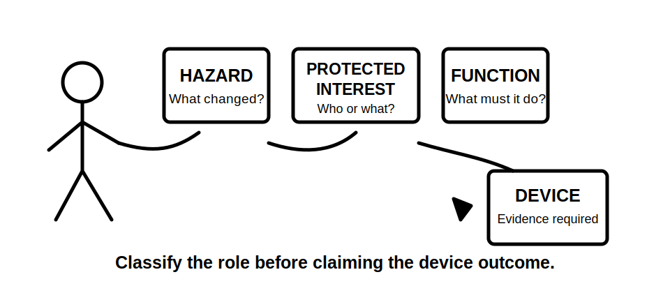
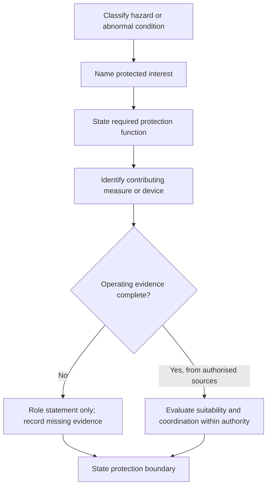
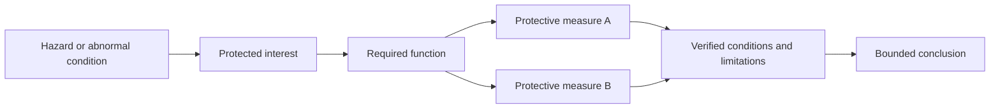

# Day 10 — Protective-Device Roles and Protection Boundaries

> **Currency and scope notice:** This module teaches original conceptual reasoning about protection purposes and evidence boundaries. It does not provide device ratings, current-time curves, breaking-capacity values, disconnection times, selectivity settings, installation instructions, test methods or a device-selection procedure. Exact definitions, clauses, coverage requirements, characteristics, coordination rules and jurisdiction-specific duties remain `reference_check_required`. Current authorised standards, legislation, regulator guidance, network rules, manufacturer instructions, workplace procedures and RTO requirements remain controlling. This module is not `technically-reviewed`.

## 1. Outcome and entry check

### Learning objectives

By the end of this block, the learner should be able to:

1. distinguish a **hazard**, a **protected interest**, a **protection function**, a **protective measure** and a **protective device**;
2. explain the conceptual roles of overload protection, short-circuit protection, fault protection and additional protection without treating them as interchangeable;
3. identify whether a scenario is primarily asking about conductor protection, equipment protection, shock-risk reduction, fire-risk reduction, supply continuity or another stated objective;
4. separate what a device is intended to detect from what it is intended to protect;
5. identify the evidence required before claiming that a particular device is suitable, coordinated or expected to operate;
6. explain why one protective device may perform more than one function while still having defined limitations;
7. reject the misconception that an RCD replaces overcurrent protection or that any circuit-breaker automatically addresses every fault type;
8. revise a role statement when the protected interest, fault path or device evidence changes;
9. produce a bounded protection-role record scoring at least 10 out of 12 rubric points, with no unsupported operating claim or unsafe practical action.

### Entry check

Complete without notes:

1. Define overload current, short-circuit current, earth-fault current and residual current.
2. Why must the current path be classified before predicting device operation?
3. Name two different things that may need protection in one circuit scenario.
4. What evidence would be needed before claiming that a protective device operates within a required time?
5. Explain why “the breaker protects the circuit” is too vague.
6. State one limitation of a written scenario that contains no device marking, characteristic or installation context.
7. What should you write when the protection purpose is clear but device suitability is not verified?

Record confidence as **guessing**, **unsure**, **reasonably confident** or **certain**. A high-confidence claim that one device “covers everything” becomes a priority misconception for remediation.

## 2. Why it matters

Protection questions become unsafe or technically weak when the learner names a device before identifying the risk, the protected interest and the required function. A fuse, circuit-breaker, RCD, protective-earthing arrangement or another protective measure cannot be evaluated merely by recognising its name.

The useful reasoning order is:

1. classify the abnormal condition or hazard;
2. identify what or whom the protection is intended to safeguard;
3. state the required protection function;
4. identify the measure or device that may contribute;
5. verify its applicability, characteristics, installation context and coordination;
6. state only the conclusion supported by evidence.

This order prepares the learner for Day 11, where residual-current protection is examined as one part of a coordinated protection system rather than as a universal substitute.



## 3. Core concepts and terminology

### Hazard

A **hazard** is a source or situation with the potential to cause harm. In a protection scenario, the hazard may involve excessive thermal stress, fault energy, accessible conductive parts becoming energised, damaged insulation, fire initiation or another stated condition.

### Protected interest

A **protected interest** is the person, conductor, equipment, property, supply function or other outcome the protection is intended to safeguard. One scenario can contain several protected interests, and they should not be collapsed into the vague phrase “protect the circuit.”

Examples include:

- a conductor against damaging thermal effects;
- equipment against a stated abnormal condition;
- a person against electric-shock risk;
- property against ignition or fire propagation;
- continuity of supply for unaffected circuits;
- a source or installation against consequences beyond its verified capability.

### Protection function

A **protection function** is the specific job required of the protection arrangement. Conceptual functions include detecting or limiting the consequences of overload, short circuit, earth fault, residual-current imbalance or another defined condition.

A function is not the same as a device name. The function states **what must be achieved**; the device or measure is one possible means of contributing to that outcome.

### Protective measure

A **protective measure** is the broader arrangement used to reduce risk. It may involve construction, insulation, barriers, earthing, bonding, automatic disconnection, separation, location, supervision, procedures or combinations of measures. Exact recognised measures and their application require authorised-source verification.

### Protective device

A **protective device** is a device intended to perform one or more protection functions under defined conditions. Its name alone does not establish suitability. Relevant evidence may include device type, rating, characteristic, breaking capacity, monitored conductors, installation arrangement, upstream and downstream devices, conductor data, fault conditions and manufacturer requirements.

### Overload protection

**Overload protection** concerns excessive current in an intended current path over a duration capable of causing unacceptable thermal effects. A complete conclusion requires more than a load estimate; it depends on the relevant conductor, device, installation condition and authorised design rules.

### Short-circuit protection

**Short-circuit protection** concerns fault current caused by an unintended conductive connection and the resulting thermal, mechanical or other consequences. Device interrupting capability, prospective current, conductor withstand and operating characteristics are evidence questions, not assumptions.

### Fault protection

**Fault protection** is protection under a stated fault condition, commonly involving measures intended to limit shock risk when accessible conductive parts may become energised. The exact terminology, permitted measures and required performance depend on the applicable authorised sources.

### Additional protection

**Additional protection** supplements other protective measures; it does not erase the need for basic protection, fault protection, overcurrent protection or safe work controls. The term does not mean “complete protection against every hazard.”

### Device role versus operating claim

A **role statement** describes what a device or measure is intended to contribute. An **operating claim** states that it will act under a particular condition, within a particular time or before a stated limit is exceeded. Operating claims require substantially more evidence than role statements.

### Protection boundary

A **protection boundary** is the limit of what a protection function, device or evidence set can support. Boundaries may arise from:

- the fault types detected;
- the conductors monitored;
- device characteristics;
- installation conditions;
- upstream or downstream interactions;
- missing values;
- authority and procedural limits;
- hazards that require a different protective measure.

## 4. Rule-finding workflow

Use **G-U-A-R-D-S** before making a device claim:

1. **G — Ground the scenario:** identify the stated abnormal condition, current path, supply context and missing facts.
2. **U — Unpack the protected interest:** name the person, conductor, equipment, property or continuity objective at issue.
3. **A — Assign the function:** state the required protection function without naming a device prematurely.
4. **R — Relate measures and devices:** identify which protective measures or devices may contribute and what each does not establish.
5. **D — Demand operating evidence:** locate authorised requirements and verify device, conductor, fault, installation and coordination data.
6. **S — State the boundary:** give the supported conclusion, list unresolved evidence and stop before an unsupported suitability or trip claim.



The diagram separates a conceptual role statement from a verified operating conclusion. Most written foundation exercises stop at the role statement because they do not contain all device, conductor and fault-condition evidence.

### Protection-role record

```text
Scenario and abnormal condition:
Current-path classification:
Hazard or consequence:
Protected interest:
Required protection function:
Candidate protective measure or device:
What the candidate may contribute:
What it does not establish:
Device evidence supplied:
Conductor and installation evidence supplied:
Coordination evidence supplied:
Missing authorised-source checks:
Supported role statement:
Unsupported operating claims avoided:
Stop or escalation condition:
```

## 5. Visual model or worked example

### Layered protection model



The model shows that several measures may contribute to one safety objective. It also shows that no measure bypasses the verification stage. The diagram is not a physical wiring layout and does not identify mandatory measures for a real installation.

### Worked reasoning example

Scenario: a fictional final subcircuit supplies a fixed load. The scenario states that operating current rises above the fictional design current because of an abnormal load condition. It names a protective device but supplies no characteristic, conductor installation data, duration, coordination information or authorised-source result.

Apply G-U-A-R-D-S:

1. **Ground:** Day 9 reasoning supports a candidate overload condition in the intended current path.
2. **Unpack:** the immediate protected interest is the circuit conductor against unacceptable thermal effects; equipment and property consequences may also be relevant but are not fully described.
3. **Assign:** the required conceptual function is overload protection.
4. **Relate:** the named device may contribute to overload protection if its characteristics and installation relationship are suitable.
5. **Demand:** rating, characteristic, conductor capacity under installation conditions, duration, applicable rules and coordination remain missing.
6. **State:** the scenario supports a role statement but not a suitability or operating-time conclusion.

Bounded conclusion:

> The named device may have an overload-protection role for the stated conductor, but the scenario does not establish correct selection, coordination or operating performance. Those conclusions remain `reference_check_required`.

### Changed-condition transfer

Change one fact: the scenario now states that the abnormal condition is an active-to-enclosure fault and that an RCD is installed. The protected interest and required function change toward shock-risk fault protection and possible additional protection. The RCD name still does not prove complete fault protection, overcurrent protection, correct monitored-conductor arrangement or timely operation. The learner must identify the missing fault path, earthing, device and authorised-source evidence rather than treating the changed device label as the answer.

## 6. Practical application

### Round 1 — separate the layers

For six trainer-written scenario cards, identify:

- abnormal condition or hazard;
- protected interest;
- required protection function;
- candidate measure or device;
- evidence needed for an operating claim.

At least two cards must share the same device name but require different role statements because the protected interest or abnormal condition differs.

### Round 2 — boundary-card sort

Sort original statements into:

- supported protection-role statement;
- unsupported suitability claim;
- unsupported operating-time claim;
- coordination question;
- different protective measure required;
- insufficient evidence.

Rewrite every unsupported claim as a bounded statement.

### Round 3 — worked-example fading

Complete four variations:

1. hazard and protected interest supplied;
2. only current-path facts supplied;
3. device name supplied as a distractor;
4. protected interest changes after the first conclusion.

Supports are removed progressively. The learner must revise the required function rather than defend the first device answer.

### Round 4 — paired-role comparison

Compare these conceptual pairs without selecting ratings or reproducing device curves:

- overload protection versus short-circuit protection;
- fault protection versus additional protection;
- conductor protection versus shock-risk reduction;
- protection function versus safe work isolation;
- device role versus verified operation;
- individual-device role versus coordinated system outcome.

For each pair, write one sentence describing the overlap and one sentence describing the boundary.

### Round 5 — Day 11 handoff

For one residual-current scenario, identify:

- what imbalance clue is described;
- which protected interest is stated;
- the possible RCD role;
- what overcurrent role remains separate;
- what earthing and fault-path evidence is missing;
- what exact authorised-source checks Day 11 must require.

Do not claim that the RCD replaces another protective function.

### Performance rubric

Score each category from **0 to 2**:

| Category | 0 | 1 | 2 |
|---|---|---|---|
| Classification | device named before condition is classified | condition partly identified | condition and current path clearly grounded |
| Protected interest | vague “protect the circuit” answer | one interest named | specific person, conductor, equipment or property interest stated |
| Function | device name substituted for function | plausible function with prompts | precise function stated independently of device |
| Evidence | device name treated as proof | some missing data recognised | device, conductor, fault and coordination evidence separated |
| Boundary | suitability or operation overclaimed | limitation partly stated | role statement and unresolved boundary explicit |
| Transfer | changed fact ignored | conclusion revised with help | function and role independently revised |

Progression target: at least **10 out of 12**, with no zero for protected interest, evidence or boundary. This is an educational readiness threshold, not an official assessment rule.

## 7. Common errors and safety checkpoint

### Common errors

- **Device-first reasoning:** selecting a fuse, circuit-breaker or RCD before defining the abnormal condition and function.
- **Universal-breaker belief:** assuming any circuit-breaker addresses every overload, short-circuit, earth-fault and shock-risk condition.
- **RCD substitution belief:** assuming an RCD replaces overcurrent protection, fault-path requirements or safe isolation.
- **Vague protected interest:** saying only that a device “protects the circuit.”
- **Role equals performance:** treating an intended role as proof of suitability, coordination or timely operation.
- **Single-measure thinking:** ignoring that several protective measures may work together.
- **Isolation confusion:** treating automatic protection as a substitute for an authorised isolation and safe-work procedure.
- **Curve invention:** guessing trip time or current from memory.
- **Missing breaking-capacity evidence:** claiming short-circuit suitability without verified prospective-current and device evidence.
- **Practical drift:** proposing live testing, fault creation or device substitution to resolve a written exercise.

### Safety checkpoint

All activities are written, diagrammatic or trainer-provided reasoning exercises. This module authorises no switching, isolation, opening equipment, testing, measurement, fault creation, device resetting, device replacement, disconnection, alteration, repair, energisation, commissioning or verification.

Stop and seek trainer or qualified guidance when:

- an exact clause, device type, rating, characteristic, breaking capacity, operating time or test method is required;
- a device label is being used without verified installation context;
- the fault path, protected interest or required protection function is unclear;
- a conclusion depends on conductor data, prospective current, earthing arrangement or coordination evidence not supplied;
- the exercise is being used to justify practical work;
- authority, supervision, procedure or equipment condition is uncertain;
- the learner proposes creating a fault or accessing energised parts;
- fatigue or repeated device-first errors make the record unreliable.

Use `reference_check_required` rather than guessing.

## 8. Retrieval and next links

### Closed-note retrieval

1. Define hazard, protected interest, protection function, protective measure, protective device and protection boundary.
2. Recite G-U-A-R-D-S and explain each step.
3. Why is a device name not a protection function?
4. Distinguish overload protection from short-circuit protection.
5. Distinguish fault protection from additional protection.
6. Why does a role statement require less evidence than an operating claim?
7. Give three examples of protected interests.
8. Explain why an RCD does not replace overcurrent protection.
9. Name five evidence items needed before a device-suitability conclusion.
10. State five stop or escalation conditions.

### Exit task

Complete an unseen fictional scenario containing:

- one classified current event;
- two competing protected interests;
- one named device used as a distractor;
- one missing conductor fact;
- one missing device characteristic;
- one changed condition after the first role statement.

Retain the original and revised protection-role records, evidence lists, confidence ratings and bounded conclusions.

### Navigation

- **Plan:** [Twelve-Week Capstone Learning Plan](../MASTER_PLAN.md)
- **Knowledge note:** [[12-Week Day 10 - Protective-Device Roles and Protection Boundaries]]
- **Previous:** [Day 9 — Overload, Short-Circuit and Fault-Current Distinctions](day-09-overload-short-circuit-and-fault-current-distinctions.md)
- **Next:** Day 11 — RCD Purpose, Limitations and Interaction with Other Protection

### Reference and currency notice

This module uses original explanations, workflows, diagrams, scenarios and assessment tools organised around learner decisions rather than a standards clause sequence. It does not reproduce standards tables, figures, device curves, systematic wording, exact technical values or official assessment material. Current authorised sources and qualified review remain required before any protection selection, coordination, operating claim or practical procedure is used beyond this written learning context.
