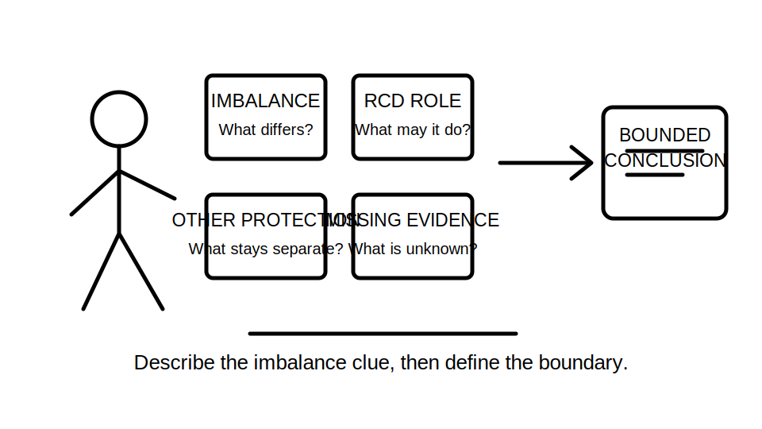
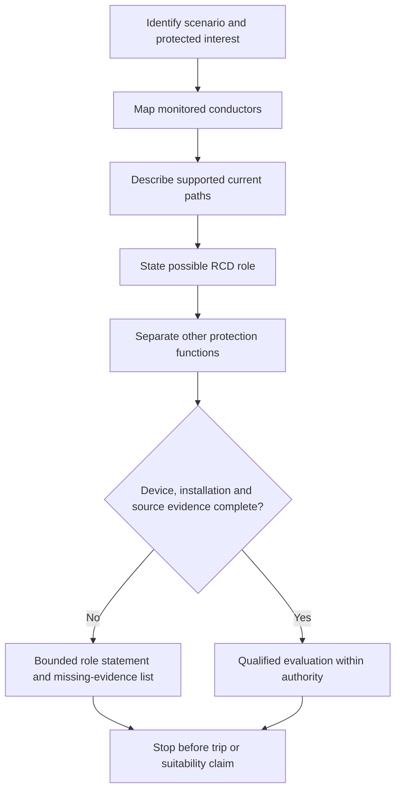
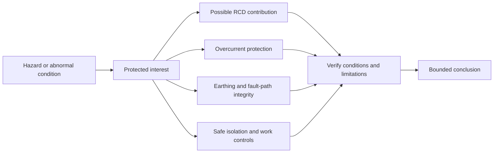

# Day 11 — RCD Purpose, Limitations and Interaction with Other Protection

> **Currency and scope notice:** This module teaches original conceptual reasoning about residual-current devices and their boundaries. It does not provide device ratings, trip-current values, operating-time limits, test procedures, circuit-coverage rules, device-type selection, installation instructions or reset guidance. Exact requirements remain `reference_check_required`. Current authorised standards, legislation, regulator guidance, network rules, manufacturer instructions, workplace procedures and RTO requirements remain controlling. This module is not `technically-reviewed`.

## 1. Outcome and entry check

### Learning objectives

By the end of this block, the learner should be able to:

1. define residual current, current imbalance, residual-current device and additional protection in plain language;
2. explain the conceptual operating clue an RCD monitors without describing it as a universal shock-prevention device;
3. distinguish an RCD role statement from a verified suitability or operating claim;
4. identify which conductors, current paths and installation facts must be known before reasoning about imbalance;
5. separate residual-current protection from overload protection, short-circuit protection, fault-path integrity and safe isolation;
6. identify at least five limitations or evidence gaps that prevent a complete RCD conclusion;
7. revise a conclusion when the fault path, monitored conductors, supply arrangement or upstream/downstream device context changes;
8. produce a bounded RCD interaction record scoring at least 10 out of 12 rubric points, with no unsupported trip claim or unsafe action.

### Entry check

Complete without notes:

1. Define residual current and earth-fault current. How can they overlap without being identical terms?
2. What is the difference between a protection function and a device name?
3. Why does a named RCD not prove that overcurrent protection is adequate?
4. What evidence is needed before predicting that any protective device will operate?
5. Why must the current path and monitored conductors be identified?
6. What should be written when an RCD role is plausible but device and installation evidence are incomplete?

Record confidence as **guessing**, **unsure**, **reasonably confident** or **certain**. A high-confidence claim that an RCD “protects against all electric shock” becomes a priority misconception for Day 12.

## 2. Why it matters

RCD questions are often answered too quickly because the device is strongly associated with shock-risk reduction. That association is useful but incomplete. A defensible answer must identify the imbalance mechanism, the protected interest, the other protective functions still required and the evidence needed before claiming suitable or timely operation.

The central discipline is:

> **Describe the imbalance clue, then define the boundary.**

This prevents four common errors:

- treating an RCD as overcurrent protection;
- assuming every earth fault creates the same detectable imbalance;
- assuming an RCD replaces earthing, bonding or a complete fault path;
- treating automatic disconnection as permission to work without authorised isolation.



## 3. Core concepts and terminology

### Residual current

**Residual current** is the difference between the currents in the conductors being compared by the device. In a simplified balanced condition, current leaving through the monitored live conductor or conductors is matched by current returning through the monitored return path. A difference indicates that some current is returning by another path or that the monitored-current relationship is otherwise not balanced.

### Current imbalance

A **current imbalance** is the measurable difference between the monitored outgoing and returning currents. It is an operating clue, not by itself a complete diagnosis of the fault, hazard, path or required protection outcome.

### Residual-current device

A **residual-current device (RCD)** is a protective device intended to respond to residual-current conditions under defined circumstances. Its name does not establish:

- correct device type;
- correct circuit coverage;
- correct monitored-conductor arrangement;
- suitable rating or characteristic;
- satisfactory earthing or bonding;
- overcurrent protection;
- coordination with other devices;
- successful operation within a required time;
- permission to reset, test or continue work.

### Additional protection

**Additional protection** supplements other required protective measures. It does not replace basic protection, fault protection, overcurrent protection, earthing, bonding, isolation or safe-work procedures.

### Monitored conductors

**Monitored conductors** are the conductors whose currents are compared by the device. A residual-current conclusion is weak if the scenario does not establish which conductors pass through the sensing arrangement or how the supply and return paths are arranged.

### Alternative return path

An **alternative return path** is a path by which current returns outside the intended monitored relationship. A person, conductive enclosure, protective conductor, earth, bonded metalwork or another connection may be relevant in a scenario, but the exact path must be supported rather than assumed.

### RCD role statement

An **RCD role statement** describes the protection function the device may contribute under stated conditions. Example: “The RCD may provide additional protection by responding to a residual-current imbalance.”

### Verified operating claim

A **verified operating claim** states that the device is suitable and expected to operate under the actual conditions within an applicable requirement. This needs authorised-source, device, installation, fault-path and test evidence that foundation scenarios commonly omit.

### Interaction with other protection

**Interaction with other protection** means considering how the RCD sits alongside overcurrent devices, earthing and bonding arrangements, upstream and downstream devices, supply configuration and procedural controls. Interaction is not automatically coordination; coordination must be demonstrated with relevant evidence.

## 4. Rule-finding workflow

Use **I-M-B-A-L-A-N-C-E**:

1. **I — Identify the scenario:** state the supply, circuit, abnormal condition and protected interest.
2. **M — Map monitored conductors:** identify which currents are compared and which facts are missing.
3. **B — Build the candidate path:** describe the intended path and any supported alternative return path.
4. **A — Assign the RCD role:** state the possible residual-current or additional-protection function without overclaiming.
5. **L — List separate functions:** identify overload, short-circuit, fault-path, earthing, bonding, isolation and other questions that remain separate.
6. **A — Ask for device evidence:** require type, markings, condition, arrangement and manufacturer information relevant to the claim.
7. **N — Note system interaction:** identify upstream/downstream devices, supply changes and possible coordination or unwanted-operation questions.
8. **C — Check authorised sources:** verify current requirements, coverage, limitations and assessment expectations.
9. **E — Express the boundary:** state the supported conclusion, missing evidence and stop condition.



The model forces the learner to separate a plausible RCD role from a verified conclusion. It also shows that an RCD question never removes the need to examine other protection functions.

### RCD interaction record

```text
Scenario and protected interest:
Supply and circuit facts:
Monitored conductors:
Intended outgoing and return paths:
Supported alternative return path:
Residual-current clue:
Possible RCD role:
Separate overcurrent function:
Separate earthing or bonding question:
Upstream/downstream interaction:
Device evidence supplied:
Authorised-source checks required:
Supported conclusion:
Unsupported claims avoided:
Stop or escalation condition:
```

## 5. Visual model or worked example

### Layered protection boundary



The diagram is a reasoning map, not a wiring diagram. It shows that several controls may address different parts of the same risk. None is a substitute for the others merely because all relate to safety.

### Worked reasoning example

A fictional scenario states that a final subcircuit has an RCD and that some current may return through an unintended conductive path. No device type, marking, monitored-conductor arrangement, earthing details, upstream device information or authorised-source result is supplied.

Apply I-M-B-A-L-A-N-C-E:

1. **Identify:** the protected interest is a person exposed to a possible shock path.
2. **Map:** the scenario does not fully establish which conductors are monitored.
3. **Build:** an alternative return path is plausible, but its continuity and magnitude are not verified.
4. **Assign:** the RCD may contribute additional protection by responding to imbalance.
5. **List:** overcurrent protection, fault-path integrity, earthing, isolation and equipment condition remain separate.
6. **Ask:** device type, arrangement, markings, condition and manufacturer information are missing.
7. **Note:** upstream/downstream interaction and supply configuration are unknown.
8. **Check:** exact coverage and performance requirements remain `reference_check_required`.
9. **Express:** no trip-time or suitability claim is supported.

Bounded conclusion:

> The described condition supports a possible residual-current and additional-protection role for the RCD. It does not establish correct device selection, complete circuit coverage, satisfactory earthing, overcurrent protection or verified operation.

### Changed-condition transfer

Change one fact: the unintended current now leaves and returns entirely through conductors monitored in the same relationship. The learner must reconsider whether the described condition necessarily creates a detectable residual-current imbalance. The correct response is not to defend the original conclusion but to remap the conductors and current paths.

Change a second fact: an alternative supply is introduced. The learner must reopen the supply arrangement, monitored-conductor, neutral, upstream/downstream and authorised-source questions before retaining any earlier conclusion.

## 6. Practical application

### Round 1 — imbalance or not established

Sort eight original scenario cards into:

- imbalance described;
- imbalance plausible but incomplete;
- no imbalance established;
- monitored-conductor information missing;
- different protection question;
- outside authority.

Write one sentence justifying each classification.

### Round 2 — function separation

For four scenarios, complete separate statements for:

- possible RCD role;
- overload-protection role;
- short-circuit-protection role;
- earthing or bonding dependency;
- safe-isolation boundary.

No statement may use “the RCD protects everything.”

### Round 3 — worked-example fading

Complete four variations:

1. full conductor and path prompts supplied;
2. monitored conductors omitted;
3. device name supplied as a distractor;
4. alternative supply introduced after the first conclusion.

Prompts are progressively removed. Retain both original and revised records.

### Round 4 — evidence ladder

Classify each claim as:

- conceptual role only;
- conditionally supported;
- requires device evidence;
- requires installation or fault-path evidence;
- requires authorised-source verification;
- requires qualified practical verification.

Rewrite every overclaimed statement at the lowest defensible level.

### Round 5 — misconception challenge

Correct these statements:

1. “An RCD stops all electric shocks.”
2. “An RCD replaces the circuit-breaker.”
3. “If an RCD is fitted, the earthing arrangement must be adequate.”
4. “If the RCD trips, the circuit is safe to work on.”
5. “Any current to earth will always trip any RCD.”
6. “Resetting proves the fault is gone.”

Each correction must identify the missing evidence or separate protection function.

### Performance rubric

Score each category from **0 to 2**:

| Category | 0 | 1 | 2 |
|---|---|---|---|
| Imbalance reasoning | repeats device label only | identifies imbalance generally | maps monitored and alternative paths clearly |
| Role boundary | universal-protection claim | partial limitation stated | bounded RCD role with explicit exclusions |
| Function separation | merges protection functions | separates some functions | cleanly separates RCD, overcurrent, earthing and isolation roles |
| Evidence control | invents values or operation | notes some missing facts | distinguishes device, installation, source and practical evidence |
| Transfer | defends first answer after change | revises partly | fully remaps and revises after changed conditions |
| Safety and authority | proposes testing/resetting/work | vague caution | explicit stop, escalation and authority boundary |

A score of **10–12** supports progression. Any score of zero for evidence control or safety and authority requires remediation before Day 13 application work.

## 7. Common errors and safety checkpoint

### Common errors

- treating residual current and earth-fault current as exact synonyms in every context;
- assuming a fault to earth always creates a detectable imbalance for the stated device arrangement;
- treating an RCD as overload or short-circuit protection without evidence;
- assuming correct earthing, bonding or fault-loop integrity because an RCD is present;
- predicting operation from a device label alone;
- ignoring upstream/downstream interaction or alternative supplies;
- treating a trip as proof of safe isolation or fault clearance;
- recommending reset, test or continued use without authority and procedure.

### Safety checkpoint

Stop and escalate when:

- the task requires opening equipment, identifying live conductors or confirming an installation arrangement physically;
- a conclusion depends on exact trip-current, time, device-type or coverage requirements;
- device markings, condition, monitored conductors or supply arrangement are uncertain;
- testing, resetting, isolation, fault creation or energisation is proposed;
- a scenario involves damaged equipment, repeated operation, signs of overheating or another immediate hazard;
- fatigue or repeated high-confidence misconceptions make the written result unreliable.

This module authorises no switching, isolation, opening, measurement, testing, resetting, fault creation, alteration, repair, energisation, commissioning or verification. Use `reference_check_required` rather than guessing.

## 8. Retrieval and next links

### Closed-note retrieval

1. Define residual current, current imbalance, RCD and monitored conductors.
2. Recite I-M-B-A-L-A-N-C-E and explain each step.
3. Why is an imbalance clue not a complete fault diagnosis?
4. State four things an RCD does not automatically establish.
5. Distinguish an RCD role statement from a verified operating claim.
6. Explain why overcurrent protection remains separate.
7. Explain why an RCD does not prove satisfactory earthing or safe isolation.
8. Name five evidence items required before a suitability or trip claim.
9. Describe how an alternative supply can invalidate an earlier conclusion.
10. State five stop conditions.

### Exit task

Complete one unseen fictional scenario containing:

- a possible unintended current path;
- incomplete monitored-conductor information;
- a named overcurrent device;
- an upstream or downstream RCD;
- one changed supply fact;
- one unsafe proposed action to reject.

Submit the original and revised RCD interaction records, confidence ratings, missing-evidence list and bounded conclusions.

### Navigation

- **Plan:** [Twelve-Week Capstone Learning Plan](../MASTER_PLAN.md)
- **Knowledge note:** [[12-Week Day 11 - RCD Purpose Limitations and Interaction with Other Protection]]
- **Previous:** [Day 10 — Protective-Device Roles and Protection Boundaries](day-10-protective-device-roles-and-protection-boundaries.md)
- **Next:** Day 12 — Rest, Retrieval and Misconception Repair

### Reference and currency notice

This module uses original explanations, workflows, diagrams, scenarios and assessment tools organised around learner decisions rather than a standards clause sequence. It does not reproduce standards tables, figures, device curves, systematic wording, exact technical values or official assessment material. Current authorised sources and qualified review remain required before any RCD selection, coverage, coordination, operating claim or practical procedure is used beyond this written learning context.
