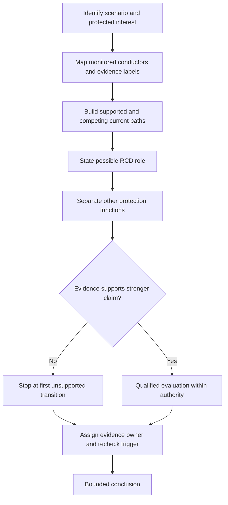
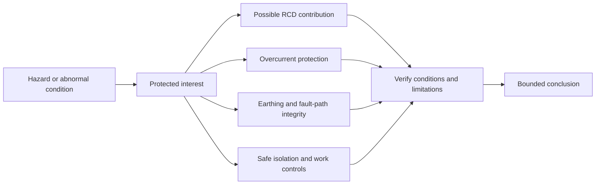

# Day 11 — RCD Purpose, Limitations and Interaction with Other Protection

> **Currency and scope notice:** This module teaches original conceptual reasoning about residual-current devices and their boundaries. It does not provide device ratings, trip-current values, operating-time limits, test procedures, circuit-coverage rules, device-type selection, installation instructions or reset guidance. Exact requirements remain `reference_check_required`. Current authorised standards, legislation, regulator guidance, network rules, manufacturer instructions, workplace procedures and RTO requirements remain controlling. This module is not `technically-reviewed`.

## 1. Outcome and entry check

### Learning objectives

By the end of this block, the learner should be able to:

1. define residual current, current imbalance, residual-current device and additional protection in plain language;
2. map the conductors and current paths relevant to an imbalance claim;
3. distinguish an RCD role statement from a suitability, coordination or operating claim;
4. label scenario information as stated fact, inference, assumption, contradiction or evidence gap;
5. separate residual-current protection from overload protection, short-circuit protection, fault-path integrity, earthing, bonding and safe isolation;
6. identify the first unsupported transition in an RCD conclusion and stop before it;
7. assign an evidence owner and recheck trigger to every material gap;
8. rebuild a bounded RCD interaction record after at least two material scenario changes without making an unsupported trip claim or proposing an unsafe action.

### Entry check

Complete without notes:

1. Define residual current and earth-fault current. How can they overlap without being identical terms?
2. What is the difference between a protection function and a device name?
3. Why does a named RCD not prove that overcurrent protection is adequate?
4. What evidence is needed before predicting that any protective device will operate?
5. Why must the current path and monitored conductors be identified?
6. What should be written when an RCD role is plausible but device and installation evidence are incomplete?

Record confidence as **guessing**, **unsure**, **reasonably confident** or **certain**. A high-confidence universal-protection claim is a priority misconception even when other answers are strong.

## 2. Why it matters

RCD questions are often answered too quickly because the device is associated with shock-risk reduction. That association is useful but incomplete. A defensible answer must identify the monitored-current relationship, the protected interest, the other protection functions still required and the evidence needed before claiming suitability, coordination or operation.

The central discipline is:

> **Describe the imbalance clue, then stop at the evidence boundary.**

This prevents four common errors:

- treating an RCD as overcurrent protection;
- assuming every earth fault creates the same detectable imbalance;
- assuming an RCD replaces earthing, bonding or a complete fault path;
- treating automatic disconnection as permission to work without authorised isolation.


*Caption: Separate the observed imbalance clue from device suitability, other protection functions and unresolved evidence.*

## 3. Core concepts and terminology

### Residual current and current imbalance

**Residual current** is the difference between the currents in the conductors being compared by the device. A **current imbalance** is that measurable difference. It is an operating clue, not by itself a complete diagnosis of a fault, hazard, path or protection outcome.

### Residual-current device

A **residual-current device (RCD)** is a protective device intended to respond to residual-current conditions under defined circumstances. Its name does not establish correct type, coverage, monitored-conductor arrangement, condition, rating, earthing, bonding, overcurrent protection, coordination, operating time or permission to reset, test or continue work.

### Additional protection

**Additional protection** supplements other required protective measures. It does not replace basic protection, fault protection, overcurrent protection, earthing, bonding, isolation or safe-work procedures.

### Monitored conductors and alternative return path

**Monitored conductors** are the conductors whose currents are compared by the device. An **alternative return path** is a path outside the intended monitored relationship. The path must be supported by scenario evidence rather than inferred from the device label.

### Role, suitability, coordination and operating claims

- An **RCD role statement** describes a function the device may contribute under stated conditions.
- A **suitability claim** states that the device and arrangement are appropriate for the actual application.
- A **coordination claim** states how the RCD interacts with upstream, downstream or other protective elements.
- A **verified operating claim** states that the device is expected to operate under the actual conditions within an applicable requirement.

Each stronger claim requires additional authorised-source, device, installation, path and verification evidence.

### Evidence labels

- **Stated fact:** information directly supplied by the scenario or authorised record.
- **Inference:** a reasoned interpretation supported by stated facts.
- **Assumption:** an unverified condition temporarily introduced for analysis.
- **Contradiction:** evidence that cannot be reconciled without further checking.
- **Evidence gap:** missing information that prevents a stronger conclusion.
- **Evidence owner:** the authorised person or source responsible for resolving a gap.
- **Recheck trigger:** a change that requires the conclusion to be rebuilt.
- **First unsupported transition:** the earliest step where a conclusion moves beyond the available evidence.

## 4. Rule-finding workflow

Use **I-M-B-A-L-A-N-C-E**:

1. **I — Identify the scenario:** state the supply, circuit, abnormal condition and protected interest.
2. **M — Map monitored conductors:** identify which currents are compared and label missing or contradictory facts.
3. **B — Build candidate paths:** describe the intended path, supported alternatives and competing interpretations.
4. **A — Assign the RCD role:** state only the possible residual-current or additional-protection function.
5. **L — List separate functions:** keep overload, short-circuit, fault-path, earthing, bonding and isolation questions distinct.
6. **A — Ask for evidence:** identify device, installation, source, manufacturer and verification evidence required for stronger claims.
7. **N — Note system interaction:** identify upstream/downstream devices, alternative supplies and possible coordination questions.
8. **C — Check authorised sources:** verify currency, applicability, coverage, limitations and assessment expectations.
9. **E — Express the boundary:** stop at the first unsupported transition, name the evidence owner and state the recheck trigger.



The diagram shows that a plausible role is not a shortcut to suitability or operation. Missing or contradictory evidence creates a controlled stop, not permission to guess.

### RCD interaction record

```text
Scenario and protected interest:
Stated facts:
Inferences:
Assumptions:
Contradictions:
Evidence gaps:
Monitored conductors:
Intended outgoing and return paths:
Supported alternative path:
Competing path interpretation:
Possible RCD role:
Separate overcurrent function:
Separate earthing or bonding question:
Upstream/downstream interaction:
First unsupported transition:
Evidence owner:
Recheck trigger:
Supported conclusion:
Stop or escalation condition:
Confidence and reason:
```

## 5. Visual model or worked example

### Layered protection boundary



This is a reasoning map, not a wiring diagram. Several controls can address different parts of the same risk; none becomes a substitute for another merely because all relate to safety.

### Worked reasoning example

A fictional scenario states that a final subcircuit has an RCD and that some current may return through an unintended conductive path. No device type, marking, monitored-conductor arrangement, earthing detail, upstream-device information or authorised-source result is supplied.

- **Stated facts:** an RCD is named; an unintended path is described as possible.
- **Inference:** a residual-current role may be relevant.
- **Assumption to reject:** the named device will necessarily operate.
- **Evidence gaps:** monitored conductors, path continuity, device characteristics, coverage, condition and applicable requirements.
- **First unsupported transition:** moving from “imbalance may exist” to “the RCD will trip suitably.”
- **Bounded conclusion:** the scenario supports a possible residual-current and additional-protection role, but not correct selection, complete coverage, satisfactory earthing, coordination or verified operation.

### Changed-condition transfer

Rebuild the record after both changes:

1. the unintended current now leaves and returns entirely through conductors monitored in the same relationship; and
2. an alternative supply is introduced upstream.

The learner must remap the conductors, current paths, supply context and device interaction. Carrying the first conclusion forward unchanged is unsupported.

## 6. Practical application

### Round 1 — evidence-labelled classification

Sort eight original scenario cards into: imbalance described; imbalance plausible but incomplete; no imbalance established; monitored-conductor information missing; different protection question; or outside authority. Label every supporting item as fact, inference, assumption, contradiction or gap.

### Round 2 — function separation

For four scenarios, write separate statements for possible RCD role, overload protection, short-circuit protection, earthing or bonding dependency and safe-isolation boundary.

### Round 3 — worked-example fading

Complete four variations with progressively fewer prompts. Retain the original and revised records. The final variation changes at least two material conditions.

### Round 4 — claim ladder

Classify each claim as conceptual role only, conditionally supported, requires device evidence, requires installation or path evidence, requires authorised-source verification, or requires qualified practical verification. Mark the first unsupported transition.

### Round 5 — misconception repair

Correct these claims and identify the missing evidence or separate protection function:

1. “An RCD stops all electric shocks.”
2. “An RCD replaces the circuit-breaker.”
3. “If an RCD is fitted, the earthing arrangement must be adequate.”
4. “If the RCD trips, the circuit is safe to work on.”
5. “Any current to earth will always trip any RCD.”
6. “Resetting proves the fault is gone.”

### Criterion-level assessment

Assess each criterion as:

- **Secure:** correct, bounded and independently reproducible after changed conditions.
- **Developing:** broadly safe but incomplete, weakly evidenced or dependent on prompts.
- **Unsupported:** a conclusion is asserted without the evidence needed to support it.
- **`stop-required`:** the response ignores a material contradiction, invents device operation, merges protection functions in a safety-critical way or proposes unauthorised practical action.

Apply the states separately to:

1. monitored-conductor and path reasoning;
2. RCD-role boundary;
3. separation of other protection functions;
4. evidence labels and first unsupported transition;
5. changed-context transfer;
6. safety, authority, evidence-owner and escalation control.

A `stop-required` result cannot be averaged away by stronger performance elsewhere. Remediation must address the specific mechanism before Day 13 application work.

## 7. Common errors and safety checkpoint

### Common errors

- treating residual current and earth-fault current as exact synonyms in every context;
- assuming a fault to earth always creates a detectable imbalance for the stated arrangement;
- treating an RCD as overload or short-circuit protection without evidence;
- assuming correct earthing, bonding or fault-loop integrity because an RCD is present;
- predicting operation from a device label alone;
- ignoring contradictory evidence, upstream/downstream interaction or alternative supplies;
- treating a trip as proof of safe isolation or fault clearance;
- recommending reset, test or continued use without authority and procedure.

### Safety checkpoint

Stop and escalate when:

- the task requires opening equipment, identifying live conductors or confirming an arrangement physically;
- a conclusion depends on exact trip-current, time, device-type or coverage requirements;
- device markings, condition, monitored conductors or supply arrangement are uncertain or contradictory;
- testing, resetting, isolation, fault creation or energisation is proposed;
- damaged equipment, repeated operation, overheating or another immediate hazard is described;
- fatigue or repeated high-confidence misconceptions make the written result unreliable.

This module authorises no access, switching, isolation, opening, measurement, testing, resetting, fault creation, replacement, disconnection, alteration, repair, energisation, commissioning, certification or verification. Use `reference_check_required` rather than guessing.

## 8. Retrieval and next links

### Closed-note retrieval

1. Define residual current, current imbalance, RCD and monitored conductors.
2. Recite I-M-B-A-L-A-N-C-E and explain each step.
3. Distinguish role, suitability, coordination and operating claims.
4. Define the five evidence labels and the first unsupported transition.
5. Explain why overcurrent protection remains separate.
6. Explain why an RCD does not prove satisfactory earthing or safe isolation.
7. Name five evidence items required before a stronger claim.
8. Describe how two material scenario changes can invalidate an earlier conclusion.
9. State the four criterion-level assessment states.
10. State five stop conditions.

### Exit task

Complete one unseen fictional scenario containing an incomplete current path, uncertain monitored-conductor information, a named overcurrent device, an upstream or downstream RCD, two changed material facts and one unsafe proposed action. Submit original and revised interaction records, evidence labels, confidence ratings, first unsupported transitions, evidence owners, missing-evidence lists and bounded conclusions.

### Navigation

- **Plan:** [Twelve-Week Capstone Learning Plan](../MASTER_PLAN.md)
- **Knowledge note:** [[12-Week Day 11 - RCD Purpose Limitations and Interaction with Other Protection]]
- **Previous:** [Day 10 — Protective-Device Roles and Protection Boundaries](day-10-protective-device-roles-and-protection-boundaries.md)
- **Next:** [Day 12 — Rest, Retrieval and Misconception Repair](day-12-rest-retrieval-and-misconception-repair.md)

### Reference and currency notice

This module uses original explanations, workflows, diagrams, scenarios and assessment tools organised around learner decisions rather than a standards clause sequence. It does not reproduce standards tables, figures, device curves, systematic wording, exact technical values or official assessment material. Current authorised sources and qualified review remain required before any RCD selection, coverage, coordination, operating claim or practical procedure is used beyond this written learning context.
