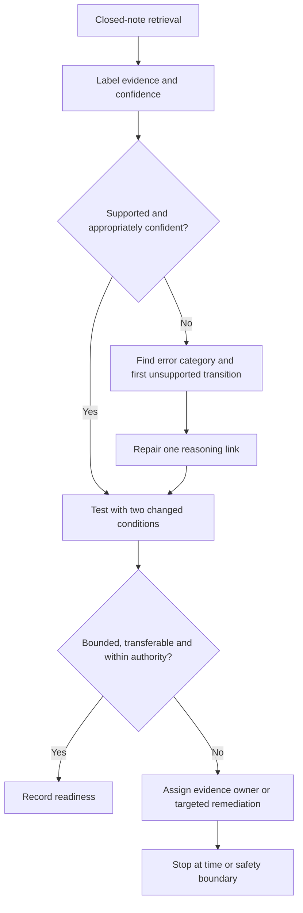
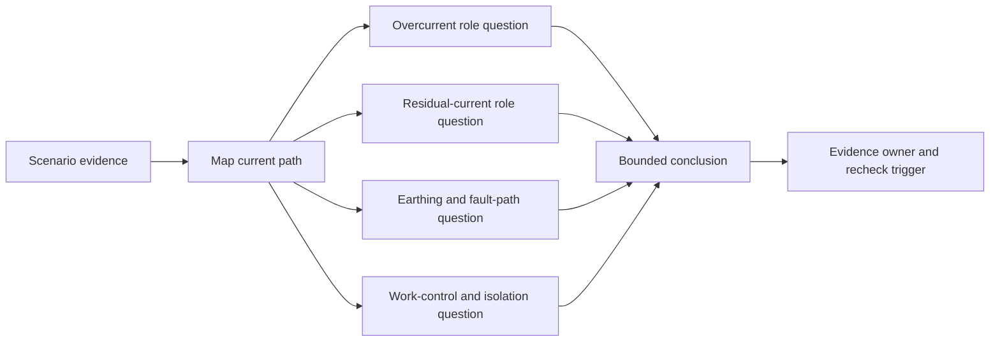

# Day 12 — Rest, Retrieval and Misconception Repair

> **Currency and scope notice:** This recovery block consolidates Days 8–11 through retrieval, confidence calibration and misconception repair. It introduces no new electrical theory, device values, clause requirements, test procedures or practical instructions. Exact requirements remain `reference_check_required`. Current authorised standards, legislation, regulator guidance, manufacturer instructions, workplace procedures and RTO requirements remain controlling. This module is not `technically-reviewed`.

## 1. Outcome and entry check

### Learning objectives

By the end of this block, the learner should be able to:

1. retrieve the main distinctions from Days 8–11 without notes before rereading;
2. classify statements as supported, conditionally supported, unsupported or outside authority and state the evidence basis;
3. identify terminology, current-path, protection-role, evidence, confidence and safety-boundary errors;
4. locate the first unsupported transition in a reasoning chain;
5. repair no more than three priority misconceptions using changed scenarios;
6. separate RCD, overcurrent, earthing and work-control functions without making operating claims;
7. record an evidence owner and recheck trigger for each unresolved material gap;
8. follow a maximum 30-minute recovery protocol with fatigue and stop conditions; and
9. make a bounded Day 13 readiness decision without claiming competence or technical approval.

### Entry check

Without notes, write one sentence for each prompt:

1. Distinguish overload, short circuit, earth-fault current and residual current.
2. Explain why a device name does not prove suitability or operation.
3. State one function an RCD may contribute and three conclusions it does not automatically establish.
4. Explain why current path, monitored conductors and supply arrangement matter.
5. Distinguish a role statement, suitability claim, coordination claim and verified operating claim.
6. Name two actions outside learner authority in this written program.

Before checking earlier work, label confidence as **guessing**, **unsure**, **reasonably confident** or **certain**. An incorrect answer marked **certain**, or any answer proposing unauthorised action, is a priority misconception and may be `stop-required`.

## 2. Why it matters

Recovery is not passive rereading. Closely related protection topics are easily merged into one vague idea of “safety.” This can produce high-confidence errors such as “the RCD makes the circuit safe,” “the breaker covers every fault,” or “earthing proves the fault will clear.”

The purpose of this block is to detect and repair those errors before Day 13 requires more independent evidence-based reasoning.

> **Retrieve first, diagnose the broken link, repair only that link, then test transfer.**

This prevents two unhelpful extremes:

- starting another full technical lesson while fatigued; and
- assuming recognition or familiarity equals reliable recall.


*Caption: Repair the smallest unsupported reasoning link before attempting a changed scenario.*

## 3. Core concepts and terminology

### Retrieval

**Retrieval** is producing knowledge or a reasoning process without looking at the source. It tests recall rather than recognition.

### Misconception

A **misconception** is a stable but incorrect mental model that can transfer into multiple scenarios.

### Confidence calibration

**Confidence calibration** compares certainty with accuracy and evidence. A confident incorrect answer is higher priority than an uncertain omission because it is less likely to trigger verification.

### Evidence labels

Use these labels before repairing an answer:

- **stated fact:** information explicitly supplied by the scenario;
- **supported inference:** a conclusion reasonably derived from stated facts within the stated scope;
- **assumption:** information treated as true without adequate evidence;
- **contradiction:** evidence that conflicts with another claim or record;
- **evidence gap:** information required before the conclusion can be supported.

### Error category

An **error category** identifies where reasoning failed:

- **terminology error:** key terms are merged or used inaccurately;
- **current-path error:** outgoing, return or alternative paths are assumed rather than mapped;
- **protection-role error:** one function is treated as if it performs another;
- **evidence error:** a conclusion exceeds supplied facts or authorised source evidence;
- **confidence error:** certainty exceeds the available evidence;
- **safety-boundary error:** the response proposes action outside authority or without required controls.

### First unsupported transition

The **first unsupported transition** is the earliest step where reasoning moves from supported information to an assumption, contradiction, unverified claim or unauthorised action. Repair begins there, not at the final sentence.

### Varied re-attempt

A **varied re-attempt** tests the same capability after at least two material conditions change, such as supply information, stated device evidence, current-path evidence, operating history or proposed action.

### Evidence owner and recheck trigger

An **evidence owner** is the person, source or authorised process responsible for resolving a gap. A **recheck trigger** is the event that requires the conclusion to be reviewed, such as new device data, a changed supply arrangement, an authorised inspection record or a revised task scope.

### Catch-up triage

**Catch-up triage** selects missed work by safety significance and prerequisite value rather than attempting everything at once.

### Readiness decision

A **readiness decision** is a bounded learning decision: progress, progress with support or remediate first. It is not a competency decision or qualified technical approval.

## 4. Rule-finding workflow

Use **R-E-P-A-I-R**:

1. **R — Retrieve without notes:** answer the prompts before opening prior modules.
2. **E — Examine evidence and confidence:** label facts, inferences, assumptions, contradictions and gaps.
3. **P — Pinpoint the error:** identify the error category and first unsupported transition.
4. **A — Amend the mental model:** write a bounded correction that separates terms, paths, functions, evidence and authority.
5. **I — Interleave a changed scenario:** alter at least two material conditions and repeat the reasoning.
6. **R — Record readiness and stop:** record the criterion state, evidence owner, recheck trigger and next action.



The diagram prevents whole-topic reteaching. The learner repairs the earliest unsupported step, tests the correction under changed conditions and stops when evidence or authority is insufficient.

### Misconception-repair record

```text
Prompt or scenario:
Initial answer and confidence:
Stated facts:
Supported inferences:
Assumptions or contradictions:
Evidence gaps:
Error category:
First unsupported transition:
Corrected mental model:
Two material scenario changes:
Re-attempt answer and confidence:
Evidence owner:
Recheck trigger:
Safety or authority boundary:
Criterion state:
Readiness outcome:
```

## 5. Visual model or worked example

### Protection-function separation map



Each branch addresses a distinct function. A familiar device name or reported operation cannot substitute for the other branches.

### Worked misconception repair

Initial statement:

> “An RCD is fitted, so the circuit is protected from overload and is safe to work on after it trips.”

Apply R-E-P-A-I-R:

1. **Retrieve:** an RCD may respond to a residual-current condition under defined circumstances.
2. **Examine:** “RCD fitted” and “reported trip” are stated facts; overload protection, correct coverage, successful fault clearance and safe isolation are unsupported conclusions.
3. **Pinpoint:** the first unsupported transition occurs when the device label is treated as proof of multiple protection and work-control outcomes.
4. **Amend:** separate the residual-current role from overcurrent protection, earthing, suitability, operation and isolation.
5. **Interleave:** change both the supply information and the available device documentation; keep the practical action proposal.
6. **Record:** suitability and permission to work remain unresolved; assign current authorised documentation and qualified supervision as evidence owners.

Corrected bounded statement:

> The named RCD may contribute a residual-current protection function, while a named overcurrent device may perform a separate role. The supplied information does not establish correct selection, coordination, operation, fault clearance or safe isolation. No practical work, reset or operating conclusion is authorised.

## 6. Practical application

### Recovery protocol — maximum 30 minutes

Use a timer and stop at the limit even if unfinished.

#### Minutes 0–6 — closed-note retrieval

Complete the entry prompts and sketch:

- one normal-current path;
- one possible earth-fault path;
- one residual-current comparison; and
- four separate protection or work-control functions.

#### Minutes 6–12 — misconception sort

Classify each statement and identify its evidence label:

1. “Overload and short circuit are identical because both may involve high current.”
2. “A device label proves correct operation in this installation.”
3. “Residual current and earth-fault current can overlap but are not universal synonyms.”
4. “An RCD replaces overcurrent protection.”
5. “A protective conductor may be relevant to a fault path, but the path must be supported.”
6. “A trip proves the circuit is isolated and safe to touch.”
7. “Changed supply information can invalidate an earlier conclusion.”
8. “Missing monitored-conductor information requires a bounded conclusion.”

Use: supported, conditionally supported, unsupported or outside authority.

#### Minutes 12–20 — repair up to three priority errors

Prioritise:

1. safety-boundary errors;
2. high-confidence incorrect answers;
3. errors blocking Day 13; then
4. lower-confidence terminology errors.

Complete one repair record per selected error.

#### Minutes 20–26 — changed-context transfer

Use a fresh fictional scenario containing an abnormal current condition, one named protective device, incomplete current-path evidence and one unsafe action proposal. Change at least two material conditions from the original prompt. Produce a bounded conclusion, name missing evidence and reject the unsafe action.

#### Minutes 26–30 — readiness and shutdown

Record each criterion as:

- **secure:** accurate, evidenced, transferable and within authority;
- **developing:** substantially correct but needs a named support or evidence check;
- **unsupported:** conclusion exceeds the evidence or transfer is not demonstrated;
- **`stop-required`:** safety boundary, contradiction, unauthorised action or material evidence gap prevents progression.

Readiness outcomes:

- **Ready:** all safety-critical criteria are secure and remaining developing items have named support.
- **Ready with support:** no `stop-required` state exists; one or more non-safety criteria are developing with an owner and recheck point.
- **Not yet ready:** any safety-critical criterion is unsupported or `stop-required`, or transfer fails after repair.

Then stop. Do not extend the session to compensate for missed work.

### Criterion-level assessment

| Criterion | Secure | Developing | Unsupported | `stop-required` |
|---|---|---|---|---|
| Closed-note retrieval | Distinctions are accurate before checking | Minor omission corrected with prompt | Terms remain merged or copied after checking | Unsafe universal claim is retained |
| Error diagnosis | Broken link and first unsupported transition are identified | General category is correct but transition is imprecise | Whole topic is labelled weak without diagnosis | Contradiction or safety error is ignored |
| Misconception repair | Corrected model transfers under two changed conditions | Correction works with one named support | Only wording is memorised | Repair proposes practical checking or reset |
| Protection separation | Roles, suitability, coordination, operation and isolation remain distinct | One boundary needs clarification | Functions are merged | Device operation is treated as proof of safety |
| Evidence and confidence | Labels, confidence, owner and trigger are explicit | One evidence field is incomplete | Unsupported certainty remains | Material gap is concealed or invented |
| Recovery control | Time, fatigue and stop conditions are followed | Minor timing drift without safety effect | Session extends without rationale | Fatigue, hazard or authority stop is overridden |

A strong result in one criterion cannot cancel a `stop-required` state in another. These are educational planning states, not official grades or competency decisions.

### Catch-up triage

Prioritise unresolved safety and authority boundaries, current-path distinctions, protection-role separation and RCD limitations before optional examples. Do not attempt more than one missed technical module during this recovery block.

## 7. Common errors and safety checkpoint

### Common errors

- rereading before retrieval;
- correcting every weak item instead of the highest-priority three;
- memorising corrected wording without transfer;
- treating a device label as evidence of suitability or operation;
- merging overload, short-circuit, earth-fault and residual-current reasoning;
- treating reported operation as proof of fault clearance, adequate earthing or safe isolation;
- using confidence as a substitute for evidence;
- failing to name an evidence owner or recheck trigger;
- extending study while fatigued; and
- attempting practical checks, resets, measurements or equipment access.

### Safety checkpoint

Stop when:

- two consecutive re-attempts become less accurate;
- the learner cannot explain the current path or function in plain language;
- fatigue, distress, interruption or workplace demands reduce concentration;
- a conclusion depends on an unverified exact clause, value, device characteristic or test result;
- a contradiction remains unresolved;
- the scenario would require opening equipment, isolation, measurement, testing, resetting, fault creation, alteration or energisation; or
- damaged equipment, repeated protective-device operation, overheating or another immediate hazard is described.

This module authorises no access, switching, isolation, opening, measurement, testing, resetting, fault creation, replacement, disconnection, alteration, repair, energisation, commissioning, certification or verification. Use `reference_check_required` and escalate rather than guessing.

## 8. Retrieval and next links

### Closed-note retrieval

1. Define retrieval, misconception, confidence calibration and varied re-attempt.
2. Recite R-E-P-A-I-R.
3. Name the six error categories and five evidence labels.
4. Define the first unsupported transition.
5. Distinguish role, suitability, coordination, operation and isolation claims.
6. Explain why a strong result cannot cancel a `stop-required` criterion.
7. State the evidence-owner and recheck-trigger fields.
8. Explain ready, ready with support and not yet ready.

### Exit task

Submit:

- the closed-note entry check;
- the misconception sort;
- no more than three repair records;
- one changed-context response with two material changes;
- confidence ratings before and after repair;
- criterion states;
- the readiness decision; and
- one specific Day 13 support need or “none identified.”

### Navigation

- **Plan:** [Twelve-Week Capstone Learning Plan](../MASTER_PLAN.md)
- **Knowledge note:** [[12-Week Day 12 - Rest Retrieval and Misconception Repair]]
- **Previous:** [Day 11 — RCD Purpose, Limitations and Interaction with Other Protection](day-11-rcd-purpose-limitations-and-interaction-with-other-protection.md)
- **Next:** [Day 13 — Protection-Selection Evidence Workflow Using Original Scenarios](day-13-protection-selection-evidence-workflow-using-original-scenarios.md)

### Reference and currency notice

This module uses original retrieval prompts, error categories, recovery controls, scenarios, diagrams and assessment tools. It does not reproduce standards tables, figures, device curves, systematic clause wording, exact technical values or official assessment material. Current authorised sources and qualified review remain required before any protection selection, operating claim or practical procedure is used beyond this written recovery context.
