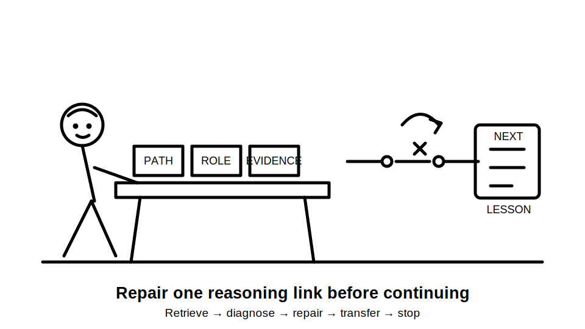
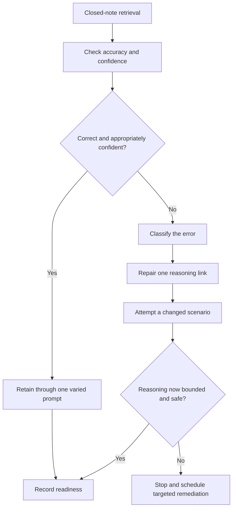
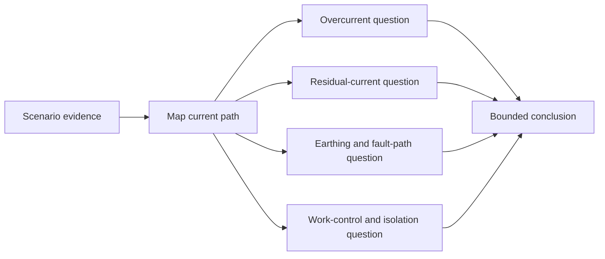

# Day 12 — Rest, Retrieval and Misconception Repair

> **Currency and scope notice:** This recovery block consolidates Days 8–11 through retrieval, confidence calibration and correction of misconceptions. It introduces no new electrical theory, device values, clause requirements, test procedures or practical instructions. Exact requirements remain `reference_check_required`. Current authorised standards, legislation, regulator guidance, manufacturer instructions, workplace procedures and RTO requirements remain controlling. This module is not `technically-reviewed`.

## 1. Outcome and entry check

### Learning objectives

By the end of this block, the learner should be able to:

1. retrieve the main distinctions from Days 8–11 without notes before rereading;
2. classify at least eight statements as supported, conditionally supported, unsupported or outside authority;
3. identify whether an error is a terminology, current-path, protection-role, evidence, confidence or safety-boundary error;
4. correct three priority misconceptions using a fresh scenario rather than repeating the original wording;
5. explain why an RCD, overcurrent device, earthing arrangement and safe-isolation process perform different functions;
6. replace universal protection claims with bounded statements that identify missing evidence;
7. apply a maximum 30-minute recovery protocol with explicit fatigue and stop conditions; and
8. make an evidence-based readiness decision for Day 13 using the stated rubric, without claiming technical approval.

### Entry check

Without notes, write one sentence for each prompt:

1. Distinguish overload, short circuit, earth-fault current and residual current.
2. Explain why a device name does not prove suitable operation.
3. State one function an RCD may contribute and three functions it does not automatically establish.
4. Explain why current path, monitored conductors and supply arrangement matter.
5. State the difference between a conceptual role statement and a verified operating claim.
6. Name two actions that remain outside learner authority in this written program.

Record confidence as **guessing**, **unsure**, **reasonably confident** or **certain** before checking prior work. Any incorrect answer marked **certain** becomes a priority misconception.

## 2. Why it matters

Recovery is not passive rereading. After several closely related protection modules, learners commonly remember device labels but merge the underlying functions. That creates high-confidence errors such as “the RCD makes the circuit safe,” “the breaker covers every fault,” or “earthing means current disappears into the ground.”

The purpose of this block is to reduce those errors before Day 13 requires independent evidence-based protection reasoning.

The central discipline is:

> **Retrieve first, diagnose the error, then repair only the weak link.**

This protects study quality by preventing two unhelpful extremes:

- attempting another full technical lesson while fatigued; and
- doing no structured retrieval and assuming familiarity equals competence.



## 3. Core concepts and terminology

### Retrieval

**Retrieval** is recalling information or a reasoning process without looking at the source. It tests whether the learner can produce the knowledge rather than merely recognise it.

### Misconception

A **misconception** is a stable but incorrect mental model. It differs from a simple omission because the learner may confidently apply the wrong rule across several scenarios.

### Confidence calibration

**Confidence calibration** compares how certain the learner feels with how accurate the answer is. A confident correct answer is useful evidence. A confident incorrect answer is a high-priority risk because the learner is less likely to seek verification.

### Error category

An **error category** identifies the part of the reasoning process that failed:

- **terminology error:** key terms are merged or used inaccurately;
- **current-path error:** the outgoing, return or alternative path is assumed rather than mapped;
- **protection-role error:** one protective function is treated as if it performs another;
- **evidence error:** a conclusion exceeds the facts, source evidence or device information supplied;
- **confidence error:** certainty is higher than the supporting evidence;
- **safety-boundary error:** the response proposes action outside authority or without required controls.

### Varied re-attempt

A **varied re-attempt** tests the same reasoning capability with changed wording, changed evidence or a different scenario. It is stronger than memorising the correction to the original question.

### Catch-up triage

**Catch-up triage** selects missed work by safety significance and prerequisite value rather than trying to complete everything at once. A short recovery block should repair the few gaps most likely to block the next module.

### Stop condition

A **stop condition** is a pre-agreed sign that further study is becoming unreliable or unsafe. Examples include repeated rereading without recall, rising frustration, worsening accuracy, inability to explain the task, or any proposal to perform unauthorised practical work.

### Readiness decision

A **readiness decision** is a bounded conclusion about whether the learner should progress, progress with support or complete targeted remediation first. It is not a statement of trade competence or qualified technical approval.

## 4. Rule-finding workflow

Use **R-E-P-A-I-R**:

1. **R — Retrieve without notes:** complete the short prompts before opening earlier modules.
2. **E — Examine accuracy and confidence:** compare each answer with the module concepts and record confidence mismatch.
3. **P — Pinpoint the error category:** identify the exact broken link rather than labelling the whole topic weak.
4. **A — Amend the mental model:** write a concise correction that separates terms, paths, functions, evidence and authority.
5. **I — Interleave a varied scenario:** test the correction in a changed context with one distracting fact.
6. **R — Record readiness and stop:** decide whether to progress, progress with support or schedule targeted remediation.



The model limits the recovery task. It does not direct the learner to relearn every module. It selects the smallest correction that can be tested through transfer.

### Misconception-repair record

```text
Prompt or scenario:
Initial answer:
Initial confidence:
Accuracy result:
Error category:
Broken reasoning link:
Corrected mental model:
Changed scenario used:
Re-attempt answer:
Evidence still missing:
Safety or authority boundary:
Readiness outcome:
```

## 5. Visual model or worked example

### Protection-function separation map



The diagram shows why one familiar device name cannot replace the other questions. Each branch addresses a different protection or work-control function, and each requires evidence appropriate to that function.

### Worked misconception repair

Initial statement:

> “An RCD is fitted, so the circuit is protected from overload and is safe to work on after it trips.”

Apply R-E-P-A-I-R:

1. **Retrieve:** the learner recalls that an RCD responds to a residual-current condition under defined circumstances.
2. **Examine:** the statement is incorrect and was marked **certain**.
3. **Pinpoint:** it contains a protection-role error, evidence error and safety-boundary error.
4. **Amend:** residual-current protection does not automatically establish overload protection, correct coverage, successful operation, fault clearance or safe isolation.
5. **Interleave:** change the scenario so an overcurrent device is also named but no ratings, arrangement, isolation evidence or authorised-source findings are supplied.
6. **Record:** the supported conclusion is limited to possible separate protection roles; suitability, operation and permission to work remain unverified.

Corrected bounded statement:

> The named RCD may contribute residual-current or additional protection, while the named overcurrent device may perform a different protective function. The information supplied does not establish correct selection, coordination, fault clearance or safe isolation, so no practical work or operating claim is authorised.

### Faded re-attempt

A new scenario names a circuit-breaker, an RCD and an earthing conductor, then states that a device operated. The learner must identify:

- which conclusions are merely plausible;
- which separate functions must not be merged;
- what device, installation, path and source evidence is missing; and
- why operation does not itself authorise reset or work.

## 6. Practical application

### Recovery protocol — maximum 30 minutes

Use a timer and stop at the limit even if unfinished.

#### Minutes 0–6 — closed-note retrieval

Complete the six entry prompts and draw from memory:

- one normal-current path;
- one possible earth-fault path;
- one residual-current comparison; and
- four separate protection or work-control functions.

#### Minutes 6–12 — misconception sort

Classify these statements:

1. “Overload and short circuit are identical because both involve high current.”
2. “A device label proves the device will operate correctly in this installation.”
3. “Residual current and earth-fault current can overlap but are not universal synonyms.”
4. “An RCD replaces the need for overcurrent protection.”
5. “A protective conductor may be relevant to a fault path, but the path must be supported.”
6. “A trip proves the circuit is isolated and safe to touch.”
7. “A changed supply arrangement can invalidate an earlier protection conclusion.”
8. “Missing monitored-conductor information should produce a bounded conclusion.”

Use these categories:

- supported;
- conditionally supported;
- unsupported;
- outside authority.

#### Minutes 12–20 — repair three priority errors

Choose no more than three items, prioritising:

1. safety-boundary errors;
2. high-confidence incorrect answers;
3. prerequisite errors that would block Day 13; then
4. lower-confidence terminology errors.

Complete one misconception-repair record for each.

#### Minutes 20–26 — varied application

Use one fresh fictional scenario containing:

- an abnormal current condition;
- one named protective device;
- incomplete current-path information;
- one changed supply or circuit fact; and
- one unsafe action proposed by another person.

Produce a bounded conclusion and reject the unsafe action.

#### Minutes 26–30 — readiness and shutdown

Select one outcome:

- **Ready:** retrieval and transfer are accurate, bounded and safe.
- **Ready with support:** one non-safety gap remains and is recorded for Day 13 scaffolding.
- **Not yet ready:** a safety, current-path or protection-role misconception remains; schedule targeted remediation before Day 13.

Then stop. Do not extend the session to compensate for missed work.

### Catch-up triage

Missed modules are not all equal. Prioritise:

1. unresolved safety and authority boundaries;
2. current-path distinctions from Day 9;
3. protection-role separation from Day 10;
4. RCD limitation and evidence reasoning from Day 11; and
5. optional extra examples.

Do not attempt more than one missed technical module during this recovery block.

### Performance rubric

Score each category from **0 to 2**:

| Category | 0 | 1 | 2 |
|---|---|---|---|
| Closed-note retrieval | mostly blank or copied after checking | partial recall with merged terms | accurate distinctions before checking |
| Error diagnosis | labels whole topic as weak | identifies a general issue | pinpoints the broken reasoning link and category |
| Misconception repair | repeats the correction | improves wording only | applies a corrected model in a varied scenario |
| Protection separation | merges device functions | separates some functions | clearly separates overcurrent, residual-current, earthing and work controls |
| Evidence and confidence | unsupported certainty remains | notes some gaps | calibrates confidence and states missing evidence precisely |
| Recovery and safety control | exceeds limits or proposes action | vague stop statement | follows time limit, authority boundary and explicit stop conditions |

A score of **10–12**, with no zero in protection separation, evidence and confidence, or recovery and safety control, supports progression. A lower result triggers targeted remediation rather than additional unstructured study.

## 7. Common errors and safety checkpoint

### Common errors

- rereading before attempting retrieval;
- correcting every weak item instead of the three highest-priority gaps;
- memorising corrected wording without testing a changed scenario;
- treating familiarity with a device name as evidence of understanding;
- merging overload, short-circuit, earth-fault and residual-current reasoning;
- treating RCD operation as proof of fault clearance, adequate earthing or safe isolation;
- using confidence as a substitute for source, device or installation evidence;
- extending study while fatigued because the block appears short;
- attempting practical checks, resets, measurements or equipment access.

### Safety checkpoint

Stop the study block when:

- two consecutive re-attempts become less accurate;
- the learner cannot explain the current path or protection function in plain language;
- concentration is reduced by fatigue, distress, interruption or workplace demands;
- a conclusion depends on an exact clause, value, device characteristic or test result not verified from an authorised source;
- the scenario would require opening equipment, isolation, measurement, testing, resetting, fault creation, alteration or energisation;
- damaged equipment, repeated protective-device operation, overheating or another immediate hazard is described.

This module authorises no switching, isolation, opening, measurement, testing, resetting, fault creation, alteration, repair, energisation, commissioning or verification. Use `reference_check_required` and escalate rather than guessing.

## 8. Retrieval and next links

### Closed-note retrieval

1. Define retrieval, misconception, confidence calibration and varied re-attempt.
2. Recite R-E-P-A-I-R and explain each step.
3. Name the six error categories.
4. Distinguish a device role statement from a verified operating claim.
5. Explain why RCD, overcurrent, earthing and isolation questions remain separate.
6. State the three catch-up priorities before optional examples.
7. Give four fatigue or safety stop conditions.
8. Explain the difference between **ready**, **ready with support** and **not yet ready**.

### Exit task

Submit:

- the closed-note entry check;
- the misconception sort;
- no more than three completed repair records;
- one varied scenario response;
- confidence ratings before and after correction;
- the readiness decision; and
- one specific support need for Day 13, or “none identified.”

### Navigation

- **Plan:** [Twelve-Week Capstone Learning Plan](../MASTER_PLAN.md)
- **Knowledge note:** [[12-Week Day 12 - Rest Retrieval and Misconception Repair]]
- **Previous:** [Day 11 — RCD Purpose, Limitations and Interaction with Other Protection](day-11-rcd-purpose-limitations-and-interaction-with-other-protection.md)
- **Next:** Day 13 — Protection-Selection Evidence Workflow Using Original Scenarios

### Reference and currency notice

This module uses original retrieval prompts, error categories, recovery controls, scenarios, diagrams and assessment tools. It does not reproduce standards tables, figures, device curves, systematic clause wording, exact technical values or official assessment material. Current authorised sources and qualified review remain required before any protection selection, operating claim or practical procedure is used beyond this written recovery context.