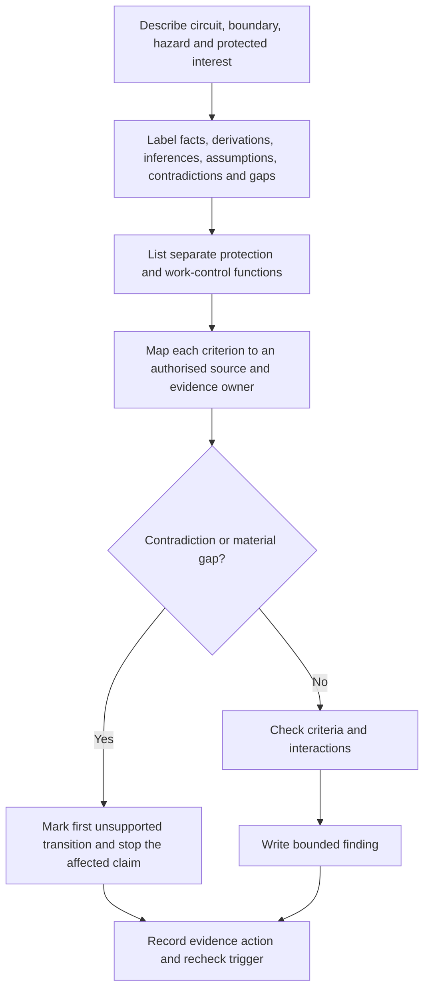
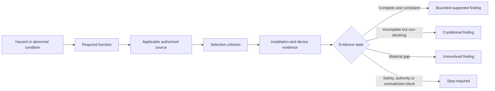

# Day 13 — Protection-Selection Evidence Workflow Using Original Scenarios

> **Currency and scope notice:** This module teaches a written evidence workflow for fictional protection-selection scenarios. It does not provide device ratings, cable sizes, fault-current values, operating times, clause answers, test procedures or authority to select, install, reset, test or alter equipment. Exact requirements remain `reference_check_required`. Current authorised standards, legislation, regulator guidance, manufacturer instructions, workplace procedures and RTO requirements remain controlling. This module is not `technically-reviewed`.

## 1. Outcome and entry check

### Learning objectives

By the end of this module, the learner should be able to:

1. convert a fictional circuit description into a structured protection-evidence record;
2. distinguish stated facts, derived facts, supported inferences, assumptions, contradictions and evidence gaps;
3. identify the protected interest and required protection function before naming a device;
4. keep overload, short-circuit, fault/disconnection, residual-current, coordination and work-control questions separate;
5. map every material criterion to an authorised source category and evidence owner;
6. identify the first unsupported transition in a proposed conclusion;
7. write a supported, conditional, unresolved or `stop-required` conclusion whose certainty matches the evidence;
8. identify changed conditions and recheck triggers that reopen an earlier finding; and
9. reject unsafe requests to energise, reset, test, inspect internally or alter equipment.

### Entry check

Without notes, answer:

1. Why does a protective-device name not prove suitability?
2. Distinguish overload current from short-circuit current.
3. State one role an RCD may contribute and two conclusions it does not automatically prove.
4. What is the difference between a stated fact, a supported inference and an assumption?
5. What should happen when supply arrangement, circuit identity or a material current path is unclear?
6. Name two actions this written module does not authorise.

Mark each answer **confident**, **partly confident** or **guessing**. A confident but unsupported or unsafe response becomes a priority correction; confidence does not increase evidence quality.

## 2. Why it matters

Protection questions are often answered backwards: a familiar device is named first and evidence is searched for later. That approach hides missing information, encourages confirmation bias and can turn a plausible label into an unsupported operating or suitability claim.

A defensible process starts with the hazard and protected interest, identifies each required function, maps relevant current paths and then asks which authorised evidence is needed to support each material criterion.

> **Select the evidence path before attempting a protection conclusion.**

A correct-looking choice supported by weak reasoning is not reliable evidence of learning. Changes in load, conductor, installation method, supply arrangement, fault level, device characteristic, circuit use or source configuration can invalidate an earlier finding.


*The bridge is complete only when every material step is supported. A missing span is a stop point, not an invitation to jump to a device conclusion.*

## 3. Core concepts and terminology

- **Protected interest:** the person, conductor, equipment, property or continuity objective that a protective measure is intended to safeguard.
- **Protection function:** the specific job required, such as overload response, short-circuit interruption, fault-disconnection support, residual-current protection, coordination or work control through isolation.
- **Selection criterion:** a condition that must be checked before a device or arrangement can be considered suitable.
- **Stated fact:** information explicitly supplied by the scenario or an identified authorised record.
- **Derived fact:** information calculated or logically obtained from stated facts using a visible method.
- **Supported inference:** a conclusion reasonably drawn from identified evidence while remaining open to contrary evidence.
- **Assumption:** information treated as true without adequate support.
- **Contradiction:** evidence that conflicts with another stated item, interpretation or proposed conclusion.
- **Evidence gap:** material information required before a criterion can be resolved.
- **Evidence owner:** the authorised person, record or source expected to resolve a named gap.
- **Evidence chain:** the connection from scenario and applicable source through criterion and evidence to conclusion.
- **First unsupported transition:** the earliest step where reasoning moves from supported material to an unverified claim.
- **Applicability:** whether the source or requirement governs the described installation context.
- **Completeness:** whether all material protection functions, interactions and boundary conditions have been considered.
- **Bounded conclusion:** a finding limited to what the evidence supports, with unresolved matters stated.
- **Recheck trigger:** a changed fact, source, condition or contradiction that requires the decision to be assessed again.
- **Blocking condition:** a safety, authority, contradiction or evidence failure that prevents progression regardless of strengths elsewhere.

## 4. Rule-finding workflow

Use **S-E-L-E-C-T**:

1. **S — State the scenario and protected interest:** identify the circuit purpose, boundary, abnormal condition and what may require protection.
2. **E — Extract and label evidence:** separate stated facts, derived facts, supported inferences, assumptions, contradictions and evidence gaps.
3. **L — List the required functions:** consider overload, short circuit, fault path and disconnection, residual-current protection, coordination and work control without merging their evidence requirements.
4. **E — Establish source applicability and ownership:** identify the current authorised source category for each criterion and who or what can resolve each gap.
5. **C — Check criteria, conflicts and transitions:** test each function against available evidence, compare competing interpretations and mark the first unsupported transition.
6. **T — Tell a bounded conclusion and triggers:** state what is supported, conditional, unresolved or `stop-required`; identify recheck triggers, authority limits and the next authorised evidence action.



The diagram shows that missing or contradictory evidence is a valid result. Only the affected claim stops; unrelated supported facts may still be recorded, but they cannot be used to bypass the gap.

### Protection-evidence record

```text
Scenario identifier:
Circuit purpose and boundary:
Hazard or abnormal condition:
Protected interest:
Stated facts and source:
Derived facts and visible method:
Supported inferences:
Assumptions to remove:
Contradictions:
Evidence gaps:
Protection functions considered:
Authorised source category for each criterion:
Evidence owner for each material gap:
Competing interpretations:
First unsupported transition:
Supported findings:
Conditional findings:
Unresolved or stop-required findings:
Recheck triggers:
Safety and authority boundary:
Next authorised evidence action:
```

## 5. Visual model or worked example



Each protection decision should be traceable through this sequence. A device label without installation evidence cannot complete the chain, and a contradiction cannot be averaged away by other strong evidence.

### Worked original scenario

A fictional workshop circuit supplies a fixed machine. A circuit-breaker and an RCD are listed. A recorded design current is supplied, but conductor capacity, installation method, device characteristic, prospective fault-current evidence, supply arrangement, circuit coverage, coordination information and verification records are missing. One record identifies the circuit as dedicated; another appears to show an additional outlet. A person proposes resetting the operated device and restarting the machine.

Apply S-E-L-E-C-T:

1. **State:** people, conductors, equipment and property may be protected interests; the cause of operation is unknown.
2. **Extract:** the named devices and recorded design current are stated facts. Suitability, coverage and cause are not. The two circuit descriptions form a contradiction requiring ownership and resolution.
3. **List:** overload, short-circuit, fault/disconnection, residual-current, coordination and work-control questions remain separate.
4. **Establish:** authorised installation requirements, manufacturer data, supply information, workplace isolation procedures and current circuit records are required. Assign an authorised record owner for the circuit-identity conflict.
5. **Check:** the first unsupported transition occurs when device presence is treated as proof of suitability or safe restart. Material criteria and circuit identity remain unresolved.
6. **Tell:** only the recorded presence of named devices and the recorded design current are supported. Reset, restart, safe-isolation, fault-clearance, circuit-coverage and suitability claims are `stop-required` or unresolved. Escalate through the authorised workplace process.

### Worked-example fading

For a second fictional scenario, complete only these headings:

- circuit purpose, boundary and protected interest;
- evidence labels and contradiction check;
- separate protection functions;
- applicable source categories and evidence owners;
- first unsupported transition;
- bounded conclusion; and
- recheck triggers.

A device recommendation is not accepted unless the evidence chain is complete for the stated educational conclusion and the result remains subject to qualified review.

## 6. Practical application

### Scenario A — altered load

A fictional final subcircuit was documented for one fixed load. The equipment is replaced. The circuit-breaker label is unchanged, and no updated load data, conductor record, installation method, manufacturer information or design review is supplied.

Produce a protection-evidence record that identifies the changed load as a recheck trigger, separates labels from verified characteristics, names evidence owners for overload and short-circuit questions, keeps residual-current, fault-path and isolation questions separate, and states the first unsupported transition.

### Scenario B — changed supply arrangement

A fictional installation gains an alternative supply. A previous protection note covered only the original supply. No updated fault-level, earthing arrangement, coordination, source-switching or manufacturer evidence is supplied.

Explain why the earlier conclusion cannot be carried forward. Record at least two competing interpretations, identify the source and installation evidence categories that must be rechecked, and assign an evidence owner to each material gap.

### Scenario C — incomplete and conflicting records

A fictional inspection record lists device names and ratings but omits circuit identification, conductor details, verification evidence, supply conditions and defect context. A second record gives a different circuit description. A supervisor asks whether the circuit “passes.”

Classify the available items, record the contradiction, identify the first unsupported transition and state why the records cannot support approval, certification or safe-operation claims.

### Assessment task

Complete one original scenario containing a defined circuit purpose, at least two changed material conditions, two named protection measures, one irrelevant fact, one contradiction, incomplete installation evidence and one proposed unsafe action.

Submit:

- a complete S-E-L-E-C-T record;
- an evidence matrix with at least six material rows;
- one competing interpretation;
- the first unsupported transition;
- a supported, conditional, unresolved or `stop-required` conclusion for each material claim;
- at least three recheck triggers;
- an evidence owner for every unresolved material gap; and
- explicit rejection of the unsafe action.

### Criterion-level performance states

| Criterion | Secure | Developing | Unsupported | `stop-required` |
|---|---|---|---|---|
| Scenario framing | Defines circuit purpose, boundary, hazard and protected interest | Context is present but one material boundary is unclear | Device-first or materially vague | Proceeds despite an immediate hazard or unknown authority boundary |
| Evidence control | Consistently labels facts, derivations, inferences, assumptions, contradictions and gaps | Most labels are correct but one non-blocking item needs correction | Treats assumptions or conflicting records as facts | Conceals or ignores a material contradiction or safety-critical gap |
| Protection separation | Keeps all material functions and evidence needs distinct | One interaction needs clarification | Merges functions or treats one device as universal protection | Uses the merged claim to justify practical action or safe-operation certainty |
| Source and ownership | Maps each criterion to an applicable source category and each gap to an evidence owner | Mapping is substantially complete but one owner or trigger is vague | Invents requirements or leaves material gaps ownerless | Relies on an unverified exact requirement for a safety-critical conclusion |
| Reasoning boundary | Identifies the first unsupported transition and bounds each conclusion | Conclusion is cautious but the transition is imprecise | Gives approval or suitability language unsupported by evidence | Claims compliance, certification, safe restart or verified operation |
| Transfer and recheck | Rebuilds the evidence chain after at least two material changes | Detects changes but carries one old assumption forward | Treats the previous conclusion as permanent | Ignores a changed supply, circuit identity, fault path or immediate hazard |
| Safety and authority | Rejects unsafe action and states an authorised escalation path | Boundary is correct but escalation ownership is vague | Gives generic caution while proposing practical action | Proposes reset, access, testing, alteration, energisation or sign-off |

Progression is based on the pattern of evidence, not an aggregate score. Any `stop-required` outcome blocks progression until corrected. An **unsupported** outcome in evidence control, protection separation, reasoning boundary or safety and authority requires a targeted varied re-attempt. Strong performance in another criterion cannot cancel a blocking failure.

## 7. Common errors and safety checkpoint

### Common errors

- choosing a familiar device before identifying the protection function;
- treating a rating label as proof of characteristic, condition, coverage or suitability;
- combining overload, short-circuit, fault/disconnection and residual-current questions;
- treating a supported inference as a stated fact;
- ignoring contradictory circuit or supply records;
- inventing clause numbers or technical values from memory;
- using calculations based on unsupported inputs;
- carrying a conclusion across changed supply, fault level, conductor, installation method or circuit use;
- treating device operation as proof that the cause is known or the circuit is safe;
- presenting an educational conclusion as technical approval; or
- proposing reset, energisation, testing, access or alteration outside authority.

### Safety checkpoint

Stop and escalate when:

- damaged equipment, overheating, repeated operation, exposed parts or another immediate hazard is described;
- the scenario requires opening equipment, isolation, proving, measurement, testing, resetting, alteration, energisation or commissioning;
- a conclusion depends on an exact clause, value, characteristic, test result or supply condition that has not been verified;
- material records contradict each other and the conflict is unresolved;
- the supply arrangement, circuit identity or current path cannot be established from authorised evidence; or
- the learner is asked to approve, certify or sign off work.

This module authorises no selection for construction, switching, isolation, opening, proving, measurement, testing, resetting, fault creation, alteration, repair, energisation, commissioning, certification or verification.

## 8. Retrieval and next links

### Closed-note retrieval

1. Recite S-E-L-E-C-T and explain each step.
2. Define protected interest, protection function, selection criterion and evidence chain.
3. Distinguish stated fact, derived fact, supported inference, assumption, contradiction and evidence gap.
4. Explain the first unsupported transition.
5. Explain the difference between applicability and completeness.
6. Give five separate protection or work-control questions.
7. State why a named device does not prove suitability.
8. Give four recheck triggers and name a suitable evidence owner for each.
9. Explain why a contradiction or `stop-required` result cannot be averaged away.

### Exit task

Submit the entry check with confidence ratings, one complete protection-evidence record, the evidence matrix, criterion-level states, one varied transfer attempt, three recheck triggers, evidence owners for unresolved material gaps and one support need for Day 14 or “none identified.”

### Navigation

- **Plan:** [Twelve-Week Capstone Learning Plan](../MASTER_PLAN.md)
- **Knowledge note:** [[12-Week Day 13 - Protection-Selection Evidence Workflow Using Original Scenarios]]
- **Previous:** [Day 12 — Rest, Retrieval and Misconception Repair](day-12-rest-retrieval-and-misconception-repair.md)
- **Next:** [Day 14 — Week 2 Protection Integration Checkpoint](day-14-week-2-protection-integration-checkpoint.md)

### Reference and currency notice

This module uses original workflows, scenarios, diagrams, evidence records and assessment tools. It does not reproduce standards tables, figures, device curves, systematic clause wording, exact technical values or official assessment material. Current authorised sources and qualified review remain required before any protection selection, installation decision, operating claim or practical procedure is used beyond this written educational context.