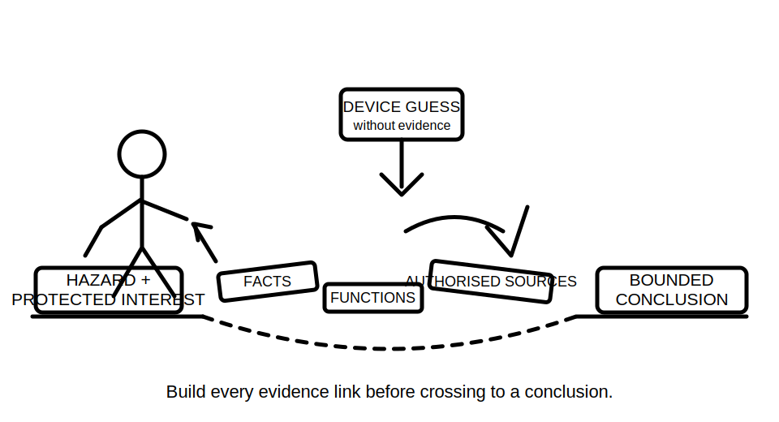
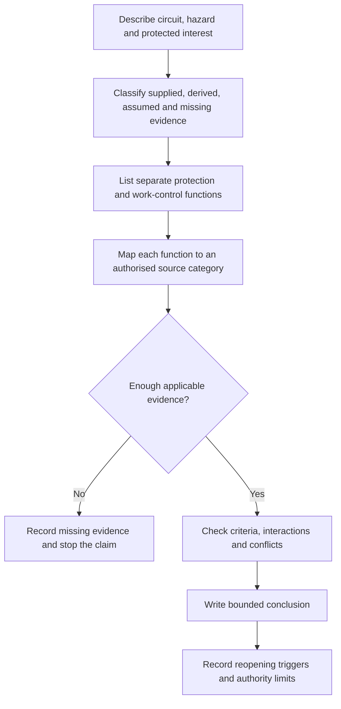
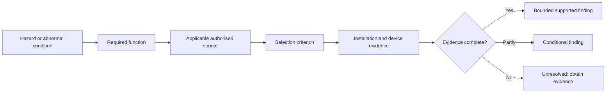

# Day 13 — Protection-Selection Evidence Workflow Using Original Scenarios

> **Currency and scope notice:** This module teaches a written evidence workflow for fictional protection-selection scenarios. It does not provide device ratings, cable sizes, fault-current values, operating times, clause answers, test procedures or authority to select, install, reset, test or alter equipment. Exact requirements remain `reference_check_required`. Current authorised standards, legislation, regulator guidance, manufacturer instructions, workplace procedures and RTO requirements remain controlling. This module is not `technically-reviewed`.

## 1. Outcome and entry check

### Learning objectives

By the end of this module, the learner should be able to:

1. convert a fictional circuit description into a structured protection-evidence record;
2. distinguish supplied facts, derived facts, assumptions and missing evidence;
3. identify the protected interest and required protection function before naming a device;
4. separate overload, short-circuit, earth-fault, residual-current and work-control questions;
5. identify the authorised source categories needed to verify each protection criterion;
6. write a supported, conditional or unresolved conclusion whose certainty matches the evidence;
7. identify at least three changes that would reopen an earlier conclusion;
8. reject unsafe requests to energise, reset, test or alter equipment; and
9. score at least 10 of 12 on the assessment rubric, with no zero in evidence control, protection separation or safety boundary.

### Entry check

Without notes, answer:

1. Why does a protective-device name not prove suitability?
2. Distinguish overload current from short-circuit current.
3. State one role an RCD may contribute and two conclusions it does not automatically prove.
4. What is the difference between a supplied fact and an assumption?
5. What should happen when the supply arrangement or fault path is unclear?
6. Name two actions this written module does not authorise.

Mark each answer **confident**, **partly confident** or **guessing**. A confident but incorrect response becomes a priority correction.

## 2. Why it matters

Protection questions are often answered backwards: a familiar device is named first and evidence is searched for later. That approach hides missing information and encourages unsafe certainty.

A defensible process starts with the hazard and protected interest, identifies the required function, maps the current path and then asks what authorised evidence is needed to verify a device or arrangement.

> **Select the evidence path before attempting a protection conclusion.**

A correct-looking choice supported by weak reasoning is not reliable evidence of competence. Changes in load, conductor, installation method, supply arrangement, fault level, device characteristic or circuit use can invalidate an earlier conclusion.



## 3. Core concepts and terminology

- **Protected interest:** the person, conductor, equipment, property or continuity objective that a protective measure is intended to safeguard.
- **Protection function:** the specific job required, such as overload response, short-circuit interruption, fault disconnection support, residual-current protection or work control through isolation.
- **Selection criterion:** a condition that must be checked before a device or arrangement can be considered suitable.
- **Supplied fact:** information explicitly stated in the scenario or an authorised record.
- **Derived fact:** information calculated or logically obtained from supplied facts using a stated method.
- **Assumption:** information treated as true without adequate support.
- **Missing evidence:** information required before the conclusion can be verified.
- **Evidence chain:** the connection from scenario and applicable source through criterion and evidence to conclusion.
- **Applicability:** whether the source or requirement governs the described installation context.
- **Completeness:** whether all material protection functions and boundary conditions have been considered.
- **Bounded conclusion:** a finding limited to what the evidence supports, with unresolved matters stated.
- **Reopening trigger:** a changed fact that requires the decision to be checked again.

## 4. Rule-finding workflow

Use **S-E-L-E-C-T**:

1. **S — State the scenario and protected interest:** identify the circuit purpose, hazard and what must be protected.
2. **E — Extract and classify evidence:** separate supplied facts, derived facts, assumptions and missing evidence.
3. **L — List the required functions:** consider overload, short circuit, fault path and disconnection, residual-current protection, coordination and work control without assuming all apply identically.
4. **E — Establish source applicability:** identify the current authorised standard, legislation, network rule, manufacturer data, workplace procedure or RTO requirement needed for each criterion.
5. **C — Check criteria and conflicts:** test each function against available evidence and stop where a value, characteristic or arrangement is unverified.
6. **T — Tell a bounded conclusion and triggers:** state what is supported, what remains unresolved, what would reopen the decision and what actions remain outside authority.



The diagram shows that missing evidence is a valid outcome. It is not permission to guess.

### Protection-evidence record

```text
Scenario identifier:
Circuit purpose and boundary:
Hazard or abnormal condition:
Protected interest:
Supplied facts:
Derived facts and method:
Assumptions to remove:
Missing evidence:
Protection functions considered:
Authorised source category for each function:
Selection criteria requiring verification:
Interactions or conflicts:
Supported findings:
Conditional findings:
Unresolved findings:
Reopening triggers:
Safety and authority boundary:
Next authorised action:
```

## 5. Visual model or worked example



Each protection decision should be traceable through this sequence. A device label without installation evidence cannot complete the chain.

### Worked original scenario

A fictional workshop circuit supplies a fixed machine. A circuit-breaker and an RCD are listed. A recorded design current is supplied, but conductor capacity, installation method, device characteristic, prospective fault-current evidence, supply arrangement, circuit coverage, coordination information and verification records are missing. Another person proposes resetting the operated device and restarting the machine.

Apply S-E-L-E-C-T:

1. **State:** people, conductors, equipment and property may be protected interests; the cause of operation is unknown.
2. **Extract:** the named devices and recorded design current are supplied facts. Suitability, coverage and cause are not.
3. **List:** overload, short-circuit, earth-fault/disconnection, residual-current, coordination and work-control questions remain separate.
4. **Establish:** authorised installation requirements, manufacturer data, supply information, workplace isolation procedures and relevant records are required.
5. **Check:** material criteria are missing, so no verified selection or operating conclusion is available.
6. **Tell:** only the recorded presence of named devices is supported. Reset, restart, safe-isolation, fault-clearance and suitability claims are unsupported. Escalate through the authorised workplace process.

### Worked-example fading

For a second fictional scenario, complete only these headings:

- circuit purpose and protected interest;
- supplied versus missing evidence;
- protection functions;
- applicable source categories;
- bounded conclusion; and
- reopening triggers.

A device recommendation is not accepted unless evidence is sufficient and the conclusion is clearly labelled as an educational finding requiring qualified review.

## 6. Practical application

### Scenario A — altered load

A fictional final subcircuit was documented for one fixed load. The equipment is replaced. The circuit-breaker label is unchanged, and no updated load data, conductor record, installation method, manufacturer information or design review is supplied.

Produce a protection-evidence record that identifies the changed load as a reopening trigger, separates labels from verified characteristics, lists evidence needed for overload and short-circuit reasoning, keeps residual-current, fault-path and isolation questions separate, and states a bounded next action.

### Scenario B — changed supply arrangement

A fictional installation gains an alternative supply. A previous protection note covered only the original supply. No updated fault-level, earthing arrangement, coordination, source-switching or manufacturer evidence is supplied.

Explain why the earlier conclusion cannot be carried forward and identify the source and installation evidence categories that must be rechecked.

### Scenario C — incomplete inspection record

A fictional inspection record lists device names and ratings but omits circuit identification, conductor details, test evidence, supply conditions and defect context. A supervisor asks whether the circuit “passes.”

Classify the available items, identify missing evidence and state why the record cannot support an approval claim.

### Assessment task

Complete one original scenario containing a defined circuit purpose, one changed condition, at least two named protection measures, one irrelevant fact, incomplete installation evidence and one proposed unsafe action.

Submit a completed S-E-L-E-C-T record, an evidence matrix with at least five rows, a bounded conclusion, three reopening triggers and rejection of the unsafe action.

### Performance rubric

| Category | 0 | 1 | 2 |
|---|---|---|---|
| Scenario framing | device-first or vague | identifies some context | states circuit, hazard and protected interest clearly |
| Evidence classification | assumptions treated as facts | some categories separated | supplied, derived, assumed and missing evidence are consistently separated |
| Protection separation | merges functions | separates some functions | overload, short-circuit, fault/disconnection, residual-current and work control remain distinct |
| Source and criteria mapping | invents requirements | identifies broad sources | maps each function to applicable source and criterion categories |
| Conclusion and triggers | unsupported approval claim | conclusion partly bounded | supported, conditional and unresolved findings plus reopening triggers are explicit |
| Safety and authority | proposes reset, testing or work | vague caution | rejects unsafe action and states the authorised escalation path |

A score of **10–12**, with no zero in evidence classification, protection separation, or safety and authority, supports progression to Day 14. Otherwise complete one targeted varied re-attempt.

## 7. Common errors and safety checkpoint

### Common errors

- choosing a familiar device before identifying the protection function;
- treating a rating label as proof of characteristic, condition, coverage or suitability;
- combining overload, short-circuit, earth-fault and residual-current questions;
- inventing clause numbers or technical values from memory;
- using calculations based on unsupported inputs;
- ignoring changes in supply, fault level, conductor or installation method;
- treating device operation as proof that the cause is known or the circuit is safe;
- presenting an educational conclusion as technical approval;
- proposing reset, energisation, testing, access or alteration outside authority.

### Safety checkpoint

Stop and escalate when:

- damaged equipment, overheating, repeated operation, exposed parts or another immediate hazard is described;
- the scenario requires opening equipment, isolation, proving, measurement, testing, resetting, alteration, energisation or commissioning;
- a conclusion depends on an exact clause, value, characteristic, test result or supply condition that has not been verified;
- the supply arrangement, circuit identity or current path cannot be established from authorised evidence; or
- the learner is asked to approve, certify or sign off work.

This module authorises no selection for construction, switching, isolation, opening, proving, measurement, testing, resetting, fault creation, alteration, repair, energisation, commissioning, certification or verification.

## 8. Retrieval and next links

### Closed-note retrieval

1. Recite S-E-L-E-C-T and explain each step.
2. Define protected interest, protection function, selection criterion and evidence chain.
3. Name the four evidence classes.
4. Explain the difference between applicability and completeness.
5. Give five separate protection or work-control questions.
6. State why a named device does not prove suitability.
7. Give four reopening triggers.
8. Write one bounded conclusion for a scenario with missing evidence.

### Exit task

Submit the entry check with confidence ratings, one complete protection-evidence record, the evidence matrix, the rubric score and one correction target, three reopening triggers, and one support need for Day 14 or “none identified.”

### Navigation

- **Plan:** [Twelve-Week Capstone Learning Plan](../MASTER_PLAN.md)
- **Knowledge note:** [[12-Week Day 13 - Protection-Selection Evidence Workflow Using Original Scenarios]]
- **Previous:** [Day 12 — Rest, Retrieval and Misconception Repair](day-12-rest-retrieval-and-misconception-repair.md)
- **Next:** Day 14 — Week 2 Protection Integration Checkpoint

### Reference and currency notice

This module uses original workflows, scenarios, diagrams, evidence records and assessment tools. It does not reproduce standards tables, figures, device curves, systematic clause wording, exact technical values or official assessment material. Current authorised sources and qualified review remain required before any protection selection, installation decision, operating claim or practical procedure is used beyond this written educational context.
