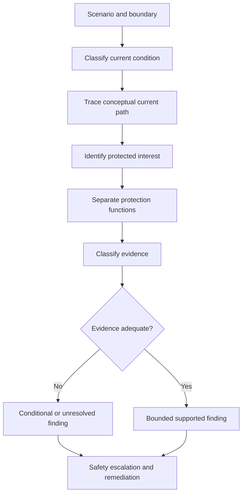
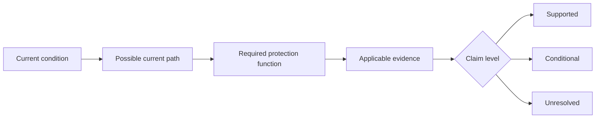

# Day 14 — Week 2 Protection Integration Checkpoint

> **Currency and scope notice:** This checkpoint assesses written reasoning with fictional scenarios. It supplies no clause answers, device ratings, conductor sizes, fault-current values, operating times, test procedures or practical authority. Exact requirements remain `reference_check_required`. Current authorised standards, legislation, regulator guidance, manufacturer instructions, workplace procedures and RTO requirements remain controlling. This module is not `technically-reviewed`.

## 1. Outcome and entry check

### Learning objectives

By the end of this checkpoint, the learner should be able to:

1. classify a described current condition as normal load, overload, short circuit, earth fault, residual-current imbalance or unresolved;
2. identify the protected interest and required protection function before naming a device;
3. distinguish overcurrent protection, residual-current protection, earthing support and work-control functions;
4. separate supplied facts, derived facts, assumptions and missing evidence;
5. construct a current-path sketch without treating it as proof of magnitude or device operation;
6. write supported, conditional and unresolved findings whose certainty matches the evidence;
7. identify a misconception, explain its consequence and state a corrective action;
8. reject unsafe reset, test, access, energisation or approval requests; and
9. score at least 16 of 20, with no zero in current-path reasoning, evidence control or safety boundary.

### Entry check

Without notes, answer:

1. Why can the same device name appear in scenarios requiring different reasoning?
2. Distinguish overload current from short-circuit current.
3. What does an RCD compare, and what does its presence not prove?
4. Why is a conceptual fault path not proof of disconnection?
5. Name the four evidence classes used in Day 13.
6. State two actions this checkpoint does not authorise.

Rate each answer **confident**, **partly confident** or **guessing**. A confident but incorrect answer becomes the first remediation target.

## 2. Why it matters

Capstone-style questions rarely test one isolated definition. They combine circuit purpose, abnormal current, protection roles, evidence quality and safety boundaries. Learners who recognise individual terms but cannot connect them may select a familiar device, invent a missing fact or treat device operation as proof that the installation is safe.

This checkpoint tests the complete reasoning chain before Week 3 introduces deeper earthing and MEN mental models.

## 3. Core concepts and terminology

- **Integration:** combining previously learned concepts into one coherent response.
- **Current condition:** the described state of current flow, such as normal load, overload, short circuit, earth fault or residual-current imbalance.
- **Current path:** the route through which current is described or inferred to flow.
- **Protection function:** the specific protective job required, independent of device name.
- **Protected interest:** the person, conductor, equipment, property or continuity objective being safeguarded.
- **Evidence class:** supplied fact, derived fact, assumption or missing evidence.
- **Claim level:** supported, conditional or unresolved, according to evidence quality and completeness.
- **Misconception:** a stable but incorrect mental model that can produce repeated errors.
- **Remediation:** targeted correction followed by a varied re-attempt.
- **Reopening trigger:** a changed fact that requires an earlier conclusion to be reconsidered.

## 4. Rule-finding workflow

Use **I-N-T-E-G-R-A-T-E**:

1. **I — Identify the scenario boundary:** state the circuit purpose, described event and information limits.
2. **N — Name the current condition:** classify it or mark it unresolved.
3. **T — Trace the conceptual path:** sketch the possible loop while separating path from magnitude and outcome.
4. **E — Establish the protected interest:** identify what or who requires protection.
5. **G — Group the required functions:** keep overload, short-circuit, fault/disconnection, residual-current and work-control functions distinct.
6. **R — Record the evidence classes:** separate supplied, derived, assumed and missing information.
7. **A — Apply authorised source categories:** identify where exact requirements would be verified.
8. **T — Tell a bounded conclusion:** state supported, conditional and unresolved findings.
9. **E — Escalate and remediate:** reject unsafe action, record one misconception and prescribe one varied re-attempt.

The workflow prevents one familiar device or remembered phrase from replacing the full reasoning chain.

## 5. Visual model or worked example

The diagram shows four separate questions. A plausible path does not establish current magnitude, suitability, operating time or safe condition.

### Worked original scenario

A fictional final subcircuit supplies a fixed heater. The recorded load has increased since the original design. A circuit-breaker and an RCD are listed, but conductor capacity, installation method, device characteristic, supply arrangement, fault-path evidence and verification records are absent. The protective device has operated twice, and someone proposes resetting it again.

Apply I-N-T-E-G-R-A-T-E:

1. **Identify:** changed load, repeated operation and incomplete records define the boundary.
2. **Name:** overload is plausible, but short circuit, earth fault and other causes remain unresolved.
3. **Trace:** sketch normal and possible abnormal paths without assigning values.
4. **Establish:** people, conductors, equipment and property may be protected interests.
5. **Group:** overcurrent, residual-current, fault/disconnection and work-control questions remain distinct.
6. **Record:** device names and repeated operation are supplied facts; suitability and cause are not.
7. **Apply:** current authorised requirements, manufacturer data, supply information, workplace procedures and verified records are required.
8. **Tell:** no reset, suitability or safe-operation conclusion is supported.
9. **Escalate:** stop the proposed reset and refer through the authorised workplace process.

## 6. Practical application

### Checkpoint task A — classification matrix

For four fictional descriptions, complete:

| Field | Required response |
|---|---|
| Current condition | classified or unresolved |
| Conceptual path | concise text or sketch |
| Protected interest | specific person, conductor, equipment, property or continuity objective |
| Protection function | stated without relying on device name |
| Evidence gaps | at least two |
| Claim level | supported, conditional or unresolved |
| Safety boundary | explicit stop or escalation point |

### Checkpoint task B — integrated scenario

Create one original scenario containing:

- a defined circuit purpose;
- one changed condition;
- one named overcurrent device and one named residual-current device;
- incomplete installation evidence;
- one misleading but irrelevant fact; and
- one proposed unsafe action.

Submit an I-N-T-E-G-R-A-T-E record, one current-path sketch, an evidence matrix, a bounded conclusion, three reopening triggers and one remediation action.

### Checkpoint task C — misconception repair

Choose one statement and correct it:

- “The RCD protects the cable from every overcurrent.”
- “The breaker tripped, so the fault is fixed.”
- “A drawn earth-fault path proves the required disconnection time.”
- “The rating label proves the device is suitable.”

For the selected statement, identify the misconception, likely consequence, missing evidence and a safer replacement statement.

### Performance rubric

| Category | 0 | 1 | 2 |
|---|---|---|---|
| Scenario boundary | vague or invented | partly defined | purpose, change and limits explicit |
| Current classification | incorrect certainty | partly correct | accurate or appropriately unresolved |
| Current-path reasoning | path confused with outcome | plausible but incomplete | path separated from magnitude and operation |
| Protected interest and function | device-first | partly separated | both identified before device reasoning |
| Protection separation | functions merged | some distinctions | all material functions kept distinct |
| Evidence control | assumptions treated as facts | some gaps found | all four evidence classes used consistently |
| Source workflow | invented clause or value | broad source named | applicable source categories mapped clearly |
| Bounded conclusion | approval or reset claim | partly bounded | supported, conditional and unresolved findings explicit |
| Misconception repair | repeats error | correction without transfer | error, consequence and varied correction complete |
| Safety boundary | unsafe action proposed | vague caution | stop condition and escalation explicit |

A score of **16–20**, with no zero in current-path reasoning, evidence control or safety boundary, supports progression. Otherwise complete one varied remediation attempt before Day 15.

## 7. Common errors and safety checkpoint

### Common errors

- naming a device before identifying the hazard and function;
- treating a current-path drawing as proof of magnitude or operation;
- merging overload, short circuit, earth fault and residual-current imbalance;
- treating an RCD as a substitute for overcurrent protection or safe isolation;
- treating repeated operation as permission to reset;
- using a label as proof of characteristic, condition or suitability;
- inventing clauses, values or assessment rules;
- hiding missing evidence behind confident language;
- presenting an educational response as technical approval.

### Safety checkpoint

Stop and escalate when:

- repeated operation, overheating, damage, exposed parts or another immediate hazard is described;
- the task requires opening, isolation, proving, measurement, testing, resetting, alteration or energisation;
- the supply arrangement, circuit identity or current path cannot be established from authorised evidence;
- an exact clause, value, characteristic, test result or operating time is unverified; or
- the learner is asked to approve, certify or sign off work.

This checkpoint authorises no switching, isolation, opening, proving, measurement, testing, resetting, fault creation, alteration, repair, energisation, commissioning, certification or verification.

## 8. Retrieval and next links

### Closed-note retrieval

1. Recite I-N-T-E-G-R-A-T-E and explain each step.
2. Name six possible current-condition classifications.
3. Explain why path, magnitude and protective outcome are separate claims.
4. Distinguish overcurrent protection from residual-current protection.
5. Name the four evidence classes.
6. Define supported, conditional and unresolved findings.
7. Give four reopening triggers.
8. State three stop conditions.

### Exit task

Submit the entry check with confidence ratings, all three checkpoint tasks, the rubric score, one corrected misconception, one remediation commitment if required, and one support need for Day 15 or “none identified.”

### Navigation

- **Plan:** [Twelve-Week Capstone Learning Plan](../MASTER_PLAN.md)
- **Knowledge note:** [[12-Week Day 14 - Week 2 Protection Integration Checkpoint]]
- **Previous:** [Day 13 — Protection-Selection Evidence Workflow Using Original Scenarios](day-13-protection-selection-evidence-workflow-using-original-scenarios.md)
- **Next:** Day 15 — Earthing Terminology and Component Roles

### Reference and currency notice

This module uses original workflows, scenarios, diagrams, matrices and assessment tools. It does not reproduce standards tables, figures, device curves, systematic clause wording, exact technical values or official assessment material. Current authorised sources and qualified review remain required before any practical or compliance conclusion.