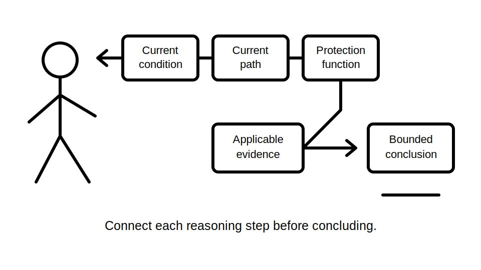
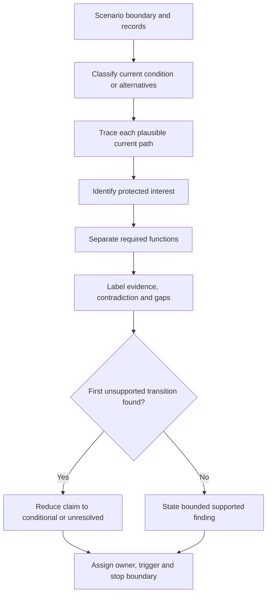
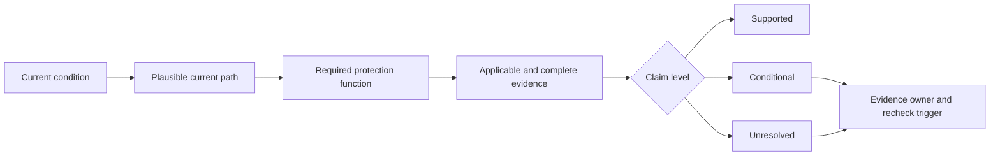

# Day 14 — Week 2 Protection Integration Checkpoint

> **Currency and scope notice:** This checkpoint assesses written reasoning with fictional scenarios. It supplies no clause answers, device ratings, conductor sizes, fault-current values, operating times, test procedures or practical authority. Exact requirements remain `reference_check_required`. Current authorised standards, legislation, regulator guidance, manufacturer instructions, workplace procedures and RTO requirements remain controlling. This module is not `technically-reviewed`.

## 1. Outcome and entry check

### Learning objectives

By the end of this checkpoint, the learner should be able to:

1. classify a described current condition as normal load, overload, short circuit, earth fault, residual-current imbalance or unresolved;
2. identify the protected interest and required protection function before naming a device;
3. distinguish overcurrent protection, residual-current protection, earthing support and work-control functions;
4. label stated facts, derived facts, supported inferences, assumptions, contradictions and evidence gaps;
5. construct a conceptual current-path sketch without treating it as proof of magnitude, suitability or device operation;
6. locate the first unsupported transition in a reasoning chain;
7. write supported, conditional and unresolved findings whose certainty matches the evidence;
8. assign an evidence owner and recheck trigger to each material unresolved issue;
9. repair one misconception and demonstrate transfer under changed conditions; and
10. reject unsafe reset, test, access, energisation, approval or sign-off requests.

### Entry check

Without notes, answer:

1. Why can the same device name appear in scenarios requiring different reasoning?
2. Distinguish overload current from short-circuit current.
3. What does an RCD compare, and what does its presence not prove?
4. Why is a conceptual fault path not proof of disconnection?
5. Distinguish a stated fact, a supported inference and an assumption.
6. What is the first unsupported transition?
7. State two actions this checkpoint does not authorise.

Rate each answer **confident**, **partly confident** or **guessing**. A confident but unsafe or unsupported answer becomes the first remediation target; confidence is evidence about calibration, not evidence that the answer is correct.

## 2. Why it matters

Capstone-style questions rarely test one isolated definition. They combine circuit purpose, abnormal current, protection roles, evidence quality and safety boundaries. Learners who recognise individual terms but cannot connect them may select a familiar device, invent a missing fact, treat operation as proof of safety or conceal uncertainty behind fluent language.

This checkpoint tests whether the learner can maintain a complete evidence chain before Week 3 introduces deeper earthing and MEN mental models. It does not test practical competence or authorise field action.

*Instructional caption: connect the scenario, current path, protection function and evidence before stating a conclusion.*

## 3. Core concepts and terminology

- **Integration:** combining previously learned concepts into one coherent response without erasing the boundary between them.
- **Current condition:** the described state of current flow, such as normal load, overload, short circuit, earth fault or residual-current imbalance.
- **Current path:** the route through which current is described or reasonably inferred to flow.
- **Protection function:** the specific protective job required, independent of device name.
- **Protected interest:** the person, conductor, equipment, property or continuity objective being safeguarded.
- **Stated fact:** information explicitly supplied by the scenario or an identified source.
- **Derived fact:** a result obtained transparently from stated facts using an appropriate relationship, without adding an unstated premise.
- **Supported inference:** a conclusion reasonably indicated by evidence but not directly stated.
- **Assumption:** an unverified premise temporarily introduced to continue reasoning; it must be labelled and cannot support a final approval.
- **Contradiction:** two items of evidence that cannot both be relied on without reconciliation.
- **Evidence gap:** information needed for a material conclusion but not yet available.
- **First unsupported transition:** the earliest point where a reasoning chain moves from supported material to an unverified claim.
- **Claim level:** supported, conditional or unresolved, according to evidence quality, applicability and completeness.
- **Evidence owner:** the authorised person, record or source responsible for resolving a gap; it is not automatically the learner.
- **Recheck trigger:** a new or changed fact that requires an earlier conclusion to be reconsidered.
- **Misconception:** a stable but incorrect mental model that can produce repeated errors.
- **Transfer task:** a varied scenario requiring the learner to apply the repaired reasoning rather than repeat memorised wording.
- **Blocking condition:** a safety, authority, contradiction or evidence failure that prevents progression regardless of strengths elsewhere.

## 4. Rule-finding workflow

Use **I-N-T-E-G-R-A-T-E**:

1. **I — Identify the scenario boundary:** state the circuit purpose, described event, available records and information limits.
2. **N — Name the current condition:** classify it or mark it unresolved; keep plausible alternatives open.
3. **T — Trace the conceptual path:** sketch each plausible loop while separating path from magnitude and outcome.
4. **E — Establish the protected interest:** identify what or who requires protection.
5. **G — Group the required functions:** keep overload, short-circuit, fault/disconnection, residual-current and work-control functions distinct.
6. **R — Record evidence status:** label facts, derived facts, inferences, assumptions, contradictions and gaps.
7. **A — Apply authorised source categories:** identify where exact requirements, characteristics and responsibilities would be verified.
8. **T — Test every transition:** locate the first unsupported transition and reduce the claim level accordingly.
9. **E — Escalate and remediate:** reject unsafe action, assign evidence owners, record recheck triggers and prescribe a varied re-attempt.

The workflow prevents one familiar device, one operation event or one remembered phrase from replacing the full reasoning chain. A supported conceptual role is not automatically a supported suitability, coordination or operating claim.

## 5. Visual model or worked example

The diagram shows separate claims. A plausible path does not establish current magnitude, device suitability, operating time, coordination or a safe condition. Each arrow must be supported; the first unsupported arrow limits every downstream conclusion.

### Worked original scenario

A fictional final subcircuit supplies a fixed heater. The recorded load has increased since the original design. A circuit-breaker and an RCD are listed, but conductor capacity, installation method, device characteristic, supply arrangement, fault-path evidence and verification records are absent. One schedule identifies the circuit as the heater circuit while a newer handwritten label identifies it differently. A protective device has operated twice, and someone proposes resetting it again.

Apply I-N-T-E-G-R-A-T-E:

1. **Identify:** changed load, repeated operation, conflicting circuit identity and incomplete records define the boundary.
2. **Name:** overload is plausible, but short circuit, earth fault, residual-current imbalance and another cause remain unresolved.
3. **Trace:** sketch normal and plausible abnormal paths without assigning values or choosing one cause prematurely.
4. **Establish:** people, conductors, equipment and property are potential protected interests.
5. **Group:** overcurrent, residual-current, fault/disconnection and work-control questions remain distinct.
6. **Record:** device names, repeated operation and conflicting labels are stated facts; cause, suitability, circuit identity and safe condition are unresolved.
7. **Apply:** current authorised requirements, manufacturer data, supply information, workplace procedures and verified records are required.
8. **Test:** the first unsupported transition occurs when repeated operation is used to claim that another reset is safe or that the cause is known.
9. **Escalate:** stop the proposed reset, preserve the contradiction, assign circuit identity and device evidence to an authorised evidence owner, and recheck all conclusions when verified records are obtained.

### Changed-context transfer

Change at least two material conditions—for example, replace the fixed heater with intermittent equipment and replace the repeated operation report with conflicting residual-current indications. Rebuild the reasoning chain from the scenario boundary. Do not carry the earlier classification, path or device conclusion into the new case.

## 6. Practical application

### Checkpoint task A — classification and evidence matrix

For four fictional descriptions, complete:

| Field | Required response |
|---|---|
| Scenario boundary | purpose, event, records and limits |
| Current condition | classified, alternatives retained or unresolved |
| Conceptual path | concise text or sketch for each plausible path |
| Protected interest | specific person, conductor, equipment, property or continuity objective |
| Protection function | stated without relying on device name |
| Evidence labels | facts, derived facts, inferences, assumptions, contradictions and gaps |
| First unsupported transition | earliest unsupported reasoning step |
| Claim level | supported, conditional or unresolved |
| Evidence owner | authorised source or person for each material gap |
| Recheck trigger | changed evidence requiring reconsideration |
| Safety boundary | explicit stop and escalation point |

### Checkpoint task B — integrated original scenario

Create one original scenario containing:

- a defined circuit purpose;
- one changed operating condition;
- one named overcurrent device and one named residual-current device;
- incomplete installation evidence;
- two records that conflict on a material fact;
- one misleading but irrelevant fact; and
- one proposed unsafe action.

Submit an I-N-T-E-G-R-A-T-E record, one current-path sketch, an evidence matrix, the first unsupported transition, a bounded conclusion, an evidence owner for each material gap, three recheck triggers and one remediation action.

### Checkpoint task C — misconception repair and transfer

Choose one statement and correct it:

- “The RCD protects the cable from every overcurrent.”
- “The breaker tripped, so the fault is fixed.”
- “A drawn earth-fault path proves the required disconnection time.”
- “The rating label proves the device is suitable.”

For the selected statement:

1. identify the misconception;
2. explain the likely consequence;
3. identify the first unsupported transition;
4. list the missing or contradictory evidence;
5. write a safer replacement statement; and
6. solve a transfer case with at least two changed material conditions.

### Criterion-level assessment record

Assess each criterion independently:

- **Secure:** accurate, evidence-controlled, transferable and within the stated safety boundary.
- **Developing:** mostly sound but incomplete, weakly explained or dependent on prompting.
- **Unsupported:** conclusion exceeds the evidence, relies on an unstated premise or fails changed-context transfer.
- **`stop-required`:** response proposes unsafe or unauthorised action, ignores a material contradiction, invents exact evidence, or claims approval despite a blocking gap.

Record a state and one evidence sentence for each criterion:

| Criterion | Required observable evidence |
|---|---|
| Scenario boundary | purpose, event, records and limits are explicit |
| Current classification | accurate or appropriately unresolved; alternatives are controlled |
| Current-path reasoning | path is separated from magnitude, suitability and operation |
| Protected interest and function | both are identified before device reasoning |
| Protection separation | overcurrent, residual-current, earthing-support and work-control roles remain distinct |
| Evidence control | all evidence labels are used consistently and contradictions remain visible |
| Source workflow | authorised source categories are mapped without invented clauses or values |
| Transition control | first unsupported transition is located and downstream claims are bounded |
| Conclusion | supported, conditional and unresolved findings are distinguished |
| Transfer | reasoning is rebuilt after at least two material conditions change |
| Remediation | error mechanism, consequence and varied corrective task are explicit |
| Safety boundary | stop condition, evidence owner and escalation path are explicit |

### Progression decision

Progression is an educational planning decision, not an official assessment result:

- **Ready for Day 15:** no criterion is `unsupported` or `stop-required`, and changed-context transfer is secure without unsafe prompting.
- **Ready with targeted support:** one or more criteria are developing, with a named remediation task, support owner and review point.
- **Not ready for new content:** any material criterion is unsupported, transfer fails, or evidence ownership is absent.
- **Stop and escalate:** any criterion is `stop-required`.

A strength in one criterion cannot cancel a blocking condition in another. Do not calculate an aggregate score.

## 7. Common errors and safety checkpoint

### Common errors

- naming a device before identifying the hazard, protected interest and function;
- treating a current-path drawing as proof of magnitude or operation;
- merging overload, short circuit, earth fault and residual-current imbalance;
- treating an RCD as a substitute for overcurrent protection or safe isolation;
- treating repeated operation as permission to reset;
- using a label as proof of characteristic, condition, identity or suitability;
- resolving contradictory records by choosing the convenient one;
- inventing clauses, values, device behaviour or assessment rules;
- hiding missing evidence behind confident language;
- carrying a conclusion unchanged into a materially different transfer case; and
- presenting an educational response as technical approval.

### Blocking conditions

Mark `stop-required` when a response:

- recommends reset, access, switching, isolation, proving, measurement, testing, alteration or energisation;
- treats device presence or operation as proof of safety, suitability or fault removal;
- ignores a material contradiction;
- invents an exact clause, value, characteristic, result or operating outcome;
- assigns unresolved safety-critical evidence to an unauthorised person; or
- approves, certifies or signs off work.

### Safety checkpoint

Stop and escalate when:

- repeated operation, overheating, damage, exposed parts or another immediate hazard is described;
- the task requires opening, isolation, proving, measurement, testing, resetting, alteration or energisation;
- the supply arrangement, circuit identity or current path cannot be established from authorised evidence;
- an exact clause, value, characteristic, test result or operating time is unverified; or
- the learner is asked to approve, certify or sign off work.

This checkpoint authorises no switching, isolation, opening, proving, measurement, testing, resetting, fault creation, alteration, repair, energisation, commissioning, certification or verification.

## 8. Retrieval and next links

### Closed-note retrieval

1. Recite I-N-T-E-G-R-A-T-E and explain each step.
2. Name six possible current-condition classifications.
3. Explain why path, magnitude, suitability and protective outcome are separate claims.
4. Distinguish overcurrent protection from residual-current protection.
5. Name the six evidence labels.
6. Define the first unsupported transition.
7. Distinguish supported, conditional and unresolved findings.
8. Give four recheck triggers.
9. State three blocking conditions.
10. Explain why an aggregate score cannot cancel a safety failure.

### Exit task

Submit the entry check with confidence ratings, all three checkpoint tasks, the criterion-level assessment record, one corrected misconception, the changed-context transfer, one remediation commitment if required, and one support need for Day 15 or “none identified.”

### Navigation

- **Plan:** [Twelve-Week Capstone Learning Plan](../MASTER_PLAN.md)
- **Knowledge note:** [[12-Week Day 14 - Week 2 Protection Integration Checkpoint]]
- **Previous:** [Day 13 — Protection-Selection Evidence Workflow Using Original Scenarios](day-13-protection-selection-evidence-workflow-using-original-scenarios.md)
- **Next:** [Day 15 — Earthing Terminology and Component Roles](day-15-earthing-terminology-and-component-roles.md)

### Reference and currency notice

This module uses original workflows, scenarios, diagrams, matrices and assessment tools. It does not reproduce standards tables, figures, device curves, systematic clause wording, exact technical values or official assessment material. Current authorised sources and qualified review remain required before any practical or compliance conclusion.