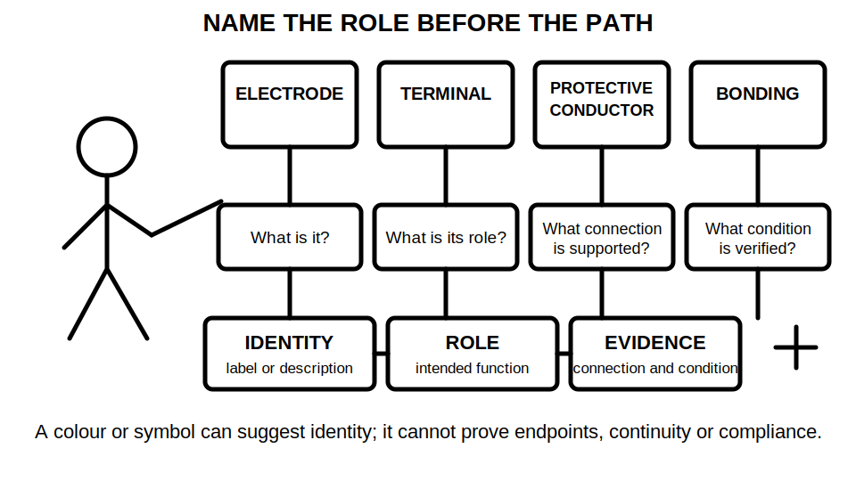
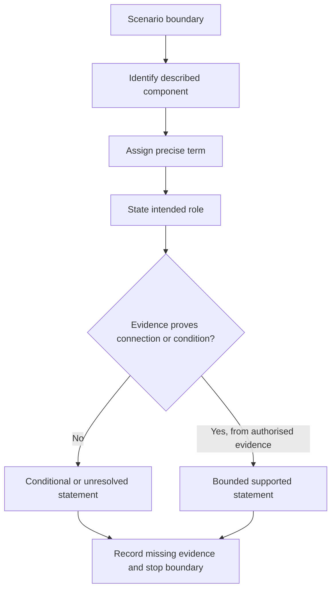

# Day 15 — Earthing Terminology and Component Roles

> **Currency and scope notice:** This module develops terminology, component-role classification and written reasoning. It does not provide installation instructions, conductor sizes, connection locations, test procedures, acceptance values or authority to inspect or alter equipment. Exact definitions and requirements remain `reference_check_required`. Current authorised standards, legislation, regulator guidance, network rules, manufacturer instructions, workplace procedures and RTO requirements remain controlling. This module is not `technically-reviewed`.

## 1. Outcome and entry check

### Learning objectives

By the end of this module, the learner should be able to:

1. define earthing, protective earthing, an earth electrode, an earthing conductor, a protective earthing conductor and equipotential bonding in bounded educational language;
2. distinguish a component's **identity**, **role**, **connection claim** and **verified condition**;
3. classify a labelled component by its stated function without relying on colour, appearance or location alone;
4. separate normal-current, fault-current and touch-potential reasoning at concept level;
5. construct a role map showing how source reference, protective conductors, conductive parts and protective devices relate without claiming compliance;
6. identify supplied facts, assumptions and missing evidence in an earthing description;
7. write supported, conditional and unresolved statements whose certainty matches the evidence; and
8. stop and escalate when a task would require opening, tracing, testing, disconnecting, reconnecting, altering or energising an installation.

### Entry check

Without notes, answer:

1. Why is a conductor colour not proof of its function?
2. What is the difference between naming a component and proving its condition?
3. Why does a drawn current path not establish current magnitude or device operation?
4. What is the difference between a protective function and a work-control function?
5. Name the four evidence classes used in Week 2.
6. State three actions this module does not authorise.

Mark each response **secure**, **uncertain** or **guessing**. Any confident but incorrect response becomes the first correction target.

## 2. Why it matters

Earthing questions become unsafe when learners use one word—such as “earth”—for several different components and functions. A green-yellow conductor, an electrode, a terminal, a bonded metal service and a protective path are related, but they are not interchangeable. Confusing them can produce incorrect diagrams, unsupported compliance claims and unsafe practical assumptions.

This module deliberately slows the sequence. It establishes a controlled vocabulary before Days 16–21 examine continuity, exposed conductive parts, bonding, MEN paths and fault scenarios.

## 3. Core concepts and terminology

The definitions below are educational summaries. Exact normative wording must be checked in current authorised sources.

- **Earthing:** the broad arrangement by which selected points or conductive parts are intentionally related to earth for defined system and protective purposes.
- **Earth:** the conductive mass of the ground, treated conceptually as a reference but not assumed to be an ideal conductor.
- **Earth electrode:** a conductive part intended to make electrical contact with the general mass of earth.
- **Earthing conductor:** a conductor that forms a specified connection within the earthing arrangement. The exact endpoints and classification depend on the applicable arrangement and authorised definition.
- **Protective earthing conductor:** a conductor intended to support a protective function by connecting relevant conductive parts into the protective earthing arrangement.
- **Protective earthing:** the protective arrangement intended to reduce risk associated with conductive parts becoming hazardous under fault conditions.
- **Equipotential bonding:** intentional connection of relevant conductive parts to reduce hazardous potential differences. It is not identical to protective earthing, even when both interact.
- **Exposed conductive part:** a conductive part of electrical equipment that may be touched and is not normally live but may become live under a fault. Exact classification remains source-dependent.
- **Extraneous conductive part:** a conductive part that can introduce a potential from outside the electrical equipment or installation under consideration. Metal alone does not prove this classification.
- **Main earthing terminal or bar:** the designated connection point at which specified protective and earthing conductors are brought together. Exact naming and required connections depend on the applicable arrangement.
- **MEN connection:** a specified neutral-to-earthing connection within an Australian or New Zealand multiple-earthed-neutral arrangement. Its permitted location, construction and implications require authorised verification.
- **Normal-current path:** the intended route of load current during ordinary operation.
- **Fault-current path:** a possible route of current created by an insulation failure or another abnormal connection.
- **Touch potential:** a potential difference that could appear between simultaneously accessible points. A conceptual possibility is not a measured value.
- **Identity claim:** a claim about what an item is labelled or described as being.
- **Role claim:** a claim about the function the item is intended to perform.
- **Connection claim:** a claim that particular endpoints are electrically connected.
- **Condition claim:** a claim about continuity, integrity, suitability or performance. It requires evidence beyond appearance or labelling.

## 4. Rule-finding workflow

Use **E-A-R-T-H**:

1. **E — Establish the boundary:** identify the installation portion, source arrangement and task limits described.
2. **A — Assign exact terms:** label each conductor, terminal and conductive part with the most specific supported term.
3. **R — Record the role:** state the intended function separately from colour, location or appearance.
4. **T — Test the evidence claim:** classify each statement as supplied, derived, assumed or missing; do not convert a label into proof of connection or condition.
5. **H — Hold the boundary:** write a supported, conditional or unresolved conclusion and stop before practical work or compliance approval.

The workflow prevents a familiar label, colour or diagram symbol from being treated as proof of continuity, correctness or compliance.

## 5. Visual model or worked example

This is a **role map**, not a wiring diagram. It shows conceptual relationships only. It does not prove that any connection is required in a particular case, that conductors are continuous, that a fault path has sufficient characteristics, or that a protective device will operate as required.

### Worked original scenario

A fictional training drawing shows a switchboard, an earth electrode symbol, a terminal bar, a green-yellow conductor to an appliance enclosure and another conductor to a metal water service. No conductor endpoints, test records, source details or installation history are supplied.

Apply E-A-R-T-H:

1. **Establish:** the drawing concerns component roles only; the source arrangement and physical condition are unknown.
2. **Assign:** the symbols may represent an electrode, a designated earthing terminal, a protective earthing conductor and a bonding conductor, but exact classification depends on authorised definitions and endpoints.
3. **Record:** the appliance conductor appears intended to support protective earthing; the water-service conductor appears intended to support bonding.
4. **Test:** colour and diagram placement are supplied observations. Actual endpoints, continuity, conductor suitability and required connection status are missing evidence.
5. **Hold:** it is supported that the drawing intends different roles; it is unresolved whether the real installation is correctly connected, continuous or compliant.

### Worked-example fading

For a second fictional drawing, complete only these prompts:

- boundary:
- most precise supported terms:
- role of each component:
- evidence that is supplied:
- assumptions to remove:
- missing evidence:
- bounded conclusion:
- stop condition:

## 6. Practical application

### Task A — terminology sort

Sort each phrase into **component**, **role**, **path**, **potential**, **evidence claim** or **work boundary**:

- earth electrode;
- protective earthing;
- fault-current path;
- touch potential;
- conductor appears green-yellow;
- continuity has not been verified;
- stop before opening equipment; and
- equipotential bonding.

For every answer, provide a one-sentence definition and one non-example.

### Task B — role-before-condition table

Complete this table for an original labelled diagram:

| Item | Most precise supported term | Intended role | What appearance may show | What still requires evidence |
|---|---|---|---|---|
| A |  |  |  |  |
| B |  |  |  |  |
| C |  |  |  |  |
| D |  |  |  |  |

At least one row must remain conditional or unresolved.

### Task C — changed-condition transfer

Start with the worked scenario, then change one fact at a time:

1. the service is changed from metal to non-conductive material;
2. the conductor endpoint cannot be identified;
3. an alternative supply is added; or
4. a test record is available but its instrument and date are unknown.

For each change, state which earlier classification or conclusion must be reopened and why.

### Assessment rubric

| Category | 0 | 1 | 2 |
|---|---|---|---|
| Terminology | vague or interchangeable terms | partly precise | terms precise and bounded |
| Component versus role | merged | partly separated | consistently separated |
| Evidence control | appearance treated as proof | some gaps identified | identity, connection and condition claims controlled |
| Path reasoning | normal and fault paths confused | partial distinction | paths separated without unsupported operation claims |
| Application | repeats worked answer | limited transfer | changed facts reopen the correct conclusions |
| Safety boundary | practical action proposed | general caution | explicit stop and escalation point |

A score of **10–12**, with no zero in terminology, evidence control or safety boundary, supports progression. Otherwise complete one varied correction before Day 16.

## 7. Common errors and safety checkpoint

### Common errors

- using “earth wire” for every conductor associated with an earthing arrangement;
- treating conductor colour as proof of identity, endpoints, continuity or suitability;
- treating all metalwork as an exposed or extraneous conductive part;
- treating protective earthing and equipotential bonding as identical;
- assuming the earth electrode is the complete protective fault-current return path;
- treating a diagram symbol as proof of physical connection;
- inferring device operation from a conceptual path;
- quoting an exact definition, connection location or test requirement from memory; and
- presenting educational classification as inspection, certification or approval.

### Safety checkpoint

Stop and escalate when:

- a component cannot be identified from authorised documentation;
- determining identity would require opening equipment, removing covers or tracing conductors;
- proving a connection would require isolation, testing, measurement, disconnection or reconnection;
- damage, overheating, exposed parts, repeated protective-device operation or another immediate hazard is described;
- an exact clause, conductor requirement, connection location, test value or jurisdiction-specific rule is unverified; or
- the learner is asked to approve, certify or sign off an installation.

This module authorises no switching, isolation, opening, proving, tracing, measurement, testing, disconnection, reconnection, alteration, repair, energisation, commissioning, certification or verification.

## 8. Retrieval and next links

### Closed-note retrieval

1. Define earthing, protective earthing and equipotential bonding without using them as synonyms.
2. Distinguish an earth electrode from a protective earthing conductor.
3. Explain identity, role, connection and condition claims.
4. Distinguish an exposed conductive part from an extraneous conductive part at concept level.
5. Explain why colour and location are insufficient evidence.
6. Recite E-A-R-T-H and explain each step.
7. State why the role map is not a wiring diagram or proof of device operation.
8. Name four stop conditions.

### Exit task

Submit the entry check with confidence ratings, Tasks A–C, the rubric score, one corrected misconception, one unresolved definition or requirement for authorised checking, and one readiness statement for Day 16.

### Navigation

- **Plan:** [Twelve-Week Capstone Learning Plan](../MASTER_PLAN.md)
- **Knowledge note:** [[12-Week Day 15 - Earthing Terminology and Component Roles]]
- **Previous:** [Day 14 — Week 2 Protection Integration Checkpoint](day-14-week-2-protection-integration-checkpoint.md)
- **Next:** [Day 16 — Protective Earthing Continuity and Exposed Conductive Parts](day-16-protective-earthing-continuity-and-exposed-conductive-parts.md)

### Reference and currency notice

This module uses original workflows, scenarios, diagrams, tables and assessment tools. It does not reproduce standards tables, figures, systematic clause wording, exact technical values or official assessment material. Exact definitions, MEN arrangements, required connections, conductor requirements, testing criteria and jurisdiction-specific duties remain `reference_check_required` and require qualified review.