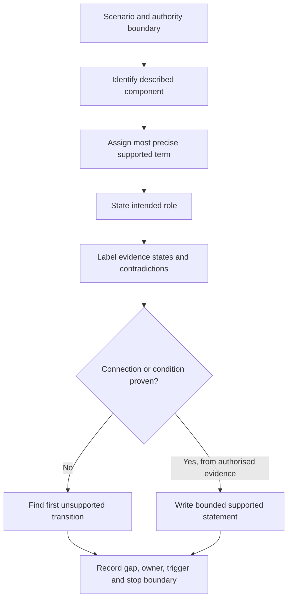
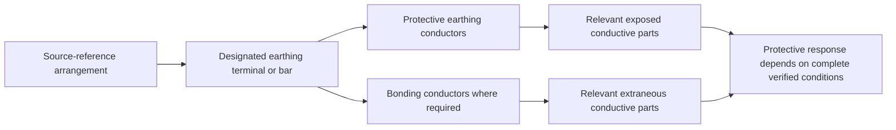

# Day 15 — Earthing Terminology and Component Roles

> **Currency and scope notice:** This module develops terminology, component-role classification and written reasoning. It does not provide installation instructions, conductor sizes, connection locations, test procedures, acceptance values or authority to inspect or alter equipment. Exact definitions and requirements remain `reference_check_required`. Current authorised standards, legislation, regulator guidance, network rules, manufacturer instructions, workplace procedures and RTO requirements remain controlling. This module is not `technically-reviewed`.

## 1. Outcome and entry check

### Learning objectives

By the end of this module, the learner should be able to:

1. define earthing, protective earthing, earth electrode, earthing conductor, protective earthing conductor and equipotential bonding in bounded educational language;
2. distinguish a component's **identity**, **intended role**, **claimed connection** and **verified condition**;
3. classify a labelled component without relying on colour, appearance or location alone;
4. separate normal-current, fault-current and touch-potential reasoning at concept level;
5. build a role map connecting source reference, protective conductors, conductive parts and protective devices without claiming compliance;
6. label stated facts, derived facts, supported inferences, assumptions, contradictions and evidence gaps;
7. identify the first unsupported transition in an earthing argument;
8. write supported, conditional and unresolved conclusions with named evidence owners and recheck triggers; and
9. stop and escalate before opening, tracing, testing, disconnecting, reconnecting, altering or energising an installation.

### Entry check

Without notes, answer:

1. Why is conductor colour not proof of function?
2. What is the difference between naming a component and proving its condition?
3. Why does a drawn current path not establish current magnitude or device operation?
4. What is the difference between a protective function and a work-control function?
5. Give one example each of a stated fact, supported inference, assumption, contradiction and evidence gap.
6. State three actions this module does not authorise.

Rate each response **high**, **medium** or **low confidence**. A high-confidence unsafe or unsupported answer is corrected before a low-confidence omission because it is more likely to be repeated without checking.

## 2. Why it matters

Earthing questions become unsafe when one word—such as “earth”—is used for several different components and functions. A green-yellow conductor, electrode, terminal, bonded metal service and protective path may be related, but they are not interchangeable. Confusing identity, role, connection and condition can produce incorrect diagrams, unsupported compliance claims and unsafe practical assumptions.

This module deliberately slows the sequence. It establishes controlled vocabulary and evidence boundaries before Days 16–21 examine continuity, exposed conductive parts, bonding, MEN paths and fault scenarios.

*Caption: Name the component and its intended role before making any claim about connection, condition or performance.*

## 3. Core concepts and terminology

The definitions below are educational summaries. Exact normative wording must be checked in current authorised sources.

- **Earthing:** the broad arrangement by which selected points or conductive parts are intentionally related to earth for defined system and protective purposes.
- **Earth:** the conductive mass of the ground, treated conceptually as a reference but not assumed to be an ideal conductor.
- **Earth electrode:** a conductive part intended to make electrical contact with the general mass of earth.
- **Earthing conductor:** a conductor that forms a specified connection within an earthing arrangement. Exact endpoints and classification depend on the applicable arrangement and authorised definition.
- **Protective earthing conductor:** a conductor intended to support a protective function by connecting relevant conductive parts into the protective earthing arrangement.
- **Protective earthing:** the protective arrangement intended to reduce risk associated with conductive parts becoming hazardous under fault conditions.
- **Equipotential bonding:** intentional connection of relevant conductive parts to reduce hazardous potential differences. It is not identical to protective earthing, even where both interact.
- **Exposed conductive part:** a conductive part of electrical equipment that may be touched, is not normally live and may become live under a fault. Exact classification remains source-dependent.
- **Extraneous conductive part:** a conductive part capable of introducing a potential from outside the electrical equipment or installation under consideration. Metal alone does not prove this classification.
- **Main earthing terminal or bar:** the designated connection point at which specified protective and earthing conductors are brought together. Exact naming and required connections depend on the applicable arrangement.
- **MEN connection:** a specified neutral-to-earthing connection within an Australian or New Zealand multiple-earthed-neutral arrangement. Permitted location, construction and implications require authorised verification.
- **Normal-current path:** the intended route of load current during ordinary operation.
- **Fault-current path:** a possible route of current created by insulation failure or another abnormal connection.
- **Touch potential:** a potential difference that could appear between simultaneously accessible points. A conceptual possibility is not a measured value.
- **Identity claim:** what an item is labelled or described as being.
- **Role claim:** the function the item is intended to perform.
- **Connection claim:** a claim that particular endpoints are electrically connected.
- **Condition claim:** a claim about continuity, integrity, suitability or performance; it requires evidence beyond appearance or labelling.
- **Stated fact:** information explicitly supplied by the scenario or an identified source.
- **Derived fact:** information obtained from stated facts by a transparent, valid step that introduces no new assumption.
- **Supported inference:** a conclusion reasonably supported by evidence but not directly stated.
- **Assumption:** an unverified proposition temporarily introduced into reasoning; it must be labelled and cannot support a final technical conclusion.
- **Contradiction:** two relevant evidence items that cannot both describe the same condition as stated.
- **Evidence gap:** missing information needed to decide a material claim.
- **First unsupported transition:** the earliest step where the reasoning moves from supported evidence to an unverified identity, connection, condition or performance claim.
- **Evidence owner:** the authorised person, record or source category responsible for resolving a gap.
- **Recheck trigger:** a change that requires the conclusion to be reopened, such as a different supply arrangement, endpoint, service material, drawing revision or evidence record.

## 4. Rule-finding workflow

Use **E-A-R-T-H**:

1. **E — Establish the boundary:** identify the installation portion, source arrangement, task and authority limits described.
2. **A — Assign exact terms:** label each conductor, terminal and conductive part with the most precise term supported by current evidence.
3. **R — Record role and evidence state:** separate intended function from appearance and label each supporting statement as fact, inference, assumption, contradiction or gap.
4. **T — Trace to the first unsupported transition:** stop where a label or diagram is converted into an unverified connection, condition, suitability or operating claim.
5. **H — Hold and hand off:** write a supported, conditional or unresolved conclusion; name the evidence owner and recheck trigger; do not cross into practical work or compliance approval.

The workflow prevents a familiar label, colour or diagram symbol from being treated as proof of continuity, correctness, suitability or compliance.

## 5. Visual model or worked example

This is a **role map**, not a wiring diagram. It shows conceptual relationships only. It does not prove that a connection is required in a particular case, that conductors are continuous, that a fault path has sufficient characteristics or that a protective device will operate as required.

### Worked original scenario

A fictional training drawing shows a switchboard, an earth-electrode symbol, a terminal bar, a green-yellow conductor to an appliance enclosure and another conductor to a metal water service. A later maintenance sketch labels the water-service conductor “spare”. No endpoints, test records, source details or document revision status are supplied.

Apply E-A-R-T-H:

1. **Establish:** the task is document-based component-role classification only. Source arrangement, document precedence and physical condition are unknown.
2. **Assign:** the symbols may represent an electrode, designated earthing terminal, protective earthing conductor and bonding conductor, but exact classifications depend on authorised definitions and verified endpoints.
3. **Record:** the first drawing suggests protective-earthing and bonding intentions. The later “spare” label contradicts the first drawing's apparent bonding role. Neither drawing proves present connection or condition.
4. **Trace:** the first unsupported transition would be claiming that the water service is currently bonded, or that bonding is or is not required, from either drawing alone.
5. **Hold:** the supported conclusion is that records conflict about intended role. The document controller or authorised technical reviewer owns resolution of revision status; any change in supply arrangement, service material, endpoint or controlling drawing triggers re-evaluation.

### Worked-example fading

For a second fictional drawing, complete only:

- boundary and authority limit;
- most precise supported terms;
- stated and derived facts;
- supported inferences;
- assumptions to remove;
- contradictions and evidence gaps;
- first unsupported transition;
- evidence owner and recheck trigger;
- bounded conclusion; and
- stop condition.

## 6. Practical application

### Task A — terminology and evidence sort

Sort each phrase into **component**, **role**, **path**, **potential**, **evidence state** or **work boundary**:

- earth electrode;
- protective earthing;
- fault-current path;
- touch potential;
- conductor appears green-yellow;
- two drawings show different endpoints;
- continuity has not been verified;
- stop before opening equipment; and
- equipotential bonding.

For each answer, provide a one-sentence definition and one non-example.

### Task B — role-before-condition ledger

Complete:

| Item | Most precise supported term | Intended role | Evidence state | Contradiction or gap | First unsupported transition | Evidence owner / recheck trigger |
|---|---|---|---|---|---|---|
| A |  |  |  |  |  |  |
| B |  |  |  |  |  |  |
| C |  |  |  |  |  |  |
| D |  |  |  |  |  |  |

At least one row must remain conditional or unresolved.

### Task C — changed-context transfer

Rebuild the reasoning after changing at least **two** material conditions:

- the service changes from metal to non-conductive material;
- the conductor endpoint cannot be identified;
- an alternative supply is introduced;
- a test record exists but its date or instrument identity is missing; or
- two drawings conflict and neither has confirmed precedence.

Do not merely edit the previous conclusion. Re-establish the boundary, reclassify the evidence and identify the new first unsupported transition.

### Assessment decision record

Assess each criterion separately:

| Criterion | Secure | Developing | Unsupported | `stop-required` |
|---|---|---|---|---|
| Terminology | terms are precise, bounded and not interchangeable | minor imprecision that does not alter the conclusion | vague terminology supports a material claim | terminology hides a hazardous or unauthorised assumption |
| Component versus role | identity, role, connection and condition remain separate | one separation needs correction | label or appearance is treated as proof | unsupported identity leads toward practical action |
| Evidence control | facts, inferences, assumptions, contradictions and gaps are explicit | evidence labels are incomplete but conclusion remains bounded | contradiction or gap is ignored | invented evidence or concealed contradiction supports action |
| Path reasoning | normal, fault and touch-potential reasoning remain distinct | distinction is incomplete but no operating claim is made | incomplete path is treated as proven | device operation or safety is asserted without required evidence |
| Transfer | reasoning is rebuilt after two material changes | one changed condition is handled incompletely | worked answer is copied into a changed context | changed conditions are ignored despite a safety consequence |
| Safety and authority | explicit stop, owner and escalation boundary | boundary is general but safe | authority limit is vague | practical work, approval or certification is proposed |

Progression requires no `stop-required` criterion and secure performance in terminology, evidence control, path reasoning and safety/authority. A developing criterion receives one varied correction. An unsupported criterion requires targeted remediation and a fresh transfer example. Strength in one criterion cannot cancel a blocking failure in another. These are educational planning states, not official grades or competency decisions.

## 7. Common errors and safety checkpoint

### Common errors

- using “earth wire” for every conductor associated with an earthing arrangement;
- treating conductor colour as proof of identity, endpoints, continuity or suitability;
- treating all metalwork as an exposed or extraneous conductive part;
- treating protective earthing and equipotential bonding as identical;
- assuming the earth electrode is the complete protective fault-current return path;
- treating a diagram symbol as proof of physical connection;
- choosing one of two contradictory records without establishing precedence;
- inferring device operation from a conceptual path;
- quoting exact definitions, connection locations or test requirements from memory; and
- presenting educational classification as inspection, certification or approval.

### Safety checkpoint

Stop and escalate when:

- a component cannot be identified from authorised documentation;
- records conflict about identity, endpoints, role or revision status;
- determining identity would require opening equipment, removing covers or tracing conductors;
- proving a connection would require isolation, testing, measurement, disconnection or reconnection;
- damage, overheating, exposed parts, repeated protective-device operation or another immediate hazard is described;
- an exact clause, conductor requirement, connection location, test value or jurisdiction-specific rule is unverified; or
- the learner is asked to approve, certify or sign off an installation.

This module authorises no switching, isolation, opening, proving, tracing, measurement, testing, disconnection, reconnection, alteration, repair, energisation, commissioning, certification or verification.

## 8. Retrieval and next links

### Closed-note retrieval

1. Define earthing, protective earthing and equipotential bonding without using them as synonyms.
2. Distinguish an earth electrode from a protective earthing conductor.
3. Explain identity, role, connection and condition claims.
4. Distinguish exposed and extraneous conductive parts at concept level.
5. Explain why colour, location and a diagram symbol are insufficient evidence.
6. Recite E-A-R-T-H and explain each step.
7. Define the first unsupported transition, evidence owner and recheck trigger.
8. Explain why contradictory records must remain unresolved until precedence is established.
9. State four stop conditions.

### Exit task

Submit the entry check with confidence ratings, Tasks A–C, the criterion decision record, one corrected high-confidence misconception, one unresolved definition or requirement for authorised checking, and one bounded readiness statement for Day 16.

### Navigation

- **Plan:** [Twelve-Week Capstone Learning Plan](../MASTER_PLAN.md)
- **Knowledge note:** [[12-Week Day 15 - Earthing Terminology and Component Roles]]
- **Previous:** [Day 14 — Week 2 Protection Integration Checkpoint](day-14-week-2-protection-integration-checkpoint.md)
- **Next:** [Day 16 — Protective Earthing Continuity and Exposed Conductive Parts](day-16-protective-earthing-continuity-and-exposed-conductive-parts.md)

### Reference and currency notice

This module uses original workflows, scenarios, diagrams, tables and assessment tools. It does not reproduce standards tables, figures, systematic clause wording, exact technical values or official assessment material. Exact definitions, MEN arrangements, required connections, conductor requirements, testing criteria and jurisdiction-specific duties remain `reference_check_required` and require qualified review.