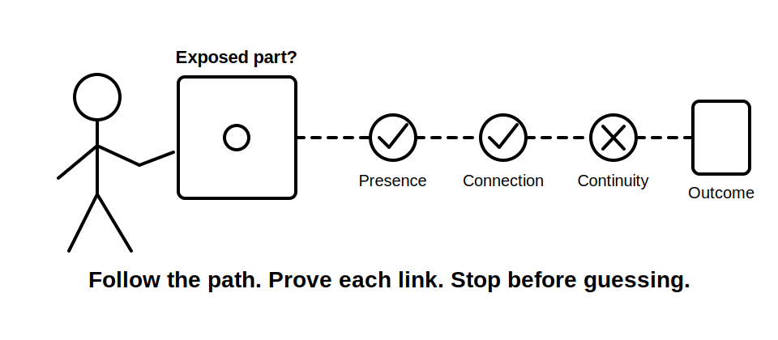
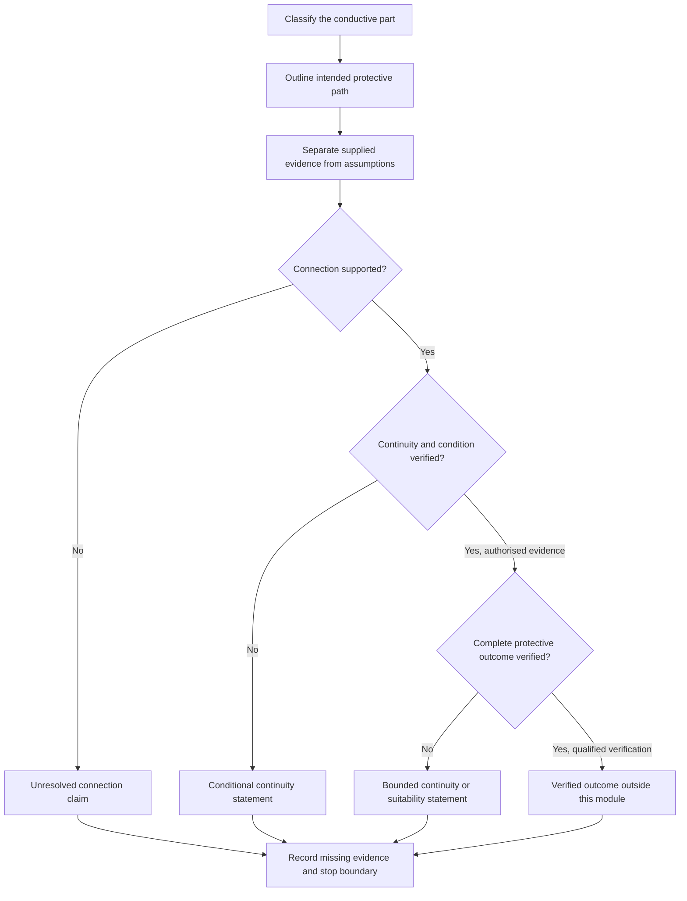
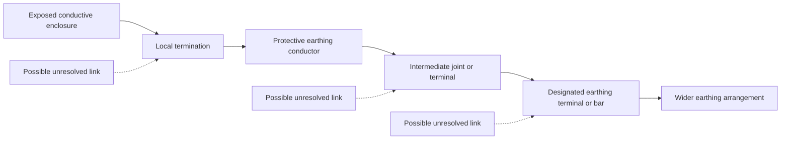

# Day 16 — Protective Earthing Continuity and Exposed Conductive Parts

> **Currency and scope notice:** This module develops written continuity reasoning, exposed-conductive-part classification and evidence control. It does not provide a continuity-test procedure, instrument settings, acceptance values, connection instructions or authority to access electrical equipment. Exact definitions and requirements remain `reference_check_required`. Current authorised standards, legislation, regulator guidance, network rules, manufacturer instructions, workplace procedures and RTO requirements remain controlling. This module is not `technically-reviewed`.

## 1. Outcome and entry check

### Learning objectives

By the end of this module, the learner should be able to:

1. define protective-earthing continuity as an evidence-dependent condition rather than a conclusion drawn from colour, labels or appearance;
2. classify a described conductive part as exposed, not exposed, or unresolved using supplied facts and bounded definitions;
3. distinguish a **described connection**, **continuous path**, **suitable protective path** and **verified protective outcome**;
4. identify plausible discontinuity locations in a conceptual path without proposing intrusive investigation;
5. explain why visible conductor presence does not prove endpoints, joint integrity, continuity, conductor suitability or protective-device operation;
6. construct an evidence ladder from observation to bounded conclusion;
7. write supported, conditional and unresolved statements whose certainty matches the available evidence; and
8. stop and escalate when proof would require opening, isolation, testing, tracing, disconnection, reconnection or energisation.

### Entry check

Without notes, answer:

1. What makes a conductive equipment part an exposed conductive part at concept level?
2. Why is a green-yellow conductor not proof of continuity?
3. What is the difference between a connection claim and a condition claim?
4. Why does a complete line on a diagram not prove a suitable fault-current path?
5. Name four evidence classes used in this program.
6. State three practical actions this module does not authorise.

Mark each response **secure**, **uncertain** or **guessing**. Correct confident errors before continuing.

## 2. Why it matters

Protective earthing depends on more than recognising an earthing conductor. A protective function can be weakened by a missing connection, an unidentified endpoint, an unsuitable joint, damage, alteration or another discontinuity. A learner who treats appearance as proof may overstate safety, misclassify a defect or assume protective-device operation without sufficient evidence.

This module deliberately separates four claim levels: what is shown, what is connected, whether continuity is established and whether the complete protective outcome is verified. That separation prepares the learner for later bonding, MEN, inspection and verification modules.

## 3. Core concepts and terminology

The definitions below are original educational summaries. Exact normative wording must be checked in current authorised sources.

- **Protective-earthing continuity:** the condition in which the required protective-earthing path is electrically continuous between its relevant endpoints. The required endpoints and acceptance criteria are source-dependent.
- **Exposed conductive part:** a touchable conductive part of electrical equipment that is not normally live but may become live under a fault. Conductivity or touchability alone is insufficient; the equipment relationship and fault possibility matter.
- **Insulating enclosure:** an enclosure whose relevant accessible surface is non-conductive for the stated purpose. Its presence does not prove that every accessible item is outside earthing requirements.
- **Described connection:** a connection stated in a scenario, label or drawing. It is evidence of intended arrangement, not automatically proof of physical condition.
- **Continuous path:** an electrically unbroken path between stated endpoints. Continuity must be established using authorised evidence.
- **Suitable protective path:** a path whose construction and characteristics satisfy applicable protective requirements. Continuity alone does not establish suitability.
- **Verified protective outcome:** a conclusion supported by the full required evidence that the protective arrangement performs as required. A conceptual module cannot establish this outcome.
- **Discontinuity:** an interruption or ineffective link in a path. It may be complete, intermittent or condition-dependent; exact diagnosis requires authorised investigation.
- **Joint:** a point where conductors or conductive parts are connected. A visible joint does not establish integrity or suitability.
- **Termination:** the endpoint connection of a conductor to a terminal, bar, enclosure or other component.
- **Evidence ladder:** an ordered progression from observation through connection and continuity evidence to a bounded conclusion.
- **Negative evidence:** the absence of an expected record, label, connection description or result. It identifies uncertainty but does not by itself prove a specific defect.
- **Claim boundary:** the strongest conclusion the available evidence supports without assumption.

### Four claim levels

1. **Presence:** a conductor, terminal or conductive part is shown or described.
2. **Connection:** stated endpoints are described as connected.
3. **Continuity and condition:** authorised evidence supports an unbroken and relevant path.
4. **Protective outcome:** all required conditions, including arrangement, suitability and interacting protection, are verified.

Progressing to a higher level requires additional evidence. No level may be skipped because a drawing looks complete.

## 4. Rule-finding workflow

Use **C-O-N-T-I-N-U-E**:

1. **C — Classify the part:** determine whether the described item is exposed, not exposed or unresolved.
2. **O — Outline the intended path:** name the stated endpoints and intermediate links without assuming physical condition.
3. **N — Note the evidence:** separate supplied observations, records, derived facts, assumptions and missing information.
4. **T — Test each claim level:** ask whether presence, connection, continuity, suitability and protective outcome are individually supported.
5. **I — Identify break consequences:** state what a discontinuity could change without diagnosing the installation.
6. **N — Name the unresolved requirement:** identify the exact definition, connection requirement, evidence record or authorised verification still needed.
7. **U — Use bounded language:** write supported, conditional or unresolved conclusions.
8. **E — End at the authority boundary:** stop before access, tracing, isolation, measurement, testing, alteration or approval.

The diagram is an evidence gate. It prevents a learner from moving directly from “a conductor is shown” to “the protective arrangement will operate correctly.”

## 5. Visual model or worked example

This is a **continuity reasoning model**, not a wiring diagram or test sequence. Each arrow represents a link that may need evidence. It does not state required construction, conductor size, test value, fault-current magnitude or protective-device operating time.

### Worked original scenario

A fictional training record describes a metal enclosure as touchable and part of electrical equipment. A green-yellow conductor is visible at the enclosure and a drawing shows a route toward an earthing bar. The drawing is undated. No endpoint confirmation, continuity record, alteration history or inspection evidence is supplied.

Apply C-O-N-T-I-N-U-E:

1. **Classify:** the enclosure may fit the educational description of an exposed conductive part because it is touchable, conductive, part of electrical equipment and may become live under a fault. Exact classification remains subject to authorised definitions.
2. **Outline:** the intended path appears to run from the enclosure through a local termination and protective conductor toward an earthing bar.
3. **Note:** visibility and the drawing are supplied observations. Actual endpoints, joint condition, continuity, suitability and current arrangement are missing.
4. **Test:** presence is supported; physical connection is only partly supported; continuity and protective outcome are not established.
5. **Identify:** a discontinuity could prevent the intended protective relationship, but no specific defect location can be diagnosed from the record.
6. **Name:** current authorised documentation and qualified verification are required.
7. **Use:** “The evidence supports an intended protective-earthing connection, but continuity, suitability and protective performance remain unresolved.”
8. **End:** do not open, trace, test or alter the equipment.

### Worked-example fading

For a second original scenario, complete only:

- part classification and supporting facts;
- intended endpoints;
- intermediate links;
- supplied evidence;
- assumptions removed;
- highest supported claim level;
- consequence of an unresolved discontinuity;
- missing authorised evidence;
- bounded conclusion; and
- stop condition.

## 6. Practical application

### Task A — exposed-part classification

Classify each fictional item as **exposed**, **not exposed** or **unresolved**, then state the facts needed to support the decision:

1. a touchable metal equipment enclosure described as separated from live parts only by basic insulation;
2. a plastic outer case with an internal metal frame that is not accessible in normal use;
3. a touchable metal label plate attached to an insulating enclosure, with no construction details supplied;
4. a metal water pipe near electrical equipment but not described as part of that equipment; and
5. a painted metal door on a switchboard, with hinge and bonding details omitted.

Do not infer classification from “metal” alone.

### Task B — evidence ladder

For an original diagram, complete:

| Claim | Supplied evidence | What the evidence supports | What remains unproved |
|---|---|---|---|
| Part is present |  |  |  |
| Endpoints are connected |  |  |  |
| Path is continuous |  |  |  |
| Path is suitable |  |  |  |
| Protective outcome is verified |  |  |  |

At least two rows must remain conditional or unresolved.

### Task C — changed-condition transfer

Reopen the worked conclusion when one fact changes:

1. the drawing is confirmed to pre-date a switchboard alteration;
2. the enclosure conductor is present but its far endpoint is undocumented;
3. a continuity record exists but does not identify the tested endpoints;
4. the enclosure is replaced with an insulating type; or
5. an alternative supply arrangement is introduced.

For each change, state which claim level changes and what evidence would be needed before progressing.

### Assessment rubric

| Category | 0 | 1 | 2 |
|---|---|---|---|
| Part classification | based on metal or colour alone | partly supported | all defining facts considered and uncertainty retained |
| Path structure | endpoints and links merged | partial path | endpoints and intermediate links clearly separated |
| Evidence control | presence treated as proof | some missing evidence identified | every claim level independently tested |
| Continuity reasoning | continuity assumed or diagnosed | general qualification | bounded consequence stated without diagnosis |
| Transfer | original answer repeated | some reopening | changed fact reopens the correct claim level |
| Safety boundary | intrusive action proposed | general caution | explicit stop, escalation and authority limit |

A score of **10–12**, with no zero in part classification, evidence control or safety boundary, supports progression. Otherwise complete one varied correction before Day 17.

## 7. Common errors and safety checkpoint

### Common errors

- treating all touchable metal as an exposed conductive part;
- treating conductor colour, a label or a diagram line as proof of endpoints or continuity;
- assuming continuity proves conductor suitability or complete protective performance;
- assuming a visible termination is sound because it appears connected;
- diagnosing the location or cause of a discontinuity from incomplete records;
- describing the earth electrode as the entire protective return path;
- inferring protective-device operation from a conceptual path;
- confusing protective earthing with equipotential bonding;
- quoting exact continuity requirements or test values from memory; and
- presenting educational reasoning as inspection, verification or certification.

### Safety checkpoint

Stop and escalate when:

- classification depends on construction details unavailable in authorised documentation;
- determining endpoints would require opening equipment or tracing conductors;
- continuity or condition would require isolation, proving, testing or measurement;
- a loose, damaged, overheated or disconnected conductor is described;
- repeated protective-device operation, exposed live parts or another immediate hazard is reported;
- exact clauses, connection requirements, test methods or acceptance criteria are unverified; or
- the learner is asked to approve, certify or sign off the arrangement.

This module authorises no switching, isolation, opening, proving, tracing, measurement, testing, disconnection, reconnection, alteration, repair, energisation, commissioning, certification or verification.

## 8. Retrieval and next links

### Closed-note retrieval

1. Define protective-earthing continuity without describing a test procedure.
2. State the defining facts used to classify an exposed conductive part at concept level.
3. Distinguish presence, connection, continuity, suitability and protective outcome.
4. Explain why a diagram line cannot prove continuity.
5. Give two possible consequences of an unresolved discontinuity without diagnosing a defect.
6. Recite C-O-N-T-I-N-U-E and explain each step.
7. State why continuity alone does not prove protective-device operation.
8. Name four stop conditions.

### Exit task

Submit the entry check with confidence ratings, Tasks A–C, the rubric score, one corrected misconception, one unresolved requirement for authorised checking and one readiness statement for Day 17.

### Navigation

- **Plan:** [Twelve-Week Capstone Learning Plan](../MASTER_PLAN.md)
- **Knowledge note:** [[12-Week Day 16 - Protective Earthing Continuity and Exposed Conductive Parts]]
- **Previous:** [Day 15 — Earthing Terminology and Component Roles](day-15-earthing-terminology-and-component-roles.md)
- **Next:** Day 17 — Equipotential Bonding Purpose and Boundary Reasoning

### Reference and currency notice

This module uses original workflows, scenarios, diagrams, tables and assessment tools. It does not reproduce standards tables, figures, systematic clause wording, exact technical values or official assessment material. Exact exposed-part definitions, required protective-earthing connections, continuity requirements, conductor criteria, test methods, acceptance criteria and jurisdiction-specific duties remain `reference_check_required` and require qualified review.