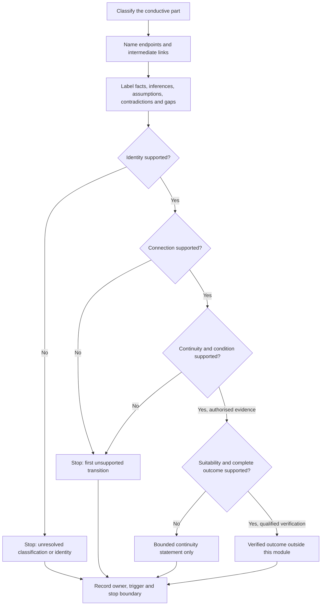
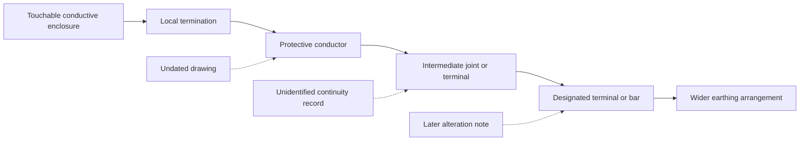

# Day 16 — Protective Earthing Continuity and Exposed Conductive Parts

> **Currency and scope notice:** This module develops written continuity reasoning, exposed-conductive-part classification and evidence control. It does not provide a continuity-test procedure, instrument settings, acceptance values, connection instructions or authority to access electrical equipment. Exact definitions and requirements remain `reference_check_required`. Current authorised standards, legislation, regulator guidance, network rules, manufacturer instructions, workplace procedures and RTO requirements remain controlling. This module is not `technically-reviewed`.

## 1. Outcome and entry check

### Learning objectives

By the end of this module, the learner should be able to:

1. classify a described conductive part as **exposed**, **not exposed** or **unresolved** using stated facts rather than material or colour alone;
2. map the stated protective-earthing path into endpoints and intermediate links;
3. distinguish **presence**, **described connection**, **continuity**, **suitability** and **verified protective outcome**;
4. label each material statement as a stated fact, derived fact, supported inference, assumption, contradiction or evidence gap;
5. identify the first unsupported transition in a continuity argument;
6. state a bounded consequence of missing continuity without diagnosing a defect or predicting device operation;
7. assign an evidence owner and recheck trigger to every material unresolved claim; and
8. stop and escalate when further proof would require access, isolation, tracing, measurement, testing, alteration or approval.

### Entry check

Without notes, answer:

1. What facts are needed before a conductive equipment part can be classified as exposed at concept level?
2. Why is a green-yellow conductor not proof of continuity?
3. What is the difference between a described connection and a verified condition?
4. Why does a complete diagram line not prove a suitable protective path?
5. Name the six evidence labels used in this module.
6. State three actions this module does not authorise.

For each response, record confidence as **high**, **medium** or **low**. A high-confidence unsupported answer is a priority correction.

## 2. Why it matters

Protective earthing depends on an evidence-supported path, not recognition of an earthing conductor. A connection may be intended but absent, present but incorrectly identified, continuous but unsuitable, or suitable as a path while the complete protective outcome remains unverified. Collapsing these claims can produce false reassurance, unsupported defect diagnoses and unsafe predictions about protective-device operation.

The central discipline is to stop at the first point where the evidence no longer supports the next claim. This keeps a learner from turning a label, drawing, photograph or unqualified record into an approval conclusion.

*Caption: Follow each stated link and stop where the evidence stops; a visible conductor does not prove the complete protective outcome.*

## 3. Core concepts and terminology

The definitions below are original educational summaries. Exact normative wording must be checked in current authorised sources.

- **Protective-earthing continuity:** an evidence-dependent condition in which the required protective-earthing path is electrically continuous between relevant endpoints.
- **Exposed conductive part:** a touchable conductive part of electrical equipment that is not normally live but may become live under a fault. Material, colour or proximity alone does not establish the classification.
- **Endpoint:** a named start or finish point for the path being claimed.
- **Intermediate link:** a termination, conductor, joint, terminal, bar or other stated connection between endpoints.
- **Described connection:** a connection stated in a scenario, label, drawing or record. It may describe intent without proving current physical condition.
- **Continuous path:** an electrically unbroken path between identified endpoints, established through authorised evidence.
- **Suitable protective path:** a continuous path whose arrangement and characteristics also satisfy applicable requirements.
- **Verified protective outcome:** a conclusion supported by all required arrangement, continuity, suitability, interacting-protection and verification evidence.
- **Discontinuity:** an interruption or ineffective link in a path. Incomplete evidence does not identify its location or cause.
- **Parallel path:** another conductive route that may influence a result or interpretation. A result alone may not prove which route produced it.
- **First unsupported transition:** the earliest step where a conclusion depends on an unproved premise. All downstream claims must remain conditional or unresolved.
- **Evidence owner:** the authorised person, document source or process responsible for resolving a named gap.
- **Recheck trigger:** the event that requires the conclusion to be reopened, such as updated drawings, identified endpoints, alteration records or qualified verification.
- **Claim boundary:** the strongest conclusion supported without assumption.

### Evidence labels

Use these labels explicitly:

1. **Stated fact:** directly supplied by the scenario or authorised record.
2. **Derived fact:** follows directly from supplied information without adding a new premise.
3. **Supported inference:** a reasoned interpretation with its supporting facts named.
4. **Assumption:** an unstated premise being used as though it were known.
5. **Contradiction:** two material items of evidence that cannot both be relied on without resolution.
6. **Evidence gap:** information required for the next claim but not supplied.

### Claim ladder

1. **Presence:** a part, conductor, terminal or record is shown or described.
2. **Identity:** the item and its role are supported for the stated scenario.
3. **Connection:** identified endpoints are supported as connected.
4. **Continuity and condition:** authorised evidence supports an unbroken relevant path.
5. **Suitability:** the path also satisfies the applicable source-dependent requirements.
6. **Protective outcome:** all required conditions and interacting protection are verified.

No level may be skipped because a drawing looks complete or a result appears plausible.

## 4. Rule-finding workflow

Use **C-O-N-T-I-N-U-E**:

1. **C — Classify the part:** exposed, not exposed or unresolved; name the defining facts and missing facts.
2. **O — Outline the path:** identify both endpoints and every stated intermediate link.
3. **N — Name evidence labels:** separate facts, derivations, inferences, assumptions, contradictions and gaps.
4. **T — Test each claim level:** presence, identity, connection, continuity, suitability and outcome.
5. **I — Identify the first unsupported transition:** stop downstream claims at that point.
6. **N — Nominate owner and trigger:** state who or what can resolve the gap and when the conclusion must be reopened.
7. **U — Use bounded language:** write supported, conditional or unresolved conclusions.
8. **E — End at the authority boundary:** do not turn written reasoning into access, testing, alteration or approval.

The diagram makes the first unsupported transition visible. Once a premise fails, later conclusions cannot remain unconditional.

## 5. Visual model or worked example

This is a continuity-reasoning model, not a wiring diagram or test sequence. Solid arrows show the claimed path; dotted records may support, weaken or contradict particular links. Every record must be checked for identity, date, scope and provenance.

### Worked original scenario

A fictional training file describes a touchable metal equipment enclosure. A green-yellow conductor is visible at the enclosure. An undated drawing shows a route toward an earthing bar. A separate maintenance note says the switchboard was altered later, while a continuity record lists only “enclosure to earth” and does not identify endpoints, path state or provenance.

Apply C-O-N-T-I-N-U-E:

1. **Classify:** the description supports a possible exposed-conductive-part classification, but exact construction and fault exposure remain subject to authorised definitions.
2. **Outline:** intended path: enclosure → local termination → protective conductor → intermediate connection → designated terminal or bar.
3. **Name:** visible conductor and document text are stated facts; current endpoints are a gap; treating the undated drawing as current is an assumption; the alteration note creates a material contradiction.
4. **Test:** presence is supported. Identity and intended connection are partly supported. Current connection, continuity, suitability and protective outcome are not established.
5. **Identify:** the first unsupported transition is from an intended drawn route to a current physical connection.
6. **Nominate:** the evidence owner is the authorised documentation or verification process; recheck when current drawings, identified endpoints and qualified evidence are available.
7. **Use:** “The records support an intended protective-earthing relationship, but the current endpoints, continuity, suitability and protective outcome remain unresolved because the drawing predates an alteration and the continuity record lacks identity and provenance.”
8. **End:** do not open, trace, test, alter, energise or approve the equipment.

### Worked-example fading

For a second scenario, submit only:

- classification and defining facts;
- endpoints and intermediate links;
- six evidence labels;
- competing interpretations;
- first unsupported transition;
- bounded consequence;
- evidence owner and recheck trigger;
- supported conclusion; and
- stop condition.

## 6. Practical application

### Task A — classification with evidence control

Classify each fictional item as **exposed**, **not exposed** or **unresolved**. For each, name the defining facts, missing facts and first unsupported transition:

1. a touchable metal equipment enclosure described as separated from live parts only by basic insulation;
2. a plastic outer case with an internal metal frame not accessible in normal use;
3. a touchable metal label plate attached to an insulating enclosure with no construction details;
4. a metal water pipe near electrical equipment but not described as part of the equipment; and
5. a painted switchboard door with hinge and connection details omitted.

### Task B — claim-dependency ledger

Complete one row for every material claim:

| Claim | Evidence label and source | Supporting premise | Contradiction or gap | First unsupported transition | Evidence owner | Recheck trigger | Bounded status |
|---|---|---|---|---|---|---|---|
| Part classification |  |  |  |  |  |  |  |
| Endpoint identity |  |  |  |  |  |  |  |
| Physical connection |  |  |  |  |  |  |  |
| Continuity and condition |  |  |  |  |  |  |  |
| Path suitability |  |  |  |  |  |  |  |
| Protective outcome |  |  |  |  |  |  |  |

At least one competing interpretation must remain open until decisive evidence is named.

### Task C — changed-context transfer

Rebuild the reasoning when **at least two** material conditions change. Choose two or more:

- the drawing is confirmed to pre-date an alteration;
- the far endpoint is undocumented;
- a continuity record does not identify tested endpoints;
- an alternative conductive path may have influenced the record;
- the enclosure is replaced with an insulating type; or
- an alternative supply arrangement is introduced.

Do not edit only the conclusion. Reclassify the part, redraw the claim ladder, relabel evidence, identify the new first unsupported transition and state the new owner and trigger.

### Criterion-level assessment

Assess every criterion independently:

| Criterion | Secure | Developing | Unsupported | `stop-required` |
|---|---|---|---|---|
| Part classification | all defining facts considered and uncertainty retained | relevant facts identified but one dependency remains vague | classification relies on material, colour or proximity | unsafe classification is presented as permission to act |
| Path structure | endpoints and intermediate links are distinct | path is mostly mapped | path identity or endpoints are assumed | intrusive tracing or access is proposed |
| Evidence control | all material claims carry evidence labels | some assumptions or gaps are identified | presence or a record is treated as proof | contradiction is ignored to claim safety or approval |
| Continuity reasoning | first unsupported transition and bounded consequence are explicit | conclusion is cautious but transition is unclear | continuity, suitability or device operation is assumed | a practical test or alteration is directed without authority |
| Transfer | two changed conditions cause a rebuilt reasoning chain | conditions change but only part of the chain is reopened | original answer is repeated | changed evidence is ignored to preserve a prior safety claim |
| Ownership and recheck | every material gap has an owner and trigger | owner or trigger is incomplete | gaps are listed without a resolution path | unresolved evidence is bypassed for approval |
| Safety boundary | stop, escalation and excluded actions are explicit | general caution is present | authority boundary is vague | switching, opening, testing, alteration, energisation or certification is proposed |

A strong result in one criterion cannot cancel an unsupported or `stop-required` result elsewhere. Before Day 17, correct each unsupported criterion with one varied scenario. Any `stop-required` result blocks progression until the unsafe reasoning and authority boundary are corrected.

## 7. Common errors and safety checkpoint

### Common errors

- classifying all touchable metal as exposed conductive parts;
- treating conductor colour, a label or a diagram line as proof of identity, endpoints or continuity;
- assuming a continuity record proves the intended path rather than a parallel path;
- assuming continuity proves suitability or complete protective performance;
- ignoring contradictory alteration history;
- diagnosing a discontinuity location from incomplete records;
- inferring protective-device operation from a conceptual path;
- confusing protective earthing with equipotential bonding;
- quoting exact continuity requirements or test values from memory; and
- presenting educational reasoning as inspection, verification or certification.

### Safety checkpoint

Record `stop-required` and escalate when:

- classification depends on unavailable construction details;
- identifying endpoints would require opening equipment or tracing conductors;
- continuity or condition would require isolation, proving, measurement or testing;
- evidence is contradictory, lacks provenance or does not identify the path;
- a loose, damaged, overheated or disconnected conductor is described;
- repeated protective-device operation, exposed live parts or another immediate hazard is reported;
- exact clauses, connection requirements, test methods or acceptance criteria are unverified; or
- the learner is asked to approve, certify or sign off the arrangement.

This module authorises no switching, isolation, opening, proving, tracing, measurement, testing, disconnection, reconnection, alteration, repair, energisation, commissioning, certification or verification.

## 8. Retrieval and next links

### Closed-note retrieval

1. Define protective-earthing continuity without describing a test procedure.
2. State the defining facts used to classify an exposed conductive part at concept level.
3. Distinguish presence, identity, connection, continuity, suitability and protective outcome.
4. Name the six evidence labels.
5. Explain the first unsupported transition.
6. Explain why an unidentified continuity record may not prove the intended path.
7. State why continuity alone does not prove protective-device operation.
8. Name four `stop-required` conditions.

### Exit task

Submit the entry check with confidence ratings, Tasks A–C, criterion states, one corrected high-confidence error, one evidence owner and recheck trigger, one unresolved authorised-source check and one readiness statement for Day 17.

### Navigation

- **Plan:** [Twelve-Week Capstone Learning Plan](../MASTER_PLAN.md)
- **Knowledge note:** [[12-Week Day 16 - Protective Earthing Continuity and Exposed Conductive Parts]]
- **Previous:** [Day 15 — Earthing Terminology and Component Roles](day-15-earthing-terminology-and-component-roles.md)
- **Next:** [Day 17 — Equipotential Bonding Purpose and Boundary Reasoning](day-17-equipotential-bonding-purpose-and-boundary-reasoning.md)

### Reference and currency notice

This module uses original workflows, scenarios, diagrams, tables and assessment tools. It does not reproduce standards tables, figures, systematic clause wording, exact technical values or official assessment material. Exact exposed-part definitions, required protective-earthing connections, continuity requirements, conductor criteria, test methods, acceptance criteria and jurisdiction-specific duties remain `reference_check_required` and require qualified review.