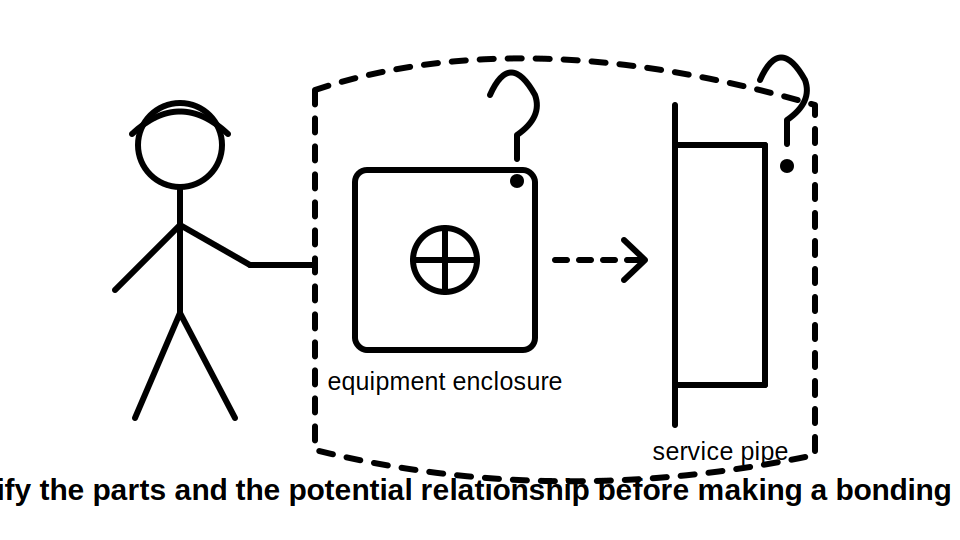
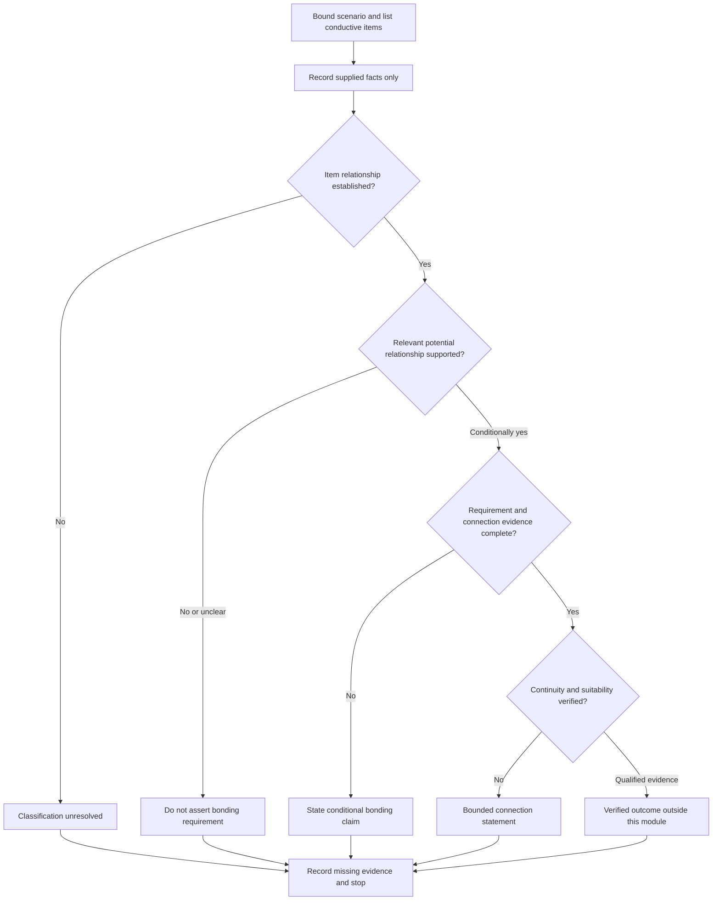
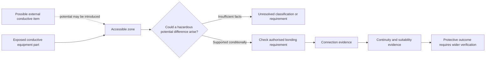

# Day 17 — Equipotential Bonding Purpose and Boundary Reasoning

> **Currency and scope notice:** This module develops written reasoning about equipotential bonding purpose, conductive-part classification, evidence boundaries and bounded conclusions. It does not provide bonding installation instructions, conductor-selection rules, connection locations, test procedures or acceptance values. Exact definitions and requirements remain `reference_check_required`. Current authorised standards, legislation, regulator guidance, network rules, manufacturer instructions, workplace procedures and RTO requirements remain controlling. This module is not `technically-reviewed`.

## 1. Outcome and entry check

### Learning objectives

By the end of this module, the learner should be able to:

1. explain equipotential bonding as a protective relationship intended to reduce hazardous potential differences, without claiming that it removes all voltage or replaces protective earthing;
2. distinguish protective earthing from equipotential bonding by purpose, connected items and evidence needed;
3. classify a described conductive item as an exposed conductive part, possible extraneous conductive part, neither, or unresolved;
4. identify the boundary of a bonding claim by separating presence, identity, connection, continuity, suitability and verified protective outcome;
5. explain why proximity, metal construction, pipework appearance or a visible conductor does not alone establish a bonding requirement or compliant bond;
6. apply the **B-O-U-N-D-A-R-Y** workflow to original scenarios;
7. write supported, conditional and unresolved conclusions whose certainty matches the evidence; and
8. stop and escalate when classification or proof would require access, tracing, isolation, measurement, testing, alteration or approval.

### Entry check

Without notes, answer:

1. What is the difference between protective earthing and equipotential bonding at purpose level?
2. What makes an item an exposed conductive part at concept level?
3. Why is a nearby metal pipe not automatically an extraneous conductive part?
4. Why does a visible bonding conductor not prove continuity or suitability?
5. Name the five claim levels used in Day 16.
6. State three actions this module does not authorise.

Mark each answer **secure**, **uncertain** or **guessing**. Correct any high-confidence error before continuing.

## 2. Why it matters

A learner may incorrectly assume that all metal must be bonded, that bonding and earthing are interchangeable, or that one visible conductor proves the complete protective arrangement. Those shortcuts can produce unsafe conclusions, unnecessary work or missed hazards.

Bonding reasoning begins with the relationship between conductive parts and the possibility of a hazardous potential difference. Classification must be supported before a requirement is asserted. Even when a bonding relationship is required, a drawing or visible conductor does not prove connection, continuity, conductor suitability or protective performance.

## 3. Core concepts and terminology

The definitions below are original educational summaries. Exact normative wording must be checked in current authorised sources.

- **Equipotential bonding:** a protective connection intended to reduce hazardous potential differences between relevant conductive parts. It does not mean every connected item is at exactly identical potential in every condition.
- **Protective earthing:** connection of relevant exposed conductive parts into the protective-earthing arrangement so fault conditions can be managed with the wider protective system.
- **Exposed conductive part:** a touchable conductive part of electrical equipment that is not normally live but may become live under a fault.
- **Extraneous conductive part:** a conductive part that is not part of the electrical installation but may introduce a potential from elsewhere. Metal, size or proximity alone does not establish this classification.
- **Potential difference:** the electrical difference between two points that can drive current if a conductive path is formed.
- **Touch potential:** the potential difference that may be encountered between simultaneously accessible conductive parts or between a conductive part and a reference point. Exact technical treatment is source-dependent.
- **Simultaneously accessible:** capable of being touched at the same time under the relevant conditions. Exact reach and location criteria require authorised verification.
- **Bonding conductor:** a conductor used to establish a required bonding relationship. Its presence does not prove endpoints, continuity, condition or suitability.
- **Protective relationship:** the intended risk-reducing relationship between classified parts, connections and the wider protective arrangement.
- **Classification evidence:** facts needed to decide what a conductive part is and whether it can introduce or acquire a relevant potential.
- **Claim boundary:** the strongest conclusion supported by the available evidence without assumption.
- **Boundary condition:** a fact that limits where a conclusion applies, such as accessibility, source relationship, construction, location or supply arrangement.

### Protective earthing versus bonding

| Question | Protective-earthing reasoning | Bonding reasoning |
|---|---|---|
| Primary focus | fault relationship of exposed conductive equipment parts | hazardous potential difference between relevant conductive parts |
| First classification question | is the item an exposed conductive part? | can the item introduce or acquire a relevant potential, and is the relationship applicable? |
| Evidence needed | part identity, required path, connection, continuity, suitability and wider protection | part classifications, accessibility, potential relationship, required connection, continuity and suitability |
| Common false shortcut | “green-yellow means protected” | “metal nearby means bond it” |

The functions interact, but neither term should be used as a substitute for the other.

## 4. Rule-finding workflow

Use **B-O-U-N-D-A-R-Y**:

1. **B — Bound the scenario:** identify the stated location, equipment, conductive items, accessibility and supply conditions.
2. **O — Observe without classifying:** list only supplied facts, records and visible descriptions.
3. **U — Understand each item’s relationship:** decide whether each item is electrical equipment, part of the installation, external to it, or unresolved.
4. **N — Name the possible potential source:** state how a relevant potential could be introduced or acquired, using conditional language.
5. **D — Distinguish the protective purpose:** separate protective earthing, bonding, isolation, overcurrent protection and additional protection.
6. **A — Audit the evidence ladder:** test identity, requirement, connection, continuity, suitability and outcome separately.
7. **R — Record uncertainty and reopening triggers:** identify missing definitions, construction facts, accessibility details, supply changes or authorised evidence.
8. **Y — Yield at the authority boundary:** stop before access, tracing, testing, alteration, connection or approval.

This diagram is a reasoning gate. It prevents movement from “metal is present” to “bonding is required and effective” without classification and evidence.

## 5. Visual model or worked example

The model shows why classification and potential relationship come before a bonding conclusion. It is not a construction diagram and does not identify required connection points.

### Worked original scenario

A fictional training drawing shows a touchable metal equipment enclosure beside a metal service pipe. The enclosure is described as part of electrical equipment. The pipe enters from outside the training area, but its material continuity, insulating sections, source relationship and accessibility beyond the drawing are not stated. A short green-yellow conductor is visible near the pipe, with neither endpoint identified.

Apply B-O-U-N-D-A-R-Y:

1. **Bound:** two touchable conductive items are described in the same area.
2. **Observe:** the enclosure is electrical equipment; the pipe enters from outside; a conductor is visible; endpoints and records are absent.
3. **Understand:** the enclosure may be an exposed conductive part. The pipe may be external to the electrical installation, but extraneous-conductive-part classification remains unresolved.
4. **Name:** the pipe could introduce a potential only if its construction and external relationship support that possibility.
5. **Distinguish:** the enclosure’s protective-earthing role and any bonding relationship with the pipe are separate questions.
6. **Audit:** presence is supported; pipe classification, requirement, endpoints, continuity, suitability and outcome are not established.
7. **Record:** construction details, accessibility, authorised definitions, current drawings and qualified verification are missing.
8. **Yield:** do not trace, open, disconnect, test or add a conductor.

Bounded conclusion: “The enclosure has a possible protective-earthing role. The pipe’s classification and any bonding requirement remain unresolved because its construction, external potential relationship and connection evidence are incomplete.”

### Worked-example fading

For a second original scenario, complete only:

- scenario boundary;
- conductive-item list;
- supplied observations;
- item relationship classifications;
- possible potential source;
- protective function under consideration;
- highest supported claim level;
- missing evidence;
- bounded conclusion; and
- stop condition.

## 6. Practical application

### Task A — classification before requirement

Classify each fictional item as **exposed conductive part**, **possible extraneous conductive part**, **neither**, or **unresolved**. State the facts that support the classification and the facts still required.

1. a touchable metal motor enclosure described as separated from live parts by basic insulation;
2. a metallic water service entering a building, with an insulating section shown but no location details;
3. a freestanding metal shelving unit with no stated connection to electrical equipment or external conductive services;
4. a metal cable-support component whose electrical and mechanical relationships are omitted; and
5. a touchable metal pipe passing through two areas, with no information about continuity or origin.

### Task B — claim ladder

Complete the table for one original scenario:

| Claim | Supplied evidence | Strongest supported statement | Missing evidence |
|---|---|---|---|
| Item identity |  |  |  |
| Relevant classification |  |  |  |
| Bonding requirement applies |  |  |  |
| Required endpoints are connected |  |  |  |
| Connection is continuous and suitable |  |  |  |
| Protective outcome is verified |  |  |  |

At least three rows must remain conditional or unresolved.

### Task C — changed-condition transfer

Reopen the worked conclusion when one fact changes:

1. an insulating insert is confirmed between the pipe and its external section;
2. a renovation relocates the pipe outside simultaneous accessibility;
3. a drawing labels a bonding conductor but gives no current inspection evidence;
4. an alternative supply is introduced; or
5. the equipment enclosure is replaced with an insulating enclosure.

For each change, identify which classification, requirement or evidence claim must be reconsidered.

### Assessment rubric

| Category | 0 | 1 | 2 |
|---|---|---|---|
| Scenario boundary | relevant conditions ignored | partial boundary | location, accessibility and supply conditions bounded |
| Classification | based on metal or proximity | partly supported | equipment and potential relationships distinguished |
| Function distinction | earthing and bonding merged | difference stated generally | protective purposes applied accurately |
| Evidence control | presence treated as proof | some missing evidence | every claim level audited separately |
| Transfer | conclusion repeated unchanged | some reopening | changed fact reopens the correct claim |
| Safety boundary | practical action proposed | general caution | explicit stop, escalation and authority limit |

A score of **10–12**, with no zero in classification, evidence control or safety boundary, supports progression. Otherwise complete one varied correction before Day 18.

## 7. Common errors and safety checkpoint

### Common errors

- assuming all metal must be bonded;
- treating proximity as proof of simultaneous accessibility or a relevant potential relationship;
- classifying pipework as extraneous without evidence of origin, continuity or introduced potential;
- using “earthing” and “bonding” interchangeably;
- assuming a visible conductor proves endpoints, continuity, suitability or current condition;
- assuming bonding removes all voltage or replaces protective earthing, isolation, overcurrent protection or RCD protection;
- proposing a connection before confirming classification and the authorised requirement;
- quoting exact conductor sizes, connection locations, tests or acceptance values from memory; and
- presenting educational reasoning as inspection, verification or certification.

### Safety checkpoint

Stop and escalate when:

- item classification depends on construction, continuity, origin or accessibility facts not available in authorised records;
- determining endpoints would require opening equipment, tracing conductors or accessing services;
- condition or continuity would require isolation, proving, measurement or testing;
- damaged, loose, overheated or disconnected protective conductors are described;
- exposed live parts, repeated protective-device operation or another immediate hazard is reported;
- exact definitions, requirements, conductor criteria, test methods or acceptance criteria are unverified; or
- the learner is asked to install, alter, approve, certify or sign off a bonding arrangement.

This module authorises no switching, isolation, opening, proving, tracing, measurement, testing, disconnection, reconnection, installation, alteration, repair, energisation, commissioning, certification or verification.

## 8. Retrieval and next links

### Closed-note retrieval

1. Define equipotential bonding without claiming exact equality of potential.
2. Distinguish protective earthing from bonding by purpose.
3. State why metal and proximity do not establish an extraneous conductive part.
4. Name the evidence levels between item presence and verified outcome.
5. Explain why a visible bonding conductor proves neither endpoints nor suitability.
6. Recite B-O-U-N-D-A-R-Y and explain each step.
7. Give two changed conditions that reopen a bonding conclusion.
8. State four stop conditions.

### Exit task

Submit the entry check with confidence ratings, Tasks A–C, the rubric score, one corrected misconception, one unresolved authorised-source question and one readiness statement for Day 18.

### Navigation

- **Plan:** [Twelve-Week Capstone Learning Plan](../MASTER_PLAN.md)
- **Knowledge note:** [[12-Week Day 17 - Equipotential Bonding Purpose and Boundary Reasoning]]
- **Previous:** [Day 16 — Protective Earthing Continuity and Exposed Conductive Parts](day-16-protective-earthing-continuity-and-exposed-conductive-parts.md)
- **Next:** Day 18 — MEN Arrangement and Normal-Current versus Fault-Current Paths

### Reference and currency notice

This module uses original workflows, scenarios, diagrams, tables and assessment tools. It does not reproduce standards tables, figures, systematic clause wording, exact technical values or official assessment material. Exact definitions, bonding classifications, connection requirements, conductor criteria, accessibility rules, test methods, acceptance criteria and jurisdiction-specific duties remain `reference_check_required` and require qualified review.