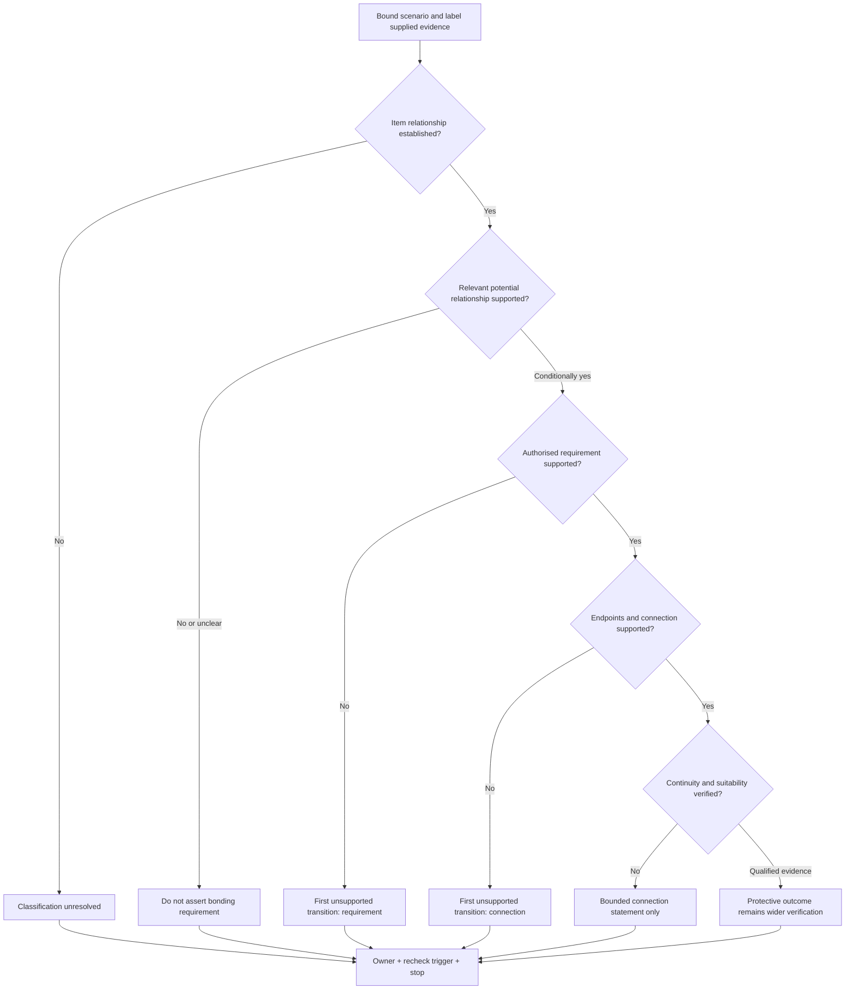
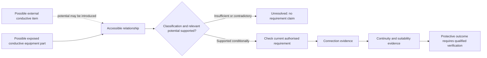

# Day 17 — Equipotential Bonding Purpose and Boundary Reasoning

> **Currency and scope notice:** This module develops written reasoning about equipotential bonding purpose, conductive-part classification, evidence boundaries and bounded conclusions. It does not provide bonding installation instructions, conductor-selection rules, connection locations, test procedures or acceptance values. Exact definitions and requirements remain `reference_check_required`. Current authorised standards, legislation, regulator guidance, network rules, manufacturer instructions, workplace procedures and RTO requirements remain controlling. This module is not `technically-reviewed`.

## 1. Outcome and entry check

### Learning objectives

By the end of this module, the learner should be able to:

1. explain equipotential bonding as a protective relationship intended to reduce hazardous potential differences, without claiming that it removes all voltage or replaces protective earthing;
2. distinguish protective earthing from equipotential bonding by purpose, connected items and evidence needed;
3. classify a described conductive item as an exposed conductive part, possible extraneous conductive part, neither, or unresolved;
4. separate presence, identity, classification, requirement, connection, continuity, suitability and verified protective outcome;
5. identify the **first unsupported transition** in a bonding argument and stop downstream conclusions at that point;
6. label each material statement as stated fact, derived fact, supported inference, assumption, contradiction or evidence gap;
7. apply the **B-O-U-N-D-A-R-Y** workflow to original and changed-context scenarios;
8. assign an evidence owner and recheck trigger to each unresolved material claim; and
9. stop and escalate when classification or proof would require access, tracing, isolation, measurement, testing, alteration or approval.

### Entry check

Without notes, answer:

1. What is the difference between protective earthing and equipotential bonding at purpose level?
2. Why is a nearby metal pipe not automatically an extraneous conductive part?
3. Why does a visible bonding conductor not prove continuity or suitability?
4. What is the first unsupported transition in a reasoning chain?
5. Name the six evidence labels used in this module.
6. State three actions this module does not authorise.

Rate each answer **high**, **medium** or **low confidence**. A high-confidence unsafe or unsupported answer must be corrected before continuing.

## 2. Why it matters

A learner may assume that all metal must be bonded, that bonding and earthing are interchangeable, or that one visible conductor proves a complete protective arrangement. These shortcuts can produce unsupported requirements, unnecessary work or missed hazards.

Bonding reasoning begins with classification and the possibility of a relevant potential difference. Even when a bonding relationship is required, a drawing or visible conductor does not prove endpoints, continuity, conductor suitability or protective performance. The quality of the conclusion must therefore be limited by the weakest unresolved material premise.

*Instructional caption: classify both conductive parts and the possible potential relationship before asserting a bonding requirement or protective outcome.*

## 3. Core concepts and terminology

The definitions below are original educational summaries. Exact normative wording must be checked in current authorised sources.

- **Equipotential bonding:** a protective connection intended to reduce hazardous potential differences between relevant conductive parts. It does not imply exact equality of potential in every condition.
- **Protective earthing:** connection of relevant exposed conductive parts into the protective-earthing arrangement so faults can be managed with the wider protective system.
- **Exposed conductive part:** a touchable conductive part of electrical equipment that is not normally live but may become live under a fault.
- **Extraneous conductive part:** a conductive part outside the electrical installation that may introduce a potential from elsewhere. Metal, size or proximity alone does not establish this classification.
- **Potential difference:** the electrical difference between two points that can drive current if a conductive path exists.
- **Simultaneously accessible:** capable of being touched at the same time under relevant conditions. Exact reach and location criteria require authorised verification.
- **Bonding conductor:** a conductor intended to establish a required bonding relationship. Visibility does not prove endpoints, continuity, condition or suitability.
- **Claim boundary:** the strongest conclusion supported without assumption.
- **First unsupported transition:** the earliest step where the conclusion depends on an assumption, contradiction or unresolved evidence gap.
- **Evidence owner:** the authorised person, record or process responsible for resolving a material gap.
- **Recheck trigger:** a specific event that requires the conclusion to be reopened, such as changed construction, accessibility, source arrangement or current authorised evidence.

### Evidence labels

- **Stated fact:** supplied directly by the scenario or a current authorised record.
- **Derived fact:** follows transparently from stated facts without adding an unstated premise.
- **Supported inference:** a bounded interpretation supported by evidence but not directly stated.
- **Assumption:** an unstated premise required to continue the argument.
- **Contradiction:** two material sources or observations that cannot both support the same conclusion without resolution.
- **Evidence gap:** information required for the claim but not available.

### Protective earthing versus bonding

| Question | Protective-earthing reasoning | Bonding reasoning |
|---|---|---|
| Primary focus | fault relationship of exposed conductive equipment parts | hazardous potential difference between relevant conductive parts |
| First classification question | is the item an exposed conductive part? | can the item introduce or acquire a relevant potential, and is the relationship applicable? |
| Evidence needed | identity, required path, connection, continuity, suitability and wider protection | classifications, accessibility, potential relationship, requirement, connection, continuity and suitability |
| Common false shortcut | “green-yellow means protected” | “metal nearby means bond it” |

The functions interact, but neither term substitutes for the other.

## 4. Rule-finding workflow

Use **B-O-U-N-D-A-R-Y**:

1. **B — Bound the scenario:** identify location, equipment, conductive items, accessibility, construction and supply conditions.
2. **O — Observe without classifying:** list supplied facts and records, assigning an evidence label to each material statement.
3. **U — Understand each item’s relationship:** decide whether each item is electrical equipment, part of the installation, external to it, neither, or unresolved.
4. **N — Name the possible potential source:** state how a relevant potential could be introduced or acquired, using conditional language.
5. **D — Distinguish the protective purpose:** separate protective earthing, bonding, isolation, overcurrent protection and additional protection.
6. **A — Audit the claim ladder:** test identity, classification, requirement, connection, continuity, suitability and outcome separately.
7. **R — Record the first unsupported transition:** stop downstream claims, name the evidence owner and define the recheck trigger.
8. **Y — Yield at the authority boundary:** stop before access, tracing, testing, alteration, connection, approval or certification.

The diagram prevents a conclusion from moving beyond the first unsupported transition. Later evidence cannot repair an earlier unresolved premise unless that premise is explicitly reopened and resolved.

## 5. Visual model or worked example

This is a reasoning model, not a construction diagram. It identifies the evidence sequence but no required connection points, conductor criteria or test procedure.

### Worked original scenario

A fictional training drawing shows a touchable metal equipment enclosure beside a metal service pipe. The enclosure is described as electrical equipment. The pipe enters from outside the area, but its material continuity, insulating sections, origin and accessibility beyond the drawing are unstated. A short green-yellow conductor is visible near the pipe, with neither endpoint identified. A maintenance note calls it a “bond,” while a later renovation sketch omits it.

Apply B-O-U-N-D-A-R-Y:

1. **Bound:** two touchable conductive items and two conflicting records are described.
2. **Observe:** enclosure identity is a stated fact; external pipe route is a stated fact; conductor purpose is contradictory; endpoints and continuity are evidence gaps.
3. **Understand:** the enclosure may be an exposed conductive part. The pipe may be external to the installation, but its extraneous-conductive-part classification remains unresolved.
4. **Name:** the pipe could introduce a potential only if its construction and external relationship support that possibility.
5. **Distinguish:** the enclosure’s protective-earthing role and any bonding relationship with the pipe are separate questions.
6. **Audit:** presence is supported; pipe classification, applicable requirement, endpoints, continuity, suitability and outcome are not.
7. **Record:** the first unsupported transition is the pipe classification. The evidence owner is the authorised reviewer using current records and qualified verification. Recheck triggers include confirmed insulating sections, altered accessibility, changed supply arrangements or resolved record conflict.
8. **Yield:** do not trace, open, disconnect, test or add a conductor.

Bounded conclusion: “The enclosure has a possible protective-earthing role. The pipe classification and any bonding requirement remain unresolved. The visible conductor and conflicting records do not establish endpoints, continuity, suitability or protective outcome.”

### Worked-example fading

For a second original scenario, complete only:

- scenario boundary and material conditions;
- evidence-labelled observations;
- conductive-item classifications;
- possible potential source;
- protective function under consideration;
- claim ladder;
- first unsupported transition;
- competing interpretation;
- evidence owner and recheck trigger;
- bounded conclusion; and
- stop condition.

## 6. Practical application

### Task A — classification before requirement

For each fictional item, classify it as **exposed conductive part**, **possible extraneous conductive part**, **neither**, or **unresolved**. Label the supporting evidence and identify the first unsupported transition.

1. a touchable metal motor enclosure described as separated from live parts by basic insulation;
2. a metallic water service entering a building, with an insulating section shown but no location details;
3. freestanding metal shelving with no stated equipment or external-service relationship;
4. a metal cable-support component whose electrical and mechanical relationships are omitted; and
5. a touchable metal pipe crossing two areas, with no information about continuity or origin.

### Task B — claim and evidence ledger

| Claim | Evidence label | Strongest supported statement | Contradiction or gap | Evidence owner | Recheck trigger |
|---|---|---|---|---|---|
| Item identity |  |  |  |  |  |
| Relevant classification |  |  |  |  |  |
| Bonding requirement applies |  |  |  |  |  |
| Required endpoints are connected |  |  |  |  |  |
| Connection is continuous and suitable |  |  |  |  |  |
| Protective outcome is verified |  |  |  |  |  |

Do not force any row to “supported.” The ledger is complete only when unsupported claims remain visibly bounded.

### Task C — changed-context transfer

Create two transfer scenarios. Each must change at least **two material conditions**, selected from:

- an insulating insert is confirmed;
- accessibility changes after renovation;
- the current drawing conflicts with a maintenance label;
- an alternative supply is introduced;
- the equipment enclosure changes construction; or
- the external service origin changes.

For each transfer scenario, rebuild the reasoning from the scenario boundary. Do not copy the previous conclusion. Identify which claim reopens first and why.

### Criterion-level assessment

Rate each criterion independently:

| Criterion | Secure | Developing | Unsupported | `stop-required` |
|---|---|---|---|---|
| Scenario boundary | all material conditions bounded | minor relevant omission | conclusion depends on omitted conditions | immediate hazard or authority boundary ignored |
| Classification | item and potential relationships supported | classification partly supported | metal or proximity used as proof | unsupported classification drives practical action |
| Function distinction | earthing and bonding applied distinctly | difference stated but incompletely applied | functions merged | one protection function claimed to replace required others |
| Evidence control | every material claim labelled and bounded | isolated labelling gap | assumptions concealed or contradiction ignored | outcome asserted beyond first unsupported transition |
| Transfer | two changed conditions trigger rebuilt reasoning | changes identified but reasoning partly copied | original conclusion repeated | changed safety or supply condition ignored |
| Safety and authority | explicit stop, owner and escalation | boundary stated generally | unauthorised step proposed | access, tracing, testing, alteration or approval attempted |

**Progression decision:** proceed to Day 18 only when every criterion is **secure** or **developing**, no criterion is **unsupported**, and no `stop-required` condition is present. A stronger criterion cannot cancel an unsupported or `stop-required` result elsewhere. Complete one varied correction for each non-secure criterion.

## 7. Common errors and safety checkpoint

### Common errors

- assuming all metal must be bonded;
- treating proximity as proof of simultaneous accessibility or a relevant potential relationship;
- classifying pipework without evidence of origin, continuity or introduced potential;
- using “earthing” and “bonding” interchangeably;
- assuming a visible conductor proves endpoints, continuity, suitability or current condition;
- allowing a later supported claim to conceal an earlier unsupported transition;
- resolving contradictory records by preference rather than evidence;
- repeating a conclusion after material conditions change;
- quoting exact conductor sizes, connection locations, tests or acceptance values from memory; and
- presenting educational reasoning as inspection, verification or certification.

### Safety checkpoint

Stop and escalate when:

- classification depends on unavailable construction, continuity, origin or accessibility facts;
- records conflict on a material identity, connection or supply condition;
- determining endpoints would require opening equipment, tracing conductors or accessing services;
- condition or continuity would require isolation, proving, measurement or testing;
- damaged, loose, overheated or disconnected protective conductors are described;
- exposed live parts, repeated protective-device operation or another immediate hazard is reported;
- exact definitions, requirements, conductor criteria, test methods or acceptance criteria are unverified; or
- the learner is asked to install, alter, approve, certify or sign off a bonding arrangement.

This module authorises no switching, isolation, opening, proving, tracing, measurement, testing, disconnection, reconnection, installation, alteration, repair, energisation, commissioning, certification or verification.

## 8. Retrieval and next links

### Closed-note retrieval

1. Define equipotential bonding without claiming exact equality of potential.
2. Distinguish protective earthing from bonding by purpose.
3. State why metal and proximity do not establish an extraneous conductive part.
4. Name the six evidence labels.
5. Explain the first unsupported transition.
6. State why contradictory records must remain unresolved until evidence resolves them.
7. Give two changed conditions that reopen a bonding conclusion.
8. State four stop conditions.

### Exit task

Submit the entry check with confidence ratings, Tasks A–C, criterion-level decisions, corrections for every non-secure criterion, one unresolved authorised-source question and one readiness statement for Day 18.

### Navigation

- **Plan:** [Twelve-Week Capstone Learning Plan](../MASTER_PLAN.md)
- **Knowledge note:** [[12-Week Day 17 - Equipotential Bonding Purpose and Boundary Reasoning]]
- **Previous:** [Day 16 — Protective Earthing Continuity and Exposed Conductive Parts](day-16-protective-earthing-continuity-and-exposed-conductive-parts.md)
- **Next:** [Day 18 — MEN Arrangement and Normal-Current versus Fault-Current Paths](day-18-men-arrangement-and-normal-current-versus-fault-current-paths.md)

### Reference and currency notice

This module uses original workflows, scenarios, diagrams, tables and assessment tools. It does not reproduce standards tables, figures, systematic clause wording, exact technical values or official assessment material. Exact definitions, bonding classifications, connection requirements, conductor criteria, accessibility rules, test methods, acceptance criteria and jurisdiction-specific duties remain `reference_check_required` and require qualified review.