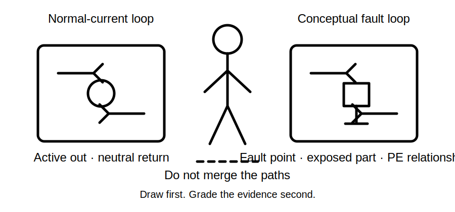
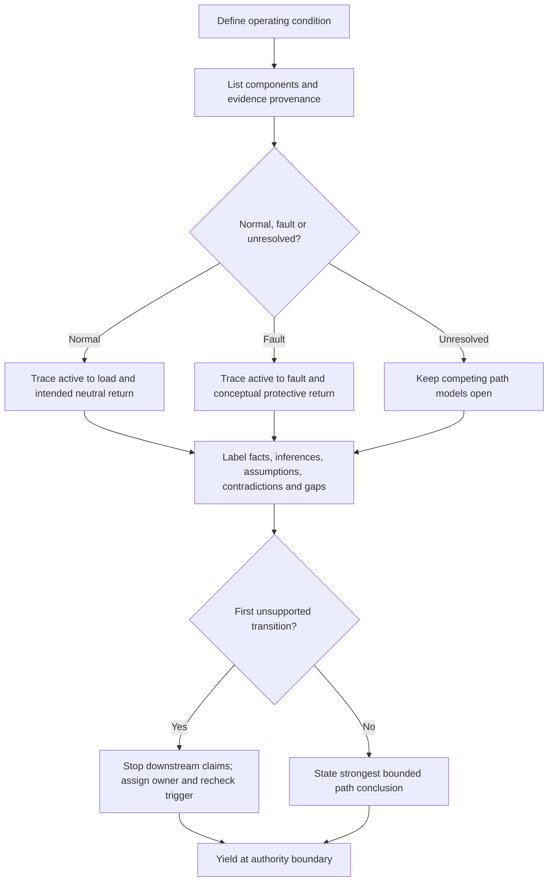
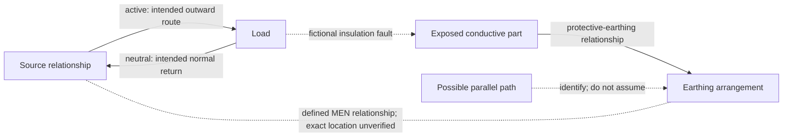

# Day 18 — MEN Arrangement and Normal-Current versus Fault-Current Paths

> **Currency and scope notice:** This module develops written mental models for a multiple-earthed-neutral arrangement and for distinguishing normal-current paths from conceptual fault-current paths. It does not prescribe connection locations, conductor sizes, test methods, operating times or field procedures. Exact arrangements and requirements remain `reference_check_required`. Current authorised standards, legislation, regulator guidance, network rules, manufacturer instructions, workplace procedures and RTO requirements remain controlling. This module is not `technically-reviewed`.

## 1. Outcome and entry check

### Learning objectives

By the end of this module, the learner should be able to:

1. identify the conceptual roles of active, neutral, protective earthing and the MEN relationship;
2. reconstruct separate normal-current and conceptual fault-current loops from bounded scenario evidence;
3. label every material statement as a stated fact, derived fact, supported inference, assumption, contradiction or evidence gap;
4. distinguish path description from claims about continuity, impedance, device operation, compliance or safety;
5. identify the first unsupported transition and stop downstream claims there;
6. explain why a defined neutral-to-earthing relationship is not permission to add or assume duplicate neutral-earth connections;
7. assign an evidence owner and recheck trigger to unresolved material claims; and
8. stop before opening, tracing, measuring, testing, altering or approving an installation.

### Entry check

Without notes, define protective earthing and bonding; distinguish exposed and possible extraneous conductive parts; explain why a visible conductor does not prove continuity; sketch a normal source-load-return loop; and state three prohibited actions. Mark each response **secure**, **developing**, **unsupported** or `stop-required`, plus low, medium or high confidence. Correct any high-confidence unsafe or unsupported response before continuing.

## 2. Why it matters

A common error is to merge every conductor and reference to earth into one vague “return path.” Normal load current follows the operational circuit. Under a fault, an unintended relationship may involve an exposed conductive part and the protective-earthing arrangement. Mixing these conditions produces incorrect conclusions about conductor purpose, current flow, protective-device operation and safety.

The MEN arrangement should be studied as a controlled system relationship, not as a shortcut diagram. A valid sketch can explain a possible path while leaving identity, continuity, impedance, device characteristics, source conditions and protective outcome unresolved.

*Instructional caption: Separate the operating condition first; a clean diagram does not convert missing evidence into proof.*

## 3. Core concepts and terminology

These are original educational summaries. Exact normative definitions require authorised verification.

- **Active conductor:** intended to carry current from source toward load in normal operation.
- **Neutral conductor:** associated with the source reference and intended to carry return current under relevant normal conditions.
- **Protective-earthing conductor:** part of the protective arrangement, not an intended ordinary load-current return.
- **MEN relationship:** the defined neutral-to-earthing relationship within the applicable system architecture; exact location and conditions require verification.
- **Normal current:** current in the intended operational circuit.
- **Fault current:** current caused by failure of an intended condition such as insulation or separation.
- **Complete loop:** an outward and return relationship reaching the source relationship conceptually; drawing it does not prove effectiveness.
- **Parallel path:** an additional route that may share current and create a competing interpretation.
- **Path provenance:** source, date, endpoints, system state and authority associated with path evidence.
- **First unsupported transition:** the earliest point where reasoning depends on an assumption, contradiction or unresolved gap.
- **Evidence owner:** authorised person, record or process responsible for resolving a material uncertainty.
- **Recheck trigger:** new evidence or a changed condition requiring the conclusion to be reopened.

### Evidence labels

- **Stated fact:** supplied directly by the scenario or a current authorised record.
- **Derived fact:** follows transparently from stated facts without an added premise.
- **Supported inference:** bounded interpretation supported by available evidence.
- **Assumption:** unstated premise needed to continue reasoning.
- **Contradiction:** material sources or observations that cannot jointly support one conclusion without resolution.
- **Evidence gap:** information required for a claim but unavailable.

### Claim ladder

Keep component presence, identity, intended role, described connection, continuity, path suitability, protective-device operation and verified protective outcome separate. Evidence for an earlier rung does not automatically support later rungs.

## 4. Rule-finding workflow

Use **P-A-T-H-W-A-Y**:

1. **P — Pin down the condition:** normal, stated fault, suspected fault or unresolved.
2. **A — Arrange the evidence:** list source, load, conductors, exposed parts, MEN relationship and provenance.
3. **T — Trace the outward route:** source toward load or fault.
4. **H — Highlight the return relationship:** separate neutral return from conceptual protective fault return.
5. **W — Weigh every claim:** apply evidence labels and keep contradictions or parallel-path alternatives open.
6. **A — Arrest unsupported reasoning:** stop at the first unsupported transition.
7. **Y — Yield with ownership:** assign an evidence owner, recheck trigger and authority-boundary stop.

The workflow blocks the jump from a neat sketch to a claim about continuity, device operation or compliance.

## 5. Visual model or worked example

Solid arrows show the intended normal-current circuit. Dotted relationships show conceptual system, fault and competing-path relationships. The model omits conductor sizes, exact connection locations, impedances, test values and guaranteed device operation.

### Worked original scenario

A fictional drawing shows a metal-enclosed single-phase load supplied by active and neutral. A protective-earthing conductor is labelled at the enclosure. A maintenance note says it was replaced, but an older as-built drawing shows a different termination point. No continuity result, test provenance, source arrangement or device data is supplied.

The drawing supports intended roles. The conflicting termination records are a contradiction. Continuity and source arrangement are evidence gaps. The first unsupported transition occurs when the labelled conductor is treated as a verified continuous path. The strongest bounded conclusion is: “The records support distinct intended normal-current and conceptual enclosure-fault relationships, but contradictory termination information prevents a verified path conclusion. Continuity, path conditions, device operation and compliance remain unresolved.”

## 6. Practical application

### Task A — reconstruct competing paths

Create separate normal and fault models for: a metal-enclosed fixed appliance; a Class II appliance with no exposed conductive equipment part described; a sub-board whose labels conflict with a maintenance note; and a circuit supplied from an alternative source whose neutral-earthing relationship is unstated. Annotate evidence label, provenance, first unsupported transition, competing interpretation, evidence owner and recheck trigger.

### Task B — claim-and-evidence ledger

| Claim | Evidence label and provenance | Contradiction or gap | First unsupported transition | Evidence owner | Strongest allowed wording |
|---|---|---|---|---|---|
| normal current uses intended operational conductors |  |  |  |  |  |
| protective earthing is connected to the enclosure |  |  |  |  |  |
| fault-return path is continuous |  |  |  |  |  |
| protective device will operate as required |  |  |  |  |  |
| arrangement is safe or compliant |  |  |  |  |  |

At least three claims remain conditional or unresolved unless adequate authorised evidence is explicitly supplied.

### Task C — changed-context transfer

Change at least two material conditions: enclosure construction, alternate source, neutral information, parallel route, record date or contradictory endpoint evidence. Rebuild the reasoning from the scenario boundary rather than carrying the old conclusion forward.

### Criterion-level assessment

| Criterion | Secure | Developing | Unsupported | `stop-required` |
|---|---|---|---|---|
| Condition control | normal and fault separated before tracing | distinction after prompting | conditions merged | unsafe action follows confusion |
| Component roles | active, neutral, PE and MEN distinct | one role corrected | roles interchangeable | arbitrary neutral-earth connection proposed |
| Path completeness | separate conceptual loops complete | one acknowledged omission | path invented or incomplete | field tracing or fault creation proposed |
| Evidence control | labels, provenance and first unsupported transition accurate | some fields incomplete | diagram treated as proof | contradiction ignored to claim safety |
| Transfer | reasoning rebuilt after two changes | one change handled | old conclusion copied | changed source ignored despite safety consequence |
| Authority boundary | clear stop, owner and trigger | general caution | unsupported approval wording | opening, testing, alteration or energisation proposed |

Strong performance in one criterion cannot cancel an **unsupported** or `stop-required` result elsewhere. These are educational planning states, not official grades or competency decisions. Any `stop-required` result blocks progression until corrected with appropriate supervision.

## 7. Common errors and safety checkpoint

Common errors include routing ordinary load current through protective earthing, treating neutral and protective earthing as interchangeable, placing neutral-earth connections wherever convenient, treating labels as verified identity and continuity, overlooking parallel paths or contradictory records, claiming device operation without source/path/device evidence, and carrying conclusions unchanged into alternate-supply scenarios.

Stop and escalate when identity, endpoints or source arrangement cannot be established; records contradict; confirmation requires opening or tracing; continuity, polarity, impedance or device performance requires testing; damaged protective conductors or repeated device operation are reported; multiple supplies are not fully identified; or approval, certification or alteration is requested.

This module authorises no switching, isolation, opening, proving, tracing, measurement, testing, fault creation, disconnection, reconnection, installation, alteration, repair, energisation, commissioning, certification or verification.

## 8. Retrieval and next links

Closed-note retrieval: define normal and fault current; distinguish normal neutral return from conceptual protective fault return; define MEN at concept level; list the six evidence labels; define first unsupported transition; explain why a diagram cannot prove operation; give a parallel-path and contradiction example; and state an evidence owner, recheck trigger and four stop conditions.

Exit task: submit both path models, the claim-and-evidence ledger, one two-condition transfer response, criterion states, one corrected misconception, one authorised-source question and one readiness statement for Day 19.

### Navigation

- **Plan:** [Twelve-Week Capstone Learning Plan](../MASTER_PLAN.md)
- **Knowledge note:** [[12-Week Day 18 - MEN Arrangement and Normal-Current versus Fault-Current Paths]]
- **Previous:** [Day 17 — Equipotential Bonding Purpose and Boundary Reasoning](day-17-equipotential-bonding-purpose-and-boundary-reasoning.md)
- **Next:** [Day 19 — Rest, Retrieval and Diagram Reconstruction](day-19-rest-retrieval-and-diagram-reconstruction.md)

### Reference and currency notice

This module uses original workflows, scenarios, diagrams, tables and assessment tools. It does not reproduce standards tables, figures, systematic clause wording, exact technical values or official assessment material. Exact MEN arrangements, connection locations, conductor requirements, source relationships, device characteristics, test methods, acceptance criteria and jurisdiction-specific duties remain `reference_check_required`. The module remains `review-required` and not `technically-reviewed`.
