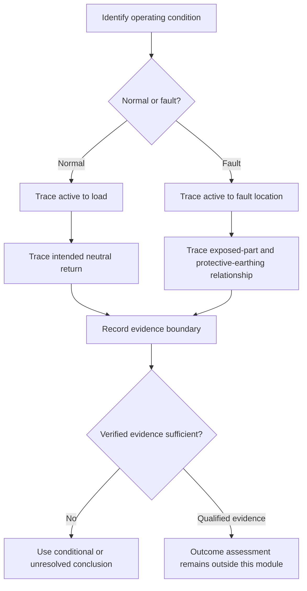
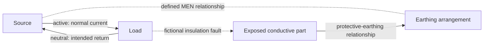

# Day 18 — MEN Arrangement and Normal-Current versus Fault-Current Paths

> **Currency and scope notice:** This module develops written mental models for a multiple-earthed-neutral arrangement and for distinguishing normal-current paths from conceptual fault-current paths. It does not prescribe connection locations, conductor sizes, test methods, operating times or field procedures. Exact arrangements and requirements remain `reference_check_required`. Current authorised standards, legislation, regulator guidance, network rules, manufacturer instructions, workplace procedures and RTO requirements remain controlling. This module is not `technically-reviewed`.

## 1. Outcome and entry check

### Learning objectives

By the end of this module, the learner should be able to:

1. identify the functional roles of active, neutral, protective earthing and the MEN connection at concept level;
2. draw a bounded normal-current path without incorrectly routing load current through protective-earthing conductors;
3. draw a conceptual earth-fault path without claiming a verified impedance, operating time or protective outcome;
4. distinguish intended load current from unintended fault current;
5. explain why the MEN connection has a defined system role and must not be treated as a general-purpose duplicate neutral connection;
6. apply the **P-A-T-H-W-A-Y** workflow to original scenarios;
7. grade conclusions as described, supported, conditional or unresolved; and
8. stop and escalate when a conclusion would require opening, tracing, measuring, testing, altering or approving an installation.

### Entry check

Without notes:

1. Define protective earthing and equipotential bonding in one sentence each.
2. State the difference between an exposed conductive part and a possible extraneous conductive part.
3. Explain why a visible conductor does not prove continuity or suitability.
4. Sketch a source, load and return path for normal operation.
5. State three actions this module does not authorise.

Mark each response **secure**, **uncertain** or **guessing**. Correct any high-confidence error before continuing.

## 2. Why it matters

Many reasoning errors begin when learners merge all conductors into one vague “return path.” In normal operation, intended load current follows the circuit’s active and neutral conductors. Under a fault, an unintended conductive path may involve an exposed conductive part and the protective-earthing arrangement. Mixing those paths can lead to incorrect conclusions about conductor purpose, current flow, protective-device operation and safety.

The MEN arrangement is best learned as a controlled relationship among source, neutral, protective earthing and the installation’s defined neutral-to-earth connection. A diagram is a reasoning model, not proof that the real installation is correctly connected, continuous or able to achieve a required protective outcome.

## 3. Core concepts and terminology

The following are original educational summaries. Exact normative definitions require authorised verification.

- **Active conductor:** a conductor intended to carry current from the source to a load under normal operation.
- **Neutral conductor:** a conductor associated with the source reference point and intended to carry return current under relevant normal operating conditions.
- **Protective earthing conductor:** a conductor used within the protective-earthing arrangement; it is not intended to carry ordinary load current.
- **MEN connection:** the defined connection between neutral and the earthing arrangement within the applicable system architecture. Exact location and conditions require authorised verification.
- **Normal current:** current flowing in the intended operational circuit while equipment is functioning as designed.
- **Fault current:** current flowing because insulation, separation or another intended condition has failed.
- **Earth fault:** a fault that creates an unintended conductive relationship involving earth or an earthed conductive part.
- **Fault-current path:** the complete conceptual route available to fault current. A drawn path does not prove its impedance or effectiveness.
- **Return path:** the route by which current completes a circuit back toward its source. The applicable route differs between normal and fault conditions.
- **Source reference:** the point or relationship against which system potentials are established.
- **Parallel path:** an additional conductive route that may share current. Its presence, cause and acceptability require evidence.
- **Protective outcome:** the wider result expected from the protective system, such as limiting exposure duration. It cannot be inferred from a diagram alone.

### Path comparison

| Reasoning question | Normal operation | Conceptual earth-fault condition |
|---|---|---|
| Why is current flowing? | load is connected and operating | an unintended conductive fault exists |
| Intended outward route | active conductor | active conductor to fault location |
| Intended or protective return relationship | neutral conductor | exposed part and protective-earthing path toward the source relationship |
| What must not be assumed? | protective earthing carries ordinary load current | the path impedance and device operation are proven |
| Evidence boundary | circuit description | fault description plus verified installation evidence |

## 4. Rule-finding workflow

Use **P-A-T-H-W-A-Y**:

1. **P — Pin down the condition:** normal operation, fault condition or unresolved.
2. **A — Arrange the stated components:** source, load, active, neutral, protective earthing, exposed parts and MEN relationship.
3. **T — Trace outward current:** identify the supplied route from source toward the load or fault.
4. **H — Highlight the return relationship:** separate intended neutral return from conceptual protective fault return.
5. **W — Weigh the evidence:** distinguish drawing labels, observed descriptions, continuity evidence, test evidence and assumptions.
6. **A — Avoid outcome claims:** do not infer impedance, operating time, compliance or safety from the path sketch.
7. **Y — Yield at the authority boundary:** stop before access, tracing, measurement, testing, alteration or approval.

The diagram enforces the first decision: identify the condition before tracing a path. It prevents normal load current and fault current from being combined into one route.

## 5. Visual model or worked example

Solid arrows show the intended normal-current circuit. Dotted relationships show the conceptual system and fault relationships. The model does not show conductor sizes, connection locations, impedances, test values or guaranteed device operation.

### Worked original scenario

A fictional training diagram shows a single-phase load supplied by active and neutral conductors. Its metal enclosure is connected to a protective-earthing conductor. A separate note says an internal active conductor may contact the enclosure, but no test data or device characteristics are supplied.

Apply P-A-T-H-W-A-Y:

1. **Pin down:** two conditions must be considered separately—normal operation and a possible enclosure fault.
2. **Arrange:** source, active, neutral, load, enclosure, protective earthing and system relationship are identified.
3. **Trace outward:** normal current travels toward the load through active; fault current would travel from active to the enclosure at the fault point.
4. **Highlight return:** normal return is through neutral; the conceptual fault return involves the enclosure and protective-earthing arrangement.
5. **Weigh evidence:** the diagram supports intended relationships only. Continuity, impedance, device characteristics and operating time are absent.
6. **Avoid outcome claims:** do not state that a device will operate within any required time.
7. **Yield:** do not open, energise, create the fault, measure or test.

Bounded conclusion: “The diagram supports distinct normal-current and conceptual enclosure-fault paths. It does not verify continuity, fault-loop conditions, protective-device operation or installation compliance.”

### Worked-example fading

For a second fictional circuit, complete only:

- condition classification;
- component list;
- normal outward and return paths;
- conceptual fault outward and return relationships;
- evidence present;
- evidence missing;
- strongest supported conclusion; and
- stop condition.

## 6. Practical application

### Task A — reconstruct both paths

For each fictional scenario, draw separate normal and fault path diagrams:

1. a metal-enclosed fixed appliance with active, neutral and protective-earthing conductors shown;
2. a Class II appliance where no exposed conductive equipment part is described;
3. a sub-board diagram with labels but no verified conductor continuity; and
4. a circuit supplied from an alternative source whose neutral-earthing arrangement is not stated.

Annotate every uncertain relationship with a question mark rather than inventing it.

### Task B — evidence ledger

| Claim | Supplied fact | Missing evidence | Strongest allowed wording |
|---|---|---|---|
| normal current uses active and neutral |  |  |  |
| protective earthing is connected |  |  |  |
| fault path is continuous |  |  |  |
| protective device will operate as required |  |  |  |
| installation is safe or compliant |  |  |  |

At least three claims must remain conditional or unresolved.

### Task C — changed-condition transfer

Reopen the worked conclusion when:

1. the neutral conductor is omitted from the drawing;
2. an alternate source is added;
3. the enclosure becomes insulating;
4. a conductor label conflicts with an as-built record; or
5. continuity evidence is old or incomplete.

State which path, classification or evidence claim changes.

### Assessment rubric

| Category | 0 | 1 | 2 |
|---|---|---|---|
| Condition identification | normal and fault merged | distinction stated | conditions separated before tracing |
| Component roles | conductors treated interchangeably | some roles correct | active, neutral, PE and MEN roles distinguished |
| Path accuracy | incomplete or impossible path | partially complete | separate complete conceptual loops |
| Evidence control | diagram treated as proof | some gaps identified | presence, continuity and outcome separated |
| Transfer | changed fact ignored | partial reopening | correct path or claim reopened |
| Safety boundary | practical action proposed | general caution | explicit stop and escalation |

A score of **10–12**, with no zero in path accuracy, evidence control or safety boundary, supports progression. Otherwise complete one varied correction before Day 19.

## 7. Common errors and safety checkpoint

### Common errors

- drawing ordinary load current through protective-earthing conductors;
- treating neutral and protective earthing as interchangeable;
- placing neutral-to-earth connections wherever convenient in a sketch;
- assuming a complete drawn loop proves low impedance or compliant operation;
- treating earth itself as the only or guaranteed fault-return route;
- claiming device operation without device, source and path evidence;
- ignoring alternate supplies or changed source arrangements; and
- presenting a classroom diagram as field verification.

### Safety checkpoint

Stop and escalate when:

- conductor identity or system arrangement cannot be established from authorised records;
- confirming a path would require opening equipment or tracing conductors;
- continuity, polarity, impedance or device performance would require testing;
- exposed live parts, damaged protective conductors or repeated device operation are reported;
- alternative or multiple supplies are present but not fully identified; or
- the learner is asked to alter, energise, approve, certify or sign off the arrangement.

This module authorises no switching, isolation, opening, proving, tracing, measurement, testing, fault creation, disconnection, reconnection, alteration, repair, energisation, commissioning, certification or verification.

## 8. Retrieval and next links

### Closed-note retrieval

1. Define normal current and fault current.
2. State the normal outward and return conductors for the simplified single-phase model.
3. Explain the protective-earthing role without calling it a normal return conductor.
4. Define MEN at concept level and state one evidence boundary.
5. Recite P-A-T-H-W-A-Y.
6. Explain why a diagram cannot prove protective-device operation.
7. Give two changed conditions that reopen a path conclusion.
8. State four stop conditions.

### Exit task

Submit both path diagrams, the evidence ledger, one changed-condition response, the rubric score, one corrected misconception, one authorised-source question and one readiness statement for Day 19.

### Navigation

- **Plan:** [Twelve-Week Capstone Learning Plan](../MASTER_PLAN.md)
- **Knowledge note:** [[12-Week Day 18 - MEN Arrangement and Normal-Current versus Fault-Current Paths]]
- **Previous:** [Day 17 — Equipotential Bonding Purpose and Boundary Reasoning](day-17-equipotential-bonding-purpose-and-boundary-reasoning.md)
- **Next:** [Day 19 — Rest, Retrieval and Diagram Reconstruction](day-19-rest-retrieval-and-diagram-reconstruction.md)

### Reference and currency notice

This module uses original workflows, scenarios, diagrams, tables and assessment tools. It does not reproduce standards tables, figures, systematic clause wording, exact technical values or official assessment material. Exact MEN arrangements, connection locations, conductor requirements, fault-loop methods, device characteristics, test methods, acceptance criteria and jurisdiction-specific duties remain `reference_check_required` and require qualified review.