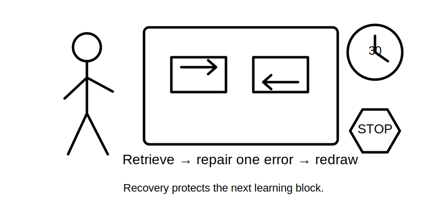
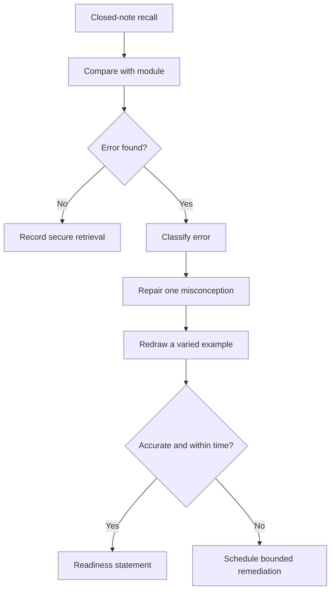
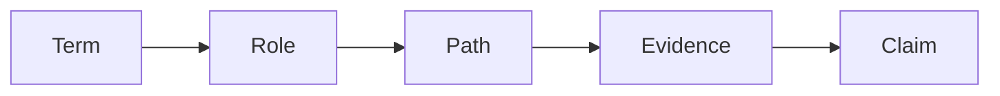

# Day 19 — Rest, Retrieval and Diagram Reconstruction

> **Currency and scope notice:** This recovery block adds no new electrical theory. It consolidates Days 15–18 through closed-note retrieval, diagram reconstruction, error-log repair and readiness checking. Exact technical requirements remain `reference_check_required`. This module is not `technically-reviewed`.

## 1. Outcome and entry check

By the end of this block, the learner should be able to:

1. reconstruct the Week 3 terminology map from memory;
2. draw separate normal-current and conceptual fault-current paths;
3. identify and correct at least two misconceptions without rereading the full modules;
4. classify each error as terminology, role, path, evidence, confidence or safety-boundary error;
5. complete no more than one bounded catch-up task;
6. apply the **R-E-D-R-A-W** workflow;
7. stop at the time and fatigue limits; and
8. state a supported readiness decision for Day 20.

### Entry check

Before opening notes, write definitions for protective earthing, equipotential bonding, exposed conductive part, possible extraneous conductive part, MEN connection, normal current and fault current. Mark each **secure**, **uncertain** or **guessing**.

## 2. Why it matters

Retrieval strengthens access to knowledge; rereading mainly strengthens familiarity. Diagram reconstruction exposes hidden path errors that prose answers can conceal. A recovery day should reduce cognitive load, repair high-value errors and protect readiness—not become another full theory lesson.

## 3. Core concepts and terminology

- **Closed-note retrieval:** recalling before consulting source material.
- **Diagram reconstruction:** rebuilding a model from memory, then checking it against the authorised learning source.
- **Misconception:** a stable but incorrect mental model.
- **Error log:** a short record of the error, cause, correction and future retrieval cue.
- **Confidence error:** high confidence attached to an incorrect answer.
- **Catch-up triage:** selecting the smallest prerequisite gap that blocks progression.
- **Stop condition:** a pre-agreed reason to end the session.
- **Readiness statement:** an evidence-based decision to progress, remediate one item or seek support.

## 4. Rule-finding workflow

Use **R-E-D-R-A-W**:

1. **R — Retrieve** definitions and paths without notes.
2. **E — Examine** differences against the completed modules.
3. **D — Diagnose** the error category and likely cause.
4. **R — Repair** one high-value misconception in your own words.
5. **A — Attempt again** with a varied diagram or prompt.
6. **W — Withdraw on time** when the limit or a stop condition is reached.

The model limits repair to one deliberate cycle before readiness is judged.

## 5. Visual model or worked example

A learner redraws a normal single-phase loop but sends the return through the protective-earthing conductor. The error is classified as a **path-role misconception**, not a drawing-quality problem. The learner writes: “Normal load current uses the intended active and neutral circuit; protective earthing is not the ordinary load return.” They then redraw a different fictional load and correctly separate normal and fault conditions.

Use the chain to locate the first broken link. Repairing an unsupported conclusion is ineffective when the underlying role or path is still wrong.

## 6. Practical application

### Task A — seven-minute reconstruction

From memory, draw and label:

- a normal-current loop;
- a conceptual enclosure-fault loop;
- the protective-earthing relationship;
- the MEN relationship at concept level; and
- one evidence boundary.

### Task B — misconception repair

Choose the two highest-priority errors from the entry check. For each, record:

| Incorrect idea | Error category | Corrected explanation | Varied retrieval cue |
|---|---|---|---|
|  |  |  |  |

### Task C — catch-up triage

Choose at most one task lasting no more than 15 minutes:

- terminology card repair;
- one current-path redraw;
- one evidence-ledger correction; or
- one reciprocal-link review between Days 15–18.

Do not begin new theory.

### Readiness rubric

Score 0–2 for terminology, path separation, evidence control, misconception correction, time discipline and safety boundary. A score of **10–12**, with no zero in path separation or safety boundary, supports progression.

## 7. Common errors and safety checkpoint

Common errors include rereading before retrieval, attempting every missed task, copying a diagram without reconstructing it, repairing low-confidence trivia before high-confidence safety errors, and extending the session because it “nearly feels finished.”

Stop when 30 minutes has elapsed, concentration declines, frustration causes guessing, a practical action would be required, or an immediate electrical hazard is described. This block authorises no switching, isolation, opening, proving, tracing, measurement, testing, alteration, repair, energisation, commissioning, certification or verification.

## 8. Retrieval and next links

### Closed-note retrieval

1. Recite R-E-D-R-A-W.
2. Name six error categories.
3. Draw both current paths.
4. State why a diagram is not verification evidence.
5. State the time limit and three stop conditions.

### Exit task

Submit the reconstructed diagrams, two error-log repairs, one catch-up decision and one readiness statement for Day 20.

### Navigation

- **Plan:** [Twelve-Week Capstone Learning Plan](../MASTER_PLAN.md)
- **Knowledge note:** [[12-Week Day 19 - Rest Retrieval and Diagram Reconstruction]]
- **Previous:** [Day 18 — MEN Arrangement and Normal-Current versus Fault-Current Paths](day-18-men-arrangement-and-normal-current-versus-fault-current-paths.md)
- **Next:** [Day 20 — MEN Fault Scenarios and Protective-Device Operation Reasoning](day-20-men-fault-scenarios-and-protective-device-operation-reasoning.md)

### Reference and currency notice

This block uses original retrieval prompts, diagrams and remediation tools. It reproduces no standards tables, figures, systematic clause wording, exact technical values or official assessment material. Technical claims retained from earlier modules remain `reference_check_required`.