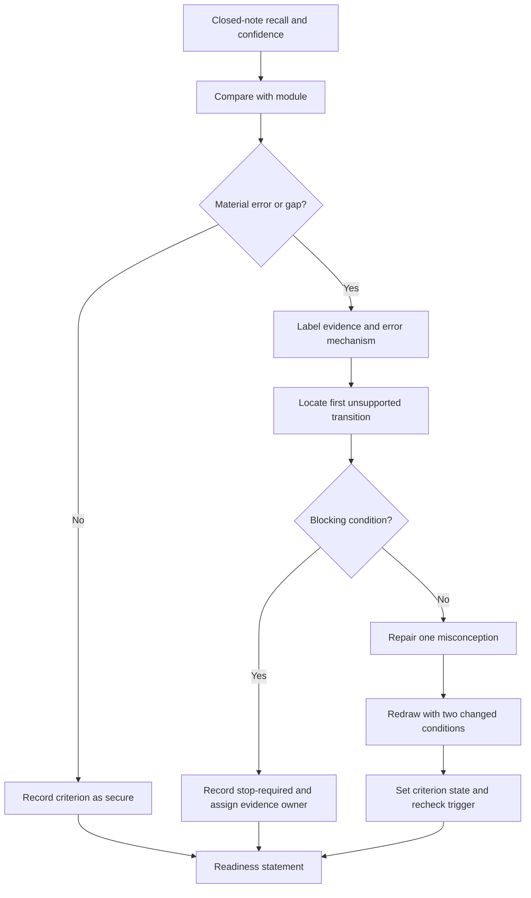
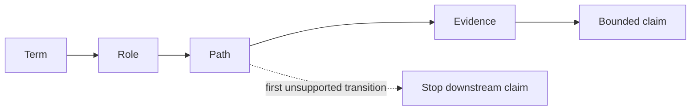

# Day 19 — Rest, Retrieval and Diagram Reconstruction

> **Currency and scope notice:** This recovery block adds no new electrical theory. It consolidates Days 15–18 through closed-note retrieval, diagram reconstruction, confidence calibration, error-log repair and readiness checking. Exact technical requirements remain `reference_check_required`. This module is not `technically-reviewed`.

## 1. Outcome and entry check

By the end of this block, the learner should be able to:

1. reconstruct the Week 3 terminology map from memory;
2. draw separate normal-current and conceptual fault-current paths;
3. identify the first unsupported transition in a reconstructed diagram;
4. correct at least two misconceptions without rereading the full modules;
5. classify each error as terminology, role, path, evidence, confidence or safety-boundary error;
6. complete no more than one bounded catch-up task;
7. apply the **R-E-D-R-A-W** workflow;
8. stop at the time and fatigue limits; and
9. state a criterion-level readiness decision for Day 20 without using an aggregate score.

### Entry check

Before opening notes, write definitions for protective earthing, equipotential bonding, exposed conductive part, possible extraneous conductive part, MEN connection, normal current and fault current. Mark each answer **high confidence**, **medium confidence** or **low confidence**, then label its support as one of:

- **stated fact:** directly supplied by the learning source;
- **supported inference:** a conclusion that follows from supplied facts;
- **assumption:** an unverified condition being treated temporarily as true;
- **contradiction:** two items of evidence that cannot both support the same claim as written; or
- **evidence gap:** information needed before the claim can be supported.

A high-confidence incorrect or unsupported answer receives priority over a low-confidence omission because it is more likely to be repeated without checking.

## 2. Why it matters

Retrieval strengthens access to knowledge; rereading mainly strengthens familiarity. Diagram reconstruction exposes hidden path errors that prose answers can conceal. Confidence calibration distinguishes a remembered answer from a justified answer. A recovery day should reduce cognitive load, repair high-value errors and protect readiness—not become another full theory lesson.

*Instructional caption: redraw from memory, compare against the learning source, repair the first material error, and stop within the recovery limit.*

## 3. Core concepts and terminology

- **Closed-note retrieval:** recalling before consulting source material.
- **Diagram reconstruction:** rebuilding a model from memory, then checking it against the authorised learning source.
- **Misconception:** a stable but incorrect mental model.
- **Error log:** a short record of the error, its likely mechanism, the correction and a future retrieval cue.
- **Error mechanism:** the reason the error occurred, such as term substitution, role confusion, path omission, unsupported inference, overconfidence or safety-boundary drift.
- **Confidence error:** confidence that is not calibrated to accuracy or evidence quality; a correct guess and a confidently unsupported answer are both confidence errors.
- **First unsupported transition:** the earliest link where the diagram or explanation moves beyond the available evidence.
- **Blocking condition:** an error that prevents progression regardless of strengths elsewhere, including a merged normal/fault path, invented device operation, ignored contradiction or unauthorised practical action.
- **Evidence owner:** the authorised person, record or source needed to resolve a material gap.
- **Recheck trigger:** the specific new evidence or corrected response that prompts reassessment.
- **Catch-up triage:** selecting the smallest prerequisite gap that blocks progression.
- **Stop condition:** a pre-agreed reason to end the session.
- **Readiness statement:** an evidence-based decision to progress, remediate one item or seek support.

## 4. Rule-finding workflow

Use **R-E-D-R-A-W**:

1. **R — Retrieve** definitions and paths without notes, recording confidence before checking.
2. **E — Examine** differences against the completed modules and label facts, inferences, assumptions, contradictions and gaps.
3. **D — Diagnose** the error category, likely mechanism and first unsupported transition.
4. **R — Repair** one high-value misconception in your own words.
5. **A — Attempt again** with a varied diagram or prompt that changes at least two material conditions.
6. **W — Withdraw on time** when the limit or a stop condition is reached.

The workflow prevents a learner from compensating for a safety-critical path error with stronger terminology recall. It also limits repair to one deliberate cycle before readiness is judged.

## 5. Visual model or worked example

A learner redraws a normal single-phase loop but sends the ordinary load return through the protective-earthing conductor. They are highly confident because the diagram “looks complete.” Comparison with Day 18 shows that the first unsupported transition occurs where the learner assigns the protective-earthing conductor an ordinary load-return role.

The response is classified as:

- **error category:** path and role;
- **error mechanism:** normal-current and fault-current models were merged;
- **confidence finding:** high-confidence unsupported answer;
- **criterion state:** `stop-required` for path separation;
- **repair statement:** “The normal-current and conceptual fault-current paths must be reconstructed separately; the diagram alone does not verify an actual installation”; and
- **recheck trigger:** correctly redraw a different fictional scenario in which both the load location and the available evidence change.

Use the chain to locate the first broken link. Repairing a conclusion is ineffective when the underlying term, role or path remains wrong.

## 6. Practical application

### Task A — seven-minute reconstruction

From memory, draw and label:

- a normal-current loop;
- a separate conceptual enclosure-fault loop;
- the protective-earthing relationship;
- the MEN relationship at concept level;
- one evidence boundary; and
- the first point at which the model would become an unsupported claim about a real installation.

For every important label, record confidence and whether it is a fact, inference, assumption, contradiction or gap.

### Task B — misconception repair

Choose the two highest-priority errors from the entry check. Prioritise blocking errors and high-confidence unsupported answers.

| Incorrect idea | Evidence label | Error category and mechanism | First unsupported transition | Corrected explanation | Varied retrieval cue | Evidence owner or recheck trigger |
|---|---|---|---|---|---|---|
|  |  |  |  |  |  |  |
|  |  |  |  |  |  |  |

### Task C — changed-context transfer

Redraw one path model after changing at least two material conditions, such as:

- the load or exposed conductive part;
- the location of the stated fault;
- which record is missing or contradictory;
- whether the task asks for a conceptual model or a verified installation claim; or
- the learner’s authority to obtain further evidence.

Do not merely relabel the original drawing. Rebuild the reasoning from the new scenario boundary.

### Task D — catch-up triage

Choose at most one task lasting no more than 15 minutes:

- terminology card repair;
- one current-path redraw;
- one evidence-ledger correction; or
- one reciprocal-link review between Days 15–18.

Do not begin new theory.

### Criterion-level readiness record

Record each criterion independently:

| Criterion | Secure | Developing | Unsupported | `stop-required` | Evidence or next action |
|---|---:|---:|---:|---:|---|
| Terminology and role distinction |  |  |  |  |  |
| Normal/fault path separation |  |  |  |  |  |
| Evidence and claim boundary |  |  |  |  |  |
| Misconception repair and transfer |  |  |  |  |  |
| Confidence calibration |  |  |  |  |  |
| Time discipline and safety boundary |  |  |  |  |  |

- **Secure:** correct, explained and transferred under changed conditions.
- **Developing:** broadly correct but still dependent on prompts or contains a non-blocking omission.
- **Unsupported:** the learner cannot yet justify the answer from the available learning evidence.
- **`stop-required`:** a blocking path, evidence, authority or safety error prevents progression until repaired or escalated.

A strong result in one criterion cannot cancel an unsupported or `stop-required` result in another. “Ready with support” is permitted only when no blocking condition remains and the support action, owner and review point are explicit.

## 7. Common errors and safety checkpoint

Common errors include rereading before retrieval, attempting every missed task, copying a diagram without reconstructing it, treating a correct guess as secure knowledge, repairing low-confidence trivia before high-confidence safety errors, averaging away a path failure, ignoring contradictory records, and extending the session because it “nearly feels finished.”

### Blocking conditions

Record `stop-required` when the learner:

- merges the normal-current and conceptual fault-current paths;
- treats a conceptual diagram as verification of an actual installation;
- invents continuity, connection, device operation or protective outcome;
- ignores a material contradiction or evidence gap;
- cannot identify the first unsupported transition; or
- proposes a practical action outside the stated authority and supervision boundary.

Stop when 30 minutes has elapsed, concentration declines, frustration causes guessing, a practical action would be required, or an immediate electrical hazard is described. This block authorises no switching, isolation, opening, proving, tracing, measurement, testing, fault creation, disconnection, reconnection, alteration, repair, energisation, commissioning, certification or verification.

## 8. Retrieval and next links

### Closed-note retrieval

1. Recite R-E-D-R-A-W.
2. Name six error categories and five evidence labels.
3. Draw separate normal-current and conceptual fault-current paths.
4. State why a diagram is not verification evidence.
5. Define the first unsupported transition.
6. Name four blocking conditions.
7. State the time limit and three stop conditions.

### Exit task

Submit the reconstructed diagrams, two error-log repairs, one changed-context transfer, one catch-up decision and one criterion-level readiness statement for Day 20. Any unsupported or `stop-required` criterion must include an evidence owner or support owner and a recheck trigger.

### Navigation

- **Plan:** [Twelve-Week Capstone Learning Plan](../MASTER_PLAN.md)
- **Knowledge note:** [[12-Week Day 19 - Rest Retrieval and Diagram Reconstruction]]
- **Previous:** [Day 18 — MEN Arrangement and Normal-Current versus Fault-Current Paths](day-18-men-arrangement-and-normal-current-versus-fault-current-paths.md)
- **Next:** [Day 20 — MEN Fault Scenarios and Protective-Device Operation Reasoning](day-20-men-fault-scenarios-and-protective-device-operation-reasoning.md)

### Reference and currency notice

This block uses original retrieval prompts, diagrams and remediation tools. It reproduces no standards tables, figures, systematic clause wording, exact technical values or official assessment material. Technical claims retained from earlier modules remain `reference_check_required`.