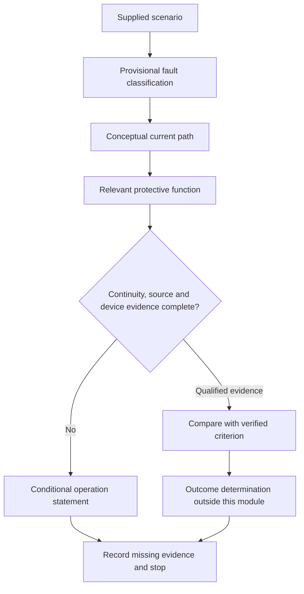
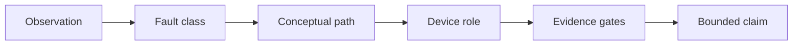

# Day 20 — MEN Fault Scenarios and Protective-Device Operation Reasoning

> **Currency and scope notice:** This module develops written, conditional reasoning about fictional MEN fault scenarios and protective-device roles. It does not provide fault-loop calculations, test procedures, operating-time claims, device settings or field instructions. Exact requirements and outcomes remain `reference_check_required`. Current authorised sources control. This module is not `technically-reviewed`.

## 1. Outcome and entry check

By the end of this module, the learner should be able to:

1. classify a fictional scenario as normal operation, overload, short circuit, earth fault, leakage/residual-current condition or unresolved;
2. trace the conceptual current path relevant to the classified condition;
3. identify the protective function that may be relevant without claiming guaranteed operation;
4. separate path presence, path continuity, path impedance, device characteristics and operating outcome;
5. explain why an RCD and an overcurrent protective device address different evidence questions;
6. apply the **F-A-U-L-T-S** workflow;
7. write conditional conclusions and reopening triggers; and
8. stop before practical investigation, testing, resetting, alteration or approval.

### Entry check

Without notes, draw separate normal and enclosure-fault paths, define overload and short circuit, distinguish overcurrent protection from residual-current protection, and state why a complete path sketch does not prove operating time.

## 2. Why it matters

Fault reasoning fails when a learner jumps directly from “fault exists” to “device trips.” Protective operation depends on the fault type, current path, source conditions, conductor and connection condition, device characteristics and applicable requirements. A protective device may have a relevant role while the evidence remains insufficient to predict its operation.

## 3. Core concepts and terminology

- **Fault classification:** identifying the type of abnormal condition before selecting a protective explanation.
- **Overload:** overcurrent in an otherwise intended current path, without assuming a short circuit.
- **Short circuit:** an unintended low-impedance connection between points at different potentials; exact treatment requires authorised sources.
- **Earth fault:** an unintended conductive relationship involving earth or an earthed conductive part.
- **Residual current:** the imbalance inferred from current not returning through the intended monitored conductors.
- **Overcurrent protective device:** a device intended to respond to relevant overcurrent conditions according to its characteristics.
- **RCD:** a device intended to respond to specified residual-current conditions; it is not a substitute for all other protection.
- **Operating characteristic:** the relationship between device response and relevant current/time conditions.
- **Fault-loop condition:** the combined source and path conditions affecting possible fault current.
- **Disconnection claim:** a conclusion that a device will interrupt supply under specified conditions; this requires verified evidence.
- **Reopening trigger:** a changed fact that invalidates or weakens an earlier conclusion.

### Evidence gates

| Gate | Question |
|---|---|
| Classification | What abnormal condition is actually described? |
| Path | What conceptual loop could carry current? |
| Continuity | Is the path established by qualified evidence? |
| Magnitude conditions | Are source and impedance conditions known? |
| Device | Are type, rating and characteristics known? |
| Requirement | Is the applicable criterion verified? |
| Outcome | Is operation demonstrated or only hypothesised? |

## 4. Rule-finding workflow

Use **F-A-U-L-T-S**:

1. **F — Frame the supplied facts:** separate observations, records, assumptions and omissions.
2. **A — Assign a provisional fault class:** normal, overload, short circuit, earth fault, residual-current condition or unresolved.
3. **U — Unroll the conceptual path:** trace outward and return relationships without invented connections.
4. **L — Link protective functions:** identify which device roles are relevant and which are not substitutes.
5. **T — Test the evidence gates:** continuity, source conditions, device data, applicable criterion and outcome evidence.
6. **S — State a bounded conclusion and stop:** use conditional wording and identify escalation.

The diagram prevents device operation from being asserted before the condition and evidence gates are established.

## 5. Visual model or worked example

Each arrow is a required reasoning step. Skipping one creates an unsupported conclusion.

### Worked original scenario

A fictional metal-enclosed appliance is reported to have damaged internal insulation. The active conductor may contact the enclosure. A protective-earthing conductor and both an overcurrent device and RCD are shown on an old diagram. No continuity results, source data, device characteristics, current records or test evidence are supplied.

Apply F-A-U-L-T-S:

1. **Frame:** damage and diagram labels are supplied; actual contact, continuity and current magnitude are not.
2. **Assign:** a possible earth-fault condition is supported conditionally.
3. **Unroll:** active to fault point, enclosure, protective-earthing relationship and source relationship form the conceptual path.
4. **Link:** overcurrent protection may depend on fault-current conditions; the RCD may have a residual-current role. Neither role is proof of operation.
5. **Test:** continuity, source, impedance, device and criterion evidence are incomplete.
6. **State:** “The scenario supports a possible enclosure earth fault and identifies two potentially relevant protective functions, but it does not establish current magnitude, operating time or verified disconnection.”

### Worked-example fading

For a second scenario, the learner receives only the observation and device list. Complete the fault class, path, relevant device roles, missing evidence, bounded conclusion and stop condition.

## 6. Practical application

### Task A — classify before predicting

For each original scenario, assign one provisional class and justify it:

1. current above expected load with no unintended connection described;
2. active and neutral conductors described as directly contacting;
3. active conductor contacting a metal enclosure;
4. an RCD operates but no cause is established;
5. repeated device operation with incomplete circuit information.

Use **unresolved** where the facts do not support one class.

### Task B — operation-claim ladder

| Claim | Evidence needed | Supplied? | Allowed conclusion |
|---|---|---|---|
| relevant device is present | current records or diagram plus identification |  |  |
| conceptual path exists | fault and connection description |  |  |
| path is continuous | qualified continuity evidence |  |  |
| current condition matches device response | source, path and device evidence |  |  |
| required outcome is achieved | verified criterion and qualified result |  |  |

### Task C — changed-condition transfer

Reopen the worked conclusion when an alternative source is added, the enclosure becomes insulating, the protective conductor record is outdated, the RCD is omitted, or the fault description changes from enclosure contact to active-neutral contact.

### Assessment rubric

Score 0–2 for fault classification, path reasoning, device-role distinction, evidence control, changed-condition transfer and safety boundary. A score of **10–12**, with no zero in classification, evidence control or safety boundary, supports progression to Day 21.

## 7. Common errors and safety checkpoint

Common errors include calling every abnormal condition a short circuit, assuming any earth fault guarantees overcurrent-device operation, assuming an RCD proves protective-earthing continuity, treating old diagrams as current verification, inventing fault values, resetting a device to “see what happens,” and presenting a paper scenario as a safety determination.

Stop and escalate when the condition cannot be classified from supplied evidence; confirming it requires opening, isolation, proving, tracing, measurement or testing; repeated protective-device operation is reported; damaged protective conductors or exposed live parts are described; alternate supplies are not fully identified; or approval, certification or sign-off is requested.

This module authorises no switching, isolation, opening, proving, tracing, measurement, testing, resetting, fault creation, disconnection, reconnection, alteration, repair, energisation, commissioning, certification or verification.

## 8. Retrieval and next links

### Closed-note retrieval

1. Name the six provisional fault classes.
2. Recite F-A-U-L-T-S.
3. Distinguish overcurrent-device and RCD roles.
4. Name the seven evidence gates.
5. Explain why a device shown on a diagram is not proof of operation.
6. Give three reopening triggers and four stop conditions.

### Exit task

Submit Tasks A–C, the rubric score, one corrected high-confidence error, one unresolved authorised-source question and one readiness statement for Day 21.

### Navigation

- **Plan:** [Twelve-Week Capstone Learning Plan](../MASTER_PLAN.md)
- **Knowledge note:** [[12-Week Day 20 - MEN Fault Scenarios and Protective-Device Operation Reasoning]]
- **Previous:** [Day 19 — Rest, Retrieval and Diagram Reconstruction](day-19-rest-retrieval-and-diagram-reconstruction.md)
- **Next:** Day 21 — Week 3 Earthing and Protection Integration Checkpoint

### Reference and currency notice

This module uses original workflows, scenarios, diagrams, tables and assessment tools. It does not reproduce standards tables, figures, systematic clause wording, exact technical values or official assessment material. Exact MEN arrangements, fault-loop requirements, device characteristics, operating criteria, test methods, acceptance criteria and jurisdiction-specific duties remain `reference_check_required` and require qualified review.