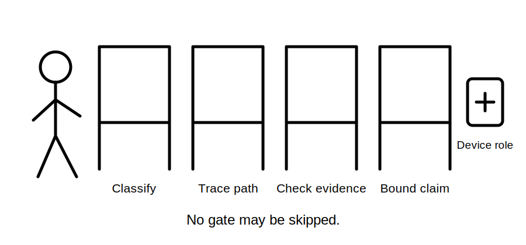
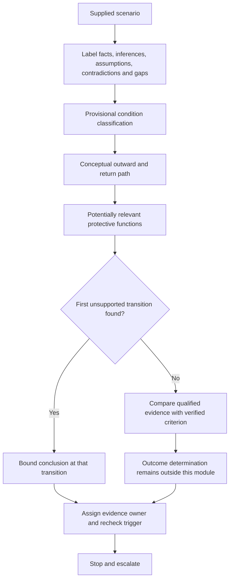
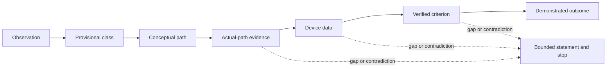

# Day 20 — MEN Fault Scenarios and Protective-Device Operation Reasoning

> **Currency and scope notice:** This module develops written, conditional reasoning about fictional MEN fault scenarios and protective-device roles. It does not provide fault-loop calculations, test procedures, operating-time claims, device settings or field instructions. Exact requirements and outcomes remain `reference_check_required`. Current authorised sources control. This module is not `technically-reviewed`.

## 1. Outcome and entry check

By the end of this module, the learner should be able to:

1. classify a fictional scenario as normal operation, overload, short circuit, earth fault, residual-current condition or unresolved;
2. trace the conceptual outward and return relationships relevant to that classification;
3. distinguish a device's potentially relevant function from a claim that it will operate;
4. separate path presence, path continuity, path impedance, source conditions, device characteristics, verified criteria and demonstrated outcome;
5. label scenario information as stated fact, derived fact, supported inference, assumption, contradiction or evidence gap;
6. identify the first unsupported transition in a fault-to-operation argument;
7. apply the **F-A-U-L-T-S** workflow and write a bounded conclusion with an evidence owner and recheck trigger; and
8. stop before practical investigation, testing, resetting, alteration or approval.

### Entry check

Without notes:

1. draw separate normal-current and enclosure-fault paths;
2. define overload, short circuit, earth fault and residual-current condition;
3. distinguish overcurrent protection from residual-current protection; and
4. explain why a complete-looking path sketch does not establish current magnitude, operating time or disconnection.

Record each response as **secure**, **developing**, **unsupported** or **`stop-required`**. These are educational planning states, not official grades or competency decisions.

## 2. Why it matters

Fault reasoning fails when a learner jumps directly from “fault exists” to “device trips.” Protective operation depends on the condition being classified correctly, the actual current path, source conditions, conductor and connection condition, device characteristics and the applicable verified requirement. A device may have a relevant protective role while the supplied evidence remains insufficient to predict operation.

*Instructional caption: the learner pauses at each evidence gate instead of treating device presence as proof of operation.*

## 3. Core concepts and terminology

- **Fault classification:** identifying the type of normal or abnormal condition before selecting a protective explanation.
- **Overload:** overcurrent in an otherwise intended current path, without assuming an unintended low-impedance connection.
- **Short circuit:** an unintended low-impedance connection between points at different potentials; exact treatment requires authorised sources.
- **Earth fault:** an unintended conductive relationship involving earth or an earthed conductive part.
- **Residual-current condition:** a condition in which current in the monitored conductors does not balance as expected; the cause is not established merely because an RCD operates.
- **Overcurrent protective device:** a device intended to respond to relevant overcurrent conditions according to its verified characteristics.
- **RCD:** a device intended to respond to specified residual-current conditions; it is not a substitute for all other protection.
- **Operating characteristic:** the relationship between device response and the relevant current and time conditions.
- **Fault-loop condition:** the combined source and path conditions affecting possible fault current.
- **Disconnection claim:** a conclusion that a device will interrupt supply under specified conditions; this requires verified evidence.
- **First unsupported transition:** the earliest step where a conclusion is not supported by the preceding evidence. Later claims inherit that weakness.
- **Evidence owner:** the authorised person, document or process responsible for resolving a named evidence gap.
- **Recheck trigger:** a new or changed fact that requires the reasoning chain to be reopened.

### Evidence labels

| Label | Meaning in this module |
|---|---|
| Stated fact | Information explicitly supplied by the fictional scenario. |
| Derived fact | A result obtained transparently from supplied information without adding an unverified premise. |
| Supported inference | A provisional interpretation reasonably supported by stated or derived facts. |
| Assumption | A premise introduced without sufficient evidence. |
| Contradiction | Two supplied items that cannot both be relied on without reconciliation. |
| Evidence gap | Information required before a stronger conclusion can be made. |

### Fault-to-operation claim ladder

1. A condition is described.
2. A provisional classification is supported.
3. A conceptual outward and return path is identified.
4. The intended path is shown to be the actual path.
5. Continuity and relevant source/path conditions are established.
6. Device identity and characteristics are established.
7. The applicable criterion is verified.
8. The operating outcome is demonstrated by authorised evidence.

The learner must mark the first unsupported transition. No downstream statement may be stronger than that boundary.

## 4. Rule-finding workflow

Use **F-A-U-L-T-S**:

1. **F — Frame the supplied facts:** label stated facts, derived facts, supported inferences, assumptions, contradictions and evidence gaps.
2. **A — Assign a provisional fault class:** normal, overload, short circuit, earth fault, residual-current condition or unresolved.
3. **U — Unroll the conceptual path:** trace outward and return relationships without inventing connections or treating a diagram as verification.
4. **L — Link protective functions:** identify which device roles may be relevant and which functions are not interchangeable.
5. **T — Test the evidence gates:** locate the first unsupported transition across continuity, source/path conditions, device data, applicable criterion and outcome evidence.
6. **S — State a bounded conclusion and stop:** identify the evidence owner, recheck trigger and escalation boundary.

The diagram shows that the workflow does not advance automatically from a plausible fault path to a device-operation conclusion. The first unsupported transition limits every later claim.

## 5. Visual model or worked example

Each solid arrow is a distinct evidential transition. A gap or contradiction diverts the reasoning to a bounded statement; it does not permit the learner to skip forward.

### Worked original scenario

A fictional metal-enclosed appliance is reported to have damaged internal insulation. The active conductor may contact the enclosure. An old diagram shows a protective-earthing conductor, an overcurrent protective device and an RCD. A later maintenance note states that the circuit was altered but does not identify what changed. No continuity results, source data, device characteristics, current records or authorised test evidence are supplied.

Apply F-A-U-L-T-S:

1. **Frame:** the damage report, old diagram and alteration note are stated facts. Actual contact, the present circuit arrangement, continuity and current magnitude are evidence gaps. The old diagram and later alteration note create a contradiction about current configuration.
2. **Assign:** a possible enclosure earth fault is a supported inference, not an established condition.
3. **Unroll:** active conductor → possible fault point → enclosure → intended protective-earthing relationship → source relationship is the conceptual path. It is not yet the verified actual path.
4. **Link:** overcurrent protection may be relevant if sufficient fault current follows a suitable path; the RCD may be relevant if a qualifying residual-current condition occurs. Neither role proves operation, and RCD operation would not by itself prove protective-earthing continuity.
5. **Test:** the first unsupported transition is from the conceptual path to the claim that the old diagram represents the present actual path. Later claims about current magnitude, operating time and disconnection are therefore unsupported.
6. **State:** “The scenario supports a possible enclosure earth fault and identifies two potentially relevant protective functions. Conflicting records prevent confirmation of the present path, and no evidence establishes continuity, current magnitude, device response or verified disconnection. The authorised evidence owner must reconcile the circuit identity and current records before the conclusion is reopened.”

**Recheck triggers:** a current verified circuit record, authorised continuity evidence, confirmed device identification, verified source/path information or a changed fault description.

### Competing interpretation check

Retain at least two interpretations until decisive evidence is available:

- **Interpretation A:** the old protective-earthing path remains present and relevant.
- **Interpretation B:** the alteration changed the path, device arrangement or circuit identity.

Do not choose Interpretation A merely because it is more convenient or familiar.

### Worked-example fading

For a second scenario, the learner receives only the observation, two conflicting records and a device list. Complete the evidence labels, provisional class, conceptual path, competing interpretations, first unsupported transition, bounded conclusion, evidence owner and recheck trigger.

## 6. Practical application

### Task A — classify before predicting

For each original scenario, assign one provisional class, label the evidence and justify the classification:

1. current above expected load with no unintended connection described;
2. active and neutral conductors described as directly contacting;
3. active conductor possibly contacting a metal enclosure, with no confirmation of actual contact;
4. an RCD operates but no cause or current path is established;
5. repeated protective-device operation with conflicting circuit records.

Use **unresolved** where the facts do not support one class. State the strongest competing classification where relevant.

### Task B — operation-claim evidence record

| Claim transition | Evidence supplied | Evidence label | State | First unsupported transition? | Evidence owner | Recheck trigger |
|---|---|---|---|---|---|---|
| condition described → provisional class |  |  |  |  |  |  |
| provisional class → conceptual path |  |  |  |  |  |  |
| conceptual path → verified actual path |  |  |  |  |  |  |
| verified path → relevant current condition |  |  |  |  |  |  |
| current condition → device response claim |  |  |  |  |  |  |
| device response claim → verified outcome |  |  |  |  |  |  |

Use these states:

- **Secure:** the learner identifies the claim boundary accurately and supports it with the supplied evidence.
- **Developing:** the reasoning is substantially correct but incomplete, imprecise or insufficiently bounded.
- **Unsupported:** the conclusion exceeds the supplied evidence or omits a material gap.
- **`stop-required`:** the response invents operation, ignores a material contradiction, merges incompatible device functions, or crosses the practical-authority boundary.

A strength in one criterion cannot cancel an unsupported or `stop-required` result elsewhere.

### Task C — changed-condition transfer

Create a transfer version of the worked scenario by changing at least **two** material conditions, such as:

- adding an alternative source;
- changing the enclosure from conductive to insulating;
- replacing the old diagram with a current but incomplete record;
- removing the RCD from the supplied record;
- changing the possible fault from active-to-enclosure to active-to-neutral; or
- adding a record that conflicts with the stated device identity.

Rebuild the reasoning from the start. Do not merely edit the final sentence. State which earlier transitions must be reopened and why.

### Criterion-level assessment record

Assess each criterion independently:

| Criterion | Observable evidence | State |
|---|---|---|
| Fault classification | Selects and justifies a provisional class without forcing certainty. |  |
| Path reasoning | Separates conceptual path from verified actual path and includes outward/return relationships. |  |
| Device-role distinction | Distinguishes overcurrent and residual-current questions without treating either as universal protection. |  |
| Evidence control | Labels facts, inferences, assumptions, contradictions and gaps and finds the first unsupported transition. |  |
| Transfer | Rebuilds the chain after at least two material conditions change. |  |
| Safety and authority | Stops before practical investigation, testing, resetting, alteration or approval. |  |

Progression planning requires every `stop-required` result to be resolved and every unsupported safety-critical criterion to have a named remediation action, evidence owner and recheck point. This is not an official pass rule.

## 7. Common errors and safety checkpoint

Common errors include:

- calling every abnormal condition a short circuit;
- assuming any earth fault guarantees overcurrent-device operation;
- assuming an RCD operation proves protective-earthing continuity or identifies the fault path;
- treating old or conflicting diagrams as current verification;
- inventing source, impedance, device or operating values;
- ignoring the first unsupported transition and continuing to a disconnection claim;
- resetting a device to “see what happens”; and
- presenting a paper scenario as a safety determination.

A `stop-required` outcome applies when the learner:

- claims guaranteed device operation without the required evidence chain;
- ignores a material contradiction or silently chooses one record;
- treats device presence as proof of suitability, operation or compliance;
- merges overcurrent and residual-current functions; or
- proposes switching, opening, proving, measurement, testing, resetting, fault creation or alteration.

Stop and escalate when the condition cannot be classified from supplied evidence; confirming it requires opening, isolation, proving, tracing, measurement or testing; repeated protective-device operation is reported; damaged protective conductors or exposed live parts are described; alternative supplies are not fully identified; or approval, certification or sign-off is requested.

This module authorises no switching, isolation, opening, proving, tracing, measurement, testing, resetting, fault creation, disconnection, reconnection, alteration, repair, energisation, commissioning, certification or verification.

## 8. Retrieval and next links

### Closed-note retrieval

1. Name the six provisional condition classes.
2. Recite F-A-U-L-T-S.
3. Distinguish a potentially relevant protective function from a device-operation claim.
4. Name the six evidence labels.
5. Reproduce the eight-step claim ladder.
6. Explain the first unsupported transition.
7. Give three contradiction examples, three recheck triggers and four stop conditions.

### Exit task

Submit Tasks A–C, the criterion-level assessment record, one corrected high-confidence error, one unresolved authorised-source question and one readiness statement for Day 21. A high-confidence answer supported only by an assumption must not be recorded as secure.

### Navigation

- **Plan:** [Twelve-Week Capstone Learning Plan](../MASTER_PLAN.md)
- **Knowledge note:** [[12-Week Day 20 - MEN Fault Scenarios and Protective-Device Operation Reasoning]]
- **Previous:** [Day 19 — Rest, Retrieval and Diagram Reconstruction](day-19-rest-retrieval-and-diagram-reconstruction.md)
- **Next:** [Day 21 — Week 3 Earthing and Protection Integration Checkpoint](day-21-week-3-earthing-and-protection-integration-checkpoint.md)

### Reference and currency notice

This module uses original workflows, scenarios, diagrams, tables and assessment tools. It does not reproduce standards tables, figures, systematic clause wording, exact technical values or official assessment material. Exact MEN arrangements, fault-loop requirements, device characteristics, operating criteria, test methods, acceptance criteria and jurisdiction-specific duties remain `reference_check_required` and require qualified review.