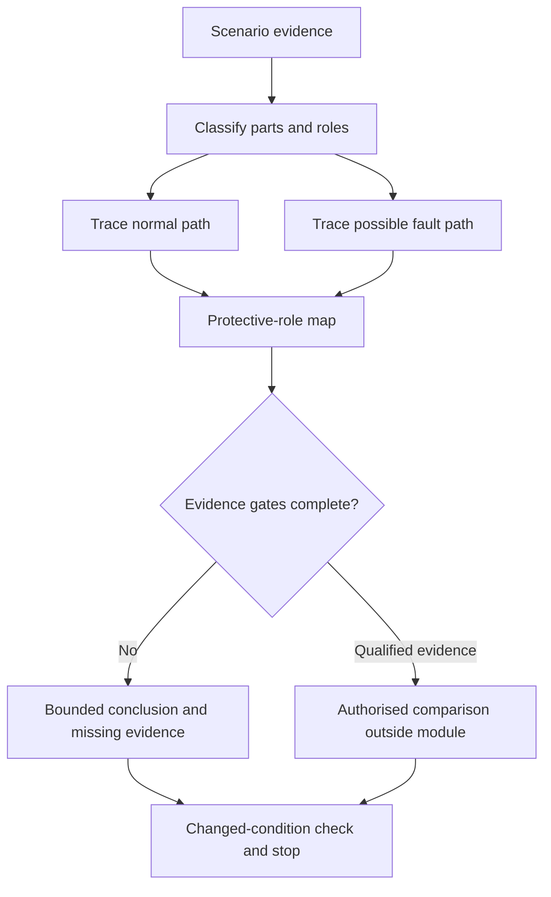
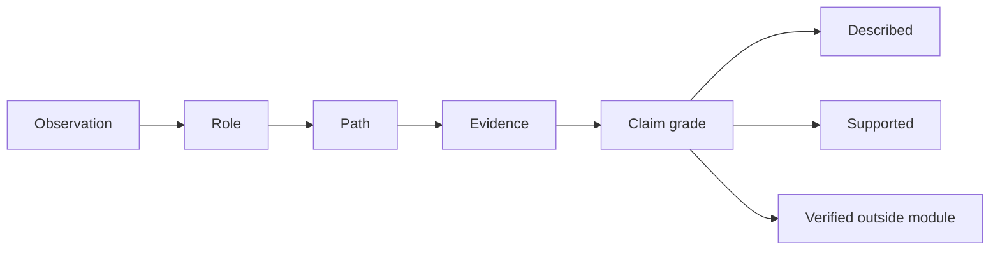

# Day 21 — Week 3 Earthing and Protection Integration Checkpoint

> **Currency and scope notice:** This module integrates fictional earthing, bonding, MEN and protective-device evidence. It does not determine installation compliance, device operation or safety. Exact requirements and outcomes remain `reference_check_required`. Current authorised sources control. This module is not `technically-reviewed`.

## 1. Outcome and entry check

By the end of this module, the learner should be able to:

1. define protective earthing, equipotential bonding, MEN arrangement, normal-current path, fault-current path, protective function and evidence gate;
2. classify supplied conductive parts and protective relationships without relying on appearance alone;
3. draw normal-current and conceptual earth-fault paths separately;
4. distinguish protective-earthing, bonding, overcurrent and residual-current roles;
5. apply the **I-N-T-E-G-R-A-T-E** workflow without inventing evidence;
6. grade claims as described, supported or verification-dependent;
7. reopen conclusions when supply, construction or document currency changes; and
8. stop before practical work, approval, certification or technical sign-off.

### Entry check

Without notes, draw separate normal and enclosure-fault paths, distinguish earthing from bonding, identify the different roles of an overcurrent device and an RCD, and explain why a complete path sketch does not prove disconnection.

## 2. Why it matters

Capstone scenarios rarely isolate one concept. A learner may need to classify a conductive part, identify a protective relationship, trace two current paths, distinguish device roles and control the strength of a conclusion. Integration prevents a correct isolated fact from being used in an unsafe overall argument.

## 3. Core concepts and terminology

- **Integration checkpoint:** a cumulative task requiring several previously learned ideas to be coordinated.
- **Protective earthing:** the protective relationship intended to connect relevant conductive parts to the earthing system.
- **Equipotential bonding:** a protective relationship intended to reduce dangerous potential differences between relevant conductive parts.
- **MEN arrangement:** the Australian–New Zealand multiple-earthed-neutral arrangement; exact configuration and requirements require authorised verification.
- **Normal-current path:** the intended path during normal operation.
- **Fault-current path:** the conceptual loop that may carry current after a fault.
- **Protective function:** the intended role of a device or conductor, not proof of an outcome.
- **Evidence gate:** a question that must be answered before a stronger conclusion is allowed.
- **Claim grade:** described, supported or verification-dependent.
- **Critical error:** an error that blocks progression regardless of total score, such as invented evidence or an unsafe instruction.

## 4. Rule-finding workflow

Use **I-N-T-E-G-R-A-T-E**:

1. **I — Inventory the facts:** list supplied observations, records, diagrams and omissions.
2. **N — Name every relevant part:** classify conductors, conductive parts, bonding relationships and devices.
3. **T — Trace normal and fault paths separately:** do not merge them.
4. **E — Explain each protective role:** state purpose without claiming guaranteed performance.
5. **G — Gate every conclusion:** check identity, connection, continuity, source, device and criterion evidence.
6. **R — Reconcile contradictions:** record which fact controls and which issue remains unresolved.
7. **A — Apply a changed condition:** reopen all affected reasoning.
8. **T — Test readiness:** score the response and identify critical errors.
9. **E — Escalate and stop:** state the practical and technical-review boundary.

The diagram prevents a protective outcome from being asserted before classification, path and evidence questions are addressed.

## 5. Visual model or worked example

A fictional detached outbuilding is supplied from a main switchboard. An old drawing shows active, neutral and protective conductors, a metal enclosure, a conductive service and two protective devices. No continuity, source, impedance or device-test evidence is supplied.

### Worked integration

A complete response:

1. records the drawing as historical evidence, not current verification;
2. classifies the enclosure and service separately;
3. draws normal and possible enclosure-fault paths;
4. distinguishes protective earthing, bonding, overcurrent and residual-current roles;
5. grades each claim as described, supported or verification-dependent;
6. states that operation and compliance cannot be concluded; and
7. reopens the analysis when an alternate source is introduced.

### Worked-example fading

A second scenario supplies only a diagram, defect report and device labels. Independently build the evidence ledger, path models and bounded conclusion.

## 6. Practical application

### Task A — integrated evidence table

Complete columns for supplied fact, classification, protective relevance, missing evidence, allowed claim and reopening trigger.

### Task B — dual-path reconstruction

Draw the intended normal path and one plausible enclosure-fault path. Label every assumed or unresolved connection.

### Task C — misconception repair

Correct these claims: “bonding and earthing are the same,” “an RCD proves earthing continuity,” “a path on a drawing proves disconnection,” and “metal always requires bonding.”

### Task D — changed-condition transfer

Rework the response after adding an alternate source, replacing a metal enclosure with insulating construction, or discovering that the drawing predates alterations.

### Assessment rubric

Score 0–2 for terminology, classification, normal path, fault path, protective roles, evidence gates, claim grading, changed-condition transfer, communication and safety. A score of **17–20**, with no critical error and no zero in evidence control or safety, supports progression.

## 7. Common errors and safety checkpoint

Common errors include merging normal and fault paths, treating protective functions as interchangeable, using historical drawings as current proof, assuming presence proves continuity, asserting device operation without source and device evidence, and allowing a numerical score to hide a critical safety error.

Stop and escalate when confirming a condition requires site access, isolation, opening, proving, tracing, measurement or testing; when protective conductors, exposed live parts, repeated device operation or unidentified alternate supplies are described; or when approval, certification or sign-off is requested.

This module authorises no switching, isolation, opening, proving, tracing, measurement, testing, resetting, fault creation, disconnection, reconnection, alteration, repair, energisation, commissioning, certification or verification.

## 8. Retrieval and next links

### Closed-note retrieval

1. Recite I-N-T-E-G-R-A-T-E.
2. Distinguish earthing and bonding.
3. Draw normal and fault paths separately.
4. Name six evidence gates.
5. Explain the three claim grades.
6. Give three reopening triggers and four stop conditions.

### Exit task

Submit Tasks A–D, the rubric score, one corrected high-confidence error, one unresolved authorised-source question and one readiness statement for Day 22.

### Navigation

- **Plan:** [Twelve-Week Capstone Learning Plan](../MASTER_PLAN.md)
- **Knowledge note:** [[12-Week Day 21 - Week 3 Earthing and Protection Integration Checkpoint]]
- **Previous:** [Day 20 — MEN Fault Scenarios and Protective-Device Operation Reasoning](day-20-men-fault-scenarios-and-protective-device-operation-reasoning.md)
- **Next:** [Day 22 — Load Schedules and Maximum-Demand Concepts](day-22-load-schedules-and-maximum-demand-concepts.md)

### Reference and currency notice

This module uses original workflows, scenarios, diagrams, tables and assessment tools. It does not reproduce standards tables, figures, systematic clause wording, exact technical values or official assessment material. Qualified review against current authorised sources is required.