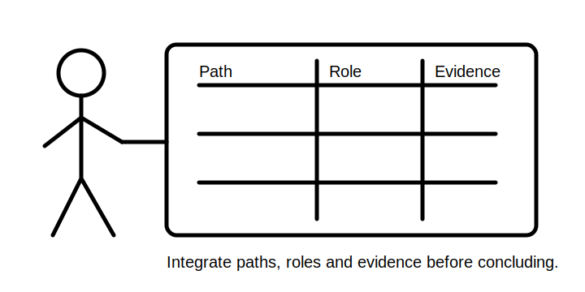
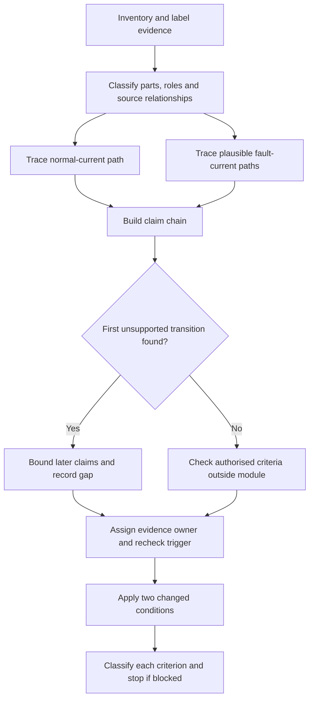
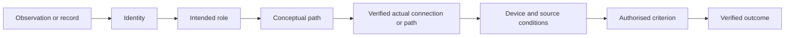

# Day 21 — Week 3 Earthing and Protection Integration Checkpoint

> **Currency and scope notice:** This module integrates fictional earthing, bonding, MEN and protective-device evidence. It does not determine installation compliance, device operation or safety. Exact requirements and outcomes remain `reference_check_required`. Current authorised sources control. This module is not `technically-reviewed`.

## 1. Outcome and entry check

By the end of this module, the learner should be able to:

1. define protective earthing, equipotential bonding, MEN arrangement, normal-current path, fault-current path, protective function, evidence gate, first unsupported transition and blocking condition;
2. classify supplied conductive parts and protective relationships without relying on appearance alone;
3. draw normal-current and conceptual earth-fault paths separately and label every unverified connection;
4. distinguish protective-earthing, bonding, overcurrent and residual-current roles without merging their functions;
5. apply the **I-N-T-E-G-R-A-T-E** workflow while separating stated facts, derived facts, supported inferences, assumptions, contradictions and evidence gaps;
6. identify the first unsupported transition in a reasoning chain and limit all later conclusions accordingly;
7. assess each criterion as secure, developing, unsupported or `stop-required`, without using an aggregate score to hide a critical weakness;
8. transfer the reasoning to a scenario with at least two material changes; and
9. stop before practical work, approval, certification or technical sign-off.

### Entry check

Without notes:

1. draw separate normal and enclosure-fault paths;
2. distinguish earthing from bonding;
3. identify the different roles of an overcurrent device and an RCD;
4. explain why a complete path sketch does not prove the actual path, operating current, operating time or disconnection outcome; and
5. name one contradiction that would force an earlier conclusion to be reopened.

Record confidence beside each response as low, medium or high. A correct guess is not secure knowledge, and a high-confidence unsupported answer is a priority for repair.

## 2. Why it matters

Capstone scenarios rarely isolate one concept. A learner may need to classify a conductive part, identify a protective relationship, trace two current paths, distinguish device roles and control the strength of a conclusion. Integration prevents a correct isolated fact from being used in an unsafe overall argument.

A technically plausible conclusion can still be unsupported when its chain depends on an unidentified conductor, an assumed connection, a historical drawing or an unverified device characteristic. The checkpoint therefore assesses both domain knowledge and evidence discipline.

*Instructional caption: compare the path model with the evidence ledger before allowing a stronger conclusion.*

## 3. Core concepts and terminology

- **Integration checkpoint:** a cumulative task requiring several previously learned ideas to be coordinated.
- **Protective earthing:** the protective relationship intended to connect relevant conductive parts to the earthing system.
- **Equipotential bonding:** a protective relationship intended to reduce dangerous potential differences between relevant conductive parts.
- **MEN arrangement:** the Australian–New Zealand multiple-earthed-neutral arrangement; exact configuration and requirements require authorised verification.
- **Normal-current path:** the intended path during normal operation.
- **Fault-current path:** the conceptual loop that may carry current after a fault.
- **Protective function:** the intended role of a device or conductor, not proof of a verified outcome.
- **Evidence gate:** a question that must be answered before a stronger conclusion is allowed.
- **Stated fact:** information explicitly supplied by the scenario.
- **Derived fact:** information obtained directly from supplied facts through a transparent, valid step.
- **Supported inference:** a conclusion reasonably supported by identified evidence but not directly stated.
- **Assumption:** an unverified proposition temporarily used to explore a scenario; it must be labelled and cannot silently become fact.
- **Contradiction:** two pieces of evidence that cannot both support the same interpretation without reconciliation.
- **Evidence gap:** information required for a stronger conclusion but not supplied.
- **First unsupported transition:** the earliest step where a conclusion goes beyond the available evidence. Later claims depending on that step inherit the limitation.
- **Evidence owner:** the authorised person, source or process responsible for resolving an evidence gap.
- **Recheck trigger:** a specific new fact or verified result that requires the reasoning chain to be revisited.
- **Secure:** the criterion is accurate, complete, evidence-controlled and transferable within the written scenario.
- **Developing:** the criterion is substantially correct but incomplete, weakly explained or not yet transferable.
- **Unsupported:** the response depends on missing, contradictory or invented evidence.
- **`stop-required`:** the response crosses a safety, authority or evidence boundary and must not progress until resolved.
- **Blocking condition:** a failure that cannot be offset by stronger performance elsewhere.

These four educational states are not official grades, competency decisions or legal classifications.

## 4. Rule-finding workflow

Use **I-N-T-E-G-R-A-T-E**:

1. **I — Inventory the evidence:** list observations, records, diagrams, labels, omissions and dates. Label each item as stated fact, derived fact, supported inference, assumption, contradiction or evidence gap.
2. **N — Name every relevant part:** classify conductors, conductive parts, bonding relationships, protective devices and source relationships. Do not classify from appearance alone.
3. **T — Trace normal and fault paths separately:** show the intended normal path and each plausible fault path. Mark every assumed or unverified connection.
4. **E — Explain each protective role:** state what each conductor or device is intended to contribute without claiming guaranteed performance.
5. **G — Gate every conclusion:** ask whether identity, connection, continuity, source, path, device characteristic and authorised criterion evidence are available.
6. **R — Reconcile contradictions:** keep competing interpretations open until decisive evidence is identified. Do not silently choose the convenient record.
7. **A — Apply changed conditions:** alter at least two material conditions and rebuild the affected reasoning rather than editing only the final sentence.
8. **T — Test criterion readiness:** classify each criterion as secure, developing, unsupported or `stop-required`; record blocking conditions separately.
9. **E — Escalate and stop:** name the evidence owner, recheck trigger and practical boundary.

The diagram makes the earliest unsupported step visible. It prevents a later, polished conclusion from appearing stronger than the evidence chain that supports it.

## 5. Visual model or worked example

Each arrow is an evidence transition. If the chain stops at intended role or conceptual path, the response must not jump to verified operation, compliance or safety.

### Fictional scenario

A detached outbuilding is supplied from a main switchboard. The evidence pack contains:

- an old drawing showing active, neutral and protective conductors;
- a current label identifying two protective devices;
- a defect report referring to intermittent operation;
- a renovation note stating that part of the enclosure was replaced with insulating construction; and
- no verified continuity, source, impedance, device-characteristic or device-test evidence.

The old drawing and renovation note disagree about the enclosure construction. Treat this as a contradiction, not as permission to choose whichever record supports the preferred answer.

### Worked integration

A controlled response:

1. records the drawing as historical evidence and the renovation note as later but still unverified evidence;
2. keeps two construction interpretations open;
3. classifies the enclosure and conductive service separately under each interpretation;
4. draws the intended normal path and plausible enclosure-fault paths;
5. distinguishes protective earthing, bonding, overcurrent and residual-current roles;
6. identifies the first unsupported transition at the move from conceptual path to verified actual connection or path;
7. states that device operation, disconnection, compliance and safety cannot be concluded;
8. assigns resolution of circuit identity, construction and path evidence to an authorised evidence owner; and
9. sets verified current records or authorised inspection and test evidence as recheck triggers, without directing the learner to perform those actions.

### Worked-example fading

A second scenario supplies only a diagram, defect report and device labels. Independently produce:

- the evidence labels;
- at least two competing interpretations where justified;
- the normal and fault-path models;
- the first unsupported transition;
- the bounded conclusion;
- the evidence owner and recheck trigger; and
- the criterion-level readiness record.

## 6. Practical application

### Task A — integrated evidence ledger

Complete these fields for every material item:

- evidence item and date;
- evidence label;
- identity or classification supported;
- protective relevance;
- contradiction or gap;
- allowed claim;
- first affected transition;
- evidence owner; and
- recheck trigger.

### Task B — dual-path reconstruction

Draw the intended normal-current path and at least one plausible enclosure-fault path. Label every assumed, disputed or unresolved connection. Do not use an RCD response as proof of protective-earthing continuity or fault-path identity.

### Task C — misconception repair

Correct these claims and identify the first unsupported transition in each:

1. “Bonding and earthing are the same.”
2. “An RCD proves earthing continuity.”
3. “A path on a drawing proves disconnection.”
4. “Metal always requires bonding.”
5. “A device label proves its operating outcome.”

### Task D — changed-condition transfer

Rework the full response after at least two material changes, such as:

- adding an alternate source;
- replacing a metal enclosure with insulating construction;
- discovering that the drawing predates alterations;
- changing the identified device role; or
- introducing a conflicting circuit schedule.

Rebuild the evidence ledger, path models, unsupported-transition boundary and conclusion. Do not merely edit the final sentence.

### Criterion-level assessment record

Classify each criterion separately:

| Criterion | Secure | Developing | Unsupported | `stop-required` |
|---|---|---|---|---|
| Terminology and classification | Accurate, explained and evidence-linked | Mostly accurate but incomplete | Relies on appearance or invented identity | Unsafe classification is used to justify action |
| Normal-current path | Complete and clearly separated | Minor omission without changed conclusion | Material connection is assumed | Path claim directs unauthorised practical action |
| Fault-current path | Plausible paths and alternatives are shown | Main path shown but assumptions are weakly controlled | Conceptual path is treated as verified | Fault creation or live investigation is proposed |
| Protective-role separation | Roles are distinct and bounded | One role boundary is unclear | Functions are merged | A merged function supports an unsafe conclusion |
| Evidence control | Labels, contradictions and gaps are explicit | Evidence labels are incomplete | Evidence is invented or contradictions ignored | Missing evidence is concealed to permit progression |
| Claim-chain control | First unsupported transition is correctly identified | Boundary is identified but downstream effects are incomplete | Later claims exceed the chain | Compliance, operation or safety is asserted without authority |
| Changed-condition transfer | Two changes trigger a rebuilt analysis | Changes are noticed but only partly propagated | Final wording changes without rebuilding reasoning | Changed hazards or sources are ignored |
| Safety and authority | Stop conditions and escalation are precise | Boundary is broadly correct but vague | Authority is assumed | Practical work, approval or certification is directed |

A criterion cannot be marked secure when it depends on an unresolved contradiction or an earlier unsupported transition.

### Blocking conditions

Record `stop-required` and do not offset it with strengths elsewhere when the response:

- invents continuity, source, device-characteristic or operating evidence;
- ignores a material contradiction;
- treats an RCD response as proof of protective-earthing continuity or fault-path identity;
- merges normal-current and fault-current paths;
- asserts verified operation, compliance or safety from a conceptual role or drawing;
- directs switching, isolation, opening, proving, tracing, measurement, testing, resetting or fault creation; or
- claims approval, certification, competency or technical sign-off.

## 7. Common errors and safety checkpoint

Common errors include:

- merging normal and fault paths;
- treating protective functions as interchangeable;
- using historical drawings as current proof;
- assuming presence proves identity, connection or continuity;
- selecting one of two conflicting records without justification;
- asserting device operation without source, path, device and criterion evidence;
- treating a correct guess as secure knowledge; and
- allowing strong performance in one criterion to hide a blocking failure elsewhere.

Stop and escalate when confirming a condition requires site access, isolation, opening, proving, tracing, measurement or testing; when protective conductors, exposed live parts, repeated device operation or unidentified alternate supplies are described; or when approval, certification or sign-off is requested.

This module authorises no switching, isolation, opening, proving, tracing, measurement, testing, resetting, fault creation, disconnection, reconnection, alteration, repair, energisation, commissioning, certification or verification.

## 8. Retrieval and next links

### Closed-note retrieval

1. Recite I-N-T-E-G-R-A-T-E.
2. Distinguish earthing and bonding.
3. Draw normal and fault paths separately.
4. Name the six evidence labels.
5. Define first unsupported transition and blocking condition.
6. Explain the four criterion states.
7. Give three recheck triggers and four stop conditions.
8. Explain why an aggregate score is unsuitable when one criterion is `stop-required`.

### Exit task

Submit Tasks A–D, the criterion-level assessment record, one corrected high-confidence error, one unresolved authorised-source question, one evidence owner, one recheck trigger and one bounded readiness statement for Day 22.

### Navigation

- **Plan:** [Twelve-Week Capstone Learning Plan](../MASTER_PLAN.md)
- **Knowledge note:** [[12-Week Day 21 - Week 3 Earthing and Protection Integration Checkpoint]]
- **Previous:** [Day 20 — MEN Fault Scenarios and Protective-Device Operation Reasoning](day-20-men-fault-scenarios-and-protective-device-operation-reasoning.md)
- **Next:** [Day 22 — Load Schedules and Maximum-Demand Concepts](day-22-load-schedules-and-maximum-demand-concepts.md)

### Reference and currency notice

This module uses original workflows, scenarios, diagrams, tables and assessment tools. It does not reproduce standards tables, figures, systematic clause wording, exact technical values or official assessment material. Exact definitions, arrangements, connection requirements, path characteristics, device characteristics, operating criteria, verification methods, acceptance criteria and assessment requirements require current authorised sources and qualified review.