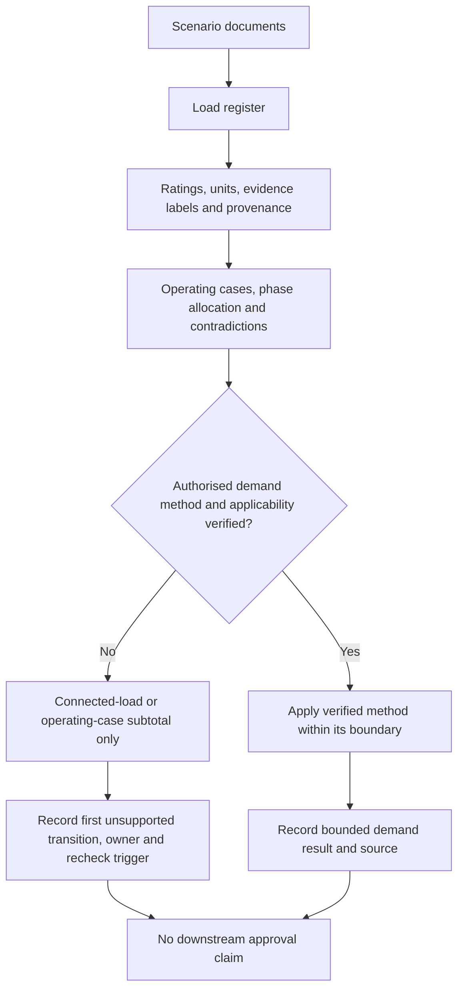
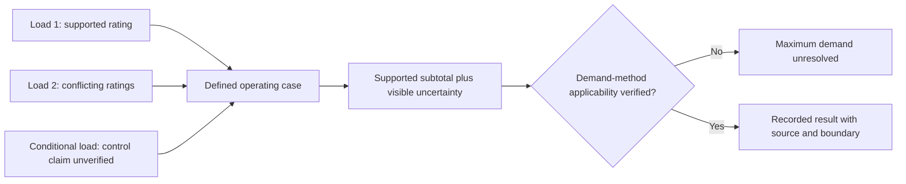

# Day 22 — Load Schedules and Maximum-Demand Concepts

> **Currency and scope notice:** This module develops an original evidence-first method for fictional load schedules and maximum-demand reasoning. It does not provide authoritative demand allowances or installation-design approval. Exact methods and values remain `reference_check_required`. Current authorised sources control. This module is not `technically-reviewed`.

## 1. Outcome and entry check

By the end of this module, the learner should be able to:

1. define connected load, load schedule, maximum demand, simultaneity, duty cycle, operating case, demand allowance and demand-method applicability;
2. create a traceable load register from supplied scenario evidence;
3. label every input as a stated fact, derived fact, supported inference, assumption, contradiction or evidence gap;
4. distinguish connected-load subtotals, operating-case totals and an authorised maximum-demand result;
5. apply the **L-O-A-D-S** workflow without inventing diversity, simultaneity or duty assumptions;
6. preserve units, transformations, evidence sources and calculation provenance;
7. identify the first unsupported transition and prevent later design claims from exceeding the available evidence;
8. assign an evidence owner and recheck trigger to every unresolved input; and
9. stop before applying an unverified method, confirming practical conditions or approving a design.

### Entry check

Without notes, explain why connected load is not automatically maximum demand, list the evidence needed for one load-register row, identify two unit errors that can invalidate a calculation, and state what must happen when two records give conflicting ratings for the same load.

## 2. Why it matters

A cable-selection process cannot be reliable when its starting load evidence is incomplete or opaque. A load schedule turns scattered ratings and operating claims into an auditable design input. Maximum demand must then be determined using an applicable authorised method, not memory, an unexplained percentage or a convenient assumption. Apparent numerical precision does not repair uncertain source data.

*Build the evidence register before calculating a total, and keep unresolved inputs visible rather than hiding them inside arithmetic.*

## 3. Core concepts and terminology

- **Connected load:** the sum of identified load ratings before any verified demand treatment.
- **Load schedule:** a structured record of loads, ratings, supply characteristics, operating cases and evidence sources.
- **Maximum demand:** the greatest demand determined using an applicable authorised method; it is not automatically the connected-load total or the largest informal operating estimate.
- **Simultaneity:** the extent to which loads may operate at the same time.
- **Duty cycle:** the proportion or pattern of time a load operates.
- **Operating case:** a defined combination of loads and conditions considered together.
- **Phase allocation:** assignment of loads among phases where relevant; exact balancing requirements need authorised verification.
- **Demand allowance:** a permitted adjustment from connected load under a verified method.
- **Demand-method applicability:** evidence that a particular authorised method applies to the installation, load category and scenario being considered.
- **Unresolved load:** a load whose identity, rating, supply, duty, control relationship or inclusion remains uncertain.
- **Calculation provenance:** the recorded path from source value through unit conversion and arithmetic to the reported result.
- **Stated fact:** information directly supplied by an identified scenario source.
- **Derived fact:** a value calculated from stated facts using an explicit, valid relationship and preserved units.
- **Supported inference:** a conclusion reasonably supported by evidence but not directly stated.
- **Assumption:** an unverified proposition used provisionally and kept visible.
- **Contradiction:** two or more evidence items that cannot all describe the same condition accurately.
- **Evidence gap:** information required for the next claim but not currently available.
- **First unsupported transition:** the earliest step where the reasoning moves beyond adequate evidence; all dependent conclusions remain provisional or blocked.
- **Evidence owner:** the person, role or authorised source responsible for resolving an identified gap.
- **Recheck trigger:** the specific new evidence or changed condition that requires the schedule to be recalculated or reclassified.

## 4. Rule-finding workflow

Use **L-O-A-D-S**:

1. **L — List every load:** assign each item a unique identifier and evidence source. Keep conflicting records as separate evidence entries until resolved.
2. **O — Observe supply and operating context:** record voltage system, phases, duty, control relationships and operating cases without guessing.
3. **A — Assign ratings and units:** distinguish stated, derived, assumed, contradictory and missing values. Record every conversion and relationship.
4. **D — Determine the applicable demand method:** locate and verify the current authorised method and its applicability before applying allowances.
5. **S — Sum each supported operating case and state uncertainty:** preserve arithmetic, units, provenance, unresolved questions, evidence owners and recheck triggers.

The method gate prevents an unexplained allowance from being hidden inside an apparently precise total. The first unsupported transition also prevents later cable, protective-device or approval claims from appearing stronger than their source evidence.

### Claim ladder

Keep these claims separate:

1. the load exists in a supplied record;
2. the load identity and rating are sufficiently supported;
3. the supply, phase and operating relationship are sufficiently supported;
4. an operating-case subtotal can be calculated;
5. a current authorised demand method is applicable;
6. that method has been applied correctly; and
7. the resulting maximum-demand value is suitable as an input to the next design stage.

Evidence for an earlier claim does not automatically prove a later claim.

## 5. Visual model or worked example

A fictional small workshop schedule lists lighting, socket-outlet circuits, a fixed heater, a compressor and a controlled water heater. A nameplate record and an equipment schedule give different ratings for the compressor. A controls note says the heater and water heater are interlocked, but the drawing does not show the interlock. No authorised demand allowance or applicability evidence is supplied.

### Worked example

The learner:

1. creates a row for each load and preserves source units;
2. records both compressor ratings as a contradiction instead of selecting the convenient value;
3. treats the interlock as an unverified operating claim rather than established mutual exclusion;
4. converts values only where the relationship and required inputs are supplied;
5. calculates connected-load or operating-case subtotals only for clearly supported cases;
6. identifies the first unsupported transition before excluding either conditional load or applying a demand allowance;
7. records maximum demand as unresolved pending the authorised method and applicability evidence; and
8. assigns an evidence owner and recheck trigger to the compressor rating, interlock evidence and demand method.

### Competing interpretations

Keep at least two interpretations open where the evidence permits them:

- the equipment schedule is current and the nameplate record is obsolete; or
- the nameplate record describes the installed unit and the schedule describes a proposed or replaced unit.

Neither interpretation is adopted until decisive evidence identifies the installed equipment and current record.

### Worked-example fading

A second schedule omits duty information, contains one ambiguous rating and includes a note that an alternate supply cannot support all loads. Decide what can be totalled, what remains unresolved, which claims are blocked, who owns each evidence gap and what evidence would reopen the schedule.

## 6. Practical application

### Task A — build the load schedule

Use columns for identifier, description, supply, phases, rating, unit, rating source, evidence label, conversion or derivation, operating case, duty evidence, control relationship, demand treatment, contradiction or gap, evidence owner and recheck trigger.

### Task B — case comparison

Construct three original operating cases: normal occupied, high-use and controlled-load excluded. Show arithmetic and units. The controlled-load exclusion is permitted only when its control relationship is adequately supported; otherwise retain both competing cases.

### Task C — evidence and claim audit

For every input and conclusion:

1. apply one evidence label;
2. identify which claim-ladder step it supports;
3. mark the first unsupported transition;
4. state which later conclusions remain provisional or blocked; and
5. assign an evidence owner and recheck trigger.

### Task D — changed-condition transfer

Change at least two material conditions, such as adding a three-phase load and removing a control interlock, correcting a rating and changing phase allocation, or introducing an alternate supply and changing which loads may operate. Rebuild the affected rows, operating cases and claim ladder rather than editing only the final number.

### Criterion-level assessment record

Record each criterion as:

- **Secure:** independently demonstrated with traceable evidence, correct units and a bounded claim.
- **Developing:** substantially correct but needs a defined correction, prompt or evidence refinement.
- **Unsupported:** the learner cannot yet justify the claim from the supplied evidence.
- **`stop-required`:** continuing would invent evidence, ignore a contradiction, exceed authority or create an unsafe or false design claim.

Assess these criteria separately:

1. terminology and claim separation;
2. register completeness and source traceability;
3. unit and calculation provenance;
4. operating-case and control-relationship reasoning;
5. demand-method applicability and source handling;
6. contradiction, gap, owner and recheck-trigger control;
7. changed-context transfer; and
8. safety and authority boundary.

A strength in one criterion does not cancel an unsupported or `stop-required` state elsewhere. These are educational planning states, not official assessment grades or competency decisions.

### Confidence calibration

For each criterion, record confidence before feedback. A correct guess remains developing until the reasoning is reproducible; a high-confidence unsupported answer becomes a priority remediation item.

## 7. Common errors and safety checkpoint

Common errors include confusing connected load with maximum demand, treating the largest imagined operating case as an authorised demand result, applying remembered allowances without checking applicability, mixing watts and amperes without a stated relationship, double-counting multi-phase loads, assuming loads are mutually exclusive, silently selecting one of two conflicting ratings, hiding missing ratings inside a total and reporting a provisional subtotal as an approved design value.

### Blocking conditions

Mark `stop-required` when the learner:

- invents a rating, duty cycle, diversity factor, interlock or demand allowance;
- ignores contradictory records or silently chooses the more convenient source;
- converts units without a valid relationship and required inputs;
- applies a method whose currency or applicability has not been verified;
- carries a provisional subtotal into a cable, device, compliance or approval conclusion as though it were verified maximum demand; or
- proposes practical access, switching, testing or alteration outside the authorised learning scope.

Stop and escalate when source ratings conflict, supply or phase information is incomplete, an applicable method cannot be verified, confirming equipment or control data requires practical access, or approval, certification or sign-off is requested.

This module authorises no switching, isolation, opening, proving, tracing, measurement, testing, disconnection, reconnection, alteration, repair, energisation, commissioning, certification or verification.

## 8. Retrieval and next links

### Closed-note retrieval

1. Recite L-O-A-D-S.
2. Distinguish connected load, an operating-case subtotal and maximum demand.
3. Name the six evidence labels.
4. List the fields in a useful load-register row.
5. Explain the first unsupported transition.
6. Give four reopening triggers and three blocking conditions.
7. Explain why a claimed interlock cannot be used as an exclusion without adequate evidence.

### Exit task

Submit Tasks A–D, the criterion-level assessment record, one corrected high-confidence error, one unresolved authorised-source question and one bounded readiness statement for Day 23.

### Navigation

- **Plan:** [Twelve-Week Capstone Learning Plan](../MASTER_PLAN.md)
- **Knowledge note:** [[12-Week Day 22 - Load Schedules and Maximum-Demand Concepts]]
- **Previous:** [Day 21 — Week 3 Earthing and Protection Integration Checkpoint](day-21-week-3-earthing-and-protection-integration-checkpoint.md)
- **Next:** [Day 23 — Design Current, Protective-Device Rating and Conductor Capacity](day-23-design-current-protective-device-rating-and-conductor-capacity.md)

### Reference and currency notice

This module uses original workflows, fictional scenarios, diagrams and assessment tools. It reproduces no standards tables, figures, systematic clause wording, exact official values or assessment material. Qualified review against current authorised sources is required.