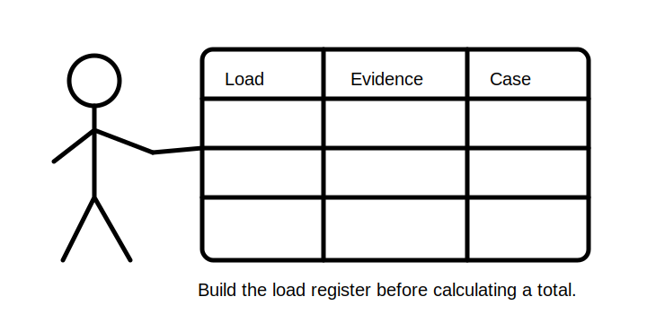
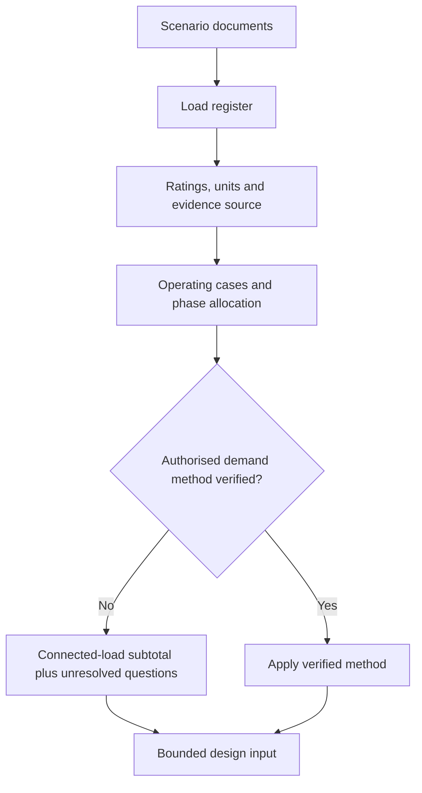
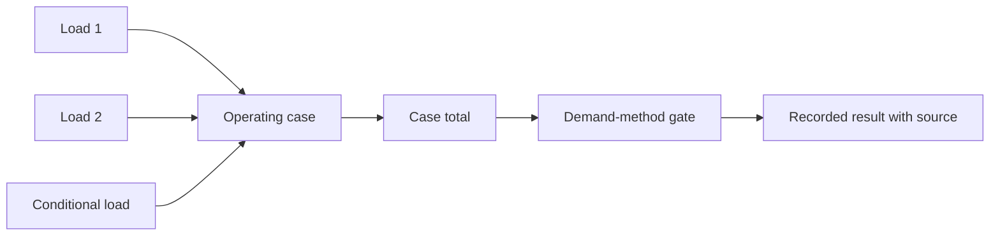

# Day 22 — Load Schedules and Maximum-Demand Concepts

> **Currency and scope notice:** This module develops an original evidence-first method for fictional load schedules and maximum-demand reasoning. It does not provide authoritative demand allowances or installation-design approval. Exact methods and values remain `reference_check_required`. Current authorised sources control. This module is not `technically-reviewed`.

## 1. Outcome and entry check

By the end of this module, the learner should be able to:

1. define connected load, load schedule, maximum demand, simultaneity, duty cycle, operating case and demand allowance;
2. create a traceable load register from supplied scenario evidence;
3. distinguish supplied, derived, assumed and missing values;
4. compare defined operating cases without inventing diversity;
5. apply the **L-O-A-D-S** workflow;
6. preserve units, transformations and evidence sources;
7. identify changed conditions that reopen a demand result; and
8. stop before applying unverified methods or approving a design.

### Entry check

Without notes, explain why connected load is not automatically maximum demand, list the evidence needed for one load-register row, and identify two unit errors that can invalidate a calculation.

## 2. Why it matters

A cable-selection process cannot be reliable when its starting load evidence is incomplete or opaque. A load schedule turns scattered ratings and operating claims into an auditable design input. Maximum demand must then be determined using an applicable authorised method, not memory or an unexplained percentage.

## 3. Core concepts and terminology

- **Connected load:** the sum of identified load ratings before any verified demand treatment.
- **Load schedule:** a structured record of loads, ratings, supply characteristics, operating cases and evidence sources.
- **Maximum demand:** the greatest demand determined using an applicable authorised method; it is not automatically the connected-load total.
- **Simultaneity:** the extent to which loads may operate at the same time.
- **Duty cycle:** the proportion or pattern of time a load operates.
- **Operating case:** a defined combination of loads and conditions considered together.
- **Phase allocation:** assignment of loads among phases where relevant; exact balancing requirements need authorised verification.
- **Demand allowance:** a permitted adjustment from connected load under a verified method.
- **Unresolved load:** a load whose rating, supply, duty or inclusion remains uncertain.
- **Evidence grade:** verified record, supplied scenario fact, derived value, explicit assumption or missing evidence.

## 4. Rule-finding workflow

Use **L-O-A-D-S**:

1. **L — List every load:** assign each item a unique identifier and evidence source.
2. **O — Observe supply and operating context:** record voltage system, phases, duty and control relationships without guessing.
3. **A — Assign ratings and units:** distinguish nameplate, calculated, assumed and missing values.
4. **D — Determine the applicable demand method:** locate and verify the authorised method before applying allowances.
5. **S — Sum each operating case and state uncertainty:** preserve arithmetic, units and unresolved questions.

The method gate prevents an unexplained allowance from being hidden inside an apparently precise total.

## 5. Visual model or worked example

A fictional small workshop schedule lists lighting, socket-outlet circuits, a fixed heater, a compressor and a controlled water heater. Ratings and units are supplied, but no authorised demand allowance is provided.

### Worked example

The learner:

1. creates a row for each load and preserves source units;
2. converts only where the relationship and units are supplied;
3. identifies mutually exclusive and uncertain operating claims;
4. calculates connected-load subtotals for clearly defined cases;
5. does not invent diversity factors; and
6. records maximum demand as unresolved pending the authorised method.

### Worked-example fading

A second schedule omits duty information and contains one ambiguous rating. Decide what can be totalled, what remains unresolved and what evidence would reopen the schedule.

## 6. Practical application

### Task A — build the load schedule

Use columns for identifier, description, supply, phases, rating, unit, rating source, operating case, duty evidence, demand treatment and unresolved question.

### Task B — case comparison

Construct three original operating cases: normal occupied, high-use and controlled-load excluded. Show arithmetic and units without applying unverified allowances.

### Task C — evidence grading

Mark every input as verified record, supplied scenario fact, derived value, explicit assumption or missing evidence.

### Task D — changed-condition transfer

Reopen the schedule when a three-phase load is added, a control interlock is removed, a rating is corrected, or an alternate supply changes which loads can operate.

### Assessment rubric

Score 0–2 for terminology, register completeness, unit discipline, operating-case reasoning, evidence control and safety boundary. A score of **10–12**, with no zero in evidence control or safety, supports progression.

## 7. Common errors and safety checkpoint

Common errors include confusing connected load with maximum demand, applying remembered allowances without checking applicability, mixing watts and amperes without a stated relationship, double-counting multi-phase loads, assuming loads are mutually exclusive, hiding missing ratings inside a total and reporting a provisional subtotal as an approved design value.

Stop and escalate when source ratings conflict, supply or phase information is incomplete, an applicable method cannot be verified, confirming equipment data requires practical access, or approval, certification or sign-off is requested.

This module authorises no switching, isolation, opening, proving, tracing, measurement, testing, disconnection, reconnection, alteration, repair, energisation, commissioning, certification or verification.

## 8. Retrieval and next links

### Closed-note retrieval

1. Recite L-O-A-D-S.
2. Distinguish connected load and maximum demand.
3. Name five evidence grades.
4. List the fields in a useful load-register row.
5. Give four reopening triggers and three stop conditions.

### Exit task

Submit Tasks A–D, the rubric score, one corrected high-confidence error, one unresolved authorised-source question and one readiness statement for Day 23.

### Navigation

- **Plan:** [Twelve-Week Capstone Learning Plan](../MASTER_PLAN.md)
- **Knowledge note:** [[12-Week Day 22 - Load Schedules and Maximum-Demand Concepts]]
- **Previous:** [Day 21 — Week 3 Earthing and Protection Integration Checkpoint](day-21-week-3-earthing-and-protection-integration-checkpoint.md)
- **Next:** [Day 23 — Design Current, Protective-Device Rating and Conductor Capacity](day-23-design-current-protective-device-rating-and-conductor-capacity.md)

### Reference and currency notice

This module uses original workflows, fictional values, scenarios, diagrams and assessment tools. It reproduces no standards tables, figures, systematic clause wording, exact official values or assessment material. Qualified review against current authorised sources is required.