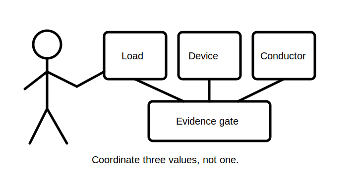
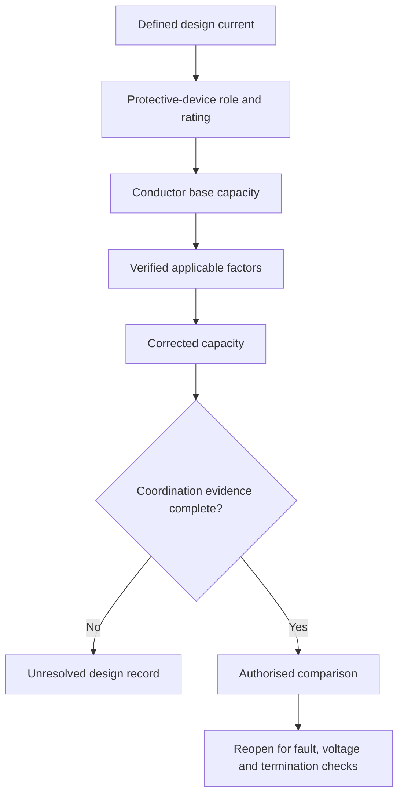

# Day 23 — Design Current, Protective-Device Rating and Conductor Capacity

> **Currency and scope notice:** This module develops conceptual coordination among design current, protective-device rating and conductor capacity using fictional values. Exact selection rules, ratings and capacities require authorised verification. This module does not approve a design and is not `technically-reviewed`.

## 1. Outcome and entry check

By the end of this module, the learner should be able to:

1. define design current, nominal device rating, base capacity, correction factor, corrected capacity and coordination relationship;
2. identify the evidence source for every value in a candidate comparison;
3. distinguish overload and short-circuit protection roles;
4. apply the **R-A-T-I-N-G** workflow;
5. audit installation influences without applying a factor twice;
6. explain why one current-rating comparison does not complete cable selection;
7. reopen the comparison when load, route, environment, termination or device data changes; and
8. stop before unverified selection, approval or field work.

### Entry check

Without notes, explain why a conductor capacity depends on installation conditions, why a device rating alone does not prove suitability, and why a corrected capacity must preserve its source and applied factors.

## 2. Why it matters

A superficially plausible cable choice can fail because the design current is unsupported, the protective function is misunderstood, the conductor capacity comes from the wrong installation condition, a correction factor is missed or duplicated, or another design check has not yet been completed. Coordination is an evidence chain, not a single comparison.

## 3. Core concepts and terminology

- **Design current:** the current used as a design input for the circuit under the defined operating case and authorised demand method.
- **Nominal device rating:** the stated rating used to identify a protective device; it does not by itself establish suitability.
- **Conductor current-carrying capacity:** the current a conductor can carry under specified installation and environmental conditions according to an authorised method.
- **Base capacity:** a source value before applicable correction factors; no source table is reproduced here.
- **Correction factor:** an authorised multiplier or adjustment reflecting a specified influence.
- **Corrected capacity:** capacity after all verified applicable influences are applied.
- **Overload protection:** protection concerned with sustained overcurrent in an otherwise intended path.
- **Short-circuit protection:** protection concerned with relevant fault-current conditions.
- **Coordination relationship:** the evidence-based comparison among load, device and conductor values; exact relationships and exceptions require authorised confirmation.
- **Reopening trigger:** a changed fact requiring the comparison to be repeated.

## 4. Rule-finding workflow

Use **R-A-T-I-N-G**:

1. **R — Record the design case:** identify the load result, units, source and unresolved assumptions.
2. **A — Assign the protective function:** distinguish overload, short-circuit and other device roles.
3. **T — Trace the conductor conditions:** route, installation method, grouping, temperature and terminations.
4. **I — Identify authorised values:** obtain device data, base capacity and applicable factors from current sources.
5. **N — Normalise units and apply factors once:** show each transformation and prevent double correction.
6. **G — Gate the coordination conclusion:** compare only verified inputs, document exceptions and state reopening triggers.

The final node is not an approval. It identifies additional checks that remain necessary.

## 5. Visual model or worked example

A fictional single-phase circuit has a supplied educational design current of 18 A. Two candidate protective devices and two conductor candidates are listed with fictional corrected capacities.

### Worked comparison

Candidate A pairs an educational 20 A device with a fictional corrected conductor capacity of 24 A. Candidate B pairs an educational 25 A device with a fictional corrected capacity of 23 A.

The learner:

1. records the design current as supplied rather than independently verified;
2. states each device's intended protective function;
3. checks that capacities already include the stated factors;
4. identifies Candidate B as unsupported by the supplied educational relationship;
5. records that Candidate A still requires fault, voltage-drop, termination and other checks; and
6. avoids presenting either candidate as an approved design.

### Worked-example fading

A second case supplies base capacity and named factors but omits evidence that one factor applies. Stop before producing a corrected capacity and state the missing evidence.

## 6. Practical application

### Task A — candidate evidence matrix

Compare three fictional candidates using columns for design-current source, device role, device rating, conductor base capacity, applicable factors, corrected capacity, missing checks and allowed conclusion.

### Task B — factor audit

For each factor, state the condition it represents, its authorised source, whether it applies, where it was applied and how double application was prevented.

### Task C — changed-condition transfer

Reopen the comparison after changing the route, ambient condition, grouping, terminal limit, load schedule or protective-device type.

### Task D — assessment explanation

In no more than 180 words, explain why passing one current-rating relationship does not complete cable selection.

### Assessment rubric

Score 0–2 for terminology, value provenance, protective-role distinction, factor control, bounded conclusion and safety boundary. A score of **10–12**, with no zero in factor control or safety, supports progression.

## 7. Common errors and safety checkpoint

Common errors include treating nominal device rating as proof of protection, comparing design current with uncorrected capacity, applying a factor twice, ignoring terminal limitations, using a capacity from the wrong installation condition, assuming overload coordination proves short-circuit performance, and calling a candidate compliant before all design checks and authorised criteria are complete.

Stop and escalate when the installation condition cannot be classified from supplied evidence, source data conflicts, a required factor or device characteristic cannot be verified, practical inspection or testing would be needed, or approval, certification or sign-off is requested.

This module authorises no switching, isolation, opening, proving, tracing, measurement, testing, disconnection, reconnection, alteration, repair, energisation, commissioning, certification or verification.

## 8. Retrieval and next links

### Closed-note retrieval

1. Recite R-A-T-I-N-G.
2. Define design current, base capacity and corrected capacity.
3. Distinguish overload and short-circuit protection.
4. Name five conductor-condition inputs.
5. Give four reopening triggers and three stop conditions.

### Exit task

Submit Tasks A–D, the rubric score, one corrected high-confidence error, one unresolved authorised-source question and one readiness statement for Day 24.

### Navigation

- **Plan:** [Twelve-Week Capstone Learning Plan](../MASTER_PLAN.md)
- **Knowledge note:** [[12-Week Day 23 - Design Current Protective-Device Rating and Conductor Capacity]]
- **Previous:** [Day 22 — Load Schedules and Maximum-Demand Concepts](day-22-load-schedules-and-maximum-demand-concepts.md)
- **Next:** Day 24 — Complete Cable-Selection Workflow and Evidence Record

### Reference and currency notice

This module uses original workflows, fictional values, scenarios, diagrams and assessment tools. It reproduces no standards tables, figures, systematic clause wording, exact official values or assessment material. Qualified review against current authorised sources is required.