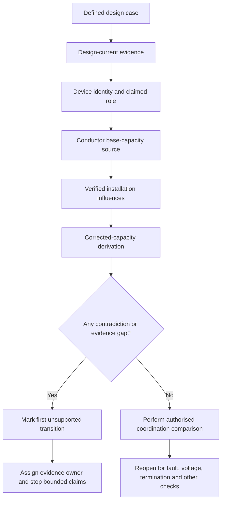
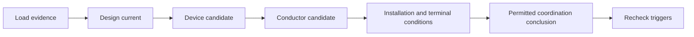

# Day 23 — Design Current, Protective-Device Rating and Conductor Capacity

> **Currency and scope notice:** This module develops conceptual coordination among design current, protective-device rating and conductor capacity using fictional values. Exact selection rules, ratings, capacities, exceptions and operating conditions require current authorised verification. This module does not approve a design and is not `technically-reviewed`.

## 1. Outcome and entry check

By the end of this module, the learner should be able to:

1. define design current, nominal device rating, base capacity, correction factor, corrected capacity and coordination relationship;
2. classify each input as a stated fact, derived fact, supported inference, assumption, contradiction or evidence gap;
3. distinguish a device identity claim from a protective-role, suitability or operating claim;
4. apply the **R-A-T-I-N-G** workflow without applying a correction factor twice;
5. identify the first unsupported transition in a load–device–conductor reasoning chain;
6. preserve competing interpretations when source records conflict;
7. state an evidence owner and recheck trigger for every unresolved input;
8. rebuild the comparison after at least two material conditions change; and
9. stop before unverified selection, approval or field work.

### Entry check

Without notes, explain why conductor capacity depends on installation conditions, why a device rating alone does not prove suitability, and why a corrected capacity must preserve its source, units and applied factors. Mark each statement as known, inferred or assumed.

## 2. Why it matters

A superficially plausible cable choice can fail because the design current is unsupported, the protective function is misunderstood, the conductor capacity comes from the wrong installation condition, a correction factor is missed or duplicated, a terminal limitation is overlooked, or another design check has not yet been completed. Coordination is an evidence chain, not a single numerical comparison.

*Instructional caption: compare the load evidence, protective-device role and conductor evidence as separate claims before deciding what conclusion is permitted.*

## 3. Core concepts and terminology

- **Design current:** the current used as a design input for a defined operating case and authorised demand method.
- **Nominal device rating:** the stated rating used to identify a protective device; it does not by itself establish suitability or operation.
- **Conductor current-carrying capacity:** the current a conductor can carry under specified installation and environmental conditions according to an authorised method.
- **Base capacity:** a source value before applicable correction factors; no source table is reproduced here.
- **Correction factor:** an authorised multiplier or adjustment representing a specified influence.
- **Corrected capacity:** capacity after every verified applicable influence is applied once.
- **Overload protection:** protection concerned with sustained overcurrent in an otherwise intended current path.
- **Short-circuit protection:** protection concerned with relevant fault-current conditions.
- **Terminal limitation:** a verified constraint associated with equipment or connection points that may bound conductor or device selection.
- **Coordination relationship:** an evidence-based comparison among load, device and conductor values; exact relationships, exceptions and conditions require authorised confirmation.
- **First unsupported transition:** the earliest step where the available evidence no longer supports the next claim. Later conclusions must remain open.
- **Evidence owner:** the person, document or authorised source responsible for resolving a gap or contradiction.
- **Recheck trigger:** a changed fact that requires affected reasoning to be repeated.

### Evidence labels

Use one label for every important input or conclusion:

- **Stated fact:** directly supplied by a traceable source.
- **Derived fact:** calculated transparently from supported inputs.
- **Supported inference:** a bounded interpretation consistent with the evidence but not directly stated.
- **Assumption:** a temporary proposition not yet verified.
- **Contradiction:** two or more sources cannot all be correct for the same condition.
- **Evidence gap:** required information is absent or unusable.

### Criterion-level learning states

Assess each criterion separately:

- **Secure:** accurate, traceable and transferable to a changed context.
- **Developing:** substantially correct but incomplete, weakly explained or dependent on prompting.
- **Unsupported:** the conclusion outruns its evidence or contains an unresolved material error.
- **`stop-required`:** the work crosses a safety, authority, contradiction or evidence boundary and must not proceed.

These are educational planning states, not official assessment grades or competency decisions.

## 4. Rule-finding workflow

Use **R-A-T-I-N-G**:

1. **R — Record the design case:** identify the load result, units, source, operating case and unresolved assumptions.
2. **A — Assign the protective function:** distinguish device identity, overload role, short-circuit role and any other claimed function.
3. **T — Trace the conductor conditions:** route, installation method, grouping, ambient influence, thermal insulation, terminations and other relevant constraints.
4. **I — Identify authorised values:** obtain device data, base capacity, applicable factors and limitations from current sources.
5. **N — Normalise units and apply factors once:** show each transformation and retain an audit trail that prevents double correction.
6. **G — Gate the coordination conclusion:** identify the first unsupported transition, retain competing interpretations, assign evidence owners and state reopening triggers.

The diagram separates source evidence from derived values and prevents a current-rating comparison from becoming an approval claim. The final node explicitly keeps other design checks open.

## 5. Visual model or worked example

A fictional circuit has a supplied educational design current of 18 A. A schedule lists a 20 A device. A conductor worksheet states a base capacity and two already-applied factors, producing a fictional corrected capacity of 24 A. A separate equipment record states a lower terminal limit, but the equipment identifier does not match the schedule exactly.

### Worked evidence chain

| Step | Claim | Evidence label | Permitted conclusion |
|---|---|---|---|
| 1 | The educational design current is 18 A | Stated fact | Use only for this fictional case; it is not independently verified. |
| 2 | The listed device is 20 A | Stated fact | Device identity remains provisional until the circuit record is reconciled. |
| 3 | The device provides the required protective functions | Assumption | Do not infer suitability or operation from rating alone. |
| 4 | The corrected conductor capacity is 24 A | Derived fact, conditional on source and factor applicability | Preserve the derivation and confirm no factor was duplicated. |
| 5 | The terminal limit applies to this circuit | Contradiction/evidence gap | Retain both interpretations until equipment identity is resolved. |
| 6 | The candidate is coordinated and approved | Unsupported | The first unsupported transition occurs before this conclusion. |

The learner records two competing interpretations:

- **Interpretation A:** the terminal record belongs to this circuit and may limit the candidate;
- **Interpretation B:** the terminal record belongs to different equipment and is not applicable.

Neither interpretation is selected merely because it produces a convenient result. The equipment schedule or responsible designer is the evidence owner. A verified equipment identity is the recheck trigger.

### Worked-example fading

A second case supplies a base capacity and named factors but omits evidence that one factor applies. The learner must stop before producing a corrected capacity, identify the first unsupported transition and specify who or what can resolve it.

## 6. Practical application

### Task A — candidate evidence matrix

Compare three fictional candidates using columns for input, units, source, evidence label, device role, base capacity, applicable factors, corrected capacity, contradiction or gap, evidence owner, recheck trigger and allowed conclusion.

### Task B — factor audit

For each factor, state the condition it represents, authorised source category, applicability evidence, where it was applied and how double application was prevented. A calculator repeat is not an independent check unless the inputs and method are independently reviewed.

### Task C — changed-condition transfer

Change at least two material conditions—for example route and ambient condition, grouping and terminal limit, or load schedule and protective-device type. Rebuild every affected row rather than editing only the final number.

### Task D — assessment explanation

In no more than 180 words, explain why passing one current-rating relationship does not complete cable selection. Identify one plausible but unsupported conclusion and the evidence needed to reopen it.

### Criterion record

Record one state for each criterion:

1. terminology and role distinction;
2. value provenance and units;
3. installation-condition classification;
4. factor applicability and single application;
5. contradiction and competing-interpretation control;
6. first unsupported transition;
7. bounded conclusion and reopening triggers;
8. safety and authority boundary; and
9. changed-context transfer.

Progression requires every safety-critical criterion to be at least developing and no `stop-required` condition. Strength in one criterion cannot cancel a material failure in another.

## 7. Common errors and safety checkpoint

Common errors include treating nominal device rating as proof of protection, comparing design current with uncorrected capacity, applying a factor twice, ignoring terminal limitations, using capacity data for the wrong installation condition, assuming overload coordination proves short-circuit performance, selecting a convenient source when records conflict, and calling a candidate compliant before all design checks and authorised criteria are complete.

A `stop-required` state applies when the learner:

- invents a rating, capacity, factor, operating characteristic or applicability condition;
- ignores a material contradiction or silently chooses one source;
- performs an invalid unit conversion or uses an untraceable value;
- treats a conceptual relationship as proof of actual device operation or compliance;
- continues after the first unsupported transition without clearly bounding later claims; or
- proposes switching, isolation, opening, proving, tracing, measurement, testing, alteration or energisation outside authorised supervised activity.

Stop and escalate when the installation condition cannot be classified from supplied evidence, source data conflicts, a required factor or device characteristic cannot be verified, practical inspection or testing would be needed, or approval, certification or sign-off is requested.

This module authorises no switching, isolation, opening, proving, tracing, measurement, testing, disconnection, reconnection, alteration, repair, energisation, commissioning, certification or verification.

## 8. Retrieval and next links

### Closed-note retrieval

1. Recite R-A-T-I-N-G.
2. Define design current, base capacity and corrected capacity.
3. Distinguish device identity, protective role, suitability and operating claims.
4. Name six evidence labels and five conductor-condition inputs.
5. Explain the first unsupported transition.
6. Give four reopening triggers and three `stop-required` conditions.

### Exit task

Submit Tasks A–D, the criterion record, one corrected high-confidence error, one unresolved authorised-source question and one readiness statement for Day 24.

### Navigation

- **Plan:** [Twelve-Week Capstone Learning Plan](../MASTER_PLAN.md)
- **Knowledge note:** [[12-Week Day 23 - Design Current Protective-Device Rating and Conductor Capacity]]
- **Previous:** [Day 22 — Load Schedules and Maximum-Demand Concepts](day-22-load-schedules-and-maximum-demand-concepts.md)
- **Next:** [Day 24 — Complete Cable-Selection Workflow and Evidence Record](day-24-complete-cable-selection-workflow-and-evidence-record.md)

### Reference and currency notice

This module uses original workflows, fictional values, scenarios, diagrams and assessment tools. It reproduces no standards tables, figures, systematic clause wording, exact official values or assessment material. Qualified review against current authorised sources is required.